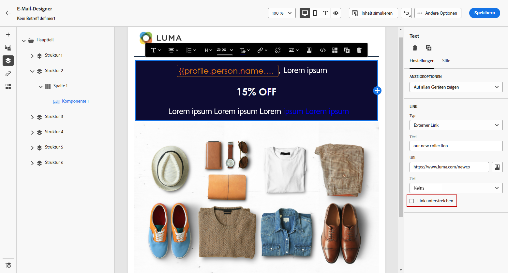

# Definieren eines Stils für Links {#styling-links}

Sie können einen Link unterstreichen und seine Farbe und Zielgruppe in Email Designer auswählen.

1. In Text **[!UICONTROL Content component]** Wenn ein Link eingefügt wurde, wählen Sie Ihren Link aus.

1. Im **[!UICONTROL Component settings]** Menü, überprüfen **[!UICONTROL Underline link]** , um den Titeltext Ihres Links zu unterstreichen.

   

1. Wählen Sie aus, wie Ihre Zielgruppe mit der **[!UICONTROL Target]** Dropdown-Liste:

   * **[!UICONTROL None]**: öffnet den Link im selben Frame, in dem er angeklickt wurde (Standard).
   * **[!UICONTROL Blank]**: öffnet den Link in einem neuen Fenster oder auf einer neuen Registerkarte.
   * **[!UICONTROL Self]**: öffnet den Link im selben Frame, in dem er angeklickt wurde.
   * **[!UICONTROL Parent]**: öffnet den Link im übergeordneten Frame.
   * **[!UICONTROL Top]**: öffnet den Link im vollständigen Textkörper des Fensters.

   

1. Um die Farbe Ihres Links zu ändern, klicken Sie auf **[!UICONTROL Link color]**.

   

1. Wählen Sie die gewünschte Farbe aus.

1. Speichern Sie Ihre Änderungen.
