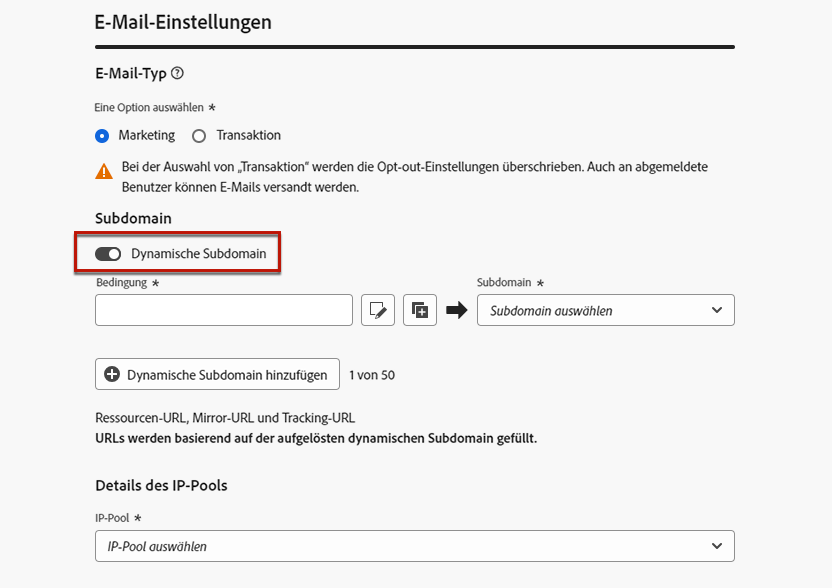
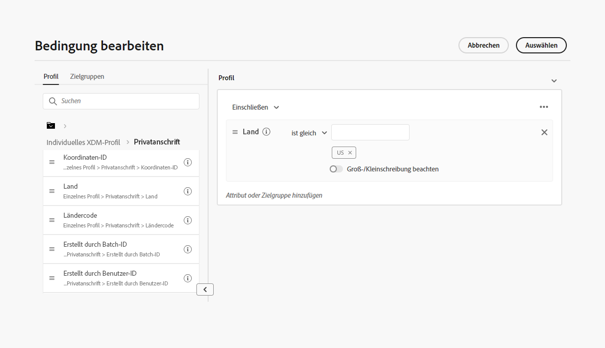
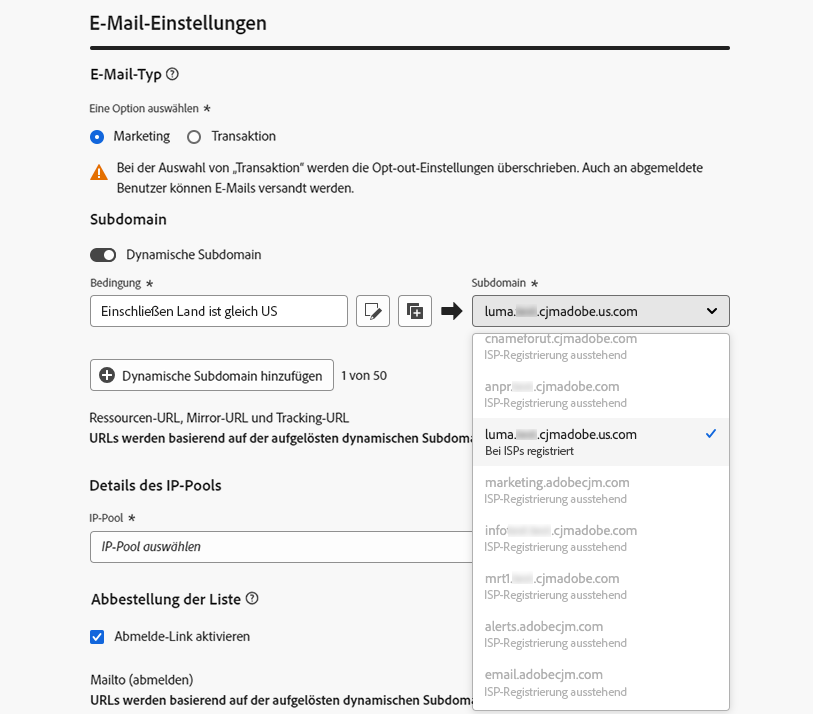
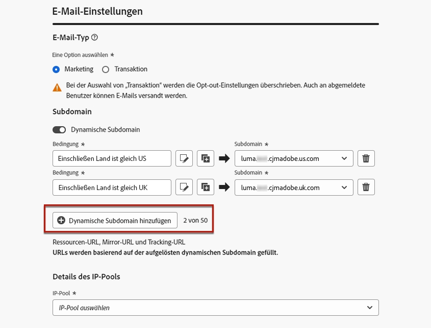
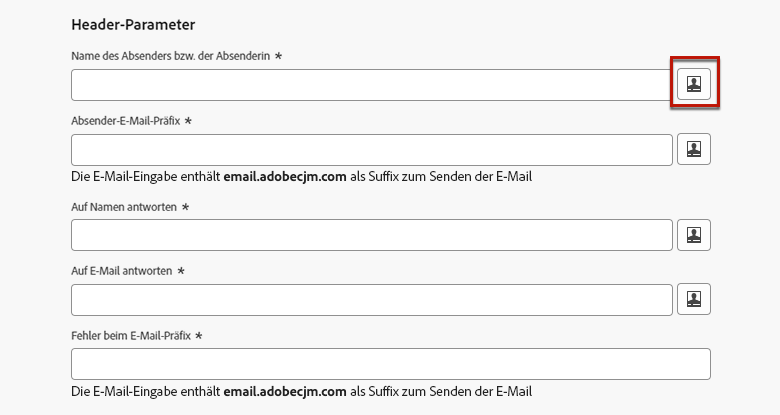
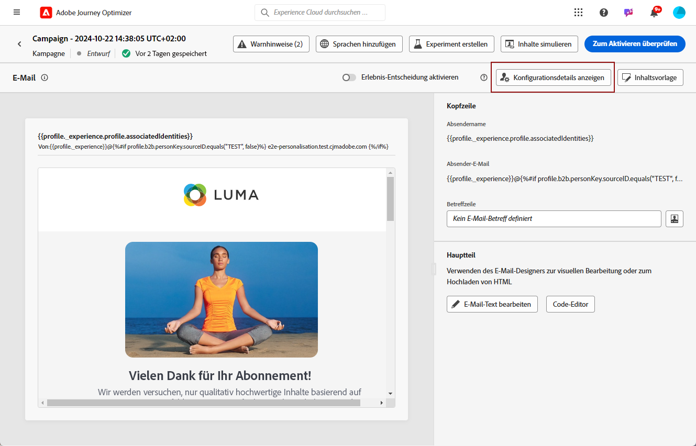
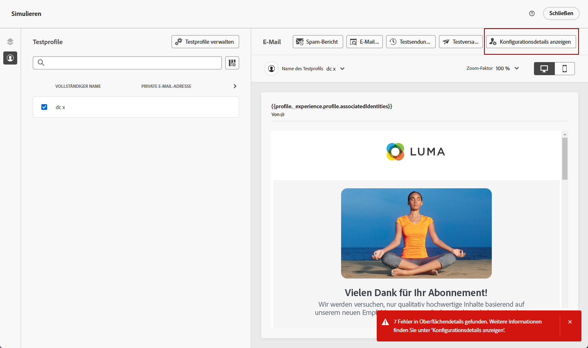
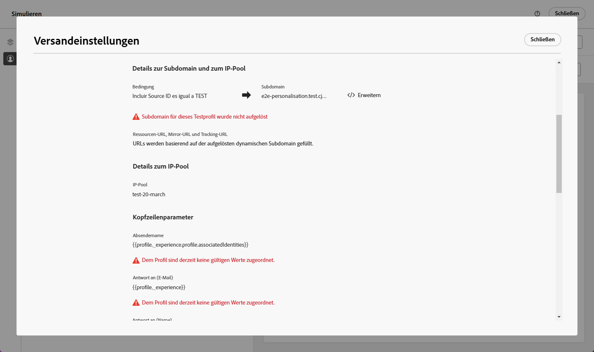

# Personalisieren der Einstellungen der E-Mail-Konfiguration {#surface-personalization}

Für mehr Flexibilität und Kontrolle über Ihre E-Mail-Einstellungen ermöglicht [!DNL Journey Optimizer] die Definition personalisierter Werte für Subdomains, Header und URL-Tracking-Parameter beim Erstellen von E-Mail-Konfigurationen.

## Hinzufügen von dynamischen Subdomains {#dynamic-subdomains}

>[!CONTEXTUALHELP]
>id="ajo_surface_perso_not_available"
>title="Personalisierung nicht verfügbar"
>abstract="Diese Konfiguration wurde ohne Personalisierungsattribute erstellt. In der Dokumentation finden Sie Schritte, um dies zu beheben, falls eine Personalisierung erforderlich ist."

>[!CONTEXTUALHELP]
>id="ajo_surface_dynamic_subdomain"
>title="Aktivieren dynamischer Subdomains"
>abstract="Beim Erstellen einer E-Mail-Konfiguration können dynamische Subdomains basierend auf Bedingungen eingerichtet werden, die mit dem Personalisierungseditor definiert werden. Bis zu 50 dynamische Subdomains können hinzugefügt werden."

Bei der Erstellung einer E-Mail-Konfiguration können Sie dynamische Subdomains basierend auf bestimmten Bedingungen einrichten.

Wenn beispielsweise rechtliche Einschränkungen gelten, die das Senden von Nachrichten von einer speziellen E-Mail-Adresse pro Land vorgeben, können Sie dynamische Subdomains verwenden. Auf diese Weise können Sie eine einzige Konfiguration mit mehreren Subdomains zum Senden erstellen, die verschiedenen Ländern entsprechen, anstatt für jedes Land mehrere Konfigurationen zu erstellen. Sie können dann Kunden und Kundinnen in verschiedenen, in einer Kampagne konsolidierten Ländern ansprechen.

Gehen Sie wie folgt vor, um dynamische Subdomains in einer E-Mail-Kanalkonfiguration zu definieren.

1. Richten Sie vor dem Erstellen einer Konfiguration nach Bedarf die Subdomains ein, die Sie für den E-Mail-Versand verwenden möchten. [Weitere Informationen](../configuration/about-subdomain-delegation.md)

   Angenommen, Sie möchten verschiedene Subdomains für verschiedene Länder verwenden, indem Sie etwa eine Subdomain für die USA einrichten, eine für Großbritannien usw.

1. Erstellen Sie eine Kanalkonfiguration. [Weitere Informationen](../configuration/channel-surfaces.md)

1. Wählen Sie den Kanal **[!UICONTROL E-Mail]** aus.

1. Aktivieren Sie im Abschnitt **Subdomain** die Option **[!UICONTROL Dynamische Subdomain]**.

   

1. Klicken Sie auf das Bearbeitungssymbol neben dem ersten Feld **[!UICONTROL Bedingung]**.

1. Der [Personalisierungseditor](../personalization/personalization-build-expressions.md) wird geöffnet. Legen Sie in diesem Beispiel eine Bedingung wie „`Country` ist gleich `US`“ fest.

   

1. Wählen Sie die Subdomain aus, die Sie mit dieser Bedingung verknüpfen möchten. [Weitere Informationen zu Subdomains](../configuration/about-subdomain-delegation.md)

   >[!NOTE]
   >
   >Bestimmte Subdomains sind aufgrund einer ausstehenden [Feedback-Schleifen](../reports/deliverability.md#feedback-loops)-Registrierung derzeit nicht zur Auswahl verfügbar. Dieser Vorgang kann bis zu 10 Werktage dauern. Nach Abschluss können Sie aus allen verfügbaren Subdomains auswählen. <!--where FL registration happens? is it when delegating a subdomain and you are awaiting from subdomain validation? or is it on ISP side only?-->

   

   Alle Empfängerinnen und Empfänger in den USA erhalten Nachrichten, die die ausgewählte Subdomain für dieses Land verwenden. Das bedeutet, dass alle beteiligten URLs (z. B. Mirror-Seite, Tracking-URL oder Abmelde-Link) auf der Basis dieser Subdomain gefüllt werden.

1. Legen Sie andere dynamische Subdomains nach Bedarf fest. Sie können bis zu 50 Elemente hinzufügen.

   

   <!--Select the [IP pool](../configuration/ip-pools.md) to associate with the configuration. [Learn more](email-settings.md#ip-pools)-->

1. Definieren Sie alle anderen [E-Mail-Einstellungen](email-settings.md) und [übermitteln](../configuration/channel-surfaces.md#create-channel-surface) Sie Ihre Konfiguration.

Nachdem Sie eine oder mehrere dynamische Subdomains zu einer Konfiguration hinzugefügt haben, werden die folgenden Elemente basierend auf der aufgelösten dynamischen Subdomain für diese Konfiguration aufgefüllt:

* Alle URLs (Ressourcen-URL, Mirror-Seiten-URL und Tracking-URL)

* Die [Abmelde-URL](email-settings.md#list-unsubscribe)

* Die Suffixe **Von E-Mail** und **Fehler-E-Mail** 

>[!NOTE]
>
>Wenn Sie dynamische Subdomains einrichten und dann die Option **[!UICONTROL Dynamische Subdomain]** deaktivieren, werden alle dynamischen Werte entfernt. Wählen Sie eine Subdomain aus und übermitteln Sie die Konfiguration, damit die Änderungen wirksam werden.

## Personalisieren der Kopfzeile {#personalize-header}

Sie können die Personalisierung auch für alle Kopfzeilenparameter verwenden, die in einer Konfiguration definiert sind.

Wenn Sie beispielsweise über mehrere Marken verfügen, können Sie eine einzelne Konfiguration erstellen und für Ihre E-Mail-Kopfzeilen personalisierte Werte verwenden. Dadurch können Sie sicherstellen, dass alle von Ihren verschiedenen Marken gesendeten E-Mails jeweils mit den richtigen **Von**-Namen und -E-Mail-Adressen versehen werden. Wenn Ihre Empfängerinnen und Empfänger auf die Schaltfläche **Antworten** in der E-Mail-Client-Software klicken, sollten schließlich die Namen und E-Mail-Adressen für **Antwort an** der richtigen Marke für die richtige Person entsprechen.

Gehen Sie wie folgt vor, um personalisierte Variablen für die Kopfzeilenparameter der Konfiguration zu verwenden.

>[!NOTE]
>
>Sie können alle Felder für die **[!UICONTROL Kopfzeilenparameter]** außer dem Feld **[!UICONTROL Fehler beim E-Mail-Präfix]** personalisieren.

1. Definieren Sie Ihre Kopfzeilenparameter wie gewohnt. [Weitere Informationen](email-settings.md#email-header)

1. Wählen Sie für jedes Feld das Symbol „Bearbeiten“ aus.

   

1. Der [Personalisierungseditor](../personalization/personalization-build-expressions.md) wird geöffnet. Definieren Sie Ihre Bedingung nach Bedarf und speichern Sie Ihre Änderungen.

   <!--For example, set a condition such as each recipient receives an email from their own brand representative.-->

   >[!NOTE]
   >
   >Sie können nur **[!UICONTROL Profilattribute]** und **[!UICONTROL Hilfsfunktionen]** auswählen.

   Beispiel: Sie möchten dynamische E-Mails im Namen einer Person im Beziehungs-Management senden, deren Details im Kundenprofil hinterlegt sind, sodass jede Kundin und jeder Kunde mit einer Person im Beziehungs-Management verknüpft ist. In einer [Journey](../building-journeys/journey-gs.md) kann die E-Mail-Kopfzeile (Absendername, Absender-E-Mail, Antwortadresse) mit den Parametern der Person im Beziehungs-Management personalisiert werden, die aus den Profilattributen entnommen werden.

   <!--The examples below use event parameters, which are currently not available.
    
    Let's say you want to handle dynamically emails sent on behalf of a sales assistant, where the sales assistant is retrieved from an event or campaign contextual parameters. For example: In a [journey](../building-journeys/journey-gs.md), when a purchase event is linked to the sales assistant of a specific shop, the email header (sender name, sender email, reply to address) can be personalized with the sales assistant parameters, taken from the event attributes. In an [API-triggered campaign](../campaigns/api-triggered-campaigns.md), initiated externally by a sales assistant, the triggered email can be sent on behalf of the sales assistant and the header personalization values taken from campaign contextual parameters.-->

1. Wiederholen Sie die obigen Schritte für jeden Parameter, den Sie personalisieren möchten.

>[!NOTE]
>
>Wenn Sie Ihrer Konfiguration eine oder mehrere dynamische Subdomains hinzugefügt haben, werden die Suffixe **Von-E-Mail** und **Fehler-E-Mail** basierend auf der aufgelösten [dynamischen Subdomain](#dynamic-subdomains) gefüllt.

## Verwenden von personalisiertem URL-Tracking {#personalize-url-tracking}

Gehen Sie wie folgt vor, um personalisierte URL-Tracking-Parameter zu verwenden.

1. Gehen Sie zum Abschnitt **[!UICONTROL URL-Tracking-Parameter]** Ihrer E-Mail-Kanalkonfiguration. [Weitere Informationen](url-tracking.md)

1. Klicken Sie auf das Symbol „Bearbeiten“ neben den einzelnen Feldern. Zusätzlich zu den kontextuellen Attributen können Sie Profilattribute auswählen.

1. Wählen Sie im [Personalisierungseditor](../personalization/personalization-build-expressions.md) das gewünschte Profilattribut aus.

1. Wiederholen Sie die obigen Schritte für jeden Tracking-Parameter, der personalisiert werden soll.

Wenn die E-Mail gesendet wird, wird der personalisierte Parameter nun automatisch an das Ende der URL angehängt. Sie können diesen Parameter dann in Web-Analyse-Tools oder in Leistungsberichten erfassen.

## Anzeigen der Konfigurationsdetails {#view-surface-details}

Wenn Sie eine Konfiguration mit personalisierten Einstellungen in einer Kampagne oder Journey verwenden, können Sie die Details der Konfiguration direkt innerhalb der Kampagne oder Journey anzeigen. Führen Sie dazu folgende Schritte durch.

1. Erstellen Sie eine E-Mail-[Kampagne](../campaigns/create-campaign.md) oder [Journey](../building-journeys/journey-gs.md).

1. Wählen Sie die Schaltfläche **[!UICONTROL Inhalt bearbeiten]** aus.

1. Klicken Sie auf die Schaltfläche **[!UICONTROL Konfigurationsdetails anzeigen]**.

   

1. Das Fenster **[!UICONTROL Versandeinstellungen]** wird angezeigt. Sie können alle Konfigurationseinstellungen anzeigen, einschließlich der dynamischen Subdomains und der personalisierten Kopfzeilenparameter.

   >[!NOTE]
   >
   >Alle Informationen auf diesem Bildschirm sind schreibgeschützt.

1. Wählen Sie **[!UICONTROL Erweitern]** aus, um die Details der dynamischen Subdomains anzuzeigen.

   

## Überprüfen Ihrer Konfiguration {#check-configuration}

Durch eine personalisierte Konfiguration in einer Kampagne oder Journey können Sie nun eine Vorschau Ihrer E-Mail-Inhalte mithilfe von Testprofilen anzeigen, um nach potenziellen Fehlern bei den von Ihnen definierten dynamischen Einstellungen zu suchen. Führen Sie dazu folgende Schritte durch.

>[!NOTE]
>
>Zusätzlich zu Testprofilen, können Sie mit [!DNL Journey optimizer] auch verschiedene Varianten Ihrer Inhalte testen, indem Sie sie in der Vorschau anzeigen und einen Testversand mit Beispieleingabedaten durchführen, die aus einer CSV- oder JSON-Datei hochgeladen oder manuell hinzugefügt wurden. [Informationen zum Simulieren von Inhaltsvarianten](../test-approve/simulate-sample-input.md)

Gehen Sie wie folgt vor, um die Vorschau von Inhalten mithilfe von Testprofilen anzuzeigen:

1. Klicken Sie auf dem Bildschirm „Inhalt bearbeiten“ Ihrer Nachricht oder im E-Mail-Designer auf die Schaltfläche **[!UICONTROL Inhalt simulieren]**. [Weitere Informationen](../content-management/preview.md)

1. Wählen Sie ein [Testprofil](../content-management/test-profiles.md) aus.

1. Wenn ein Fehler angezeigt wird, klicken Sie auf die Schaltfläche **[!UICONTROL Konfigurationsdetails anzeigen]**.

   

1. Sehen Sie sich im Bildschirm **[!UICONTROL Versandeinstellungen]** die Fehlerdetails an.

   

Mögliche Fehler sind:

* Die **Subdomain** wurde für das ausgewählte Testprofil nicht aufgelöst. Ihre Konfiguration verwendet beispielsweise mehrere Versand-Subdomains, die unterschiedlichen Ländern entsprechen, aber für das ausgewählte Profil ist kein Wert für das Attribut `Country` definiert oder das Attribut ist auf `France` eingestellt. Dieser Wert ist jedoch keiner Subdomain in dieser Konfiguration zugeordnet.

* Dem ausgewählten Profil sind keine Werte für einen oder mehrere **Kopfzeilenparameter** zugeordnet.

Bei jedem dieser Fehler erfolgt kein E-Mail-Versand an das ausgewählte Testprofil.

Um diesen Fehlertyp zu vermeiden, stellen Sie sicher, dass die von Ihnen definierten Kopfzeilenparameter personalisierte Attribute mit Werten für die Mehrzahl Ihrer Profile verwenden. Fehlende Werte können sich auf die E-Mail-Zustellbarkeit auswirken.

>[!NOTE]
>
>Weitere Informationen zur Zustellbarkeit finden Sie in [diesem Abschnitt](../reports/deliverability.md).
