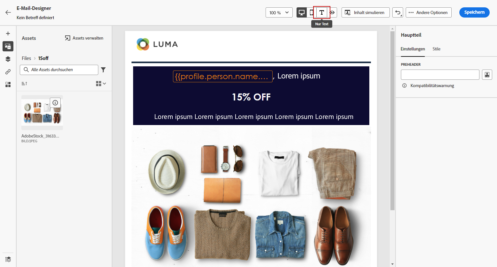
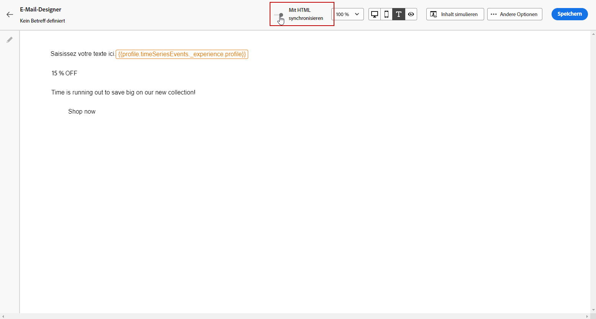
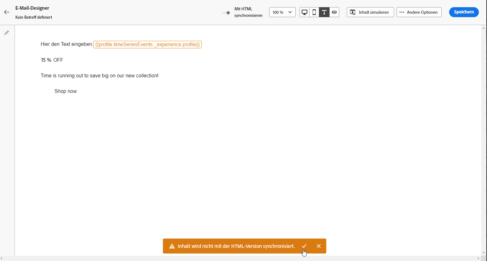

# Erstellen der Textversion einer E-Mail {#text-version-email}

Es wird empfohlen, eine Textversion Ihres E-Mail-Textkörpers zu erstellen, die verwendet wird, wenn HTML-Inhalte nicht angezeigt werden können.

Standardmäßig erstellt E-Mail-Designer eine **[!UICONTROL Nur-Text-Version]** Ihrer E-Mail einschließlich Personalisierungsfeldern. Diese Version wird automatisch generiert und mit der HTML-Version Ihres Inhalts synchronisiert.

Wenn Sie lieber einen anderen Inhalt für die Nur-Text-Version verwenden, führen Sie die folgenden Schritte aus:

1. Wählen Sie in Ihrer E-Mail die Registerkarte **[!UICONTROL Nur-Text]** aus.

   

1. Verwenden Sie den Umschalter **[!UICONTROL Mit HTML synchronisieren]**, um die Synchronisierung zu deaktivieren.

   

1. Klicken Sie auf das Häkchen, um Ihre Auswahl zu bestätigen.

   

1. Sie können die Nur-Text-Version dann nach Belieben bearbeiten.

>[!CAUTION]
>
>* Die Änderungen, die Sie in der **[!UICONTROL Nur-Text-Ansicht]** vorgenommen haben, werden in der HTML-Ansicht nicht dargestellt.
>
>* Wenn Sie die Option **[!UICONTROL Mit HTML synchronisieren]** erneut aktivieren, nachdem Sie Ihren Nur-Text-Inhalt aktualisiert haben, gehen Ihre Änderungen verloren und werden durch Textinhalte ersetzt, die aus der HTML-Version generiert wurden.

