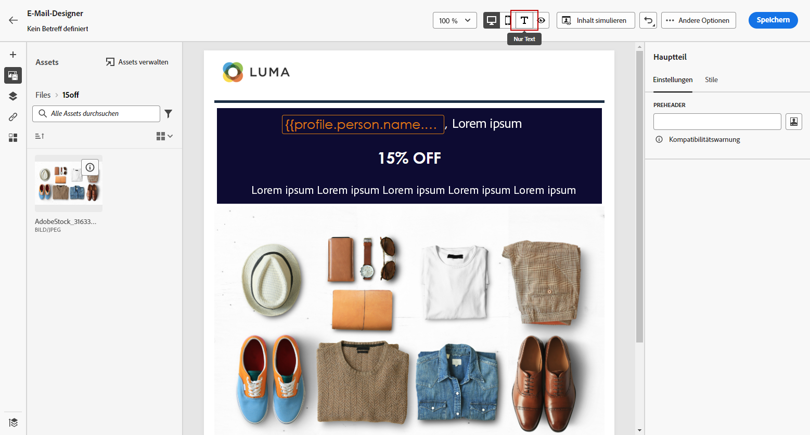
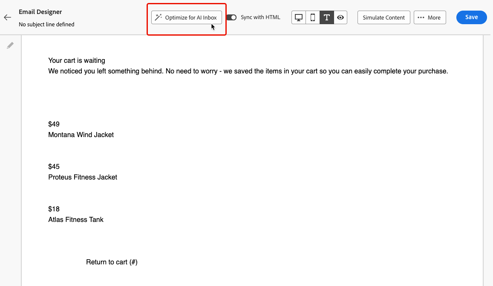

# Textversion einer E-Mail verwalten {#text-version-email}

Es wird empfohlen, eine Textversion Ihres E-Mail-Textkörpers zu erstellen, die verwendet wird, wenn HTML-Inhalte nicht angezeigt werden können.

Aus Sicherheitssicht ist die Bereitstellung einer Nur-Text-Version wichtig, da HTML-E-Mails Risiken wie bösartige Skripte, Tracking-Pixel oder Phishing-Versuche bergen können, die auf Rich-Formatierung und Links angewiesen sind. Nur-Text reduziert die Angriffsfläche und wird oft von sicherheitsbewussten Empfängerinnen und Empfängern oder E-Mail-Systemen des Unternehmens bevorzugt, die HTML einschränken oder entfernen. Durch die Bereitstellung beider Versionen können Empfängerinnen und Empfänger das Format auswählen, das ihren Sicherheits- und Datenschutzanforderungen entspricht.

## Zugriff auf die Standardtextversion {#plain-text-default}

Standardmäßig erstellt E-Mail-Designer eine **[!UICONTROL Nur-Text-Version]** Ihrer E-Mail einschließlich Personalisierungsfeldern. Diese Version wird automatisch generiert und mit der HTML-Version Ihres Inhalts synchronisiert.

Um auf die Standardtextversion zuzugreifen, wählen Sie in Ihrem E **[!UICONTROL Mail-Inhalt das Symbol]** Nur Text“ aus.



## Benutzerdefinierte Textversion verwenden {#plain-text-custom}

Wenn Sie lieber einen anderen Inhalt für die Nur-Text-Version verwenden, führen Sie die folgenden Schritte aus:

1. Wählen Sie in Ihrer E-Mail das Symbol **[!UICONTROL Nur Text]** aus.

1. Verwenden Sie den Umschalter **[!UICONTROL Mit HTML synchronisieren]**, um die Synchronisierung zu deaktivieren. Klicken Sie auf das Häkchen, um Ihre Auswahl zu bestätigen.

   

1. Sie können dann die benutzerdefinierte Nur-Text-Version nach Bedarf bearbeiten.

>[!CAUTION]
>
> * Wenn die Synchronisierung deaktiviert ist, werden Änderungen, **[!UICONTROL in der Ansicht]** Nur Text“ vorgenommen wurden, nicht in der HTML-Ansicht angezeigt.
>
> * Wenn Sie die Option **[!UICONTROL Mit HTML synchronisieren]** erneut aktivieren, nachdem Sie Ihren Nur-Text-Inhalt aktualisiert haben, gehen Ihre Änderungen verloren und werden durch Textinhalte ersetzt, die aus der HTML-Version generiert wurden.

## Textversion für KI-Posteingänge optimieren {#optimize-plain-text-ai}

Mithilfe der Schaltfläche „Für KI-Posteingang optimieren“ können Sie KI-gestützte Posteingangsfunktionen (z. B. Zusammenfassungen in [!DNL Gmail], [!DNL Outlook] oder [!DNL Apple Mail]) bei der Erstellung Ihrer wichtigen Angebote **[!UICONTROL Details]**. Diese Aktion erzeugt eine verbesserte Nur-Text-Version, die sich auf Informationen konzentriert, die Assistenten wahrscheinlich aus dem Textteil der Nachricht lesen.

{zoomable="yes" width="80%"}

>[!IMPORTANT]
>
>Bei Verwendung dieser Funktion wird die Option **[!UICONTROL Mit HTML synchronisieren]** automatisch deaktiviert.

Eine vollständige Anleitung und empfohlene Szenarien finden Sie unter [Optimieren von E-Mail-Text für KI-Posteingänge](../content-management/llm-email-optimizer.md).

## Verwendung benutzerdefinierter Nur-Text-Versionen {#when-to-use}

Wenn Sie verstehen, wann eine benutzerdefinierte Nur-Text-Version im Vergleich zur Verwendung der automatischen Synchronisierung erstellt werden muss, wird ein optimaler E-Mail-Versand und eine optimale Lesbarkeit sichergestellt.

### Benutzerdefinierten Text verwenden (Synchronisierung deaktivieren), wenn:

* **Komplexe HTML-**: Ihre HTML-E-Mail enthält mehrspaltige Layouts, Tabellen oder komplexe CSS, die nicht gut in einfachen Text übersetzt werden können.
* **Stark visuelle Inhalte** - Ihre E-Mail hängt stark von Bildern ab, und Sie möchten beschreibende Textalternativen für Clients mit deaktivierten Bildern bereitstellen.
* **Unterschiedliche Nachrichtenstruktur** - Sie möchten eine vereinfachte oder umstrukturierte Nachrichtenstruktur bereitstellen, die für Nur-Text-Leser optimiert ist.
* **Barrierefreiheitsanforderungen** - Sie benötigen eine bestimmte Textformatierung, um Barrierefreiheitsstandards zu erfüllen.
* **Ältere E-Mail-Clients** - Zu Ihrer Zielgruppe gehören Benutzer älterer E-Mail-Clients (z. B. Outlook 2003, Nur-Text-Mobile-Clients), die speziell formatierte Inhalte benötigen.
* **ASCII-**: Sie möchten eine bestimmte Textformatierung wie ASCII-Grafiken, Tabellen oder bestimmte Zeilenumbrüche einfügen.

### Automatische Synchronisierung verwenden (Standard), wenn:

* **Einfaches HTML-Design** - Ihre HTML-E-Mail hat eine einfache, lineare Struktur, die sich gut in einfachen Text übersetzen lässt.
* **Konsistenter Inhalt** - Sie möchten die exakte Konsistenz zwischen HTML- und Nur-Text-Versionen gewährleisten.
* **Häufige Updates** - Sie aktualisieren E-Mail-Inhalte regelmäßig und möchten manuelle Duplizierungen vermeiden.
* **Personalization funktioniert einwandfrei** - Ihre Personalisierungsfelder funktionieren in beiden Formaten ordnungsgemäß.
* **Zeitbeschränkungen** - Sie müssen E-Mails schnell starten, ohne zusätzliche Anpassungen im Nur-Text-Format vornehmen zu müssen.

## Praxisbeispiele {#practical-examples}

Die folgenden Beispiele zeigen reale Szenarien, in denen Sie entscheiden können, ob Sie benutzerdefinierten Text oder automatische Synchronisierung verwenden möchten. In jedem Beispiel werden der Kontext, der empfohlene Ansatz und die Gründe für die Entscheidung erläutert.

+++Beispiel 1: Marketing-Newsletter mit komplexem Layout

**Szenario:** Mehrspaltiger Newsletter mit Bildern, formatierten Schaltflächen und farbcodierten Abschnitten.


**Empfehlung:** Verwenden Sie benutzerdefinierten Klartext (deaktivieren Sie die Synchronisierung).

**Warum benutzerdefinierter Nur-Text:** Die HTML-Version verwendet ein dreispaltiges Rasterlayout mit Bannerbildern, formatierten Schaltflächen und farbcodierten Abschnitten. Diese visuellen Elemente werden durch automatische Synchronisierung nicht gut in einfachen Text übersetzt, was zu unübersichtlichen, schwer lesbaren Inhalten führt. Eine benutzerdefinierte Nur-Text-Version ermöglicht es Ihnen, den Inhalt in ein lineares, leicht zu scannendes Format mit klaren Abschnittsüberschriften und ordnungsgemäß formatierten Links umzustrukturieren.

**Beispiel für benutzerdefinierten Klartext:**

```
================================================
YOUR BRAND - MONTHLY NEWSLETTER
December 2025
================================================

🌟 FEATURED ARTICLE
"10 Ways to Optimize Your Customer Journeys"
Read more: https://example.com/articles/optimize-journeys

📢 UPCOMING WEBINAR
"Mastering Email Personalization"
December 15, 2025 at 2:00 PM EST
Register: https://example.com/webinar/register

📦 NEW PRODUCTS
- Winter Collection: https://example.com/winter
- Holiday Gift Guide: https://example.com/gifts

================================================
Website: https://example.com
Unsubscribe: https://example.com/unsubscribe
================================================
```

+++

+++Beispiel 2: Transaktionsauftragsbestätigung

**Szenario:** Bestellbestätigung mit strukturierten Daten (Bestellnummer, Artikel, Preise, Versanddetails).


**Empfehlung:** Verwenden Sie die automatische Synchronisierung.

**Warum die automatische Synchronisierung funktioniert:** Bestellbestätigungen haben eine einfache, lineare Struktur, die sich natürlich von HTML in Nur-Text übersetzt. Die Informationen fließen logisch (Bestelldetails → Artikel → Gesamtwerte → Versand), und Personalisierungsfelder wie Bestellnummern und Kundennamen funktionieren in beiden Formaten identisch. Die strukturierten, tabellarischen Daten konvertieren sauber, ohne dass manuelle Anpassungen erforderlich sind, wodurch Zeit gespart und die Klarheit gewahrt wird.

+++

+++Beispiel 3: Ereigniseinladung mit Rich-Media

**Szenario:**-Einladung mit Hintergrundbildern, eingebetteten Videos und interaktiven Elementen.


**Empfehlung:** Verwenden Sie benutzerdefinierten Klartext (deaktivieren Sie die Synchronisierung).

**Warum benutzerdefinierter Nur-Text:** Die HTML-Version beruht auf visuellen Effekten - Hintergrundbildern, Videoeinbettungen und interaktiven RSVP-Schaltflächen. Die automatische Synchronisierung würde diese Elemente entfernen und eine verwirrende Textversion mit fehlerhaften Verweisen hinterlassen. Eine benutzerdefinierte Nur-Text-Version ermöglicht es Ihnen, klare Ereignisdetails, Sprecherinformationen und direkte Registrierungs-Links in einem gut organisierten Format bereitzustellen, das ohne visuelle Elemente funktioniert.

**Beispiel für benutzerdefinierten Klartext:**

```
YOU'RE INVITED!
Annual Customer Summit 2025

📅 When: March 15-17, 2025
📍 Where: San Francisco Convention Center
         123 Market Street, San Francisco, CA

KEYNOTE SPEAKERS
- Jane Smith, CEO TechCorp: "The Future of Digital Marketing"
- John Doe, Chief Innovation Officer: "AI and Customer Experience"

REGISTER NOW: https://example.com/summit/register
Early bird discount ends February 1st

Full agenda: https://example.com/summit/agenda
Questions: events@example.com | 1-800-555-0123
```

+++

## Häufige Anwendungsfälle {#common-use-cases}

Die folgenden Anwendungsfälle zeigen, in welchen Situationen das Erstellen einer benutzerdefinierten Nur-Text-Version (Deaktivieren der Synchronisierung) von Vorteil ist. Jedes Beispiel zeigt, vor welchen Herausforderungen die HTML-Version steht und wie sie mit einer benutzerdefinierten Nur-Text-Lösung bewältigt wird.

+++Anwendungsfall 1: E-Mails zum Produktkatalog

**Herausforderung:** HTML zeigt ein Raster von Produkten mit Bildern, Preisen und Kaufen-Buttons

**Nur-Text-Lösung** Erstellen Sie eine strukturierte Liste mit klaren Produktnamen, Preisen und direkten Links

```
FEATURED PRODUCTS
=================

1. Premium Leather Wallet
   Price: $89.99
   View product: https://example.com/product/wallet
   
2. Designer Sunglasses
   Price: $129.99
   View product: https://example.com/product/sunglasses
```

+++

+++Anwendungsfall 2: Willkommens-E-Mail-Serie

**Herausforderung:** Willkommens-E-Mail mit Firmenlogo und formatierter Formatierung

**Nur-Text-Lösung** Verwenden Sie ASCII-Grafik oder Textformatierung, um eine visuelle Hierarchie zu erstellen

```
***************************************************
*                                                 *
*     WELCOME TO [BRAND NAME]                    *
*     We're thrilled to have you!                *
*                                                 *
***************************************************
```

+++

+++Anwendungsfall 3: Umfrage- oder Feedback-Anfrage

**Herausforderung:** HTML enthält formatierte Schaltflächen und Formularelemente

**Nur-Text-Lösung** Bereitstellung von Klartext-Links mit Anweisungen

```
We'd love your feedback!
------------------------

Please take 2 minutes to complete our survey:
https://example.com/survey/customer-feedback

Your input helps us improve our service.
```

+++

## Häufig gestellte Fragen {#faq}

**Funktionieren meine Personalisierungsfelder im Klartext?**\
Ja, Personalisierungsfelder wie `{{profile.firstName}}` funktionieren sowohl in der HTML- als auch in der Nur-Text-Version.

**Wie kann ich meine Nur-Text-Version testen?**
* Schalten Sie in **[!UICONTROL E]** Mail-Designer zur Ansicht „Nur Text“ um. [Weitere Informationen](#text-version-email)
* Senden Sie Test-E-Mails an Clients nur mit Text, wie alte Versionen von Pine oder einfache mobile E-Mail-Apps.

**Was passiert, wenn ich vergesse, eine Nur-Text-Version zu erstellen?**\
Das System generiert automatisch eine Nur-Text-Version aus Ihrer HTML, die möglicherweise nicht optimal formatiert ist, aber die Bereitstellung an Nur-Text-Clients sicherstellt.

**Kann ich in HTML eine andere Personalisierung als Nur-Text-Personalisierung verwenden?**\
Ja, sobald Sie die Synchronisierung deaktiviert haben, können Sie jede Version unabhängig voneinander anpassen, einschließlich der Verwendung verschiedener Personalisierungsfelder oder Inhalte.

**Welche E-Mail-Clients unterstützen nur Text?**\
Nur sehr wenige moderne Clients sind nur für Text vorgesehen, aber einige E-Mail-Richtlinien des Unternehmens, Barrierefreiheits-Tools und ältere Mobilgeräte zeigen möglicherweise nur Text an. Es ist auch ein Fallback, wenn das HTML-Rendering fehlschlägt.

**Wie oft sollte ich meine Nur-Text-Version aktualisieren?**\
Aktualisieren Sie sie, wenn Sie wesentliche Änderungen an Ihrem HTML-Inhalt vornehmen. Geringfügige HTML-Änderungen erfordern möglicherweise keine Nur-Text-Aktualisierungen, wenn die Kernbotschaft unverändert bleibt.

**Kann ich Links in Nur-Text-E-Mails einfügen?**\
Ja. Schließen Sie vollständige URLs ein (z. B. https://example.com/page), und die meisten E-Mail-Clients machen sie automatisch klickbar.

**Sollte ich Bilder im Klartext einbinden?**\
Nein, Nur-Text unterstützt keine Bilder. Beschreiben Sie stattdessen, was das Bild zeigt, oder geben Sie einen Link an, um es online anzuzeigen.
