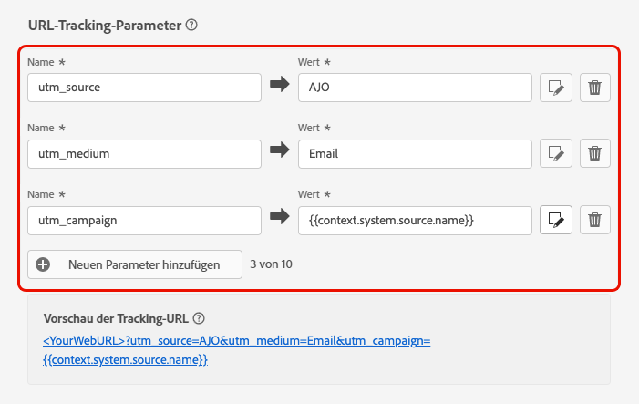
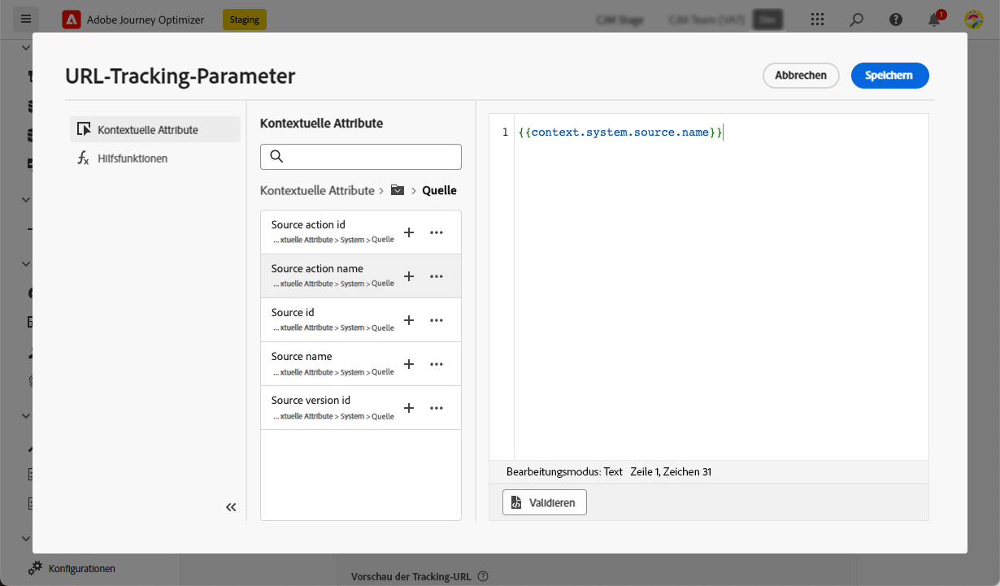
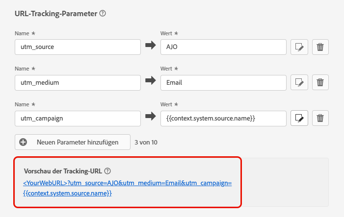

# URL-Tracking {#url-tracking}

>[!BEGINSHADEBOX]

**Auf dieser Seite:** Erfahren Sie, wie Sie URL-Tracking-Parameter auf der Konfigurationsebene des E-Mail-Kanals definieren, damit sie an Ihre Inhalts-Links angehängt und in Web-Analysen und Leistungsberichten erfasst werden.

>[!ENDSHADEBOX]

>[!CONTEXTUALHELP]
>id="ajo_admin_preset_utm"
>title="Definieren der URL-Tracking-Parameter"
>abstract="Diesen Abschnitt verwenden, um Tracking-Parameter automatisch an die im E-Mail-Inhalt vorhandenen URLs anzuhängen. Diese Funktion ist optional."

>[!CONTEXTUALHELP]
>id="ajo_admin_preset_url_preview"
>title="Vorschau der URL-Tracking-Parameter"
>abstract="Überprüfen Sie, wie Tracking-Parameter an die in Ihrem E-Mail-Inhalt vorhandenen URLs angehängt werden."

Bei der Konfiguration einer neuen [E-Mail-Kanalkonfiguration](email-settings.md) können Sie **[!UICONTROL URL-Tracking-Parameter]** definieren, um die Effektivität Ihrer Marketing-Maßnahmen kanalübergreifend zu messen. Die Aktivierung dieser Funktion ist optional.

Die im entsprechenden Abschnitt definierten Parameter werden an das Ende der URLs angehängt, die im Inhalt Ihrer E-Mail-Nachricht enthalten sind. Anschließend können Sie diese Parameter in Web-Analyse-Tools wie Adobe Analytics oder Google Analytics erfassen und verschiedene Performance-Berichte erstellen.

>[!NOTE]
>
>Die Reihenfolge der an die URL angehängten URL-Tracking-Parameter ist zufällig und kann nicht gesteuert werden. Wenn Ihr System Parameter in einer bestimmten Reihenfolge benötigt, müssen Sie sie parsen und auf Ihrer Seite neu anordnen.

Sie können mithilfe der Schaltfläche **[!UICONTROL Neuen Parameter hinzufügen]** bis zu 10 Tracking-Parameter hinzufügen.

{width="80%"}

Um einen URL-Tracking-Parameter zu konfigurieren, können Sie die gewünschten Werte direkt in die Felder **[!UICONTROL Name]** und **[!UICONTROL Wert]** eingeben.

Mithilfe des [Personalisierungseditors](../personalization/personalization-build-expressions.md) können Sie auch jedes Feld **[!UICONTROL Wert]** bearbeiten. Klicken Sie auf das Bearbeitungssymbol, um den Editor zu öffnen. Dort können Sie die gewünschten Kontexteigenschaften und/oder den Text direkt bearbeiten.

Die folgenden vordefinierten Werte sind über den Personalisierungseditor verfügbar:

* **Nachrichtprofil-ID**:Ein nachrichtenorientiertes Attribut, das jede an jedes Zielprofil in einem Versand gesendete Nachricht eindeutig identifiziert.

* **Angebots-ID**: ID des in der E-Mail verwendeten Angebots.

* **Quellaktion-ID**: ID der E-Mail-Aktion, die der Journey oder Kampagne hinzugefügt wurde.

  >[!NOTE]
  >
  >Journey-Dateien, die nach einer Produktänderung geschlossen oder nicht erneut veröffentlicht wurden, können `context.system.source.actionId` möglicherweise nicht in Tracking-URLs einfügen, was zu leeren Platzhaltern führt (z. B. `cid=em-acou-adob{}`). Um sicherzustellen, dass die Tracking-Parameter korrekt ausgefüllt sind[&#x200B; veröffentlichen Sie die betroffene Journey erneut](../building-journeys/publish-journey.md#journey-create-new-version) oder entfernen Sie den Verweis auf dieses Kontextfeld für geschlossene Journey. Weitere Informationen finden Sie unter [Fehlerbehebung bei der Live-Journey-Ausführung](../building-journeys/troubleshooting-execution.md#tracking-parameters-closed-journeys).

* **Name der Quellaktion**: Name der E-Mail-Aktion, die der Journey oder Kampagne hinzugefügt wurde.

* **Quell-ID**: ID der Journey oder Kampagne, mit der die E-Mail gesendet wurde.

* **Quellname**: Name der Journey oder Kampagne, mit der die E-Mail gesendet wurde.

* **Quellversions-ID**: ID der Journey- oder Kampagnenversion, mit der die E-Mail gesendet wurde.

>[!NOTE]
>
>Sie können die Eingabe von Textwerten und die Verwendung von kontextuellen Attributen im Personalisierungseditor kombinieren. Jedes **[!UICONTROL Wert]**-Feld kann eine Anzahl von Zeichen bis zu einer Größe von 5 KB enthalten.

<!--You can drag and drop the parameters to reorder them.-->

Im Folgenden finden Sie Beispiele für URLs, die mit Adobe Analytics und Google Analytics kompatibel sind.

* Mit Adobe Analytics kompatible URL: `www.YourLandingURL.com?cid=email_AJO_{{context.system.source.id}}_image_{{context.system.source.name}}`

* Mit Google Analytics kompatible URL: `www.YourLandingURL.com?utm_medium=email&utm_source=AJO&utm_campaign={{context.system.source.id}}&utm_content=image`

Sie können die resultierende Tracking-URL dynamisch in der Vorschau anzeigen. Jedes Mal, wenn Sie einen Parameter hinzufügen, bearbeiten oder entfernen, wird die Vorschau automatisch aktualisiert.

>[!NOTE]
>
>Sie können auch dynamische personalisierte Tracking-Parameter zu den Links im E-Mail-Inhalt hinzufügen. [Weitere Informationen](surface-personalization.md#personalize-url-tracking)
