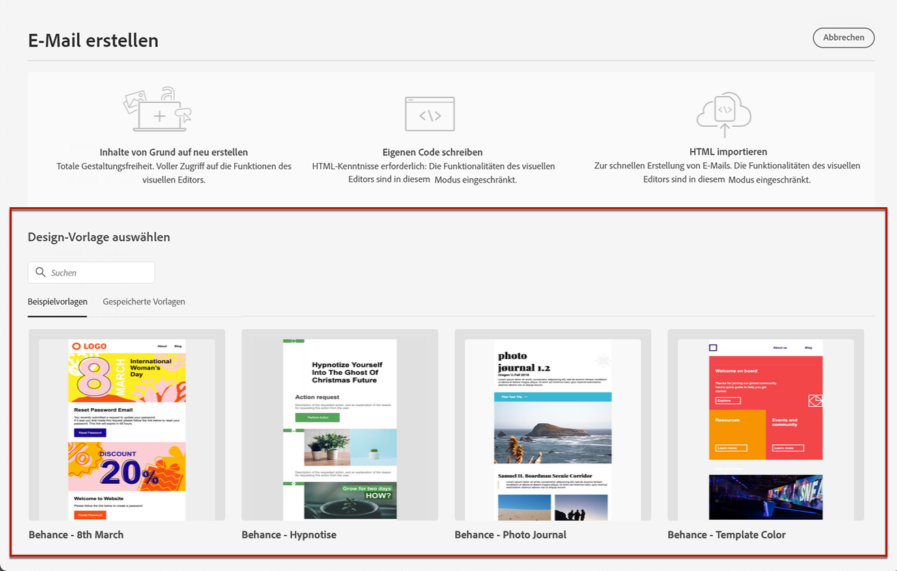

# Verwenden von E-Mail-Vorlagen {#email-templates}

>[!CONTEXTUALHELP]
>id="ajo_use_template"
>title="Erstellen von Inhalten aus einer Vorlage"
>abstract="Wählen Sie zum Erstellen Ihres E-Mail-Inhalts entweder eine bereits im System vorhandene Standardvorlage, eine von Ihnen neu erstellte Vorlage oder eine zu einem früheren Zeitpunkt als Vorlage gespeicherte E-Mail aus."
>additional-url="https://experienceleague.adobe.com/docs/journey-optimizer/using/content-management/reusable-content/content-templates.html?lang=de#create-content-templates" text="Erstellen von Inhaltsvorlagen"

Verwenden Sie auf dem Bildschirm **[!UICONTROL E-Mail erstellen]** den Abschnitt **[!UICONTROL Design-Vorlage auswählen]**, um Ihren Inhalt aus einer Vorlage zu erstellen.

Sie können aus folgenden Optionen wählen:

* **Beispielvorlagen**. Die [!DNL Journey Optimizer]-Benutzeroberfläche bietet 20 vordefinierte E-Mail-Vorlagen, aus denen Sie wählen können.

* **Gespeicherte Vorlagen**. Sie können auch eine benutzerdefinierte Vorlage verwenden, die Sie entweder:

   * von Grund auf mit dem Menü **[!UICONTROL Inhaltsvorlagen]** erstellt haben. [Weitere Informationen](../content-management/content-templates.md#create-template-from-scratch)

   * mithilfe der Option **[!UICONTROL Als Inhaltsvorlage speichern]** aus einer E-Mail in einer Journey oder einer Kampagne gespeichert haben. [Weitere Informationen](../content-management/content-templates.md#save-as-template)

Gehen Sie wie folgt vor, um mit einer der Beispielvorlagen oder der gespeicherten Vorlagen mit der Erstellung Ihres Inhalts zu beginnen.

1. [Greifen Sie auf den E-Mail-Designer zu](get-started-email-design.md) über den Bildschirm **[!UICONTROL Inhalt bearbeiten]**.

1. Auf dem Bildschirm **[!UICONTROL E-Mail erstellen]** ist standardmäßig die Registerkarte **[!UICONTROL Beispielvorlagen]** ausgewählt.

1. Um eine benutzerdefinierte Vorlage zu verwenden, navigieren Sie zur Registerkarte **[!UICONTROL Gespeicherte Vorlagen]**.

   

1. Die Liste aller [Inhaltsvorlagen](../content-management/content-templates.md#create-content-templates), die in der aktuellen Sandbox erstellt wurden, wird angezeigt. Sie können sie nach **[!UICONTROL Name]**, **[!UICONTROL Zuletzt geändert]** und **[!UICONTROL Zuletzt erstellt]** sortieren.

   

1. Wählen Sie aus der Liste die gewünschte Vorlage aus.

1. Nach der Auswahl können Sie mit Pfeil nach rechts und nach links zwischen allen Vorlagen einer Kategorie (Beispielvorlage oder gespeicherte Vorlagen, je nach Ihrer Auswahl) navigieren.

   

1. Klicken Sie oben rechts auf dem Bildschirm auf **[!UICONTROL Diese Vorlage verwenden]**.

1. Bearbeiten Sie die Inhalte nach Bedarf mit dem E-Mail-Designer.
