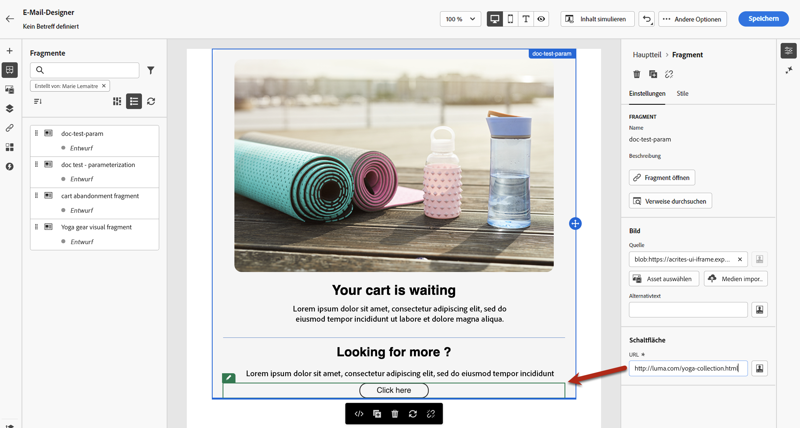

# Hinzufügen visueller Fragmente zu Ihren E-Mails {#use-visual-fragments}

Ein Fragment ist eine wiederverwendbare Komponente, die in einer oder mehreren E-Mails in Journey Optimizer-Kampagnen, -Journeys oder -Inhaltsvorlagen referenziert werden kann.  Mit dieser Funktion können Sie mehrere benutzerdefinierte Inhaltsbausteine vorab erstellen, mit denen Marketing-Fachleute E-Mail-Inhalte schnell in einem verbesserten Design-Prozess zusammenstellen können.  [Informationen zum Erstellen und Verwalten von Fragmenten](../content-management/fragments.md).

➡️ [In diesem Video erfahren Sie, wie Sie Fragmente verwalten, erstellen und verwenden.](../content-management/fragments.md#video-fragments)

## Verwenden eines Fragments {#use-fragment}

Gehen Sie wie folgt vor, um ein Fragment in einer E-Mail zu verwenden.

>[!NOTE]
>
>Sie können für einen Versand bis zu 30 Fragmente hinzufügen. Fragmente können nur bis zu einer Ebene verschachtelt werden.

1. Öffnen Sie eine beliebige E-Mail oder Inhaltsvorlage mit dem [E-Mail-Designer](get-started-email-design.md).

1. Wählen Sie in der linken Leiste das Symbol **[!UICONTROL Fragmente]** aus.

   

1. Es wird eine Liste aller in der aktuellen Sandbox erstellten Fragmente angezeigt. Sie werden nach Erstellungsdatum sortiert, wobei die kürzlich hinzugefügten visuellen Fragmente zuerst in der Liste angezeigt werden.  Sie haben folgende Möglichkeiten:

   * Suchen Sie nach einem bestimmten Fragment, indem Sie mit der Eingabe der zugehörigen Kennzeichnung beginnen.
   * Sortieren Sie Fragmente in auf- oder absteigender Reihenfolge.
   * Ändern Sie die Anzeige der Fragmente (Karten- oder Listenansicht).
   * Aktualisieren Sie die Liste.

   >[!NOTE]
   >
   >Wenn einige Fragmente während der Bearbeitung des Inhalts geändert oder hinzugefügt wurden, wird die Liste mit den neuesten Änderungen aktualisiert.

1. Ziehen Sie ein beliebiges Fragment aus der Liste in den Bereich, in den Sie es einfügen möchten.

   

   >[!CAUTION]
   >
   >Sie können jeden **Fragmententwurf** und jedes **Live-Fragment** zu Ihrem Inhalt hinzufügen. Sie können Ihre Journey oder Kampagne jedoch nicht aktivieren, wenn ein Fragment mit dem Status „Entwurf“ darin verwendet wird. Bei der Veröffentlichung einer Journey oder Kampagne wird bei Fragmententwürfen ein Fehler angezeigt. Sie müssen sie erst genehmigen, um sie veröffentlichen zu können.

1. Wie jede andere Komponente können Sie das Fragment in Ihrem Inhalt verschieben.

1. Wählen Sie das Fragment aus, um den entsprechenden Bereich auf der rechten Seite anzuzeigen. Dort können Sie das Fragment aus Ihrem Inhalt löschen oder duplizieren. Sie können diese Aktionen auch direkt über das Kontextmenü ausführen, das über dem Fragment angezeigt wird.

   

1. Auf der Registerkarte **[!UICONTROL Einstellungen]** haben Sie folgende Möglichkeiten:

   * Wählen Sie die Geräte aus, auf denen das Fragment angezeigt werden soll.
   * Öffnen Sie das Fragment auf einer neuen Registerkarte, um es bei Bedarf zu bearbeiten. [Weitere Informationen](../content-management/fragments.md#edit-fragments)
   * Erkunden Sie Verweise. [Weitere Informationen](../content-management/fragments.md#explore-references)

1. Sie können Ihr Fragment mit der Registerkarte **[!UICONTROL Stile]** weiter anpassen.

1. Bei Bedarf können Sie die Vererbung vom ursprünglichen Fragment unterbrechen. [Weitere Informationen](#break-inheritance)

1. Fügen Sie beliebig viele Fragmente hinzu und **[!UICONTROL speichern]** Sie Ihre Änderungen.

## Verwenden implizierter Variablen {#implicit-variables-in-fragments}

Implizite Variablen verbessern die vorhandene Fragmentfunktionalität, um die Effizienz der Wiederverwendbarkeit von Inhalten und der entsprechenden Skripterstellung zu verbessern. Fragmente können nun Eingabevariablen verwenden und Ausgabevariablen erstellen, die sich in Kampagnen- und Journey-Inhalten verwenden lassen.

In [diesem Abschnitt](../personalization/use-expression-fragments.md#implicit-variables) erfahren Sie, wie Sie implizite Variablen verwenden.

## Anpassen bearbeitbarer Felder {#customize-fields}

Wenn bestimmte Teile des ausgewählten Fragments bearbeitbar gemacht wurden, können Sie deren Standardwert überschreiben, nachdem Sie das Fragment zum Inhalt hinzugefügt haben. [Erfahren Sie, wie Sie Ihre Fragmente anpassbar machen können](../content-management/customizable-fragments.md)

Gehen Sie wie folgt vor, um bearbeitbare Felder in einem Fragment anzupassen:

1. Fügen Sie das Fragment zu Ihrem Inhalt hinzu und wählen Sie es aus, um den Bereich „Eigenschaften“ auf der rechten Seite zu öffnen.

1. Alle bearbeitbaren Felder im Fragment werden auf der Registerkarte **Einstellungen** im Abschnitt **Fragment** angezeigt.

   Bearbeitbare Felder werden im Vorschaufenster grün hervorgehoben, wenn sie im rechten Bereich ausgewählt wurden. So können Sie die Position der Felder in Ihrem Inhalt leicht identifizieren.

   Im folgenden Beispiel können die **Bildquelle** und der **alternative Text** sowie die **URL** der Schaltfläche „Hier klicken“ bearbeitet werden.

   

## Unterbrechen der Vererbung {#break-inheritance}

Wenn Sie ein visuelles Fragment bearbeiten, werden die Änderungen synchronisiert. Sie werden automatisch an alle Journey-Entwürfe oder Live-Journeys/Kampagnen und Inhaltsvorlagen übertragen, die dieses Fragment enthalten.

Wenn Fragmente zu einer E-Mail oder Inhaltsvorlage hinzugefügt werden, werden sie standardmäßig synchronisiert.  Sie können allerdings die Vererbung vom ursprünglichen Fragment unterbrechen. In diesem Fall wird der Inhalt des Fragments in das aktuelle Design kopiert, die Änderungen jedoch nicht mehr synchronisiert.

Gehen Sie wie folgt vor, um die Vererbung zu unterbrechen:

1. Wählen Sie das Fragment aus.

1. Klicken Sie in der kontextbezogenen Symbolleiste auf das Entsperrsymbol.

   

1. Dieses Fragment wird dann zu einem eigenständigen Element, das nicht mehr mit dem ursprünglichen Fragment verknüpft ist. Bearbeiten Sie es wie jede andere Inhaltskomponente in Ihrem Inhalt. [Weitere Informationen](content-components.md)
