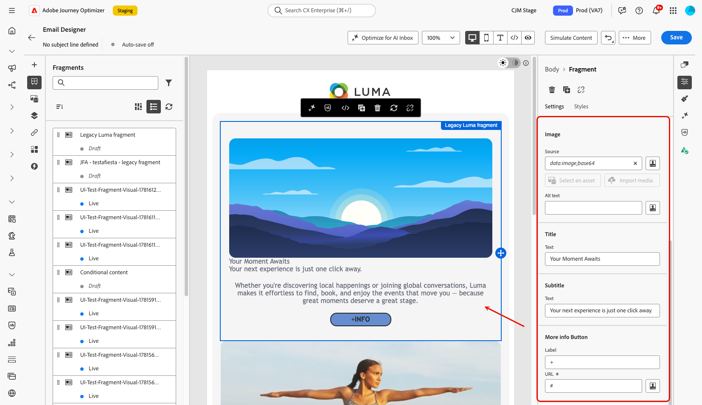
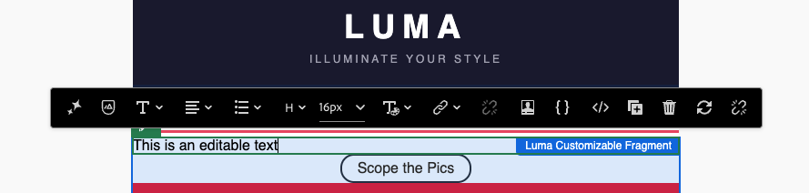
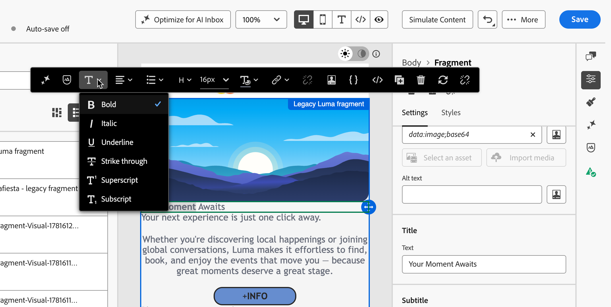

# Hinzufügen visueller Fragmente zu Ihren E-Mails {#use-visual-fragments}

>[!BEGINSHADEBOX]

**Auf dieser Seite** Erfahren Sie, wie Sie wiederverwendbare visuelle Fragmente in Ihre E-Mails einfügen, ihre bearbeitbaren Felder anpassen und ihre Vererbung mit dem ursprünglichen Fragment aufheben oder beibehalten.

>[!ENDSHADEBOX]

Ein Fragment ist eine wiederverwendbare Komponente, die in einer oder mehreren E-Mails in Journey Optimizer-Kampagnen, -Journeys oder -Inhaltsvorlagen referenziert werden kann. Diese Funktionalität ermöglicht es, mehrere benutzerdefinierte Inhaltsbausteine vorab zu erstellen, die anschließend von Benutzenden aus dem Marketing-Bereich verwendet werden können, um E-Mail-Inhalte in einem verbesserten Design-Prozess schnell zusammenzustellen. [Informationen zum Erstellen und Verwalten von Fragmenten](../content-management/fragments.md).

➡️ [In diesem Video erfahren Sie, wie Sie Fragmente verwalten, erstellen und verwenden](../content-management/fragments.md#video-fragments)

## Verwenden eines Fragments {#use-fragment}

Gehen Sie wie folgt vor, um ein Fragment in einer E-Mail zu verwenden.

>[!NOTE]
>
>Sie können für einen Versand bis zu 30 Fragmente hinzufügen. Fragmente können nur bis zu einer Ebene verschachtelt werden.

1. Öffnen Sie eine beliebige E-Mail oder Inhaltsvorlage mit dem [E-Mail-Designer](get-started-email-design.md).

1. Wählen Sie in der linken Leiste das Symbol **[!UICONTROL Fragmente]** aus.

   

1. Es wird eine Liste aller in der aktuellen Sandbox erstellten Fragmente angezeigt. Sie werden nach Erstellungsdatum sortiert, wobei die kürzlich hinzugefügten visuellen Fragmente zuerst in der Liste angezeigt werden. Sie haben folgende Möglichkeiten:

   * Suchen Sie nach einem bestimmten Fragment, indem Sie mit der Eingabe des zugehörigen Labels beginnen.
   * Sortieren Sie Fragmente in auf- oder absteigender Reihenfolge.
   * Ändern Sie die Anzeige der Fragmente (Karten- oder Listenansicht).
   * Aktualisieren Sie die Liste.

   >[!NOTE]
   >
   >Wenn einige Fragmente während der Bearbeitung des Inhalts geändert oder hinzugefügt wurden, wird die Liste mit den neuesten Änderungen aktualisiert.

1. Ziehen Sie ein beliebiges Fragment aus der Liste in den Bereich, in den Sie es einfügen möchten.

   

   >[!CAUTION]
   >
   >Sie können jeden **Entwurf** und jedes **Live-Fragment** zu Ihrem Inhalt hinzufügen. Sie können Ihre Journey oder Kampagne jedoch nicht aktivieren, wenn ein Fragment mit dem Status „Entwurf“ darin verwendet wird. Bei der Veröffentlichung einer Journey oder Kampagne wird bei Fragmententwürfen ein Fehler angezeigt. Sie müssen sie erst genehmigen, um sie veröffentlichen zu können.

1. Wie jede andere Komponente können Sie das Fragment in Ihrem Inhalt verschieben.

1. Wählen Sie das Fragment aus, um den entsprechenden Bereich auf der rechten Seite anzuzeigen. Dort können Sie das Fragment aus Ihrem Inhalt löschen oder duplizieren. Sie können diese Aktionen auch direkt über das Kontextmenü ausführen, das über dem Fragment angezeigt wird.

   

1. Auf der Registerkarte **[!UICONTROL Einstellungen]** haben Sie folgende Möglichkeiten:

   * Wählen Sie die Geräte aus, auf denen das Fragment angezeigt werden soll.
   * Öffnen Sie das Fragment auf einer neuen Registerkarte und bearbeiten Sie es bei Bedarf. [Weitere Informationen](../content-management/manage-fragments.md#edit-fragments)
   * Erkunden Sie Verweise. [Weitere Informationen](../content-management/fragments.md#visual-expression)

1. Bei Bedarf können Sie die Vererbung vom ursprünglichen Fragment unterbrechen. [Weitere Informationen](#break-inheritance)

   Nach der Entsperrung können Sie Ihr Fragment wie jede andere Komponente weiter anpassen und die Registerkarte **[!UICONTROL Stile]** verwenden.

1. Fügen Sie beliebig viele Fragmente hinzu und **[!UICONTROL speichern]** Sie Ihre Änderungen.

## Verwalten bedingter Inhalte in Fragmenten {#fragment-dynamic-content}

Beachten Sie beim Arbeiten mit visuellen Fragmenten mit bedingtem Inhalt die folgenden Richtlinien. [Erfahren Sie mehr über dynamische Inhalte](../personalization/dynamic-content.md#emails)

>[!CAUTION]
>
>**Das Verschachteln von Fragmenten mit bedingten Inhalten wird nicht unterstützt.** Ein Fragment mit bedingtem Inhalt kann nicht in einem entsperrten Fragment platziert werden, das auch bedingten Inhalt enthält. Diese nicht unterstützte Konfiguration kann zu Folgendem führen:
>
>* Verlust der Zuordnungen von bedingten Inhaltsvarianten
>* Warnungen zum Kompatibilitätsmodus im E-Mail-Designer
>* Inkonsistentes E-Mail-Rendering

**E-Mail richtig strukturieren:** Wenn Sie mehrere Fragmente mit bedingtem Inhalt verwenden, fügen Sie jedes Fragment direkt in einen eigenen Strukturblock auf E-Mail-Ebene hinzu. Verschachteln Sie Fragmente mit bedingtem Inhalt nicht in anderen ungesperrten Fragmenten, die auch bedingte Inhalte enthalten.

**Planen Sie voraus:** Bevor Sie Ihrer E-Mail Fragmente hinzufügen, identifizieren Sie, welche bedingte Inhalte enthalten, und planen Sie Ihr Layout entsprechend. So vermeiden Sie Konfigurationsprobleme und stellen von Anfang an eine saubere Struktur sicher.

**Entwerfen Sie wiederverwendbare Fragmente sorgfältig** Wenn Sie Fragmente erstellen, die bedingte Inhalte enthalten, sollten Sie überlegen, wie sie verwendet werden sollen. Wenn ein Fragment in anderen Fragmenten verschachtelt werden muss, vermeiden Sie das Hinzufügen bedingter Inhalte sowohl zum übergeordneten als auch zum untergeordneten Fragment.

**Fehlerbehebung:** Wenn bedingte Inhaltsvariantenzuordnungen verloren gehen oder Warnungen zum Kompatibilitätsmodus angezeigt werden, führen Sie die folgenden Schritte aus.

* Überprüfen Sie Ihre E-Mail-Struktur auf verschachtelte Fragmente, die bedingte Inhalte enthalten
* Strukturieren Sie die Struktur um, indem Sie jedes Fragment mit bedingtem Inhalt auf E-Mail-Ebene in einen eigenen Strukturblock verschieben
* Speichern und überprüfen Sie, ob bedingte Inhaltsvarianten ordnungsgemäß wiederhergestellt werden

## Verwenden implizierter Variablen {#implicit-variables-in-fragments}

Implizite Variablen verbessern die vorhandene Fragmentfunktionalität, um die Effizienz der Wiederverwendbarkeit von Inhalten und der entsprechenden Skripterstellung zu verbessern. Fragmente können nun Eingabevariablen verwenden und Ausgabevariablen erstellen, die sich in Kampagnen- und Journey-Inhalten verwenden lassen.

In [diesem Abschnitt](../personalization/use-expression-fragments.md#implicit-variables) erfahren Sie, wie Sie implizite Variablen verwenden.

## Anpassen bearbeitbarer Felder {#customize-fields}

Wenn bestimmte Teile des ausgewählten Fragments bearbeitbar gemacht wurden, können Sie deren Standardwert überschreiben, nachdem Sie das Fragment in Ihren Inhalt eingefügt haben. [Erfahren Sie, wie Sie ein Fragment anpassbar machen](../content-management/customizable-fragments.md)

Gehen Sie wie folgt vor, um bearbeitbare Felder in einem in einer E-Mail verwendeten Fragment anzupassen.

1. Fügen Sie Ihrem E-Mail-Inhalt ein anpassbares Fragment hinzu und wählen Sie es aus **[!UICONTROL um den Bereich „Fragment]** auf der rechten Seite zu öffnen.

1. Alle bearbeitbaren Felder im Fragment werden auf der Registerkarte **[!UICONTROL Einstellungen]** unter den Fragmenteigenschaften angezeigt.

   Im folgenden Beispiel können die Bildquelle und der Alternativtext sowie die Felder „Titel“/„Untertitel“ und die URL der Schaltfläche „Weitere Informationen“ bearbeitet werden.

   

1. Bewegen Sie den Mauszeiger über ein bearbeitbares Feld auf der zentralen Arbeitsfläche. Das Feld wird grün hervorgehoben, und beim Klicken auf den darin enthaltenen Text wird ein Stiftsymbol angezeigt.

   {width="80%" align="center"}

1. Bearbeiten Sie den Feldtext direkt inline auf der zentralen Designer-Arbeitsfläche von E-Mail.

   >[!NOTE]
   >
   >Um die bearbeitbaren Felder in Ihren Inhalten einfach zu finden, können Sie sie auch im rechten Bereich auswählen, diese Felder können jedoch nur auf der zentralen Arbeitsfläche bearbeitet werden.

1. Bei **[!UICONTROL Text]**-, **[!UICONTROL Button]**- und **[!UICONTROL HTML]**-Komponenten bietet die E-Mail-Designer-Symbolleiste auch Zugriff auf Rich-Text-Formatierungsoptionen - fett, kursiv, Hyperlinks und mehr.

   

   >[!TIP]
   >
   >Für Fragmente, die vor der Einführung der Rich-Text-Bearbeitungsfunktion erstellt wurden, sind bearbeitbare Felder standardmäßig auf Nur-Text-Modus eingestellt. Um vollständige Formatierungsoptionen zu aktivieren, wechseln Sie zum Fragment-Editor mithilfe der Schaltfläche **[!UICONTROL Fragment öffnen]**, klicken Sie auf **[!UICONTROL Aktivieren]**, um den Rich-Text-Modus zu entsperren und **[!UICONTROL Fragment]** speichern. [Weitere Informationen](../content-management/customizable-fragments.md#rich-text-visual)

   {width="50%" align="left" zoomable="yes"}

1. Sie können auf **[!UICONTROL Inhalte simulieren]** klicken, um zu sehen, wie die bearbeitbaren Inhalte und Stile gerendert werden. [Informationen zur Vorschau von Inhalten](../content-management/preview-test.md)

>[!CAUTION]
>
>Wenn sowohl **label** als auch **URL** einer Schaltflächenkomponente in einem Fragment bearbeitbar gemacht werden können, wird in Tracking-Berichten die URL anstelle der Schaltflächenbeschriftung angezeigt. [Weitere Informationen zum Tracking](message-tracking.md)

## Unterbrechen der Vererbung {#break-inheritance}

Wenn Sie ein visuelles Fragment bearbeiten, werden die Änderungen synchronisiert. Sie werden automatisch an alle Journey-Entwürfe oder Live-Journeys/Kampagnen und Inhaltsvorlagen übertragen, die dieses Fragment enthalten.

Wenn Fragmente zu einer E-Mail oder Inhaltsvorlage hinzugefügt werden, werden sie standardmäßig synchronisiert. Sie können allerdings die Vererbung vom ursprünglichen Fragment unterbrechen. In diesem Fall wird der Inhalt des Fragments in das aktuelle Design kopiert, die Änderungen jedoch nicht mehr synchronisiert.

Gehen Sie wie folgt vor, um die Vererbung zu unterbrechen:

1. Wählen Sie das Fragment aus.

1. Klicken Sie in der kontextbezogenen Symbolleiste auf das Entsperrsymbol.

   

1. Dieses Fragment wird dann zu einem eigenständigen Element, das nicht mehr mit dem ursprünglichen Fragment verknüpft ist. Bearbeiten Sie es wie jede andere Inhaltskomponente in Ihrem Inhalt. [Weitere Informationen](content-components.md)

### Gesperrte Fragmente {#locked-fragments}

Wenn das Fragment von seinem Autor gesperrt wurde, ist das Entsperrsymbol grau dargestellt und kann nicht zum Unterbrechen der Vererbung verwendet werden.

Gesperrte Fragmente bleiben überall synchronisiert, wo sie angezeigt werden. Dadurch werden lokale Bearbeitungen verhindert, die Markenstandards oder Compliance-Anforderungen beeinträchtigen könnten.

Erfahren Sie in ([&#x200B; Abschnitt), wie Sie ein Fragment &#x200B;](../content-management/create-fragments.md#lock-visual-fragment).

>[!NOTE]
>
>Der Fragmentautor kann die Einstellung für zukünftige Verwendungen später ändern, indem er in den Fragmenteinstellungen sein Verhalten **[!UICONTROL Unterbrechung der Vererbung zulassen]** zurücksetzt.

