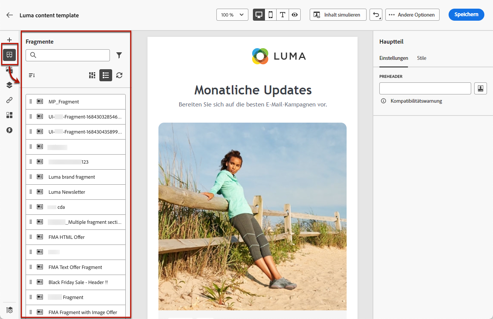
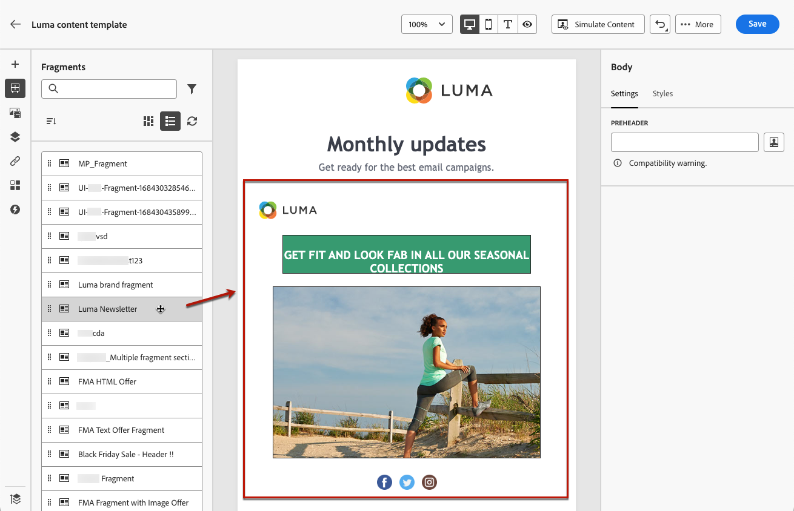
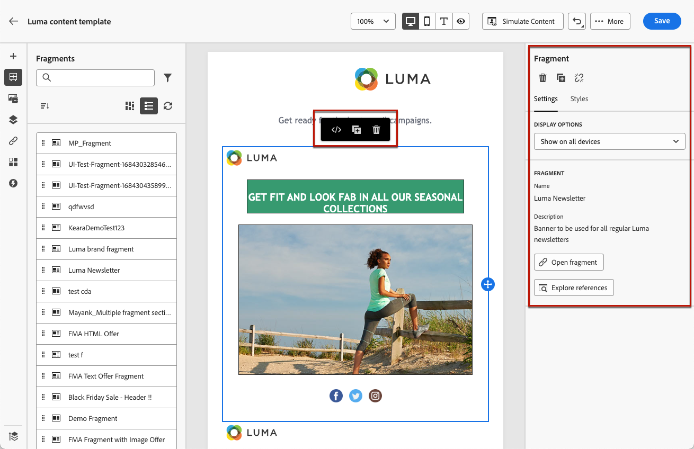
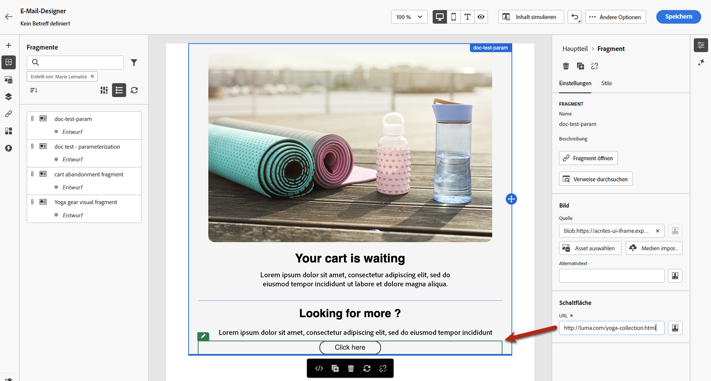
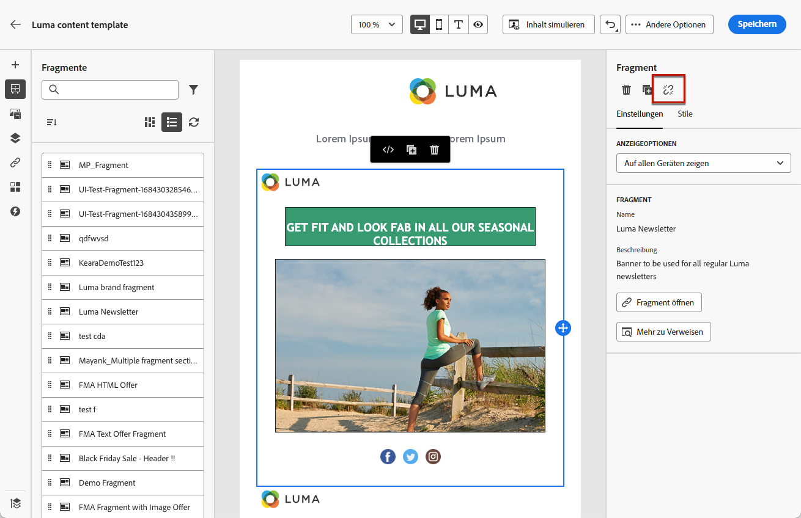

# Hinzufügen visueller Fragmente zu Ihren E-Mails {#use-visual-fragments}

Ein Fragment ist eine wiederverwendbare Komponente, die in einer oder mehreren E-Mails in Journey Optimizer-Kampagnen, -Journeys oder -Inhaltsvorlagen referenziert werden kann. Diese Funktionalität ermöglicht es, mehrere benutzerdefinierte Inhaltsbausteine vorab zu erstellen, die anschließend von Benutzenden aus dem Marketing-Bereich verwendet werden können, um E-Mail-Inhalte in einem verbesserten Design-Prozess schnell zusammenzustellen. [Informationen zum Erstellen und Verwalten von Fragmenten](../content-management/fragments.md).

➡️ [In diesem Video erfahren Sie, wie Sie Fragmente verwalten, erstellen und verwenden](../content-management/fragments.md#video-fragments)

## Verwenden eines Fragments {#use-fragment}

Gehen Sie wie folgt vor, um ein Fragment in einer E-Mail zu verwenden.

>[!NOTE]
>
>Sie können für einen Versand bis zu 30 Fragmente hinzufügen. Fragmente können nur bis zu einer Ebene verschachtelt werden.

1. Öffnen Sie eine beliebige E-Mail oder Inhaltsvorlage mit dem [E-Mail-Designer](get-started-email-design.md).

1. Wählen Sie in der linken Leiste das Symbol **[!UICONTROL Fragmente]** aus.

   

1. Es wird eine Liste aller in der aktuellen Sandbox erstellten Fragmente angezeigt. Sie werden nach Erstellungsdatum sortiert, wobei die kürzlich hinzugefügten visuellen Fragmente zuerst in der Liste angezeigt werden. Sie haben folgende Möglichkeiten:

   * Suchen Sie nach einem bestimmten Fragment, indem Sie mit der Eingabe des zugehörigen Labels beginnen.
   * Sortieren Sie Fragmente in auf- oder absteigender Reihenfolge.
   * Ändern Sie die Anzeige der Fragmente (Karten- oder Listenansicht).
   * Aktualisieren Sie die Liste.

   >[!NOTE]
   >
   >Wenn einige Fragmente während der Bearbeitung des Inhalts geändert oder hinzugefügt wurden, wird die Liste mit den neuesten Änderungen aktualisiert.

1. Ziehen Sie ein beliebiges Fragment aus der Liste in den Bereich, in den Sie es einfügen möchten.

   

   >[!CAUTION]
   >
   >Sie können jeden **Entwurf** und jedes **Live-Fragment** zu Ihrem Inhalt hinzufügen. Sie können Ihre Journey oder Kampagne jedoch nicht aktivieren, wenn ein Fragment mit dem Status „Entwurf“ darin verwendet wird. Bei der Veröffentlichung einer Journey oder Kampagne wird bei Fragmententwürfen ein Fehler angezeigt. Sie müssen sie erst genehmigen, um sie veröffentlichen zu können.

1. Wie jede andere Komponente können Sie das Fragment in Ihrem Inhalt verschieben.

1. Wählen Sie das Fragment aus, um den entsprechenden Bereich auf der rechten Seite anzuzeigen. Dort können Sie das Fragment aus Ihrem Inhalt löschen oder duplizieren. Sie können diese Aktionen auch direkt über das Kontextmenü ausführen, das über dem Fragment angezeigt wird.

   

1. Auf der Registerkarte **[!UICONTROL Einstellungen]** haben Sie folgende Möglichkeiten:

   * Wählen Sie die Geräte aus, auf denen das Fragment angezeigt werden soll.
   * Öffnen Sie das Fragment auf einer neuen Registerkarte, um es bei Bedarf zu bearbeiten. [Weitere Informationen](../content-management/fragments.md#fragments)
   * Erkunden Sie Verweise. [Weitere Informationen](../content-management/fragments.md#visual-expression)

1. Sie können Ihr Fragment mit der Registerkarte **[!UICONTROL Stile]** weiter anpassen.

1. Bei Bedarf können Sie die Vererbung vom ursprünglichen Fragment unterbrechen. [Weitere Informationen](#break-inheritance)

1. Fügen Sie beliebig viele Fragmente hinzu und **[!UICONTROL speichern]** Sie Ihre Änderungen.

### Einschränkungen bei der Verwendung dynamischer Inhalte in Fragmenten {#fragment-dynamic-content}

>[!CAUTION]
>
>Beachten Sie beim Arbeiten mit Fragmenten, die dynamische Inhalte (bedingte Inhalte) enthalten, die folgende Einschränkung:
>
>**Das Verschachteln von Fragmenten mit dynamischen Inhalten wird nicht unterstützt.** Sie können kein Fragment mit dynamischem Inhalt in einem entsperrten Fragment platzieren, das auch dynamischen Inhalt enthält. Diese nicht unterstützte Konfiguration kann zu Folgendem führen:
>
>* Verlust der bedingten Inhaltszuordnungen
>* Warnungen zum Kompatibilitätsmodus im E-Mail-Designer
>* Inkonsistentes E-Mail-Rendering
>
>**Empfohlener Ansatz:** Wenn Sie mehrere Fragmente mit dynamischen Inhalten in einer E-Mail verwenden, fügen Sie jedes Fragment direkt in einem eigenen Strukturblock auf E-Mail-Ebene hinzu. Dadurch wird die ordnungsgemäße Funktionalität sichergestellt und die oben genannten Probleme werden vermieden.

## Best Practices für Fragmente mit dynamischen Inhalten {#fragment-best-practices}

Befolgen Sie diese Best Practices beim Arbeiten mit visuellen Fragmenten und dynamischen Inhalten (bedingte Inhalte):

* **E-Mail richtig strukturieren**: Fügen Sie jedes Fragment in einem dedizierten Strukturblock auf E-Mail-Ebene hinzu, wenn Sie E-Mails mit Fragmenten mit dynamischem Inhalt erstellen. Vermeiden Sie es, Fragmente mit dynamischem Inhalt innerhalb von anderen entsperrten Fragmenten zu verschachteln, die ebenfalls dynamische Inhalte enthalten.

* **Im Voraus planen**: Bevor Sie Ihrer E-Mail Fragmente hinzufügen, müssen Sie ermitteln, welche Fragmente dynamische Inhalte enthalten, und Ihr Layout entsprechend planen. So vermeiden Sie Konfigurationsprobleme und stellen von Anfang an eine saubere Struktur sicher.

* **Wiederverwendbare Fragmente sorgfältig entwerfen**: Berücksichtigen Sie beim Erstellen von Fragmenten mit dynamischen Inhalten, wie diese Fragmente verwendet werden. Wenn ein Fragment in anderen Fragmenten verschachtelt werden muss, sollten Sie dynamische Inhalte nicht sowohl in den übergeordneten als auch in den untergeordneten Fragmenten hinzuzufügen.

* **Fehlerbehebung**: Wenn Zuordnungen bedingter Inhalte verloren gehen oder Warnungen zum Kompatibilitätsmodus angezeigt werden:
   * Prüfen Sie Ihre E-Mail-Struktur auf verschachtelte Fragmente, die dynamische Inhalte enthalten
   * Passen Sie die Struktur an, indem Sie jedes Fragment mit dynamischen Inhalten in einen eigenen Strukturblock auf der E-Mail-Ebene verschieben
   * Speichern Sie und prüfen Sie, ob die Zuordnungen bedingter Inhalte ordnungsgemäß wiederhergestellt wurden

## Verwenden implizierter Variablen {#implicit-variables-in-fragments}

Implizite Variablen verbessern die vorhandene Fragmentfunktionalität, um die Effizienz der Wiederverwendbarkeit von Inhalten und der entsprechenden Skripterstellung zu verbessern. Fragmente können nun Eingabevariablen verwenden und Ausgabevariablen erstellen, die sich in Kampagnen- und Journey-Inhalten verwenden lassen.

In [diesem Abschnitt](../personalization/use-expression-fragments.md#implicit-variables) erfahren Sie, wie Sie implizite Variablen verwenden.

## Anpassen bearbeitbarer Felder {#customize-fields}

Wenn bestimmte Teile des ausgewählten Fragments bearbeitbar gemacht wurden, können Sie deren Standardwert überschreiben, nachdem Sie das Fragment in Ihren Inhalt eingefügt haben. [Informationen dazu, wie Sie Ihre Fragmente anpassbar machen können](../content-management/customizable-fragments.md)

Gehen Sie wie folgt vor, um bearbeitbare Felder in einem Fragment anzupassen:

1. Fügen Sie das Fragment zu Ihrem Inhalt hinzu.

1. Wählen Sie diese Option aus, um den Eigenschaftenbereich auf der rechten Seite zu öffnen.

   Alle bearbeitbaren Felder im Fragment werden auf der Registerkarte **Einstellungen** im Abschnitt **Fragment** angezeigt.

1. Wenn Sie ein bearbeitbares Feld im rechten Bereich auswählen, wird es im Vorschaubereich in der Mitte grün hervorgehoben, sodass die Position des Feldes im Inhalt leicht zu finden ist.

   Im folgenden Beispiel können die **Bildquelle** und der **alternative Text** sowie die **URL** der Schaltfläche „Hier klicken“ bearbeitet werden.

   

>[!CAUTION]
>
>Wenn sowohl **label** als auch **URL** einer Schaltflächenkomponente in einem Fragment bearbeitbar gemacht werden können, wird in Tracking-Berichten die URL anstelle der Schaltflächenbeschriftung angezeigt. [Weitere Informationen zum Tracking](../email/message-tracking.md)

## Unterbrechen der Vererbung {#break-inheritance}

Wenn Sie ein visuelles Fragment bearbeiten, werden die Änderungen synchronisiert. Sie werden automatisch an alle Journey-Entwürfe oder Live-Journeys/Kampagnen und Inhaltsvorlagen übertragen, die dieses Fragment enthalten.

Wenn Fragmente zu einer E-Mail oder Inhaltsvorlage hinzugefügt werden, werden sie standardmäßig synchronisiert. Sie können allerdings die Vererbung vom ursprünglichen Fragment unterbrechen. In diesem Fall wird der Inhalt des Fragments in das aktuelle Design kopiert, die Änderungen jedoch nicht mehr synchronisiert.

Gehen Sie wie folgt vor, um die Vererbung zu unterbrechen:

1. Wählen Sie das Fragment aus.

1. Klicken Sie in der kontextbezogenen Symbolleiste auf das Entsperrsymbol.

   

1. Dieses Fragment wird dann zu einem eigenständigen Element, das nicht mehr mit dem ursprünglichen Fragment verknüpft ist. Bearbeiten Sie es wie jede andere Inhaltskomponente in Ihrem Inhalt. [Weitere Informationen](content-components.md)

### Gesperrte Fragmente {#locked-fragments}

Wenn das Fragment von seinem Autor gesperrt wurde, ist das Entsperrsymbol grau dargestellt und kann nicht zum Unterbrechen der Vererbung verwendet werden.

Gesperrte Fragmente bleiben überall synchronisiert, wo sie angezeigt werden. Dadurch werden lokale Bearbeitungen verhindert, die Markenstandards oder Compliance-Anforderungen beeinträchtigen könnten.

Erfahren Sie in ([&#x200B; Abschnitt), wie Sie ein Fragment &#x200B;](../content-management/create-fragments.md#lock-visual-fragment).

>[!NOTE]
>
>Der Fragmentautor kann die Einstellung für zukünftige Verwendungen später ändern, indem er in den Fragmenteinstellungen sein Verhalten **[!UICONTROL Unterbrechung der Vererbung zulassen]** zurücksetzt.

