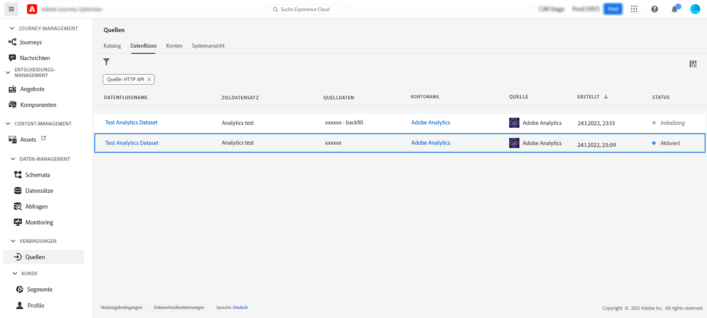

# Nutzung von Adobe Analytics-Daten{#analytics-data}

Sie können alle verhaltensbezogenen Ereignisdaten, die Sie in Adobe Analytics bereits erfassen und an Adobe Experience Platform streamen, nutzen, um Journeys auszulösen und Erlebnisse für Ihre Kunden zu automatisieren.

>[!NOTE]
>
>Dieser Abschnitt gilt nur für regelbasierte Ereignisse und Kunden, die Adobe Analytics-Daten verwenden müssen.

Dazu müssen Sie in Adobe Experience Platform die Report Suite aktivieren, die Sie verwenden möchten. Gehen Sie dazu wie folgt vor:

1. Stellen Sie eine Verbindung zu Adobe Experience Platform her und suchen Sie nach **[!UICONTROL Sources]**.
1. Wählen Sie im Abschnitt Adobe Analytics die Option **[!UICONTROL Add data]**: wird die Liste der verfügbaren Adobe Analytics Report Suites angezeigt.

1. Wählen Sie die zu aktivierende Report Suite aus und klicken Sie auf **[!UICONTROL Next]** und **[!UICONTROL Finish]**.

1. Geben Sie die Quelldaten-ID für Ihren Beta-Programmkontaktpunkt frei.

Dadurch wird der Analytics-Quell-Connector für diese Report Suite aktiviert. Sobald die Daten eingehen, werden sie in ein Erlebnisereignis umgewandelt und an Adobe Experience Platform gesendet.

Weitere Informationen zum Quell-Connector für Adobe Analytics finden Sie unter  [Dokumentation zu Adobe Experience Platform](https://experienceleague.adobe.com/docs/experience-platform/sources/connectors/adobe-applications/analytics.html){target=&quot;_blank&quot;} und [Tutorial](https://experienceleague.adobe.com/docs/experience-platform/sources/ui-tutorials/create/adobe-applications/analytics.html){target=&quot;_blank&quot;}.
