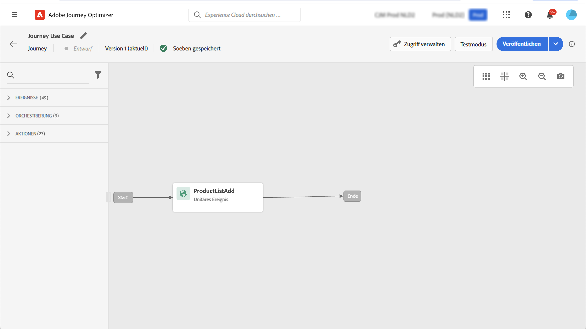

# Adobe Analytics-Integration {#analytics-data}

## Verwenden von Adobe Analytics- oder Web SDK-Daten {#leverage-analytics-data}

Alle Ereignisdaten über das Verhalten im Internet, die in Adobe Analytics oder über das Web SDK bereits erfasst und an Adobe Experience Platform gestreamt werden, können zum Auslösen von Journeys und zum Automatisieren von Kundenerlebnissen genutzt werden.

>[!NOTE]
>
>Dieser Abschnitt gilt nur für regelbasierte Ereignisse und Kunden, die Adobe Analytics- oder Web-SDK-Daten verwenden müssen.

Damit Adobe Analytics verwendet werden kann, muss die Report Suite aktiviert wurde, die in Adobe Experience Platform verwendet werden soll. Gehen Sie dazu wie folgt vor:

1. Eine Verbindung mit Adobe Experience Platform herstellen und zu **[!UICONTROL Quellen]** navigieren.

1. Wählen Sie im Adobe Analytics-Bereich die Option **[!UICONTROL Daten hinzufügen]**.

   

1. Wählen Sie aus der Liste der verfügbaren Adobe Analytics Report Suites die zu aktivierende **[!UICONTROL Report Suite]** aus. Klicken Sie dann auf **[!UICONTROL Weiter]**.

   

1. Wählen Sie aus, ob Sie ein standardmäßiges oder benutzerdefiniertes Schema verwenden möchten.

1. Wählen Sie im Bildschirm **[!UICONTROL Datenflussdetails]** einen **[!UICONTROL Datenflussnamen]** aus.

1. Nachdem die Konfiguration abgeschlossen ist, klicken Sie auf **[!UICONTROL Beenden]**.

   

Dadurch wird der Analytics-Quell-Connector für diese Report Suite aktiviert. Sobald die Daten eingehen, werden sie in ein Erlebnisereignis umgewandelt und an Adobe Experience Platform gesendet.

Weitere Informationen zum Adobe Analytics-Quell-Connector finden Sie unter  [Adobe Experience Platform-Dokumentation](https://experienceleague.adobe.com/docs/experience-platform/sources/connectors/adobe-applications/analytics.html?lang=de){target="_blank"} and [tutorial](https://experienceleague.adobe.com/docs/experience-platform/sources/ui-tutorials/create/adobe-applications/analytics.html?lang=de){target="_blank"}.

## Erstellen einer Journey mit einem Ereignis mithilfe von Adobe Analytics- oder Web SDK-Daten {#event-analytics}

Nach der Integration von Adobe Analytics mit [Adobe Analytics-Quellen](#leverage-analytics-data) oder dem [Adobe Experience Platform Web SDK](https://experienceleague.adobe.com/docs/experience-platform/edge/home.html?lang=de) können Sie ein Ereignis erstellen, das später in einer Journey verwendet werden kann.

In diesem Beispiel werden wir Benutzende ansprechen, die ein Produkt zum Warenkorb hinzugefügt haben:

* Zwei Tage nach Abschluss der Bestellung erhalten sie eine Follow-up-E-Mail mit der Bitte um Feedback.
* Wenn die Bestellung noch nicht abgeschlossen ist, erhalten sie eine E-Mail, in der sie daran erinnert werden, die Bestellung abzuschließen.

1. Öffnen Sie über Adobe Journey Optimizer das Menü **[!UICONTROL Konfiguration]**.

1. Wählen Sie anschließend **[!UICONTROL Verwalten]** in der Karte **[!UICONTROL Ereignisse]**.

   

1. Klicken auf **[!UICONTROL Ereignis erstellen]**. Der Bereich für die Ereigniskonfiguration wird auf der rechten Seite des Bildschirms geöffnet.

1. Füllen Sie die **[!UICONTROL Ereignis]**-Parameter aus:

   * **[!UICONTROL Name]**: Personalisieren Sie den Namen Ihres **[!UICONTROL Ereignisses]**.
   * **[!UICONTROL Typ]**: Wählen Sie den Typ **[!UICONTROL Einzelfall]**. [Weitere Informationen](../event/about-events.md)
   * **[!UICONTROL Ereignis-ID-Typ]**: Wählen Sie den Ereignis-ID-Typ **[!UICONTROL Regelbasiert]**. [Weitere Informationen](../event/about-events.md#event-id-type)
   * **[!UICONTROL Schema]**: Wählen Sie das im obigen Abschnitt erstellte Analytics- oder Web SDK-Schema aus.
   * **[!UICONTROL Felder]**: Wählen Sie die Payload-Felder aus. [Weitere Informationen](../event/about-creating.md#define-the-payload-fields)
   * **[!UICONTROL Ereignis-ID-Bedingung]**: Definieren Sie die Bedingung, anhand der das System die Ereignisse identifiziert, die Ihre Journey auslösen.

      Hier wird das Ereignis ausgelöst, wenn Kunden bzw. Kundinnen einen Artikel zu ihrem Warenkorb hinzufügen.
   * **[!UICONTROL Profilkennung]**: Wählen Sie ein Feld aus Ihren Payload-Feldern aus oder definieren Sie eine Formel, um die mit dem Ereignis verknüpfte Person zu identifizieren.

   

1. Klicken Sie abschließend auf **[!UICONTROL Speichern]**. Ihr Ereignis kann jetzt in einer Journey verwendet werden.

1. In **[!UICONTROL Journeys]** können Sie jetzt mit der Erstellung Ihrer Journey beginnen. Weiterführende Informationen hierzu finden Sie in [diesem Abschnitt](../building-journeys/journey-gs.md).

1. Fügen Sie Ihre zuvor konfigurierten Analytics-Ereignisse zu Ihrer Journey hinzu.

   

1. Fügen Sie ein Ereignis hinzu, das ausgelöst wird, wenn eine Bestellung abgeschlossen ist.

1. Wählen Sie im **[!UICONTROL Ereignismenü]** die Optionen **[!UICONTROL Maximale Wartezeit für Ereignisse definieren]** und **[!UICONTROL Zeitüberschreitungspfad festlegen]** aus.

   

1. Fügen Sie im Zeitüberschreitungspfad die Aktion **[!UICONTROL E-Mail]** hinzu. Dieser Pfad wird verwendet, um eine E-Mail an Kunden bzw. Kundinnen zu senden, die keine Bestellung abgeschlossen haben, um sie daran zu erinnern, dass sich noch Waren in ihrem Warenkorb befinden.

1. Fügen Sie nach Ihrem Hauptpfad die Aktivität **[!UICONTROL Warten]** hinzu und wählen Sie dafür die erforderliche Dauer aus.

   

1. Fügen Sie dann eine **[!UICONTROL E-Mail-Aktion]** hinzu. In dieser E-Mail werden die Kunden bzw. Kundinnen aufgefordert, Feedback zur aufgegebenen Bestellung abzugeben.

Sie können eine Journey veröffentlichen, nachdem Sie ihre Gültigkeit getestet haben. [Weitere Informationen](../building-journeys/publishing-the-journey.md)

