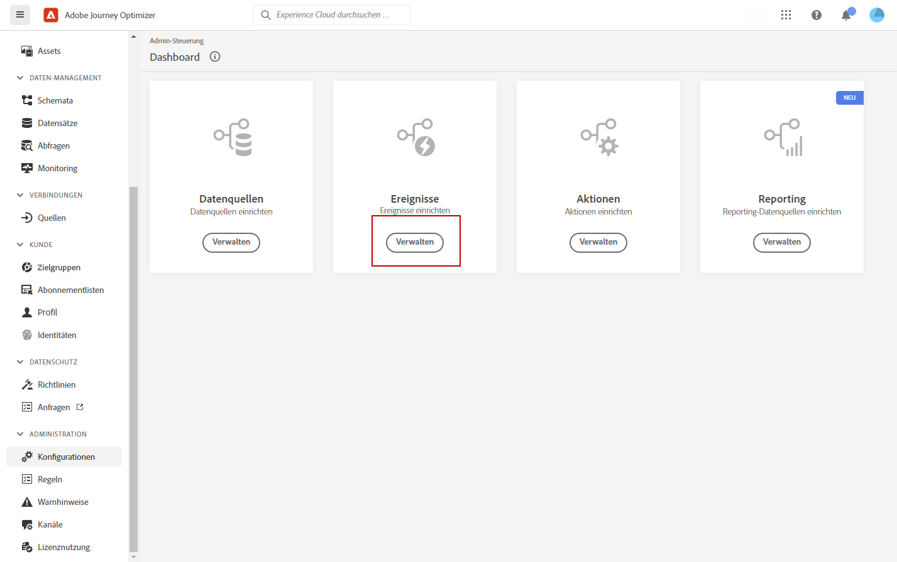

# Adobe Analytics-Integration {#analytics-data}

## Verwenden von Adobe Analytics- oder Web SDK-Daten {#leverage-analytics-data}

Sie können alle Web-verhaltensbezogenen Ereignisdaten (über Adobe Analytics oder Web SDK) nutzen, die Sie bereits erfassen und an Adobe Experience Platform streamen, um Journey von Triggern zu erhalten und Erlebnisse für Ihre Kunden zu automatisieren.

>[!NOTE]
>
>Dieser Abschnitt gilt nur für regelbasierte Ereignisse und Kunden, die Adobe Analytics- oder WebSDK-Daten verwenden müssen.

Damit dies mit Adobe Analytics funktioniert, müssen Sie in Adobe Experience Platform die Report Suite aktivieren, die Sie verwenden möchten. Gehen Sie dazu wie folgt vor:

1. Eine Verbindung mit Adobe Experience Platform herstellen und zu **[!UICONTROL Quellen]** navigieren.

1. Wählen Sie im Abschnitt Adobe Analytics die Option **[!UICONTROL Daten hinzufügen]**

   

1. Wählen Sie aus der Liste der verfügbaren Adobe Analytics Report Suites das **[!UICONTROL Report Suite]** aktivieren. Klicken Sie dann auf **[!UICONTROL Weiter]**.

   

1. Wählen Sie aus, ob Sie ein standardmäßiges oder benutzerdefiniertes Schema verwenden möchten.

1. Aus dem **[!UICONTROL Datenflussdetails]** Bildschirm, wählen Sie eine **[!UICONTROL Dataflow-Name]**.

1. Sobald die Konfiguration abgeschlossen ist, klicken Sie auf **[!UICONTROL Beenden]**.

   

Dadurch wird der Analytics-Quell-Connector für diese Report Suite aktiviert. Sobald die Daten eingehen, werden sie in ein Erlebnisereignis umgewandelt und an Adobe Experience Platform gesendet.

Weitere Informationen zum Adobe Analytics-Quellen-Connector finden Sie in der [Dokumentation zu Adobe Experience Platform](https://experienceleague.adobe.com/docs/experience-platform/sources/connectors/adobe-applications/analytics.html?lang=de){target=&quot;_blank&quot;} und im [Tutorial](https://experienceleague.adobe.com/docs/experience-platform/sources/ui-tutorials/create/adobe-applications/analytics.html?lang=de){target=&quot;_blank&quot;}.

## Erstellen einer Journey mit einem Ereignis mithilfe von Adobe Analytics- oder Web SDK-Daten {#event-analytics}

Nach der Implementierung Ihrer Integration mit Adobe Analytics mit [Adobe Analytics-Quellen](#leverage-analytics-data) oder mit [Adobe Experience Platform Web SDK](https://experienceleague.adobe.com/docs/experience-platform/edge/home.html?lang=de)können Sie ein Ereignis erstellen, das später in einer Journey verwendet werden kann.

In diesem Beispiel werden wir Benutzer ansprechen, die ein Produkt zum Warenkorb hinzugefügt haben:

* Wenn die Bestellung abgeschlossen ist, erhalten sie zwei Tage später eine Follow-up-E-Mail, um Feedback zu erhalten.
* Wenn die Bestellung noch nicht abgeschlossen ist, erhalten sie eine E-Mail, um sie daran zu erinnern, die Bestellung abzuschließen.

1. Greifen Sie über Adobe Journey Optimizer auf die **[!UICONTROL Konfiguration]** Menü.

1. Wählen Sie anschließend **[!UICONTROL Verwalten]** von **[!UICONTROL Veranstaltungen]** Karte.

   

1. Klicken **[!UICONTROL Ereignis erstellen]**. Der Bereich für die Ereigniskonfiguration wird auf der rechten Seite des Bildschirms geöffnet.

1. Füllen Sie die **[!UICONTROL Ereignis]** Parameter:

   * **[!UICONTROL Name]**: Personalisieren Sie den Namen Ihrer **[!UICONTROL Ereignis]**.
   * **[!UICONTROL Typ]**: Wählen Sie die **[!UICONTROL Einzelfall]** Typ. [Weitere Informationen](../event/about-events.md)
   * **[!UICONTROL Ereignis-ID-Typ]**: Wählen Sie die **[!UICONTROL Regelbasiert]** Ereignis-ID-Typ. [Weitere Informationen](../event/about-events.md#event-id-type)
   * **[!UICONTROL Schema]**: Wählen Sie das im obigen Abschnitt erstellte Analytics- oder WebSDK-Schema aus.
   * **[!UICONTROL Felder]**: Wählen Sie die Felder Payload aus. [Weitere Informationen](../event/about-creating.md#define-the-payload-fields)
   * **[!UICONTROL Ereignis-ID-Bedingung]**: Definieren Sie die Bedingung, die vom System verwendet wird, um die Ereignisse zu identifizieren, die Ihre Journey Trigger werden.

      Hier wird das Ereignis ausgelöst, wenn Kunden einen Artikel zu ihrem Warenkorb hinzufügen.
   * **[!UICONTROL Profilkennung]**: Wählen Sie ein Feld aus Ihren Payload-Feldern aus oder definieren Sie eine Formel, um die mit dem Ereignis verbundene Person zu identifizieren.

   

1. Wählen Sie nach der Konfiguration **[!UICONTROL Speichern]**. Ihr Ereignis kann jetzt in einer Journey verwendet werden.

1. Aus dem **[!UICONTROL Journey]**, können Sie jetzt mit der Erstellung Ihrer Journey beginnen. Weiterführende Informationen hierzu finden Sie in [diesem Abschnitt](../building-journeys/journey-gs.md).

1. Fügen Sie Ihre zuvor konfigurierten Analytics-Ereignisse zu Ihrer Journey hinzu.

   

1. Fügen Sie ein Ereignis hinzu, das ausgelöst wird, wenn eine Bestellung abgeschlossen ist.

1. Von Ihrem **[!UICONTROL Ereignismenü]**, wählen Sie die **[!UICONTROL Definieren des Ereignis-Timeouts]** und **[!UICONTROL Zeitüberschreitungspfad festlegen]** Optionen.

   

1. Fügen Sie im Timeout-Pfad eine **[!UICONTROL Email]** Aktion. Dieser Pfad wird verwendet, um eine E-Mail an Kunden zu senden, die keine Bestellung abgeschlossen haben, um sie daran zu erinnern, dass ihr Warenkorb noch verfügbar ist.

1. Hinzufügen einer **[!UICONTROL Warten]** Aktivität nach Ihrem Hauptpfad und legen Sie dafür die erforderliche Dauer fest.

   

1. Fügen Sie dann eine **[!UICONTROL E-Mail-Aktion]**. In dieser E-Mail werden die Kunden aufgefordert, Feedback zur aufgegebenen Bestellung abzugeben.

Sie können Ihre Journey jetzt veröffentlichen, nachdem Sie ihre Gültigkeit getestet haben. [Weitere Informationen](../building-journeys/publishing-the-journey.md)

