# Business-Ereignis {#configure-a-business-event} konfigurieren

Im Gegensatz zu einheitlichen Ereignissen sind geschäftliche Ereignisse nicht mit einem bestimmten Profil verknüpft. Der Ereignis-ID-Typ ist immer regelbasiert. Lesen Sie mehr über geschäftliche Ereignisse in [diesem Abschnitt](../event/about-events.md).

Auf Lesesegmenten basierende Journey können in einer Einzelaufnahme durch eine Planung auf regulärer Basis oder durch ein geschäftliches Ereignis ausgelöst werden, wenn das Ereignis eintritt.

Business Ereignisses können &quot;ein Produkt ist wieder auf Lager&quot;, &quot;der Aktienkurs einer Firma erreicht einen bestimmten Wert&quot; usw. sein.

## Wichtige Hinweise

* Das Ereignis-Schema muss eine primäre Identität enthalten.
* Business-Ereignis können nur als erster Schritt einer Journey fallen gelassen werden.
* Wenn Sie ein Business-Ereignis als ersten Schritt einer Journey ablegen, lautet der Typ der Planung der Journey &quot;Business-Ereignis&quot;.
* Nach einem geschäftlichen Ereignis kann nur eine Aktivität für gelesene Segmente abgelegt werden. Es wird automatisch als nächster Schritt hinzugefügt.
* Geschäftliche Ereignis können nicht häufiger als eine Stunde ausgelöst werden.
* Nachdem ein geschäftliches Ereignis ausgelöst wurde, wird es verzögert, das Segment von 15 auf bis zu eine Stunde exportieren zu lassen.
* Beim Testen eines Business-Ereignisses müssen Sie die Ereignis-Parameter und die ID des Test-Profils übergeben, das die Journey in den Test eingibt. Beim Testen einer Business-Ereignis-basierten Journey können Sie außerdem nur den Trigger eines einzelnen Profils verwenden. Siehe [diesen Abschnitt](../building-journeys/testing-the-journey.md#test-business). Im Testmodus ist kein Code-Ansicht-Modus verfügbar.
* Was passiert mit Personen, die sich derzeit in der Journey befinden, wenn ein neues Business-Ereignis eintrifft? Es verhält sich genauso wie bei einer erneuten Journey, wenn sich Personen immer noch in einer wiederkehrenden Phase befinden. Ihr Weg ist vorbei. Daher müssen Marketingexperten darauf achten, nicht zu lange Journey zu bauen, wenn sie häufige geschäftliche Ereignis erwarten.

## Erste Schritte mit geschäftlichen Ereignissen

Im Folgenden werden die ersten Schritte zum Konfigurieren eines Business-Ereignisses beschrieben:

1. Klicken Sie im linken Menü auf das Symbol **[!UICONTROL Admin]** und dann auf **[!UICONTROL Ereignis]**. Die Liste der Ereignis wird angezeigt.

   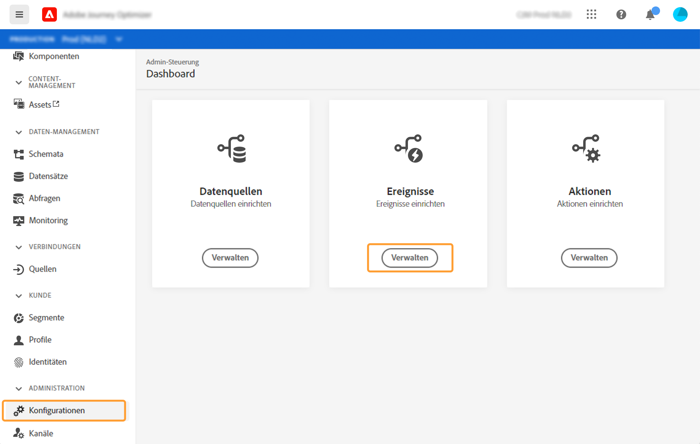

1. Klicken Sie auf **[!UICONTROL Hinzufügen]**, um ein neues Ereignis zu erstellen. Der Bereich &quot;Ereignis-Konfiguration&quot;wird rechts im Bildschirm angezeigt.

   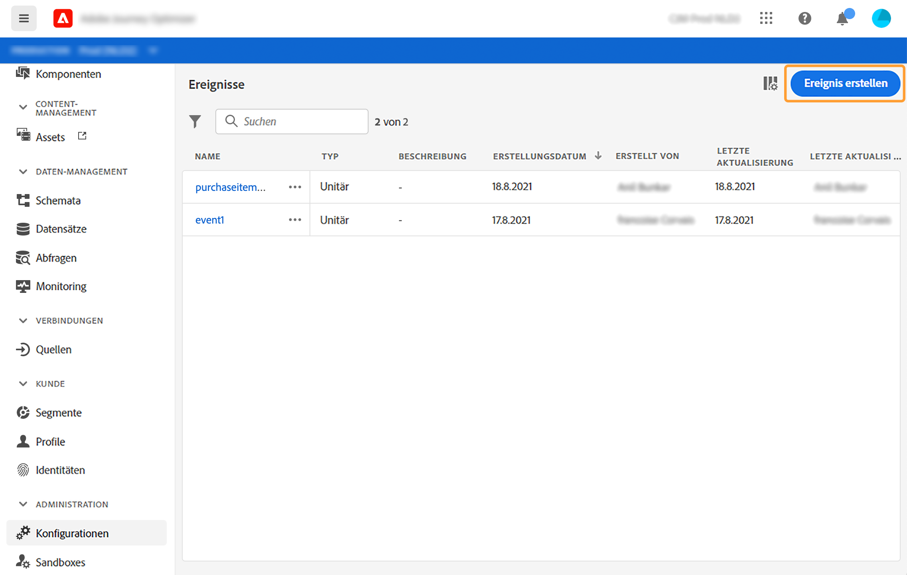

1. Geben Sie den Namen Ihres Ereignisses ein. Sie können auch eine Beschreibung hinzufügen.

   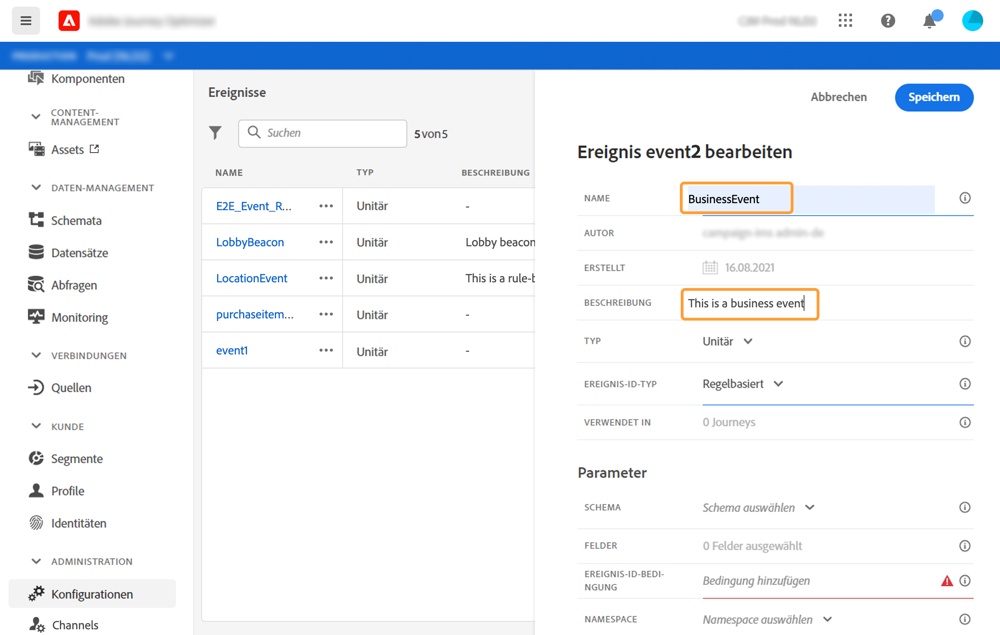

   >[!NOTE]
   >
   >Verwenden Sie keine Leerzeichen oder Sonderzeichen. Verwenden Sie nicht mehr als 30 Zeichen.

1. Wählen Sie im Feld **[!UICONTROL Typ]** **Unternehmen**.

   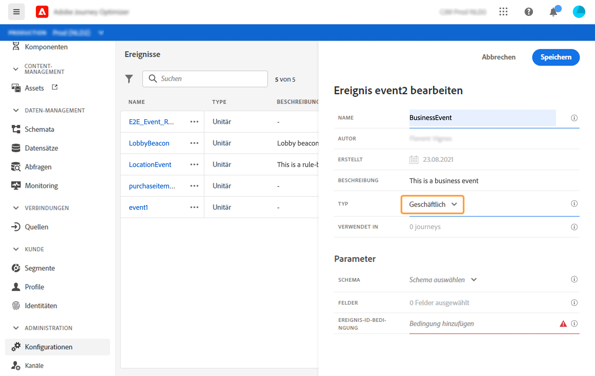

1. Die Anzahl der Journey, die dieses Ereignis verwenden, wird im Feld **[!UICONTROL Wird in]** verwendet angezeigt. Sie können auf das Symbol **[!UICONTROL Ansicht Journey]** klicken, um die Liste der Journey anzuzeigen, die dieses Ereignis verwenden.

1. Definieren Sie die Schema- und Payload-Felder: Hier wählen Sie die Ereignis-Informationen aus (meist Nutzlast genannt), die Journey erwarten. Sie können diese Informationen dann in Ihrer Journey verwenden. Siehe [diesen Abschnitt](../event/about-creating-business.md#define-the-payload-fields).

   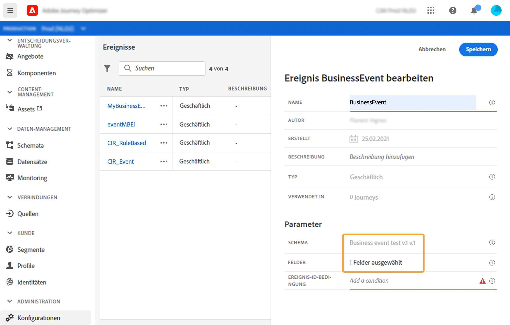

   Es sind nur Schemas für Zeitreihen verfügbar. Experience Ereignisses-, Decision Ereignisses- und Journey Step Ereignisses-Schema sind nicht verfügbar. Das Ereignis-Schema muss eine primäre Identität enthalten.

   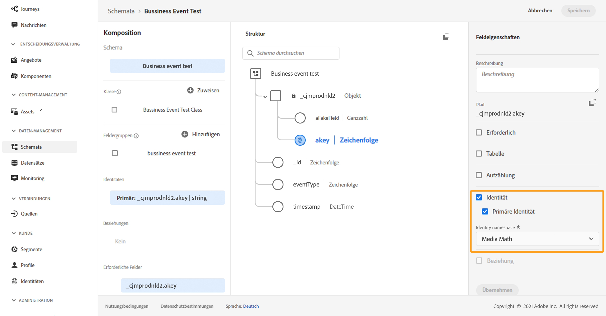

1. Klicken Sie in das Feld **[!UICONTROL Ereignis-ID-Bedingung]**. Definieren Sie mithilfe des Editors für einfache Ausdruck die Bedingung, die vom System zur Identifizierung der Ereignis verwendet wird, die Ihren Journey Trigger verursachen.
   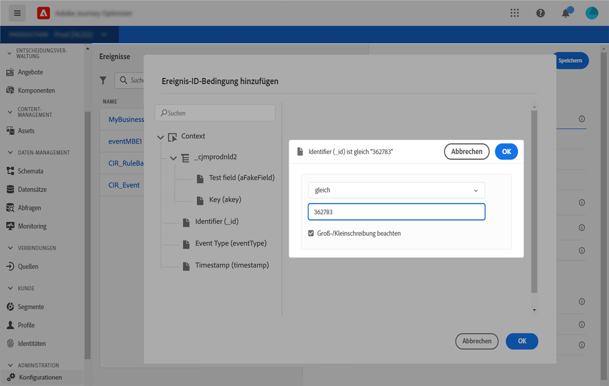

   In unserem Beispiel haben wir eine Bedingung geschrieben, die auf der Produkt-ID basiert. Das bedeutet, dass das System jedes Mal, wenn es ein Ereignis erhält, das dieser Bedingung entspricht, es an die Journey weiterleitet.

1. Klicken Sie auf **[!UICONTROL Speichern]**.

   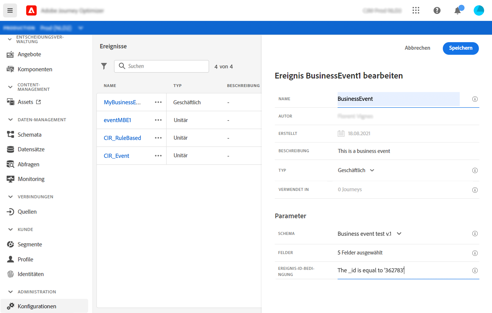

   Das Ereignis ist jetzt konfiguriert und kann in einer Journey abgelegt werden. Für den Empfang von Ereignissen sind zusätzliche Konfigurationsschritte erforderlich. Siehe [diese Seite](../event/additional-steps-to-send-events-to-journey-orchestration.md).

## Definieren Sie die Payload-Felder {#define-the-payload-fields}

Die Payload-Definition ermöglicht es Ihnen, die vom System erwarteten Informationen aus dem Ereignis in Ihrer Journey auszuwählen und den Schlüssel zur Identifizierung der Person, die mit dem Ereignis verbunden ist. Die Nutzlast basiert auf der Experience Cloud-XDM-Felddefinition. Weitere Informationen zu XDM finden Sie auf [dieser Seite](https://experienceleague.adobe.com/docs/experience-platform/xdm/home.html).

1. Wählen Sie ein XDM-Schema aus der Liste und klicken Sie auf das Feld **[!UICONTROL Payload]** oder auf das Symbol **[!UICONTROL Bearbeiten]**.

   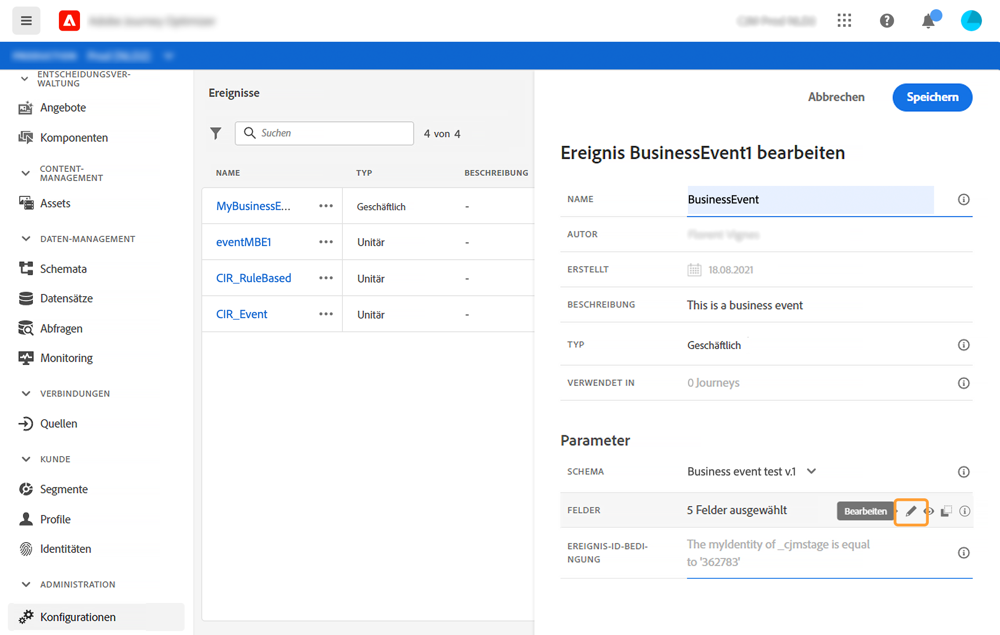

   Alle im Schema definierten Felder werden angezeigt. Die Liste der Felder ist je nach Schema unterschiedlich. Sie können nach einem bestimmten Feld suchen oder die Filter verwenden, um alle Knoten und Felder oder nur die ausgewählten Felder anzuzeigen. Gemäß der Definition des Schemas können einige Felder obligatorisch und vorausgewählt sein. Sie können die Auswahl nicht aufheben. Alle Felder, die für den ordnungsgemäßen Empfang des Ereignisses durch Journey erforderlich sind, werden standardmäßig ausgewählt.

   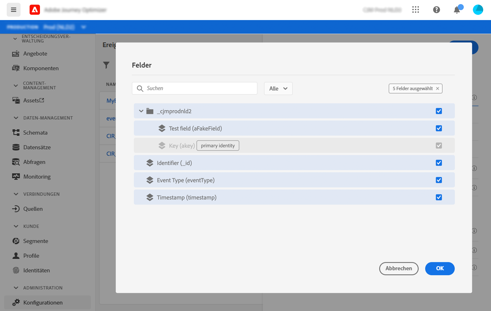

1. Wählen Sie die Felder aus, die Sie vom Ereignis erwarten. Dies sind die Bereiche, die der Geschäftsbenutzer bei der Journey nutzen wird.

   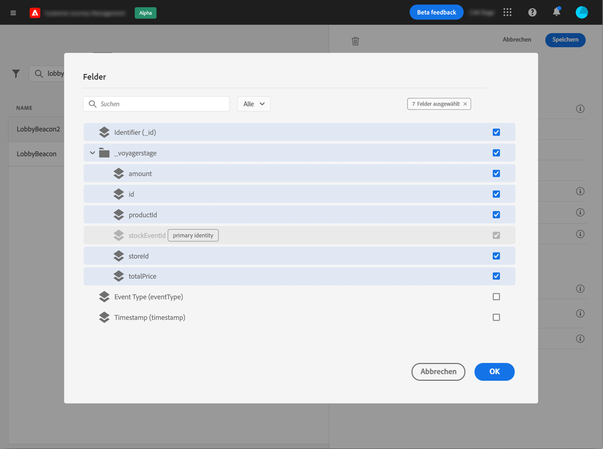

1. Wenn Sie mit der Auswahl der erforderlichen Felder fertig sind, klicken Sie auf **[!UICONTROL Speichern]** oder drücken Sie die Eingabetaste ]**.**[!UICONTROL 

   Die Anzahl der ausgewählten Felder wird im Feld **[!UICONTROL Payload]** angezeigt.

   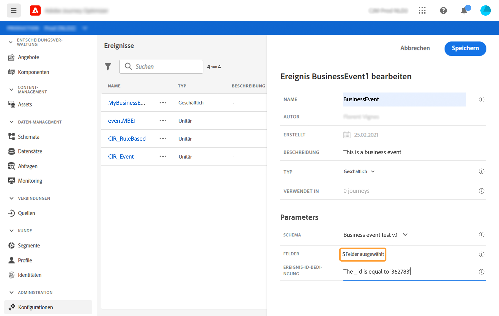

## Vorschau der Nutzlast {#preview-the-payload}

Mit der Payload-Vorschau können Sie die Payload-Definition überprüfen.

1. Klicken Sie auf das Symbol **[!UICONTROL Ansicht Payload]**, um die vom System erwartete Nutzlast Vorschau.

   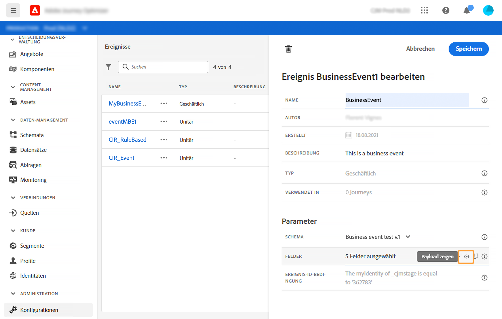

   Sie können bemerken, dass die ausgewählten Felder angezeigt werden.

   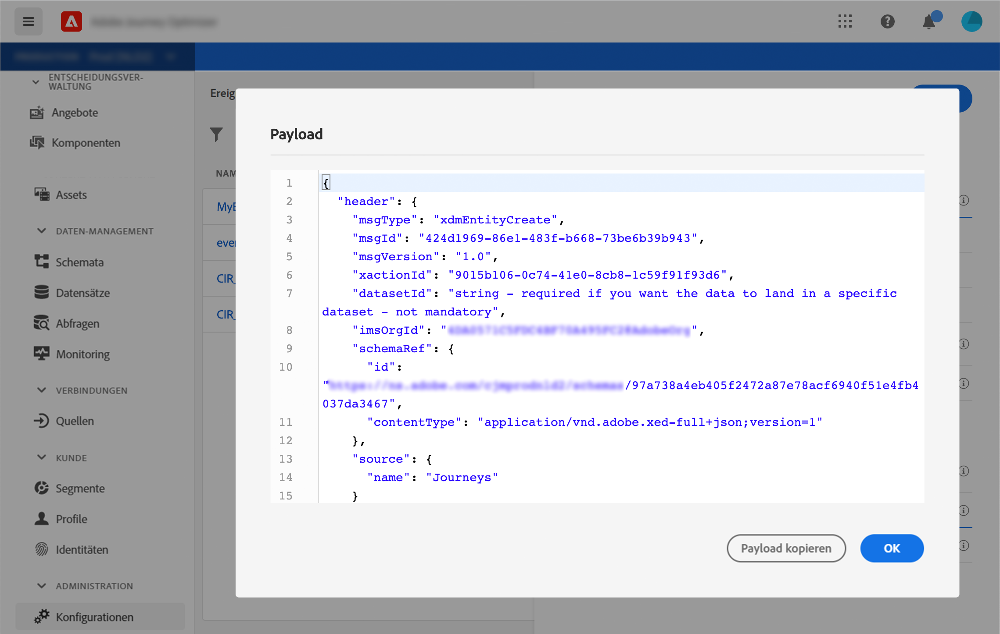

1. Überprüfen Sie die Vorschau, um die Payload-Definition zu validieren.

1. Anschließend können Sie die Nutzlast-Vorschau an den Verantwortlichen des Ereignisses freigeben. Diese Nutzlast kann ihm helfen, die Einrichtung eines Ereignisses zu entwerfen, das nach [!DNL Journey Optimizer] schiebt. Siehe [diese Seite](../event/additional-steps-to-send-events-to-journey-orchestration.md).
