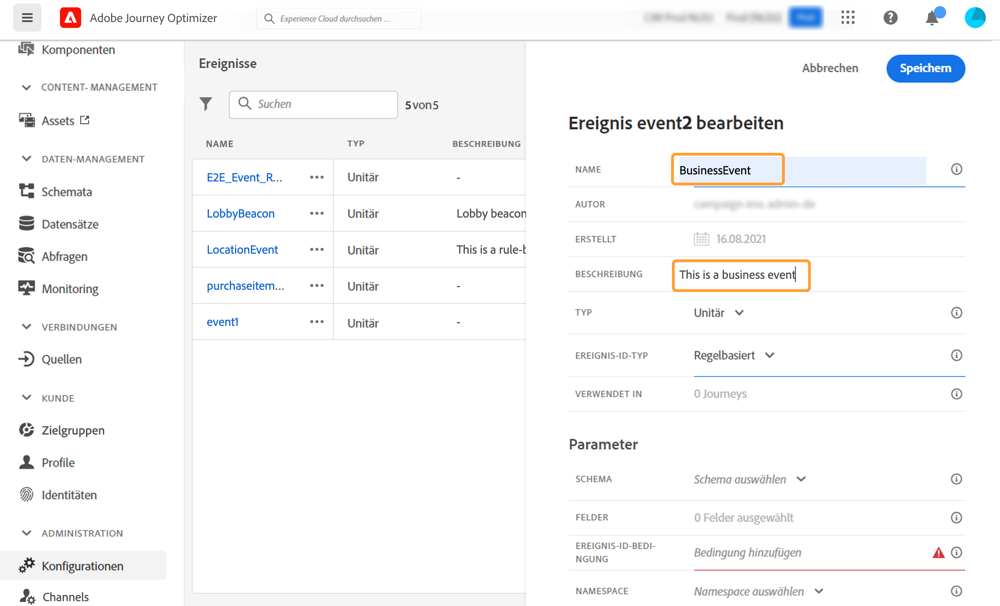
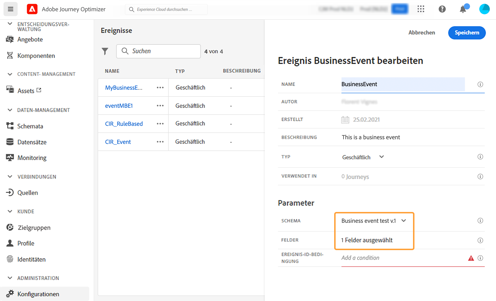

# Business-Ereignis konfigurieren {#configure-a-business-event}

>[!CONTEXTUALHELP]
>id="ajo_journey_event_business"
>title="Geschäftsereignisse"
>abstract="Mit der Ereigniskonfiguration können Sie festlegen, welche Informationen Journey Optimizer als Ereignisse erhält. Sie können mehrere Ereignisse (in verschiedenen Schritten einer Journey) verwenden und mehrere Journeys können dasselbe Ereignis verwenden. Im Gegensatz zu Einzelereignissen sind Geschäftsereignisse nicht mit einem bestimmten Profil verknüpft. Der Ereignis-ID-Typ ist immer regelbasiert."

Im Gegensatz zu Einzelereignissen sind Geschäftsereignisse nicht mit einem bestimmten Profil verknüpft. Der Ereignis-ID-Typ ist immer regelbasiert. Mehr über Geschäftsereignisse in [diesem Abschnitt](../event/about-events.md).

Gelesene segmentbasierte Journeys können in einem Versuch von einem Planer regelmäßig oder von einem Geschäftsereignis ausgelöst werden, wenn das Ereignis eintritt.

Geschäftsereignisse können &quot;ein Produkt ist wieder auf Lager&quot;, &quot;der Börsenkurs eines Unternehmens erreicht einen bestimmten Wert&quot; usw. lauten.

>[!NOTE]
>
>Sie können sich auch den Anwendungsfall für Geschäftsereignisse ansehen [Tutorial](https://experienceleague.adobe.com/docs/journey-optimizer-learn/tutorials/create-journeys/use-case-business-event.html). Beachten Sie, dass das Schema für das Profil nicht aktiviert werden muss.

## Wichtige Hinweise {#important-notes}

* Es sind nur Zeitreihenschemata verfügbar. Es sind keine Schemas für Erlebnisereignisse, Entscheidungsereignisse und Journey-Schrittereignisse verfügbar.
* Das Ereignisschema muss eine nicht personenbasierte primäre Identität enthalten. Beim Definieren des Ereignisses müssen die folgenden Felder ausgewählt werden: `_id` und `timestamp`
* Geschäftsereignisse können nur als erster Schritt einer Journey abgelegt werden.
* Wenn Sie ein Geschäftsereignis als ersten Schritt einer Journey ablegen, lautet der Planungstyp der Journey &quot;Geschäftsereignis&quot;.
* Nach einem Geschäftsereignis kann nur die Aktivität Segment lesen abgelegt werden. Sie wird automatisch als nächster Schritt hinzugefügt.
* Aktivieren Sie die entsprechende Option im **[!UICONTROL Execution]** Abschnitt der Journey-Eigenschaften.
* Nachdem ein Geschäftsereignis ausgelöst wurde, dauert es eine Verzögerung, bis das Segment von 15 Minuten auf bis zu eine Stunde exportiert wird.
* Beim Testen eines Geschäftsereignisses müssen Sie die Ereignisparameter und die Kennung des Testprofils übergeben, das in den Test der Journey eintreten wird. Außerdem können Sie beim Testen einer ereignisbasierten Journey nur den Eintritt in ein Profil auslösen. Siehe [diesem Abschnitt](../building-journeys/testing-the-journey.md#test-business). Im Testmodus ist kein Modus &quot;Codeansicht&quot;verfügbar.
* Was passiert mit Personen, die sich derzeit in der Journey befinden, wenn ein neues Geschäftsereignis eintrifft? Sie verhält sich genauso wie Kontakte, die sich immer noch in einer wiederkehrenden Journey befinden, wenn eine neue Wiederholung erfolgt. Ihr Weg ist vorbei. Daher müssen Marketing-Experten darauf achten, zu lange Journeys zu vermeiden, wenn sie häufige Geschäftsereignisse erwarten.
* Geschäftsereignisse können nicht zusammen mit Einzelereignissen oder Segmentqualifikationsaktivitäten verwendet werden.

## Mehrere Geschäftsereignisse {#multiple-business-events}

Im Folgenden finden Sie einige wichtige Hinweise, die gelten, wenn mehrere Geschäftsereignisse nacheinander empfangen werden.

**Wie verhält es sich beim Empfang eines Geschäftsereignisses während der Verarbeitung der Journey?**

Geschäftsereignisse folgen den Regeln für den Wiedereintritt auf die gleiche Weise wie für Einzelereignisse. Wenn eine Journey den erneuten Eintritt ermöglicht, wird das nächste Geschäftsereignis verarbeitet.

**Welche Limits gibt es, um zu verhindern, dass materialisierte Segmente überladen werden?**

Im Falle von direkten geschäftlichen Ereignissen werden für eine bestimmte Journey die vom ersten Ereignisauftrag übertragenen Daten innerhalb eines Zeitfensters von einer Stunde wiederverwendet. Für geplante Journeys gibt es keine Limits. Weitere Informationen zu Segmenten finden Sie in der [Dokumentation zu Adobe Experience Platform Segmentation Service](https://experienceleague.adobe.com/docs/experience-platform/segmentation/home.html).

## Erste Schritte mit Geschäftsereignissen {#gs-business-events}

Im Folgenden finden Sie die ersten Schritte zum Konfigurieren eines Geschäftsereignisses:

1. Wählen Sie im Menü ADMINISTRATION die Option **[!UICONTROL Configurations]**. Im  **[!UICONTROL Events]** Abschnitt, klicken Sie auf **[!UICONTROL Manage]**. Die Liste der Ereignisse wird angezeigt.

   

1. Klicken **[!UICONTROL Create Event]** , um ein neues Ereignis zu erstellen. Der Bereich für die Ereigniskonfiguration wird auf der rechten Seite des Bildschirms geöffnet.

   

1. Geben Sie den Namen Ihres Ereignisses ein. Sie können auch eine Beschreibung hinzufügen.

   

   >[!NOTE]
   >
   >Verwenden Sie keine Leerzeichen oder Sonderzeichen. Verwenden Sie nicht mehr als 30 Zeichen.

1. Im **[!UICONTROL Type]** Feld, wählen Sie **Unternehmen**.

   

1. Die Anzahl der Journeys, die dieses Ereignis verwenden, wird im **[!UICONTROL Used in]** -Feld. Sie können auf die **[!UICONTROL View journeys]** -Symbol, um die Liste der Journeys anzuzeigen, die dieses Ereignis verwenden.

1. Definieren Sie das Schema und die Payload-Felder: Hier wählen Sie die Ereignisinformationen (oder Payload) aus, die Journeys empfangen sollen. Sie werden diese Informationen später in Ihrer Journey verwenden. Siehe [diesem Abschnitt](../event/about-creating-business.md#define-the-payload-fields).

   

   Es sind nur Zeitreihenschemata verfügbar. `Experience Events`, `Decision Events` und `Journey Step Events` -Schemata sind nicht verfügbar. Das Ereignisschema muss eine nicht personenbasierte primäre Identität enthalten. Beim Definieren des Ereignisses müssen die folgenden Felder ausgewählt werden: `_id` und `timestamp`

   

1. Klicken Sie in die **[!UICONTROL Event ID condition]** -Feld. Verwenden Sie den einfachen Ausdruckseditor, um die Bedingung zu definieren, mit der das System die Ereignisse identifiziert, die Ihre Journey auslösen.

   

   In unserem Beispiel haben wir eine Bedingung basierend auf der ID des Produkts geschrieben. Das bedeutet, dass das System jedes Mal, wenn es ein Ereignis empfängt, das dieser Bedingung entspricht, es an Journeys übergibt.

   >[!NOTE]
   >
   >Im einfachen Ausdruckseditor sind nicht alle Operatoren verfügbar, sondern hängen vom Datentyp ab. Beispielsweise können Sie für einen Feldzeichenfolgentyp &quot;contains&quot;oder &quot;equal to&quot;verwenden.

1. Klicken **[!UICONTROL Save]**.

   

   Das Ereignis ist jetzt konfiguriert und kann in einer Journey abgelegt werden. Für den Empfang von Ereignissen sind zusätzliche Konfigurationsschritte erforderlich. Weitere Informationen finden Sie unter [diese Seite](../event/additional-steps-to-send-events-to-journey.md).

## Definieren der Payload-Felder {#define-the-payload-fields}

Mit der Payload-Definition können Sie die Informationen auswählen, die das System vom Ereignis in Ihrer Journey erwartet, und den Schlüssel zur Identifizierung der mit dem Ereignis verbundenen Person auswählen. Die Payload basiert auf der Experience Cloud-XDM-Felddefinition. Weitere Informationen zu XDM finden Sie unter [Dokumentation zu Adobe Experience Platform](https://experienceleague.adobe.com/docs/experience-platform/xdm/home.html){target=&quot;_blank&quot;}.

1. Wählen Sie ein XDM-Schema aus der Liste aus und klicken Sie auf die **[!UICONTROL Fields]** oder auf **[!UICONTROL Edit]** Symbol.

   

   Alle im Schema definierten Felder werden angezeigt. Die Feldliste variiert von Schema zu Schema. Sie können nach einem bestimmten Feld suchen oder die Filter verwenden, um alle Knoten und Felder oder nur die ausgewählten Felder anzuzeigen. Je nach Schemadefinition können einige Felder obligatorisch und vorausgewählt sein. Sie können die Auswahl nicht aufheben. Standardmäßig sind alle Felder ausgewählt, die erforderlich sind, damit das Ereignis von Journeys ordnungsgemäß empfangen werden kann.

   

   >[!NOTE]
   >
   > Stellen Sie sicher, dass die folgenden Felder ausgewählt sind: `_id` und `timestamp`

1. Wählen Sie die Felder aus, die Sie vom Ereignis erwarten. Dies sind die Felder, die der Business-Anwender in der Journey nutzen wird.

1. Wenn Sie die erforderlichen Felder ausgewählt haben, klicken Sie auf **[!UICONTROL Save]** oder drücken Sie **[!UICONTROL Enter]**.

   Die Anzahl der ausgewählten Felder wird angezeigt in **[!UICONTROL Fields]**.

   

## Payload-Vorschau {#preview-the-payload}

Verwenden Sie die Payload-Vorschau, um die Payload-Definition zu validieren.

1. Klicken Sie auf **[!UICONTROL View Payload]** -Symbol, um eine Vorschau der vom System erwarteten Payload anzuzeigen.

   

   Sie können feststellen, dass die ausgewählten Felder angezeigt werden.

   

1. Überprüfen Sie die Vorschau , um die Payload-Definition zu validieren.

1. Anschließend können Sie die Payload-Vorschau für die Person freigeben, die für das Senden des Ereignisses verantwortlich ist. Diese Payload kann ihnen bei der Konzeption eines Ereignisses helfen, das an [!DNL Journey Optimizer]. Siehe [diese Seite](../event/additional-steps-to-send-events-to-journey.md).
