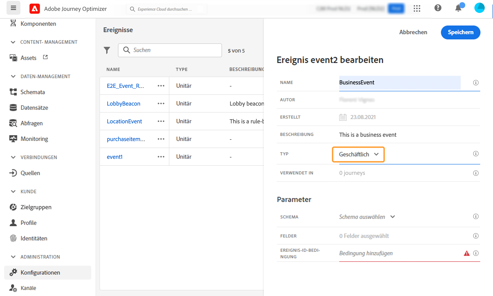
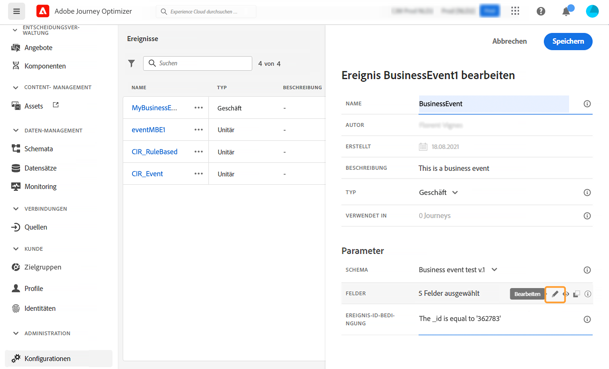
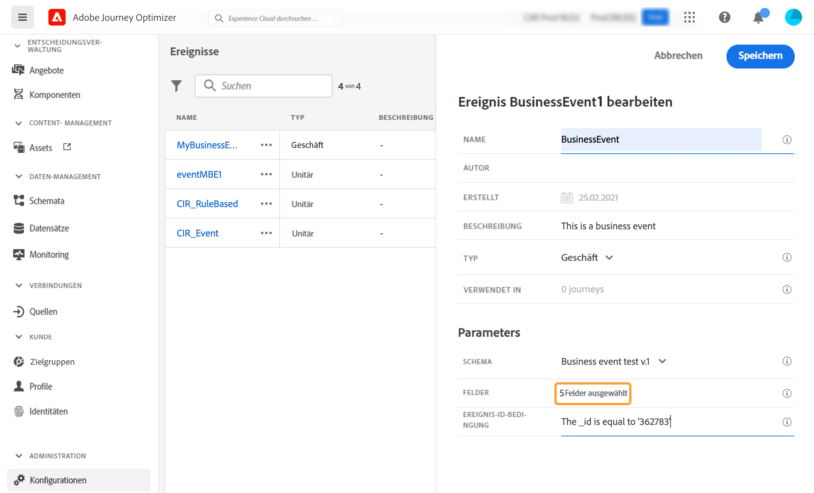
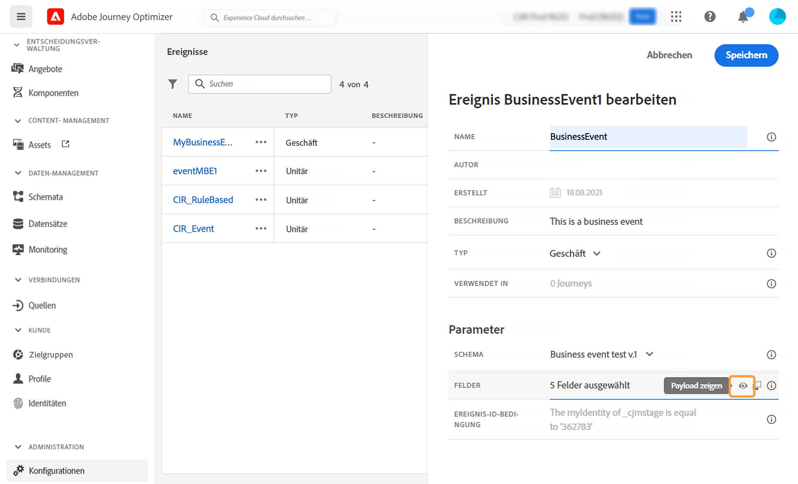

# Konfigurieren eines Geschäftsereignisses {#configure-a-business-event}

>[!CONTEXTUALHELP]
>id="ajo_journey_event_business"
>title="Geschäftsereignisse"
>abstract="Mit der Ereigniskonfiguration können Sie festlegen, welche Informationen Journey Optimizer als Ereignisse erhält. Sie können mehrere Ereignisse (in verschiedenen Schritten der Journey) verwenden und mehrere Journeys können dasselbe Ereignis verwenden. Im Gegensatz zu unitären Ereignissen sind Geschäftsereignisse nicht mit einem bestimmten Profil verknüpft. Der Ereignis-ID-Typ ist immer regelbasiert."

Im Gegensatz zu unitären Ereignissen sind Geschäftsereignisse nicht mit einem bestimmten Profil verknüpft. Der Ereignis-ID-Typ ist immer regelbasiert. Weitere Informationen zu Geschäftsereignissen finden Sie in [diesem Abschnitt](../event/about-events.md).

Auf dem Lesen von Segmenten basierende Journeys können einmalig durch eine Planung auf regulärer Basis oder durch ein Geschäftsereignis ausgelöst werden, wenn das Ereignis eintritt.

Geschäftsereignisse können sein: „ein Produkt ist wieder auf Lager“, „der Aktienkurs einer Firma erreicht einen bestimmten Wert“ usw.

>[!NOTE]
>
>Sie können sich auch das [Tutorial](https://experienceleague.adobe.com/docs/journey-optimizer-learn/tutorials/create-journeys/use-case-business-event.html?lang=de) zu Anwendungsfällen für Geschäftsereignisse ansehen. Beachten Sie, dass das Schema für das Profil nicht aktiviert werden muss.

## Wichtige Hinweise {#important-notes}

* Es sind nur Schemas für Zeitreihen verfügbar. Erlebnisereignis-, Entscheidungsereignis- und Journey-Schritt-Ereignis-Schemas sind nicht verfügbar.
* Das Ereignisschema muss eine primäre Identität enthalten, die nicht auf Personen basiert. Beim Definieren des Ereignisses müssen die folgenden Felder ausgewählt werden: `_id` und `timestamp`
* Geschäftsereignisse können nur als erster Schritt einer Journey eingefügt werden.
* Wenn Sie ein Geschäftsereignis als ersten Schritt einer Journey einfügen, lautet der Planungstyp der Journey „Geschäftsereignis“.
* Nach einem Geschäftsereignis kann nur eine Aktivität „Segment lesen“ eingefügt werden. Sie wird automatisch als nächster Schritt hinzugefügt.
* Um mehrere Ausführungen für Geschäftsereignisse zuzulassen, aktivieren Sie die entsprechende Option im Abschnitt **[!UICONTROL Ausführung]** der Journey-Eigenschaften.
* Nachdem ein Geschäftsereignis ausgelöst wurde, gibt es eine Verzögerung von 15 Minuten bis zu einer Stunde, um das Segment zu exportieren.
* Beim Testen eines Geschäftsereignisses müssen Sie die Ereignisparameter und die ID des Testprofils übergeben, das beim Test in die Journey eintritt. Beim Testen einer geschäftsereignisbasierten Journey können Sie außerdem nur den Eintritt einzelner Profile auslösen. Weiterführende Informationen finden Sie in diesem [Abschnitt](../building-journeys/testing-the-journey.md#test-business). Im Testmodus ist kein Modus „Code-Ansicht“ verfügbar.
* Was passiert mit Kontakten, die sich derzeit in der Journey befinden, wenn ein neues Geschäftsereignis eintrifft? Es verhält sich genauso wie bei Kontakten, die sich noch in einer wiederkehrenden Journey befinden, wenn ein neues Ereignis auftritt. Ihr Weg endet. Daher müssen Marketing-Experten darauf achten, nicht zu lange Journeys zu erstellen, wenn sie häufige Geschäftsereignisse erwarten.
* Geschäftsereignisse können nicht zusammen mit unitären Ereignissen oder Segmentqualifikationsaktivitäten verwendet werden.

## Mehrere Geschäftsereignisse {#multiple-business-events}

Im Folgenden finden Sie einige wichtige Hinweise für den Fall, dass mehrere Geschäftsereignisse nacheinander empfangen werden.

**Was passiert, wenn ein Geschäftsereignis während der Verarbeitung der Journey empfangen wird?**

Für Geschäftsereignisse gelten die gleichen Regeln für den erneuten Eintritt wie für unitäre Ereignisse. Wenn eine Journey den erneuten Eintritt erlaubt, wird das nächste Geschäftsereignis verarbeitet.

**Welche Schutzmaßnahmen gibt es, um zu verhindern, dass materialisierte Segmente überladen werden?**

Im Falle von einmaligen Geschäftsereignissen werden die vom ersten Ereignisvorgang übertragenen Daten für eine bestimmte Journey innerhalb eines Zeitfensters von einer Stunde wiederverwendet. Für geplante Journeys gibt es keine diesbezüglichen Einschränkungen. Weitere Informationen finden Sie in der [Dokumentation zum Segmentierungs-Service von Adobe Experience Platform](https://experienceleague.adobe.com/docs/experience-platform/segmentation/home.html?lang=de).

## Erste Schritte mit Geschäftsereignissen {#gs-business-events}

Im Folgenden finden Sie die ersten Schritte zum Konfigurieren eines Geschäftsereignisses:

1. Wählen Sie im Menü ADMINISTRATION die Option **[!UICONTROL Konfigurationen]**. Klicken Sie im Abschnitt **[!UICONTROL Ereignisse]** auf **[!UICONTROL Verwalten]**. Die Liste der Ereignisse wird angezeigt.

   

1. Klicken Sie auf **[!UICONTROL Ereignis erstellen]**, um ein neues Ereignis zu erstellen. Der Bereich für die Ereigniskonfiguration wird auf der rechten Seite des Bildschirms geöffnet.

   

1. Geben Sie den Namen Ihres Ereignisses ein. Sie können auch eine Beschreibung hinzufügen.

   

   >[!NOTE]
   >
   >Verwenden Sie keine Leerzeichen oder Sonderzeichen. Verwenden Sie nicht mehr als 30 Zeichen.

1. Wählen Sie im Feld **[!UICONTROL Typ]** die Option **Geschäftlich**.

   

1. Die Anzahl der Journeys, die dieses Ereignis verwenden, wird im Feld **[!UICONTROL Verwendet in]** angezeigt. Sie können auf **[!UICONTROL Customer Journeys anzeigen]** klicken, um die Liste der Journeys mit diesem Ereignis anzuzeigen.

1. Definieren Sie das Schema und die Payload-Felder: Hier wählen Sie die Ereignisinformationen aus (normalerweise als Payload bezeichnet), die Journeys erhalten sollen. Sie werden diese Informationen später in Ihrer Journey benötigen. Weitere Informationen finden Sie in [diesem Abschnitt](../event/about-creating-business.md#define-the-payload-fields).

   

   Es sind nur Schemas für Zeitreihen verfügbar. `Experience Events`-, `Decision Events`- und `Journey Step Events`-Schemas sind nicht verfügbar. Das Ereignisschema muss eine primäre Identität enthalten, die nicht auf Personen basiert. Beim Definieren des Ereignisses müssen die folgenden Felder ausgewählt werden: `_id` und `timestamp`

   

1. Klicken Sie in das Feld **[!UICONTROL Ereignis-ID-Bedingung]**. Mit dem einfachen Ausdruckseditor definieren Sie die Bedingung, anhand derer das System die Ereignisse erkennt, die Ihre Journey auslösen.

   

   In unserem Beispiel haben wir eine Bedingung basierend auf der Kennung des Produkts geschrieben. Das bedeutet, dass das System jedes Mal, wenn es ein Ereignis erhält, das dieser Bedingung entspricht, dieses an Journeys weitergibt.

   >[!NOTE]
   >
   >Im einfachen Ausdruckseditor sind nicht alle Operatoren verfügbar. Sie hängen vom Datentyp ab. Beispielsweise können Sie für ein Feld vom Typ Zeichenfolge „enthält“ oder „ist gleich“ verwenden.

1. Klicken Sie auf **[!UICONTROL Speichern]**.

   

   Das Ereignis ist jetzt konfiguriert und kann in einer Journey abgelegt werden. Für den Empfang von Ereignissen sind zusätzliche Konfigurationsschritte erforderlich. Weiterführende Informationen finden Sie auf [dieser Seite](../event/additional-steps-to-send-events-to-journey.md).

## Definieren der Payload-Felder {#define-the-payload-fields}

Mit der Payload-Definition können Sie die Informationen auswählen, die das System vom Ereignis in Ihrer Journey erwartet, sowie den Schlüssel zum Identifizieren der mit dem Ereignis verbundenen Person. Die Payload basiert auf der Experience Cloud-XDM-Felddefinition. Weitere Informationen zu XDM finden sich in der [Adobe Experience Platform Launch-Dokumentation](https://experienceleague.adobe.com/docs/experience-platform/xdm/home.html?lang=de){target="_blank"}.

1. Wählen Sie ein XDM-Schema aus der Liste aus und klicken Sie auf das Feld **[!UICONTROL Felder]** oder das Symbol **[!UICONTROL Bearbeiten]**.

   

   Alle im Schema definierten Felder werden angezeigt. Die Liste der Felder variiert von Schema zu Schema. Sie können nach einem bestimmten Feld suchen oder die Filter verwenden, um alle Knoten und Felder oder nur die ausgewählten Felder anzuzeigen. Gemäß der Schemadefinition können einige Felder obligatorisch und vorausgewählt sein. Sie können die Auswahl nicht aufheben. Alle Felder, die für den korrekten Empfang des Ereignisses durch Journeys erforderlich sind, sind standardmäßig ausgewählt.

   

   >[!NOTE]
   >
   > Stellen Sie sicher, dass die folgenden Felder ausgewählt sind: `_id` und `timestamp`

1. Wählen Sie die Felder aus, die Sie vom Ereignis erwarten. Dies sind die Felder, die der Business-Anwender in der Journey nutzen wird.

1. Wenn Sie die erforderlichen Felder ausgewählt haben, klicken Sie auf **[!UICONTROL Speichern]** oder drücken Sie die **[!UICONTROL Eingabetaste]**.

   Die Anzahl der ausgewählten Felder wird in **[!UICONTROL Felder]** angezeigt.

   

## Vorschau der Payload {#preview-the-payload}

Verwenden Sie die Payload-Vorschau, um die Payload-Definition zu validieren.

1. Klicken Sie auf das Symbol **[!UICONTROL Payload zeigen]**, um eine Vorschau der vom System erwarteten Payload anzuzeigen.

   

   Sie können sehen, dass die ausgewählten Felder angezeigt werden.

   

1. Überprüfen Sie die Vorschau, um die Payload-Definition zu validieren.

1. Anschließend können Sie die Payload-Vorschau für die Person freigeben, die für das Senden des Ereignisses verantwortlich ist. Diese Payload kann ihr beim Entwurf eines Ereignisses helfen, das an [!DNL Journey Optimizer] gesendet wird. Weitere Informationen finden Sie auf [dieser Seite](../event/additional-steps-to-send-events-to-journey.md).
