# Einheitliches Ereignis {#configure-an-event} konfigurieren

Uniitäre Ereignis sind mit einem bestimmten Profil verknüpft. Sie können regelbasiert oder systemgeneriert sein.  Lesen Sie mehr über das einheitliche Ereignis [in diesem Abschnitt](../event/about-events.md).

Im Folgenden werden die ersten Schritte zum Konfigurieren eines neuen Ereignisses beschrieben:

1. Klicken Sie im linken Menü auf das Symbol **[!UICONTROL Admin]** und dann auf **[!UICONTROL Ereignis]**. Die Liste der Ereignisse wird angezeigt.

   

1. Klicken Sie auf **[!UICONTROL Hinzufügen]**, um ein neues Ereignis zu erstellen. Der Bereich für die Ereigniskonfiguration wird auf der rechten Seite des Bildschirms geöffnet.

   

1. Geben Sie den Namen Ihres Ereignisses ein. Sie können auch eine Beschreibung hinzufügen.

   

   >[!NOTE]
   >
   >Verwenden Sie keine Leerzeichen oder Sonderzeichen. Verwenden Sie nicht mehr als 30 Zeichen.

1. Wählen Sie im Feld **[!UICONTROL Typ]** die Option **Einfache Ereignis**.

   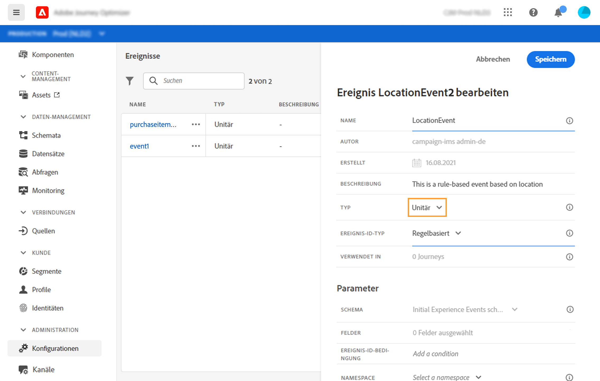

1. Wählen Sie im Feld **[!UICONTROL Ereignis-ID-Typ]** den Ereignis-ID-Typ aus, den Sie verwenden möchten: **Regelbasiert** oder **System-generiert**. Weitere Informationen zu Ereignis-ID-Typen in [diesem Abschnitt](../event/about-events.md#event-id-type).

   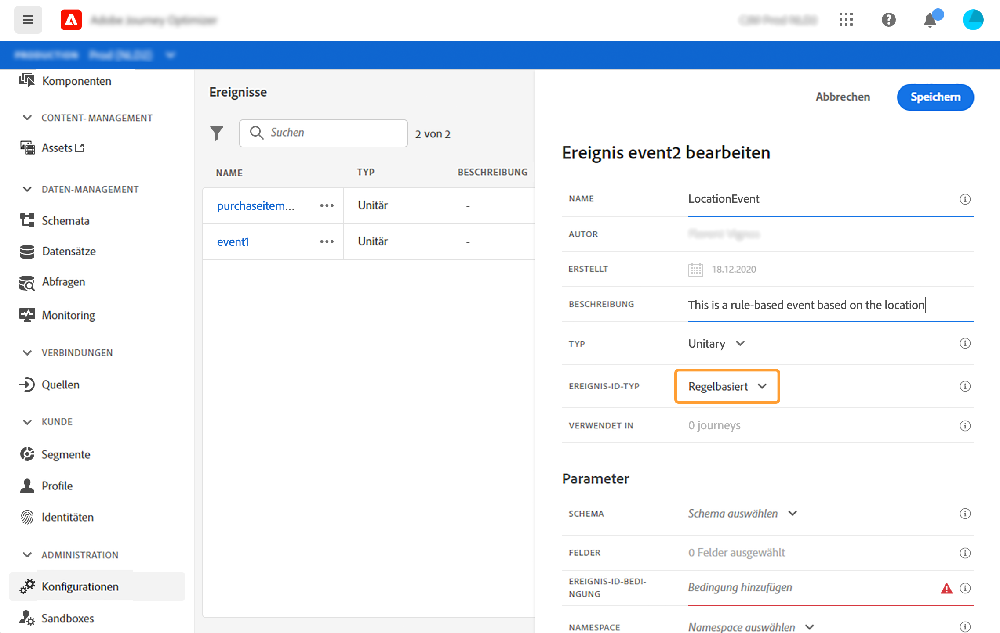

1. Die Anzahl der Journeys, die dieses Ereignis verwenden, wird im Feld **[!UICONTROL Verwendet in]** angezeigt. Sie können auf **[!UICONTROL Customer Journeys anzeigen]** klicken, um die Liste der Journeys mit diesem Ereignis anzuzeigen.

1. Definieren Sie die Schema- und Payload-Felder: Hier wählen Sie die Ereignis-Informationen aus (meist Nutzlast genannt), die Journey erwarten. Anschließend können Sie diese Informationen in Ihrer Journey verwenden. Weitere Informationen finden Sie in [diesem Abschnitt](../event/about-creating.md#define-the-payload-fields).

   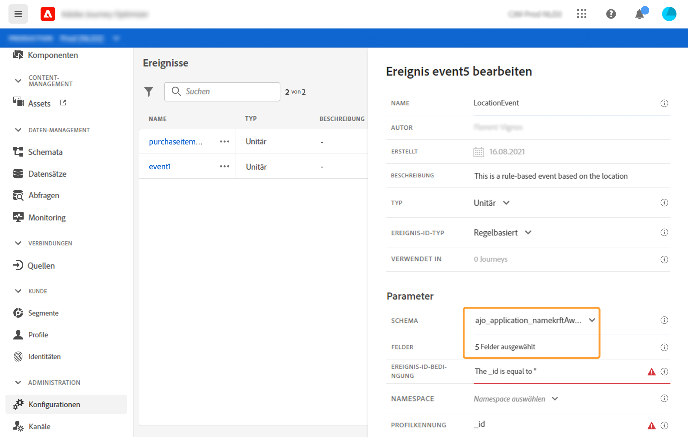

   >[!NOTE]
   >
   >Wenn Sie den **[!UICONTROL systemgenerierten]** Typ auswählen, sind nur Schemata mit dem eventID-Typ „mixin“ verfügbar. Wenn Sie den **[!UICONTROL regelbasierten]** Typ auswählen, sind nur Erlebnisereignisschemata verfügbar.

1. Klicken Sie bei regelbasierten Ereignissen in das Feld **[!UICONTROL Ereignis-ID-Bedingung]**. Mit dem einfachen Ausdruckseditor definieren Sie eine Bedingung, anhand derer das System die Ereignisse identifiziert, die Ihre Journey auslösen.
   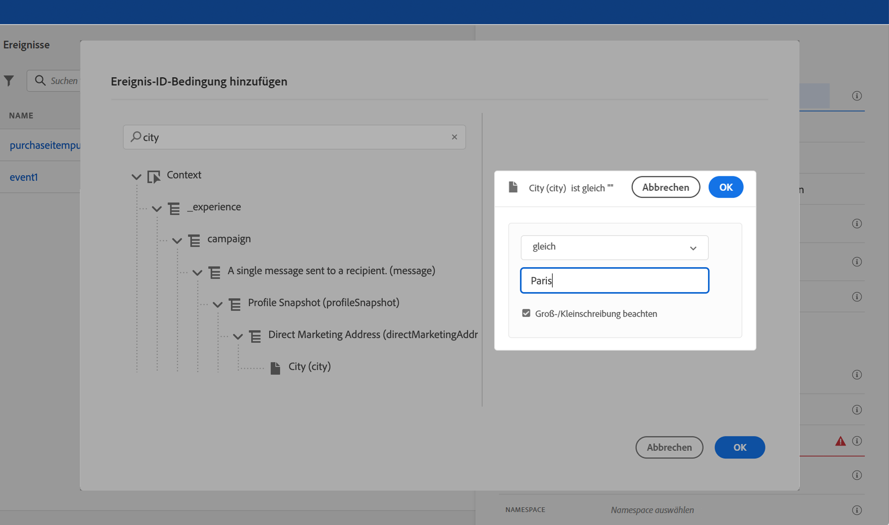

   In unserem Beispiel haben wir eine Bedingung basierend auf der Stadt des Profils verwendet. Das bedeutet, dass das System jedes Mal, wenn es ein Ereignis erhält, das dieser Bedingung entspricht (**[!UICONTROL City]** und **[!UICONTROL Paris]**), es an Journey weiterleitet.

1. Fügen Sie einen Namespace hinzu. Dieser Schritt ist optional, wird jedoch empfohlen, da das Hinzufügen eines Namespace es Ihnen ermöglicht, die im Echtzeit-Kundenprofildienst gespeicherten Informationen zu nutzen. Er definiert den Typ des Schlüssels, den das Ereignis hat. Weitere Informationen finden Sie in [diesem Abschnitt](../event/about-creating.md#select-the-namespace).
1. Definieren Sie den Schlüssel: Wählen Sie ein Feld aus Ihren Payload-Feldern aus oder definieren Sie eine Formel, um die mit dem Ereignis verbundene Person zu identifizieren. Dieser Schlüssel wird automatisch eingerichtet (kann aber weiterhin bearbeitet werden), wenn Sie einen Namespace auswählen. Tatsächlich wählt der Journey den Schlüssel aus, der dem Namensraum entsprechen sollte (wenn Sie beispielsweise einen E-Mail-Namensraum auswählen, wird der E-Mail-Schlüssel ausgewählt). Weitere Informationen finden Sie in [diesem Abschnitt](../event/about-creating.md#define-the-event-key).

   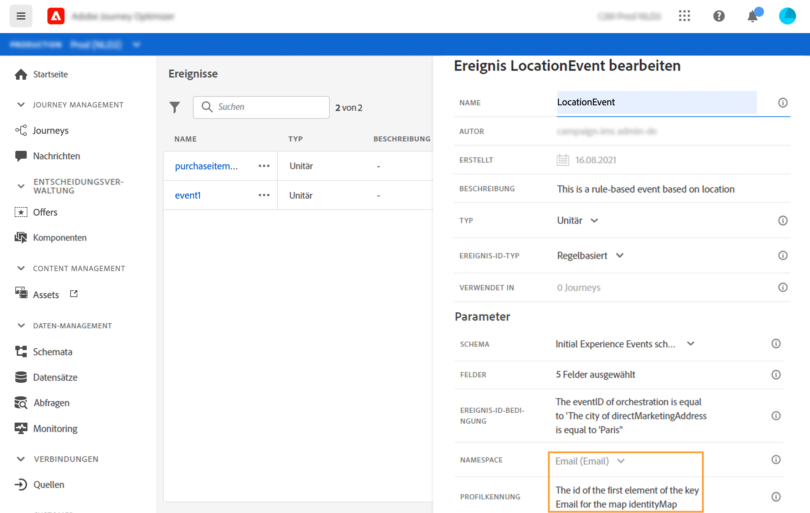

1. Bei systemgenerierten Ereignissen können Sie eine Bedingung hinzufügen.  Dieser Schritt ist optional. Dadurch kann das System nur die Ereignisse verarbeiten, die die Bedingung erfüllen. Die Bedingung kann nur auf den im Ereignis enthaltenen Informationen basieren. Weitere Informationen finden Sie in [diesem Abschnitt](../event/about-creating.md#add-a-condition).
1. Klicken Sie auf **[!UICONTROL Speichern]**.

   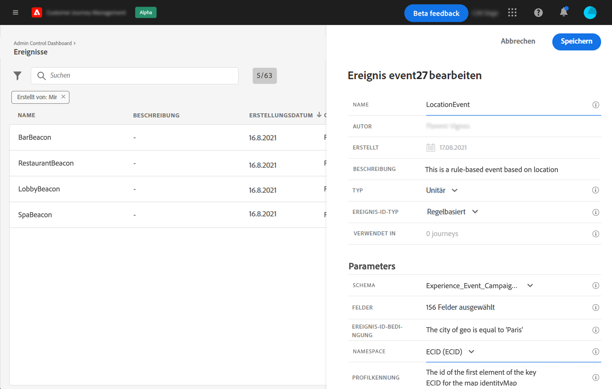

   Das Ereignis ist jetzt konfiguriert und kann in einer Journey abgelegt werden. Für den Empfang von Ereignissen sind zusätzliche Konfigurationsschritte erforderlich. Weitere Informationen finden Sie auf [dieser Seite](../event/additional-steps-to-send-events-to-journey-orchestration.md).

## Definieren Sie die Payload-Felder {#define-the-payload-fields}

Mit der Payload-Definition können Sie die Informationen auswählen, die das System vom Ereignis in Ihrer Journey erwartet, sowie den Schlüssel zum Identifizieren der mit dem Ereignis verbundenen Person. Die Payload basiert auf der Experience Cloud-XDM-Felddefinition. Weitere Informationen zu XDM finden Sie auf [dieser Seite](https://experienceleague.adobe.com/docs/experience-platform/xdm/home.html?lang=de).

1. Wählen Sie ein XDM-Schema aus der Liste aus und klicken Sie auf das Feld **[!UICONTROL Payload]** oder das Symbol **[!UICONTROL Bearbeiten]**.

   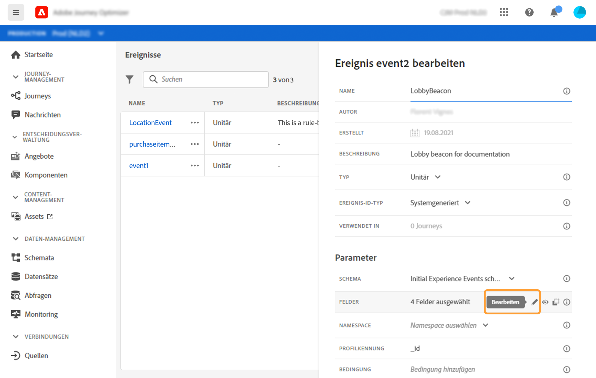

   Alle im Schema definierten Felder werden angezeigt. Die Liste der Felder variiert von Schema zu Schema. Sie können nach einem bestimmten Feld suchen oder die Filter verwenden, um alle Knoten und Felder oder nur die ausgewählten Felder anzuzeigen. Gemäß der Schemadefinition können einige Felder obligatorisch und vorausgewählt sein. Sie können die Auswahl nicht aufheben. Alle Felder, die für den ordnungsgemäßen Empfang des Ereignisses durch Journey erforderlich sind, werden standardmäßig ausgewählt.

   >[!NOTE]
   >
   >Vergewissern Sie sich, dass Sie das Mixin „orchestration“ zum XDM-Schema hinzugefügt haben. Dadurch wird sichergestellt, dass Ihr Schema alle erforderlichen Informationen für die Zusammenarbeit mit [!DNL Journey Optimizer] enthält.

   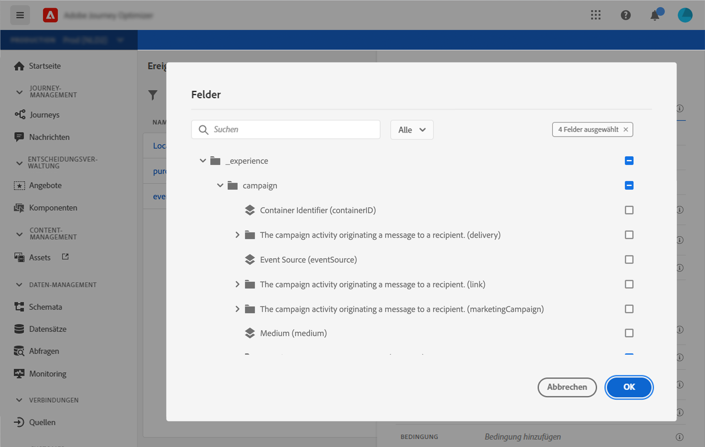

1. Wählen Sie die Felder aus, die Sie vom Ereignis erwarten. Dies sind die Felder, die der Business-Anwender in der Journey nutzen wird. Sie müssen auch den Schlüssel enthalten, mit dem die mit dem Ereignis verbundene Person identifiziert wird (siehe [diesen Abschnitt](../event/about-creating.md#define-the-event-key)).

   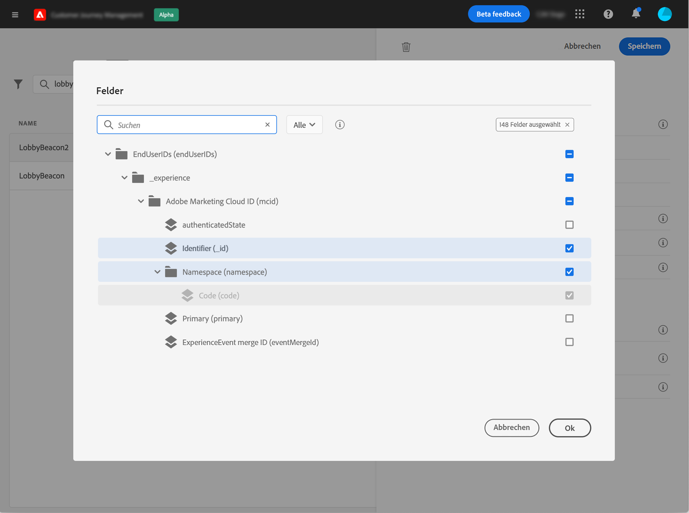

   >[!NOTE]
   >
   >Das Feld **[!UICONTROL eventID]** wird automatisch in die Liste der ausgewählten Felder eingefügt, damit [!DNL Journey Optimizer] das Ereignis identifizieren kann. Das System, das das Ereignis per Push sendet, sollte keine ID generieren, sondern die ID verwenden, die in der Payload-Vorschau verfügbar ist. Weitere Informationen finden Sie in [diesem Abschnitt](../event/about-creating.md#preview-the-payload).

1. Wenn Sie die erforderlichen Felder ausgewählt haben, klicken Sie auf **[!UICONTROL Speichern]** oder drücken Sie die **[!UICONTROL Eingabetaste]**.

   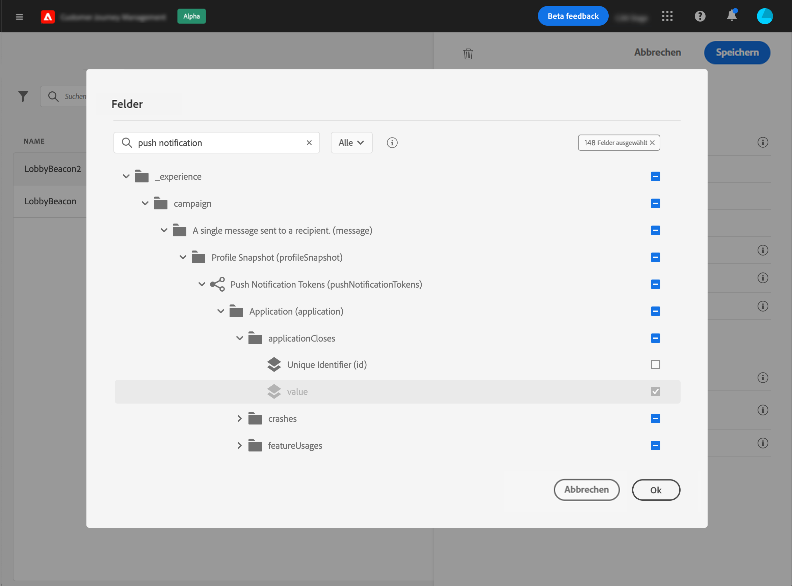

   Die Anzahl der ausgewählten Felder wird im Feld **[!UICONTROL Payload]** angezeigt.

   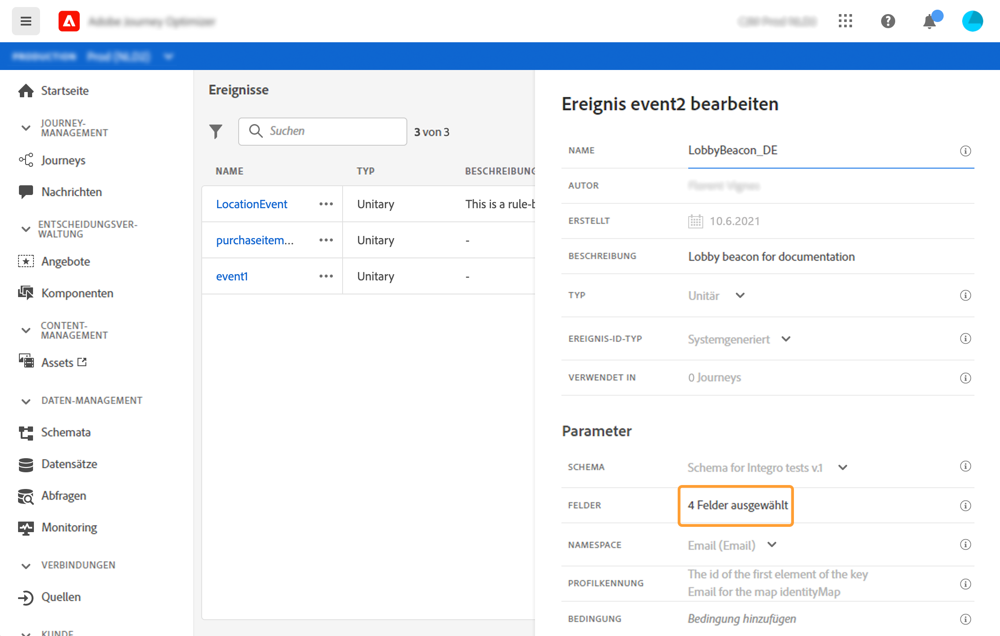

## Wählen Sie den Namensraum {#select-the-namespace}

Mit dem Namespace können Sie den Typ des Schlüssels definieren, mit dem die mit dem Ereignis verbundene Person identifiziert wird. Die Konfiguration ist optional. Sie ist erforderlich, wenn Sie in Ihren Journeys zusätzliche Informationen aus dem [Echtzeit-Kundenprofil](https://experienceleague.adobe.com/docs/experience-platform/profile/home.html?lang=de) abrufen möchten. Der Namespace muss nicht definiert werden, wenn Sie nur Daten aus einem Drittanbietersystem über eine benutzerdefinierte Datenquelle verwenden.

Sie können entweder einen der vordefinierten Namespace verwenden oder mit dem Identity-Namespace-Dienst einen neuen erstellen. Mehr dazu erfahren Sie auf [dieser Seite](https://experienceleague.adobe.com/docs/experience-platform/identity/home.html).

Wenn Sie ein Schema mit einer Primäridentität auswählen, werden die Felder **[!UICONTROL Schlüssel]** und **[!UICONTROL Namespace]** vorbelegt. Wenn keine Identität definiert ist, wählen Sie _identityMap > id_ als Primärschlüssel aus. Wählen Sie anschließend einen Namespace aus und der Schlüssel wird (unter dem Feld **[!UICONTROL Namespace]**) mit _identityMap > id_ vorbelegt.

Bei der Auswahl von Feldern werden Primäridentitätsfelder mit Tags versehen.

Wählen Sie einen Namespace aus der Dropdown-Liste aus.

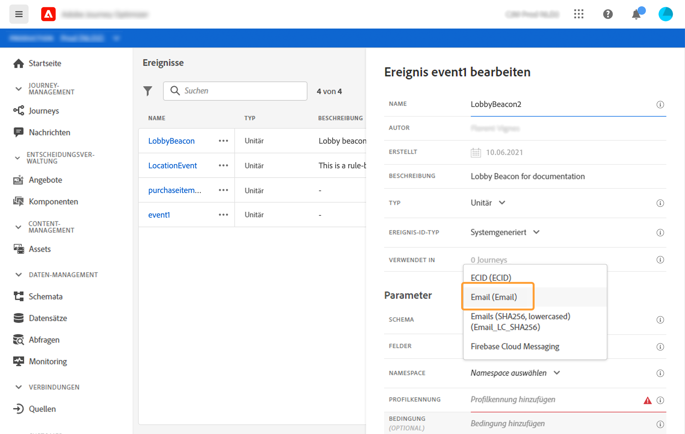

Pro Journey ist nur ein Namespace zulässig. Wenn Sie mehrere Ereignisse in derselben Journey verwenden, müssen diese denselben Namespace verwenden. Weitere Informationen finden Sie auf [dieser Seite](../building-journeys/journey.md).

## Definieren des Ereignis-Schlüssels {#define-the-event-key}

Der Schlüssel ist das Feld oder die Feldkombination, die Teil der Ereignis-Payload-Daten ist und es dem System ermöglicht, die mit dem Ereignis verbundene Person zu identifizieren. Der Schlüssel kann beispielsweise die Experience Cloud-ID, eine CRM-ID oder eine E-Mail-Adresse sein.

Wenn Sie Daten nutzen möchten, die in der Echtzeit-Kundenprofildatenbank gespeichert sind, müssen Sie als Ereignisschlüssel die Informationen auswählen, die Sie im [Echtzeit-Kundenprofildienst](https://experienceleague.adobe.com/docs/experience-platform/profile/home.html) als Profilidentität definiert haben.

Dadurch kann das System die Abstimmung zwischen dem Ereignis und dem Profil des Kontakts durchführen. Wenn Sie ein Schema mit einer Primäridentität auswählen, werden die Felder **[!UICONTROL Schlüssel]** und **[!UICONTROL Namespace]** vorbelegt. Wenn keine Identität definiert ist, wählen Sie _identityMap > id_ als Primärschlüssel aus. Wählen Sie anschließend einen Namespace aus und der Schlüssel wird (unter dem Feld **[!UICONTROL Namespace]**) mit _identityMap > id_ vorbelegt.

Bei der Auswahl von Feldern werden Primäridentitätsfelder mit Tags versehen.

Wenn Sie einen anderen Schlüssel verwenden müssen, z. B. eine CRM-ID oder eine E-Mail-Adresse, müssen Sie ihn manuell hinzufügen:

1. Klicken Sie in das Feld **[!UICONTROL Schlüssel]** oder auf das Bleistiftsymbol.

   

1. Wählen Sie das als Schlüssel ausgewählte Feld in der Liste der Payload-Felder aus. Sie können auch zum erweiterten Ausdruckseditor wechseln, um komplexere Schlüssel zu erstellen (z. B. eine Verkettung zweier Ereignisfelder). Siehe unten in diesem Abschnitt.

   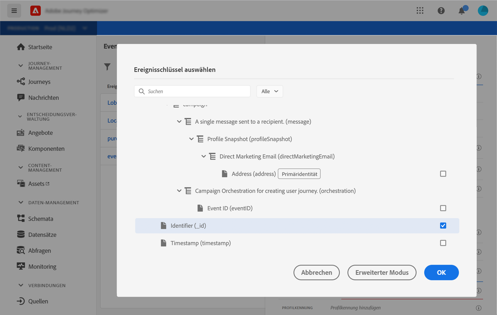

Wenn das Ereignis eingeht, kann das System mit dem Wert des Schlüssels die mit dem Ereignis verbundene Person identifizieren. Mit einem Namensraum verbunden (siehe [diesen Abschnitt](../event/about-creating.md#select-the-namespace)), kann der Schlüssel zum Ausführen von Abfragen auf Adobe Experience Platform verwendet werden. Weitere Informationen finden Sie auf [dieser Seite](../building-journeys/about-journey-activities.md#orchestration-activities).
Der Schlüssel wird auch verwendet, um zu überprüfen, ob sich eine Person in einer Journey befindet. Eine Person kann nicht an zwei verschiedenen Stellen in derselben Journey sein. Das System lässt daher nicht zu, dass sich derselbe Schlüssel, z. B. der Schlüssel CRMID=3224, an verschiedenen Stellen in derselben Journey befindet.

Sie haben auch Zugriff auf die erweiterten Ausdrucksfunktionen (**[!UICONTROL erweiterter Modus]**), wenn Sie zusätzliche Manipulationen durchführen möchten. Mit diesen Funktionen können Sie die Werte bearbeiten, die für bestimmte Abfragen wie das Ändern von Formaten verwendet werden, indem Sie Feldverkettungen durchführen, wobei nur ein Teil eines Felds (z. B. die 10 ersten Zeichen) berücksichtigt wird. Weitere Informationen finden Sie auf [dieser Seite](https://experienceleague.adobe.com/docs/journeys/using/building-advanced-conditions-journeys/expressionadvanced.html).

## Fügen Sie eine Bedingung hinzu {#add-a-condition}

Die Bedingung ist nur für systemgenerierte Ereignis verfügbar. Sie können eine Systembedingung definieren, die es dem Ereignis ermöglicht, die Verarbeitung von Ereignissen zu filtern. Wenn die Bedingung wahr ist, wird das Ereignis verarbeitet. Wenn die Bedingung nicht wahr ist, wird das Ereignis ignoriert.

Die Bedingung für Ereignisse kann nur auf Daten basieren, die in der Ereignis-Payload übergeben werden. Die auf Ereignisebene definierte Bedingung kann von einem Marketing-Experten auf der Arbeitsfläche nicht geändert werden. Der Zweck besteht darin, diese Bedingung zu härten, wenn dieses Ereignis verwendet wird. Wenn Sie beispielsweise nicht möchten, dass Marketing-Experten bei zu geringem Warenkorbwert Transaktionsabbruchsereignisse verwenden, können Sie eine Bedingung für das Ereignisfeld „Warenkorbwert“ erstellen und einen Wert über 100 US-Dollar festlegen.

Sie können den einfachen Ausdruckseditor oder den erweiterten Ausdruckseditor verwenden, um Bedingungen für Ereignisse einzurichten. Weitere Informationen finden Sie auf [dieser Seite](https://experienceleague.adobe.com/docs/journeys/using/building-advanced-conditions-journeys/expressionadvanced.html).

Sie können beispielsweise eine Bedingung definieren, die nur die Ereignisse eines bestimmten Ereignistyps verarbeitet und die anderen Typen ignoriert. Wenn es sich bei Ihrem Ereignis um einen Transaktionsabbruch handelt und die Payload das Feld für den Warenkorbwert enthält, können Sie eine Ereignisbedingung definieren, um die Ereignisse nur dann zu verarbeiten, wenn der Wert des Warenkorbs größer als 100 US-Dollar ist.

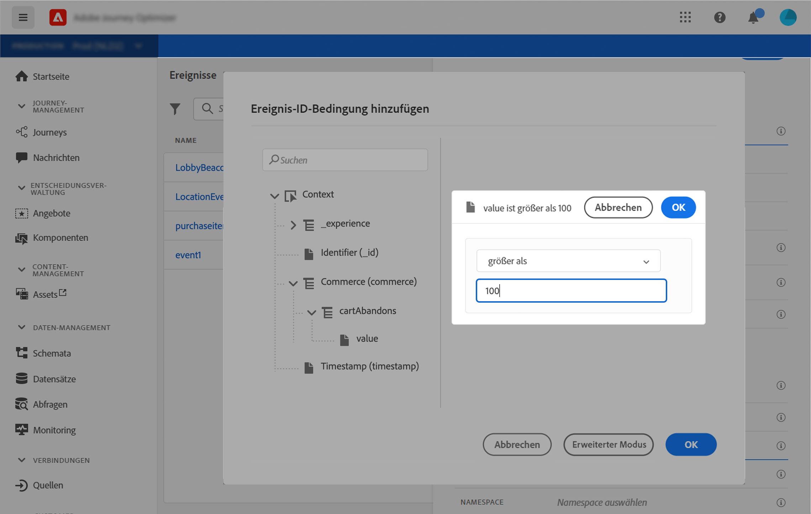

## Vorschau der Nutzlast {#preview-the-payload}

Mit der Payload-Vorschau können Sie die Payload-Definition validieren.

>[!NOTE]
>
>Bei vom System erstellten Ereignissen: Wenn Sie ein Ereignis erstellen, speichern und öffnen Sie es erneut, bevor Sie die Payload-Vorschau anzeigen. Dieser Schritt ist erforderlich, um eine Ereignis-ID in der Payload zu generieren.

1. Klicken Sie auf das Symbol **[!UICONTROL Payload zeigen]**, um eine Vorschau der vom System erwarteten Payload anzuzeigen.

   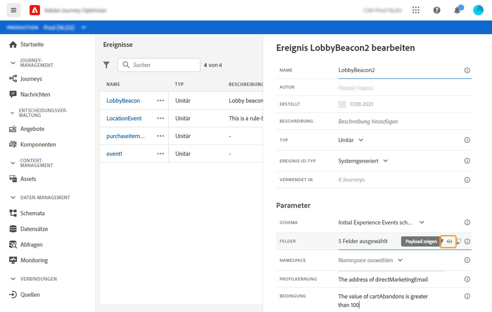

   Sie können sehen, dass die ausgewählten Felder angezeigt werden.

   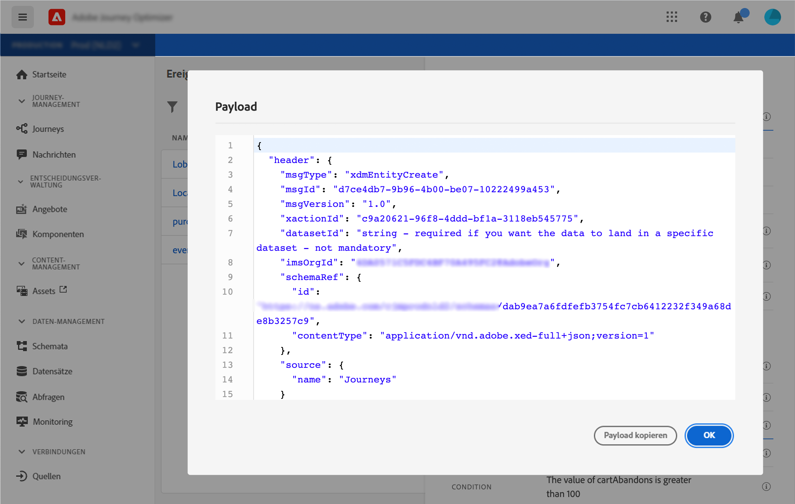

1. Überprüfen Sie die Vorschau, um die Payload-Definition zu validieren.

1. Anschließend können Sie die Payload-Vorschau für die Person freigeben, die für das Senden des Ereignisses verantwortlich ist. Diese Payload kann ihr beim Entwurf eines Ereignisses helfen, das an [!DNL Journey Optimizer] gepusht wird. Weitere Informationen finden Sie auf [dieser Seite](../event/additional-steps-to-send-events-to-journey-orchestration.md).
