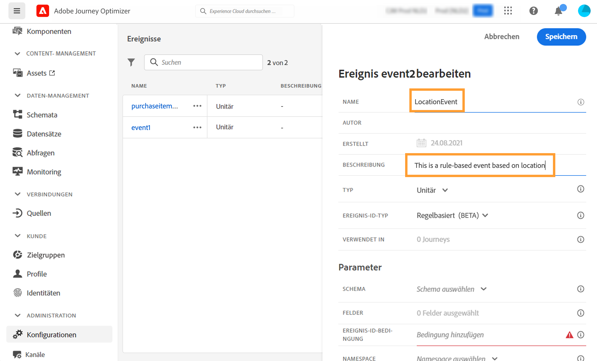
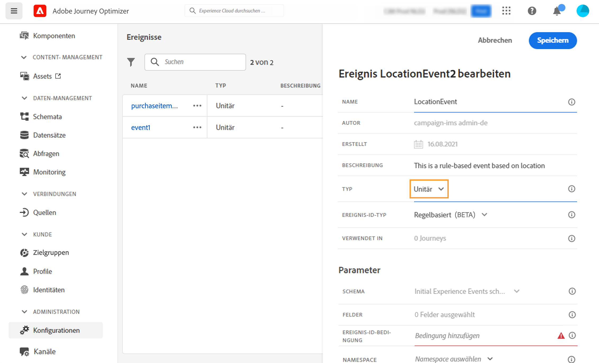
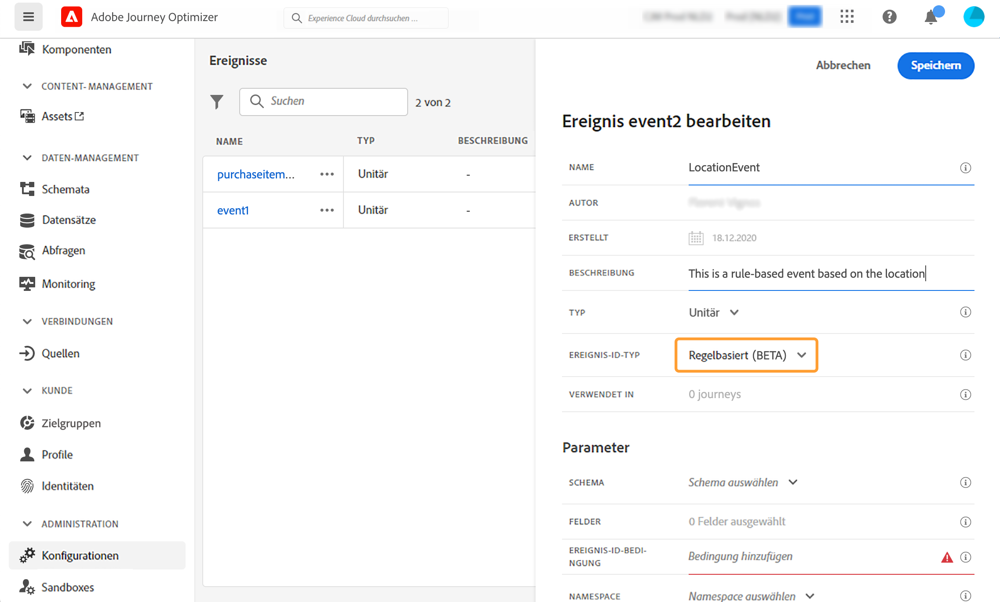
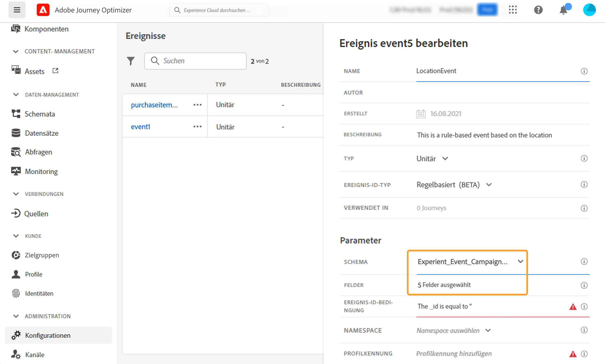

# Konfigurieren eines unitären Ereignisses {#configure-an-event}

>[!CONTEXTUALHELP]
>id="ajo_journey_event_unitary"
>title="Unitäres Ereignis"
>abstract="Mit der Ereigniskonfiguration können Sie festlegen, welche Informationen Journey Optimizer als Ereignisse erhält. Sie können mehrere Ereignisse (in verschiedenen Schritten der Journey) verwenden und mehrere Journeys können dasselbe Ereignis verwenden. Unitäre Ereignisse sind mit einem bestimmten Profil verknüpft. Sie können regelbasiert oder systemgeneriert sein."

Unitäre Ereignisse sind mit einem bestimmten Profil verknüpft. Sie können regelbasiert oder systemgeneriert sein.  Mehr über unitäre Ereignisse erfahren Sie [in diesem Abschnitt](../event/about-events.md).

Im Folgenden finden Sie die ersten Schritte zum Konfigurieren eines neuen Ereignisses:

1. Wählen Sie im Menü ADMINISTRATION die Option **[!UICONTROL Konfigurationen]**. Klicken Sie im Abschnitt **[!UICONTROL Ereignisse]** auf **[!UICONTROL Verwalten]**. Die Liste der Ereignisse wird angezeigt.

   

1. Klicken Sie auf **[!UICONTROL Ereignis erstellen]**, um ein neues Ereignis zu erstellen. Der Bereich für die Ereigniskonfiguration wird auf der rechten Seite des Bildschirms geöffnet.

   

1. Geben Sie den Namen Ihres Ereignisses ein. Sie können auch eine Beschreibung hinzufügen.

   

   >[!NOTE]
   >
   >Verwenden Sie keine Leerzeichen oder Sonderzeichen. Verwenden Sie nicht mehr als 30 Zeichen.

1. Wählen Sie im Feld **[!UICONTROL Typ]** die Option **Unitär**.

   

1. Wählen Sie im Feld **[!UICONTROL Ereignis-ID-Typ]** den zu verwendenden Ereignistyp aus: **Regelbasiert** oder **Systemgeneriert**. Weitere Informationen zum Ereignis-ID-Typ finden Sie in [diesem Abschnitt](../event/about-events.md#event-id-type).

   

1. Die Anzahl der Journeys, die dieses Ereignis verwenden, wird im Feld **[!UICONTROL Verwendet in]** angezeigt. Sie können auf **[!UICONTROL Customer Journeys anzeigen]** klicken, um die Liste der Journeys mit diesem Ereignis anzuzeigen.

1. Definieren Sie das Schema und die Payload-Felder: Hier wählen Sie die Ereignisinformationen aus (normalerweise als Payload bezeichnet), die von Journeys erwartet werden. Anschließend können Sie diese Informationen in Ihrer Journey verwenden. Weiterführende Informationen finden Sie in diesem [Abschnitt](../event/about-creating.md#define-the-payload-fields).

   

   >[!NOTE]
   >
   >Wenn Sie den Typ **[!UICONTROL Systemgeneriert]** auswählen, sind nur Schemas mit dem Feld vom Typ „eventID“ verfügbar. Wenn Sie den **[!UICONTROL regelbasierten]** Typ auswählen, sind nur Erlebnisereignisschemata verfügbar.

1. Klicken Sie bei regelbasierten Ereignissen in das Feld **[!UICONTROL Ereignis-ID-Bedingung]**. Mit dem einfachen Ausdruckseditor definieren Sie eine Bedingung, anhand derer das System die Ereignisse identifiziert, die Ihre Journey auslösen.
   

   In unserem Beispiel haben wir eine Bedingung basierend auf der Stadt des Profils verwendet. Dies bedeutet, dass das System jedes Mal, wenn es ein Ereignis empfängt, das dieser Bedingung entspricht (Feld **[!UICONTROL Stadt]** und Wert **[!UICONTROL Paris]**), dieses an Journeys weiterleitet.

   >[!NOTE]
   >
   >Der erweiterte Ausdruckseditor ist beim Definieren der **[!UICONTROL Ereignis-ID-Bedingung]** nicht verfügbar. Im einfachen Ausdruckseditor sind nicht alle Operatoren verfügbar. Sie hängen vom Datentyp ab. Beispielsweise können Sie für ein Feld vom Typ Zeichenfolge „enthält“ oder „ist gleich“ verwenden.
   >
   >Wenn Sie Ihr Schema nach der Erstellung des Ereignisses durch neue Auflistungswerte ändern, müssen Sie die folgenden Schritte ausführen, um die Änderungen auf das vorhandene Ereignis anzuwenden: Deaktivieren Sie das Auflistungsfeld in den Ereignisfeldern, bestätigen Sie die Auswahl und wählen Sie das Auflistungsfeld erneut aus. Der neue Auflistungswert wird jetzt angezeigt.

1. Fügen Sie einen Namespace hinzu. Dieser Schritt ist optional, wird jedoch empfohlen, da das Hinzufügen eines Namespace es Ihnen ermöglicht, die im Echtzeit-Kundenprofildienst gespeicherten Informationen zu nutzen. Er definiert den Typ des Schlüssels, den das Ereignis hat. Weitere Informationen finden Sie in [diesem Abschnitt](../event/about-creating.md#select-the-namespace).

1. Profilkennung definieren: Wählen Sie ein Feld aus Ihren Payload-Feldern aus oder definieren Sie eine Formel, um die mit dem Ereignis verbundene Person zu identifizieren. Dieser Schlüssel wird automatisch eingerichtet (kann aber weiterhin bearbeitet werden), wenn Sie einen Namespace auswählen. Journeys wählen den Schlüssel aus, der dem Namespace entsprechen soll (wenn Sie beispielsweise einen E-Mail-Namespace auswählen, wird der E-Mail-Schlüssel ausgewählt). Weitere Informationen finden Sie in [diesem Abschnitt](../event/about-creating.md#define-the-event-key).

   

1. Klicken Sie auf **[!UICONTROL Speichern]**.

   Das Ereignis ist jetzt konfiguriert und kann in einer Journey abgelegt werden. Für den Empfang von Ereignissen sind zusätzliche Konfigurationsschritte erforderlich. Weitere Informationen finden Sie auf [dieser Seite](../event/additional-steps-to-send-events-to-journey.md).

## Definieren der Payload-Felder {#define-the-payload-fields}

Mit der Payload-Definition können Sie die Informationen auswählen, die das System vom Ereignis in Ihrer Journey erwartet, sowie den Schlüssel zum Identifizieren der mit dem Ereignis verbundenen Person. Die Payload basiert auf der Experience Cloud-XDM-Felddefinition. Weitere Informationen zu XDM finden sich in der [Adobe Experience Platform Launch-Dokumentation](https://experienceleague.adobe.com/docs/experience-platform/xdm/home.html?lang=de){target="_blank"}.

1. Wählen Sie ein XDM-Schema aus der Liste aus und klicken Sie auf das Feld **[!UICONTROL Felder]** oder das Symbol **[!UICONTROL Bearbeiten]**.

   

   Alle im Schema definierten Felder werden angezeigt. Die Liste der Felder variiert von Schema zu Schema. Sie können nach einem bestimmten Feld suchen oder die Filter verwenden, um alle Knoten und Felder oder nur die ausgewählten Felder anzuzeigen. Gemäß der Schemadefinition können einige Felder obligatorisch und vorausgewählt sein. Sie können die Auswahl nicht aufheben. Alle Felder, die für den korrekten Empfang des Ereignisses durch Journeys erforderlich sind, sind standardmäßig ausgewählt.

   >[!NOTE]
   >
   >Stellen Sie bei systemgenerierten Ereignissen sicher, dass Sie die Feldergruppe „Orchestrierung“ zum XDM-Schema hinzugefügt haben. Dadurch wird sichergestellt, dass Ihr Schema alle erforderlichen Informationen für die Zusammenarbeit mit [!DNL Journey Optimizer] enthält.

   

1. Wählen Sie die Felder aus, die Sie vom Ereignis erwarten. Dies sind die Felder, die der Business-Anwender in der Journey nutzen wird. Sie müssen auch den Schlüssel enthalten, mit dem die mit dem Ereignis verbundene Person identifiziert werden kann (siehe [diesen Abschnitt](../event/about-creating.md#define-the-event-key)).

   >[!NOTE]
   >
   >Das Feld **[!UICONTROL eventID]** wird automatisch in die Liste der ausgewählten Felder eingefügt, damit [!DNL Journey Optimizer] das Ereignis identifizieren kann. Das System, das das Ereignis per Push sendet, sollte keine ID generieren, sondern die ID verwenden, die in der Payload-Vorschau verfügbar ist. Weitere Informationen finden Sie in [diesem Abschnitt](../event/about-creating.md#preview-the-payload).

1. Wenn Sie die erforderlichen Felder ausgewählt haben, klicken Sie auf **[!UICONTROL OK]** oder drücken Sie die **[!UICONTROL Eingabetaste]**.

   Die Anzahl der ausgewählten Felder wird im Feld **[!UICONTROL Felder]** angezeigt.

   

## Wählen des Namespace {#select-the-namespace}

>[!CONTEXTUALHELP]
>id="ajo_journey_namespace"
>title="Identity-Namespace"
>abstract="Wählen Sie den Schlüssel aus, um das mit dem Ereignis verknüpfte Kundenprofil zu identifizieren."

Mit dem Namespace können Sie den Typ des Schlüssels definieren, mit dem die mit dem Ereignis verbundene Person identifiziert wird. Die Konfiguration ist optional. Sie ist erforderlich, wenn Sie in Ihren Journeys zusätzliche Informationen aus dem [Echtzeit-Kundenprofil](https://experienceleague.adobe.com/docs/experience-platform/profile/home.html?lang=de){target="_blank"} abrufen möchten. Der Namespace muss nicht definiert werden, wenn Sie nur Daten aus einem Drittanbietersystem über eine benutzerdefinierte Datenquelle verwenden.

Sie können entweder einen der vordefinierten Namespace verwenden oder mit dem Identity-Namespace-Dienst einen neuen erstellen. Weitere Informationen finden Sie in der [Adobe Experience Platform-Dokumentation](https://experienceleague.adobe.com/docs/experience-platform/identity/home.html?lang=de){target="_blank"}.

Wenn Sie ein Schema mit einer Primäridentität auswählen, werden die Felder **[!UICONTROL Profilkennung]** und **[!UICONTROL Namespace]** vorbelegt. Wenn keine Identität definiert ist, wählen Sie _identityMap > id_ als Primärschlüssel aus. Wählen Sie anschließend einen Namespace aus und der Schlüssel wird (unter dem Feld **[!UICONTROL Namespace]**) mit _identityMap > id_ vorbelegt.

Bei der Auswahl von Feldern werden Primäridentitätsfelder mit Tags versehen.

Wählen Sie einen Namespace aus der Dropdown-Liste aus.

Pro Journey ist nur ein Namespace zulässig. Wenn Sie mehrere Ereignisse in derselben Journey verwenden, müssen diese denselben Namespace verwenden. Weitere Informationen finden Sie auf [dieser Seite](../building-journeys/journey.md).

>[!NOTE]
>
>Sie können nur einen personenbasierten Identity-Namespace auswählen. Wenn Sie einen Namespace für eine Suchtabelle definiert haben (z. B.: Produkt-ID-Namespace für eine Produktsuche), ist er nicht in der Dropdown-Liste **Namespace** verfügbar.

## Profilkennung definieren {#define-the-event-key}

Der Schlüssel ist das Feld oder die Feldkombination, die Teil der Payload-Ereignisdaten ist und es dem System ermöglicht, die mit dem Ereignis verbundene Person zu identifizieren. Der Schlüssel kann beispielsweise die Experience Cloud-ID, eine CRM-ID oder eine E-Mail-Adresse sein.

Um in der Echtzeit-Kundenprofildatenbank von Adobe gespeicherte Daten zu verwenden, muss der Ereignisschlüssel den Informationen entsprechen, die Sie im [Echtzeit-Kundenprofil-Service](https://experienceleague.adobe.com/docs/experience-platform/profile/home.html?lang=de){target="_blank"} als Profilidentität definiert haben.

Mit der Profilkennung kann das System die Abstimmung zwischen dem Ereignis und dem Profil des Kontakts durchführen. Wenn Sie ein Schema mit einer Primäridentität auswählen, werden die Felder **[!UICONTROL Profilkennung]** und **[!UICONTROL Namespace]** vorbelegt. Wenn keine Identität definiert ist, wählen Sie _identityMap > ID_ als Primärschlüssel aus. Wählen Sie dann einen Namespace aus und der Schlüssel wird automatisch mithilfe von _identityMap > ID_ vorausgefüllt.

Bei der Auswahl von Feldern werden Primäridentitätsfelder mit Tags versehen.

Wenn Sie einen anderen Schlüssel verwenden müssen, z. B. eine CRM-ID oder eine E-Mail-Adresse, müssen Sie ihn manuell hinzufügen, wie hier beschrieben:

1. Klicken Sie in das Feld **[!UICONTROL Profilkennung]** oder auf das Stiftsymbol.

   

1. Wählen Sie das als Schlüssel ausgewählte Feld in der Liste der Payload-Felder aus. Sie können auch zum erweiterten Ausdruckseditor wechseln, um komplexere Schlüssel zu erstellen (z. B. eine Verkettung zweier Felder der Ereignisse).

   

Wenn das Ereignis eingeht, kann das System mit dem Wert des Schlüssels die mit dem Ereignis verbundene Person identifizieren. Mit dem Schlüssel, der einem Namespace zugeordnet ist (siehe [diesen Abschnitt](../event/about-creating.md#select-the-namespace)), können Abfragen in Adobe Experience Platform durchgeführt werden. Weitere Informationen finden Sie auf [dieser Seite](../building-journeys/about-journey-activities.md#orchestration-activities).
Der Schlüssel wird auch verwendet, um zu überprüfen, ob sich eine Person in einer Journey befindet. Eine Person kann nicht an zwei verschiedenen Stellen in derselben Journey sein. Das System lässt daher nicht zu, dass sich derselbe Schlüssel, z. B. der Schlüssel CRMID=3224, an verschiedenen Stellen in derselben Journey befindet.

Sie haben auch Zugriff auf die erweiterten Ausdrucksfunktionen (**[!UICONTROL erweiterter Modus]**), wenn Sie zusätzliche Manipulationen durchführen möchten. Mit diesen Funktionen können Sie die Werte bearbeiten, die für bestimmte Abfragen wie das Ändern von Formaten verwendet werden, indem Sie Feldverkettungen durchführen, wobei nur ein Teil eines Felds (z. B. die 10 ersten Zeichen) berücksichtigt wird. Weitere Informationen finden Sie auf dieser [Seite](../building-journeys/expression/expressionadvanced.md).

## Vorschau der Payload {#preview-the-payload}

Mit der Payload-Vorschau können Sie die Payload-Definition validieren.

>[!NOTE]
>
>Bei vom System erstellten Ereignissen: Wenn Sie ein Ereignis erstellen, speichern und öffnen Sie es erneut, bevor Sie die Payload-Vorschau anzeigen. Dieser Schritt ist erforderlich, um eine Ereignis-ID in der Payload zu generieren.

1. Klicken Sie auf das Symbol **[!UICONTROL Payload zeigen]**, um eine Vorschau der vom System erwarteten Payload anzuzeigen.

   

   Sie können sehen, dass die ausgewählten Felder angezeigt werden.

   

1. Überprüfen Sie die Vorschau, um die Payload-Definition zu validieren.

1. Anschließend können Sie die Payload-Vorschau für die Person freigeben, die für das Senden des Ereignisses verantwortlich ist. Diese Payload kann ihr beim Entwurf eines Ereignisses helfen, das an [!DNL Journey Optimizer] gesendet wird. Weitere Informationen finden Sie auf [dieser Seite](../event/additional-steps-to-send-events-to-journey.md).
