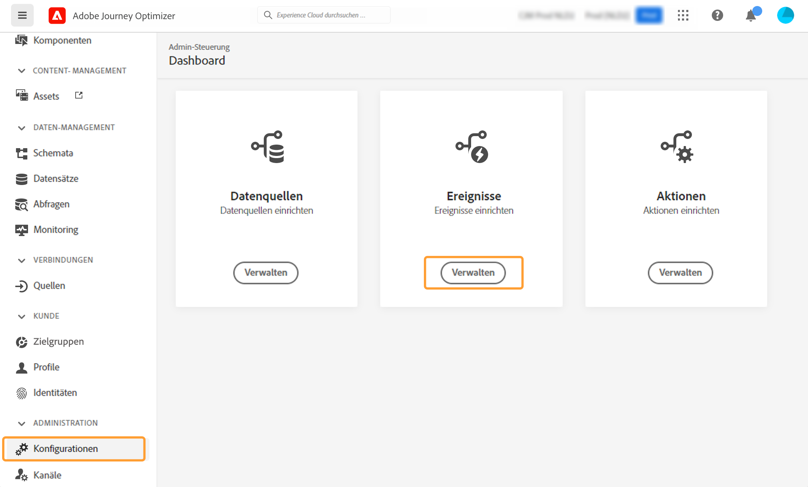
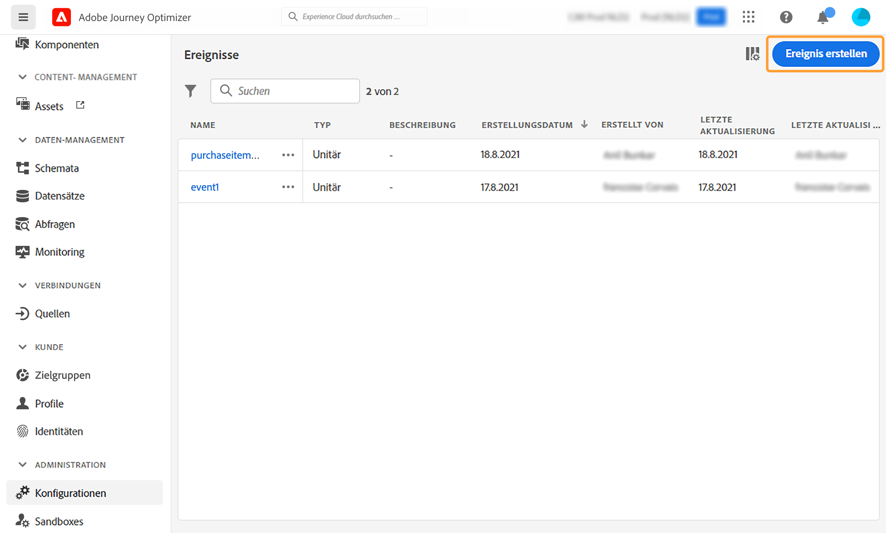

# Einzelereignisse konfigurieren {#configure-an-event}

>[!CONTEXTUALHELP]
>id="ajo_journey_event_unitary"
>title="Einzelereignisse"
>abstract="Mit der Ereigniskonfiguration können Sie festlegen, welche Informationen Journey Optimizer als Ereignisse erhält. Sie können mehrere Ereignisse (in verschiedenen Schritten einer Journey) verwenden und mehrere Journeys können dasselbe Ereignis verwenden. Einzelereignisse sind mit einem bestimmten Profil verknüpft. Sie können regelbasiert oder systemgeneriert sein."

Einzelereignisse sind mit einem bestimmten Profil verknüpft. Sie können regelbasiert oder systemgeneriert sein.  Mehr über Einzelereignisse [diesem Abschnitt](../event/about-events.md).

Im Folgenden finden Sie die ersten Schritte zum Konfigurieren eines neuen Ereignisses:

1. Wählen Sie im Menü ADMINISTRATION die Option **[!UICONTROL Configurations]**. Im  **[!UICONTROL Events]** Abschnitt, klicken Sie auf **[!UICONTROL Manage]**. Die Liste der Ereignisse wird angezeigt.

   

1. Klicken **[!UICONTROL Create Event]** , um ein neues Ereignis zu erstellen. Der Bereich für die Ereigniskonfiguration wird auf der rechten Seite des Bildschirms geöffnet.

   

1. Geben Sie den Namen Ihres Ereignisses ein. Sie können auch eine Beschreibung hinzufügen.

   

   >[!NOTE]
   >
   >Verwenden Sie keine Leerzeichen oder Sonderzeichen. Verwenden Sie nicht mehr als 30 Zeichen.

1. Im **[!UICONTROL Type]** Feld, wählen Sie **Einzelfall**.

   

1. Im **[!UICONTROL Event ID type]** wählen Sie den Ereignis-ID-Typ aus, den Sie verwenden möchten: **Regelbasiert** oder **Systemgeneriert**. Weitere Informationen zu Ereignis-ID-Typen in [diesem Abschnitt](../event/about-events.md#event-id-type).

   

1. Die Anzahl der Journeys, die dieses Ereignis verwenden, wird im **[!UICONTROL Used in]** -Feld. Sie können auf die **[!UICONTROL View journeys]** -Symbol, um die Liste der Journeys anzuzeigen, die dieses Ereignis verwenden.

1. Definieren Sie das Schema und die Payload-Felder: Hier wählen Sie die Ereignisinformationen aus (normalerweise als Payload bezeichnet), die Journeys erwarten, empfangen zu werden. Anschließend können Sie diese Informationen in Ihrer Journey verwenden. Siehe [diesem Abschnitt](../event/about-creating.md#define-the-payload-fields).

   

   >[!NOTE]
   >
   >Wenn Sie die **[!UICONTROL System Generated]** -Typ, sind nur Schemata mit dem Feld eventID-Typ verfügbar. Wenn Sie die **[!UICONTROL Rule Based]** Typ, sind alle Erlebnisereignisschemata verfügbar.

1. Klicken Sie bei regelbasierten Ereignissen in der **[!UICONTROL Event ID condition]** -Feld. Definieren Sie mithilfe des einfachen Ausdruckseditors die Bedingung, die vom System verwendet wird, um die Ereignisse zu identifizieren, die Ihre Journey auslösen werden.
   

   In unserem Beispiel haben wir eine Bedingung basierend auf der Stadt des Profils geschrieben. Das bedeutet, dass jedes Mal, wenn das System ein Ereignis erhält, das dieser Bedingung entspricht (**[!UICONTROL City]** und **[!UICONTROL Paris]** -Wert), wird er an Journeys übergeben.

   >[!NOTE]
   >
   >Der erweiterte Ausdruckseditor ist beim Definieren der **[!UICONTROL Event ID condition]**. Im einfachen Ausdruckseditor sind nicht alle Operatoren verfügbar, sondern hängen vom Datentyp ab. Beispielsweise können Sie für einen Feldzeichenfolgentyp &quot;contains&quot;oder &quot;equal to&quot;verwenden.

1. Fügen Sie einen Namespace hinzu. Dieser Schritt ist optional, wird jedoch empfohlen, da das Hinzufügen eines Namespace es Ihnen ermöglicht, die im Echtzeit-Kundenprofildienst gespeicherten Informationen zu nutzen. Sie definiert den Typ des Schlüssels, den das Ereignis hat. Siehe [diesem Abschnitt](../event/about-creating.md#select-the-namespace).
1. Definieren Sie die Profilkennung: Wählen Sie ein Feld aus Ihren Payload-Feldern aus oder definieren Sie eine Formel, um die mit dem Ereignis verbundene Person zu identifizieren. Dieser Schlüssel wird automatisch eingerichtet (kann aber dennoch bearbeitet werden), wenn Sie einen Namespace auswählen. Journeys wählt den Schlüssel aus, der dem Namespace entsprechen soll (wenn Sie beispielsweise einen E-Mail-Namespace auswählen, wird der E-Mail-Schlüssel ausgewählt). Siehe [diesem Abschnitt](../event/about-creating.md#define-the-event-key).

   

1. Klicken **[!UICONTROL Save]**.

   Das Ereignis ist jetzt konfiguriert und kann in einer Journey abgelegt werden. Für den Empfang von Ereignissen sind zusätzliche Konfigurationsschritte erforderlich. Siehe [diese Seite](../event/additional-steps-to-send-events-to-journey.md).

## Definieren der Payload-Felder {#define-the-payload-fields}

Mit der Payload-Definition können Sie die Informationen auswählen, die das System vom Ereignis in Ihrer Journey erwartet, und den Schlüssel zur Identifizierung der mit dem Ereignis verbundenen Person auswählen. Die Payload basiert auf der Experience Cloud-XDM-Felddefinition. Weitere Informationen zu XDM finden Sie unter [Dokumentation zu Adobe Experience Platform](https://experienceleague.adobe.com/docs/experience-platform/xdm/home.html){target=&quot;_blank&quot;}.

1. Wählen Sie ein XDM-Schema aus der Liste aus und klicken Sie auf die **[!UICONTROL Fields]** oder auf **[!UICONTROL Edit]** Symbol.

   

   Alle im Schema definierten Felder werden angezeigt. Die Feldliste variiert von Schema zu Schema. Sie können nach einem bestimmten Feld suchen oder die Filter verwenden, um alle Knoten und Felder oder nur die ausgewählten Felder anzuzeigen. Je nach Schemadefinition können einige Felder obligatorisch und vorausgewählt sein. Sie können die Auswahl nicht aufheben. Standardmäßig sind alle Felder ausgewählt, die erforderlich sind, damit das Ereignis von Journeys ordnungsgemäß empfangen werden kann.

   >[!NOTE]
   >
   >Stellen Sie bei systemgenerierten Ereignissen sicher, dass Sie die Feldergruppe &quot;Orchestrierung&quot;zum XDM-Schema hinzugefügt haben. Dadurch wird sichergestellt, dass Ihr Schema alle erforderlichen Informationen enthält, mit denen Sie arbeiten können. [!DNL Journey Optimizer].

   

1. Wählen Sie die Felder aus, die Sie vom Ereignis erwarten. Dies sind die Felder, die der Business-Anwender in der Journey nutzen wird. Sie müssen auch den Schlüssel enthalten, mit dem die mit dem Ereignis verbundene Person identifiziert werden kann (siehe [diesem Abschnitt](../event/about-creating.md#define-the-event-key)).

   >[!NOTE]
   >
   >Bei systemgenerierten Ereignissen muss die Variable **[!UICONTROL eventID]** wird automatisch in die Liste der ausgewählten Felder eingefügt, sodass [!DNL Journey Optimizer] kann das Ereignis identifizieren. Das System, das das Ereignis per Push sendet, sollte keine ID generieren, sondern die ID verwenden, die in der Payload-Vorschau verfügbar ist. Siehe [diesem Abschnitt](../event/about-creating.md#preview-the-payload).

1. Wenn Sie die erforderlichen Felder ausgewählt haben, klicken Sie auf **[!UICONTROL Ok]** oder drücken Sie **[!UICONTROL Enter]**.

   Die Anzahl der ausgewählten Felder wird im **[!UICONTROL Fields]** -Feld.

   

## Namespace auswählen {#select-the-namespace}

>[!CONTEXTUALHELP]
>id="ajo_journey_namespace"
>title="Identitäts-Namespace"
>abstract="Wählen Sie den Schlüssel aus, um das mit dem Ereignis verknüpfte Kundenprofil zu identifizieren."

Mit dem Namespace können Sie den Typ des Schlüssels definieren, mit dem die mit dem Ereignis verbundene Person identifiziert wird. Die Konfiguration ist optional. Sie ist erforderlich, wenn Sie in Ihren Journeys zusätzliche Informationen aus der [Echtzeit-Kundenprofil](https://experienceleague.adobe.com/docs/experience-platform/profile/home.html){target=&quot;_blank&quot;}. Die Namespace-Definition ist nicht erforderlich, wenn Sie nur Daten aus einem Drittanbietersystem über eine benutzerdefinierte Datenquelle verwenden.

Sie können entweder einen der vordefinierten Namespace verwenden oder mit dem Identity Namespace-Dienst einen neuen erstellen. Siehe [Dokumentation zu Adobe Experience Platform](https://experienceleague.adobe.com/docs/experience-platform/identity/home.html){target=&quot;_blank&quot;}.

Wenn Sie ein Schema mit einer primären Identität auswählen, wird die **[!UICONTROL Profiler identifier]** und **[!UICONTROL Namespace]** -Felder sind vorausgefüllt. Wenn keine Identität definiert ist, wählen Sie _identityMap > id_ als Primärschlüssel. Dann müssen Sie einen Namespace auswählen und der Schlüssel wird vorausgefüllt (unter dem **[!UICONTROL Namespace]** -Feld) mithilfe von _identityMap > id_.

Bei der Auswahl von Feldern werden primäre Identitätsfelder mit Tags versehen.

Wählen Sie einen Namespace aus der Dropdownliste aus.

Pro Journey ist nur ein Namespace zulässig. Wenn Sie mehrere Ereignisse in derselben Journey verwenden, müssen diese denselben Namespace verwenden. Siehe [diese Seite](../building-journeys/journey.md).

## Profilkennung definieren {#define-the-event-key}

Der Schlüssel ist das Feld oder die Kombination von Feldern, die Teil der Ereignis-Payload-Daten ist und es dem System ermöglicht, die mit dem Ereignis verbundene Person zu identifizieren. Der Schlüssel kann beispielsweise die Experience Cloud ID, eine CRM-ID oder eine E-Mail-Adresse sein.

Um in der Echtzeit-Kundenprofildatenbank von Adobe gespeicherte Daten verwenden zu können, muss der Ereignisschlüssel die Informationen sein, die Sie in der [Echtzeit-Kundenprofildienst](https://experienceleague.adobe.com/docs/experience-platform/profile/home.html){target=&quot;_blank&quot;}.

Mit der Profilkennung kann das System die Abstimmung zwischen dem Ereignis und dem Profil der Person durchführen. Wenn Sie ein Schema mit einer primären Identität auswählen, wird die **[!UICONTROL Profile identifier]** und **[!UICONTROL Namespace]** -Felder sind vorausgefüllt. Wenn keine Identität definiert ist, wird die _identityMap > id_ ist der Primärschlüssel. Wählen Sie dann einen Namespace aus und der Schlüssel wird automatisch mit _identityMap > id_.

Bei der Auswahl von Feldern werden primäre Identitätsfelder mit Tags versehen.

Wenn Sie einen anderen Schlüssel verwenden müssen, z. B. eine CRM-ID oder eine E-Mail-Adresse, müssen Sie ihn manuell hinzufügen, wie unten beschrieben:

1. Klicken Sie in die **[!UICONTROL Profile identifier]** oder auf dem Stiftsymbol angezeigt.

   

1. Wählen Sie in der Liste der Payload-Felder das Feld aus, das als Schlüssel ausgewählt wurde. Sie können auch zum erweiterten Ausdruckseditor wechseln, um komplexere Schlüssel zu erstellen (z. B. eine Verkettung zweier Ereignisfelder).

   

Wenn das Ereignis empfangen wird, ermöglicht der Wert des Schlüssels dem System, die mit dem Ereignis verbundene Person zu identifizieren. Mit einem Namespace verknüpft (siehe [diesem Abschnitt](../event/about-creating.md#select-the-namespace)), kann der Schlüssel für Abfragen in Adobe Experience Platform verwendet werden. Siehe [diese Seite](../building-journeys/about-journey-activities.md#orchestration-activities).
Der Schlüssel wird auch verwendet, um zu überprüfen, ob sich eine Person in einer Journey befindet. Eine Person kann sich nicht an zwei verschiedenen Orten in derselben Journey befinden. Daher lässt das System nicht zu, dass sich derselbe Schlüssel, z. B. der Schlüssel CRMID=3224, an verschiedenen Stellen in derselben Journey befindet.

Sie haben auch Zugriff auf die erweiterten Ausdrucksfunktionen (**[!UICONTROL Advanced mode]**), wenn Sie zusätzliche Manipulationen durchführen möchten. Mit diesen Funktionen können Sie die Werte bearbeiten, die für spezifische Abfragen wie das Ändern von Formaten verwendet werden, indem Sie Feldverkettungen durchführen, wobei nur ein Teil eines Felds (z. B. die 10 ersten Zeichen) berücksichtigt wird. Siehe dies [page](../building-journeys/expression/expressionadvanced.md).

## Payload-Vorschau {#preview-the-payload}

Mit der Payload-Vorschau können Sie die Payload-Definition überprüfen.

>[!NOTE]
>
>Wenn Sie bei systemgenerierten Ereignissen ein Ereignis erstellen, speichern und öffnen Sie es erneut, bevor Sie die Payload-Vorschau anzeigen. Dieser Schritt ist erforderlich, um eine Ereignis-ID in der Payload zu generieren.

1. Klicken Sie auf **[!UICONTROL View Payload]** -Symbol, um eine Vorschau der vom System erwarteten Payload anzuzeigen.

   

   Sie können feststellen, dass die ausgewählten Felder angezeigt werden.

   

1. Überprüfen Sie die Vorschau , um die Payload-Definition zu validieren.

1. Anschließend können Sie die Payload-Vorschau für die Person freigeben, die für das Senden des Ereignisses verantwortlich ist. Diese Payload kann ihnen bei der Konzeption eines Ereignisses helfen, das an [!DNL Journey Optimizer]. Siehe [diese Seite](../event/additional-steps-to-send-events-to-journey.md).
