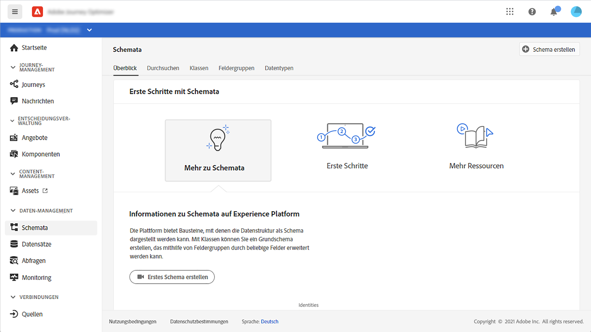
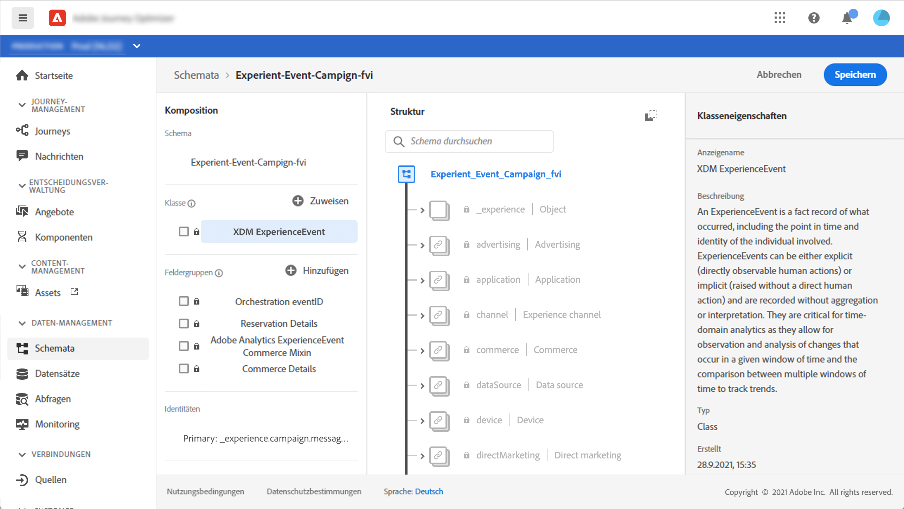
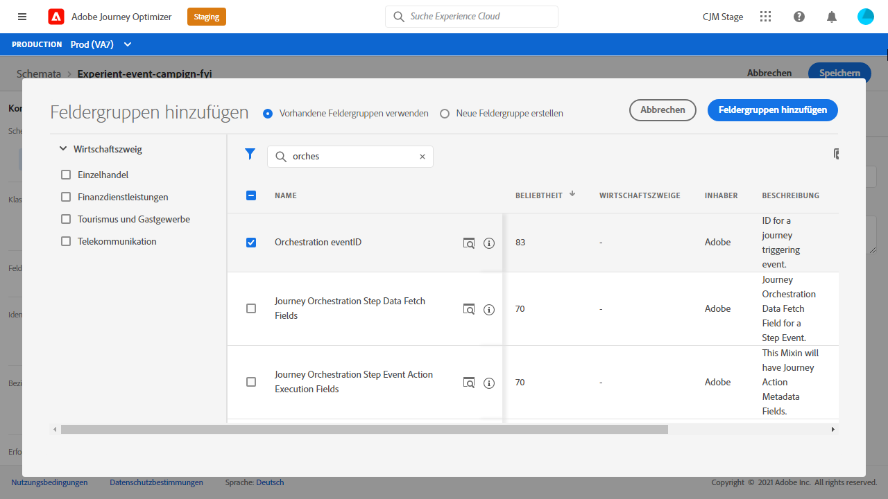
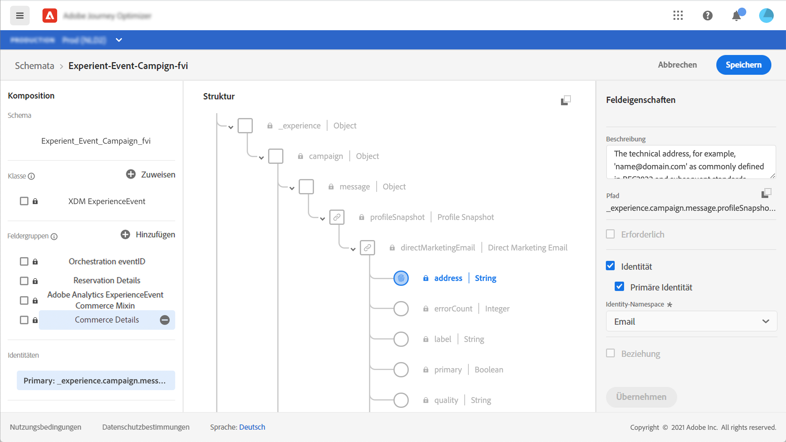
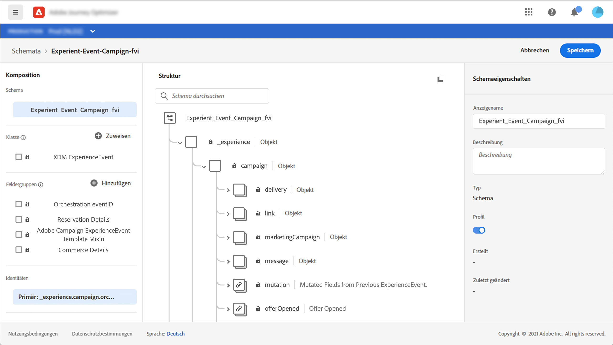
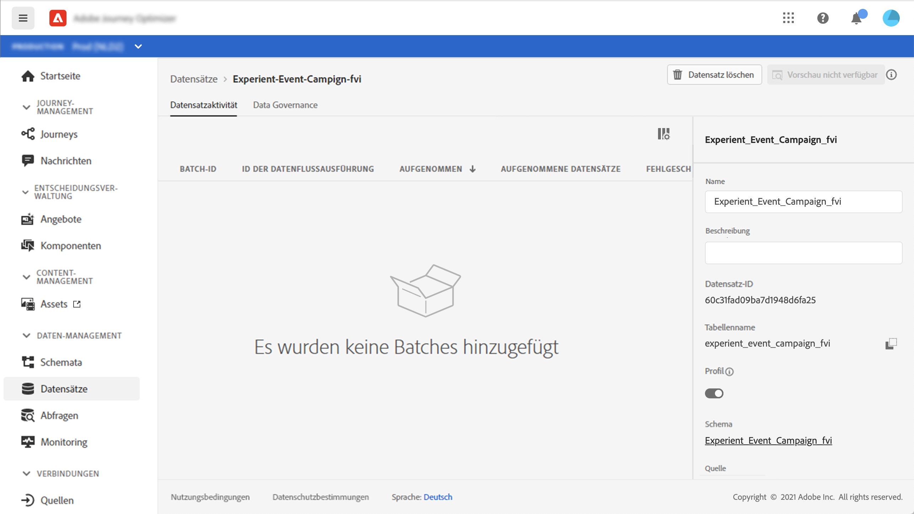
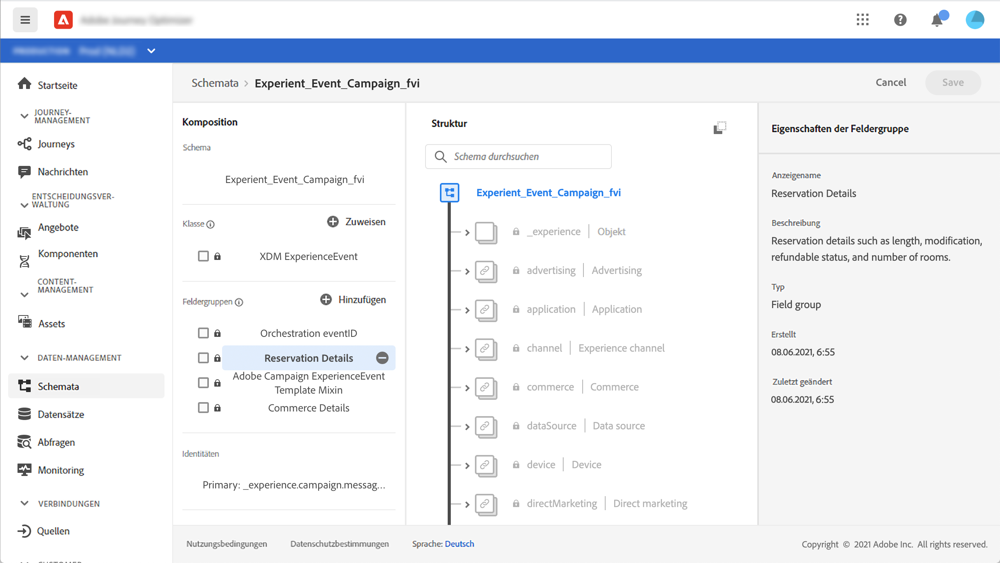

# Informationen zu ExperienceEvent-Schemata für [!DNL Journey Optimizer]-Ereignisse

[!DNL Journey Optimizer] Ereignis sind XDM Experience Ereignis, die über Streaming Ingestion an Adobe Experience Platform gesendet werden.

Eine wichtige Voraussetzung für das Einrichten von Ereignissen für [!DNL Journey Optimizer] ist, dass Sie mit dem Adobe Experience Platform Experience Data Model (oder XDM) vertraut sind und wie Sie XDM Experience Ereignis-Schema zusammenstellen sowie wie Sie XDM-formatierte Daten an Adobe Experience Platform streamen können.

## Schemaanforderungen an [!DNL Journey Optimizer]-Ereignisse

Der erste Schritt beim Einrichten eines Ereignisses für [!DNL Journey Optimizer] besteht darin, sicherzustellen, dass ein XDM-Schema zur Darstellung des Ereignisses definiert ist und ein Datensatz, der zum Aufzeichnen von Instanzen des Ereignisses auf Adobe Experience Platform erstellt wurde. Es ist nicht unbedingt erforderlich, einen Datensatz für Ihre Ereignisse zu haben. Wenn Sie die Ereignisse jedoch an einen bestimmten Datensatz senden, können Sie den Ereignisverlauf der Benutzer zur späteren Bezugnahme und Analyse aufbewahren. Dies ist daher immer empfehlenswert. Wenn Sie noch kein geeignetes Schema und einen entsprechenden Datensatz für Ihr Ereignis haben, können beide Aufgaben in der Adobe Experience Platform-Weboberfläche durchgeführt werden.

Jedes XDM-Schema, das für [!DNL Journey Optimizer]-Ereignisse verwendet wird, sollte die folgenden Anforderungen erfüllen:

* Das Schema muss der XDM-ExperienceEvent-Klasse angehören.

   

* Bei vom System erstellten Ereignissen muss das Schema das eventID-Orchestrierungs-Mixin enthalten. [!DNL Journey Optimizer] verwendet dieses Feld, um Ereignisse zu identifizieren, die in Journeys verwendet werden.

   

* Deklarieren Sie ein Identitätsfeld zur Identifizierung des Themas des Ereignisses. Wenn keine Identität angegeben ist, kann eine Identitätszuordnung (identityMap) verwendet werden. Dies wird nicht empfohlen.

   

* Damit diese Daten später in einer Journey zur Suche verfügbar sind, markieren Sie das Schema und den Datensatz für das Profil.

   

   

* Sie können auch Datenfelder einschließen, um andere Kontextdaten zu erfassen, die Sie in das Ereignis aufnehmen möchten, z. B. Informationen zum Benutzer, zum Gerät, von dem das Ereignis generiert wurde, zum Ort oder andere aussagekräftige Umstände in Zusammenhang mit dem Ereignis.

   

   
