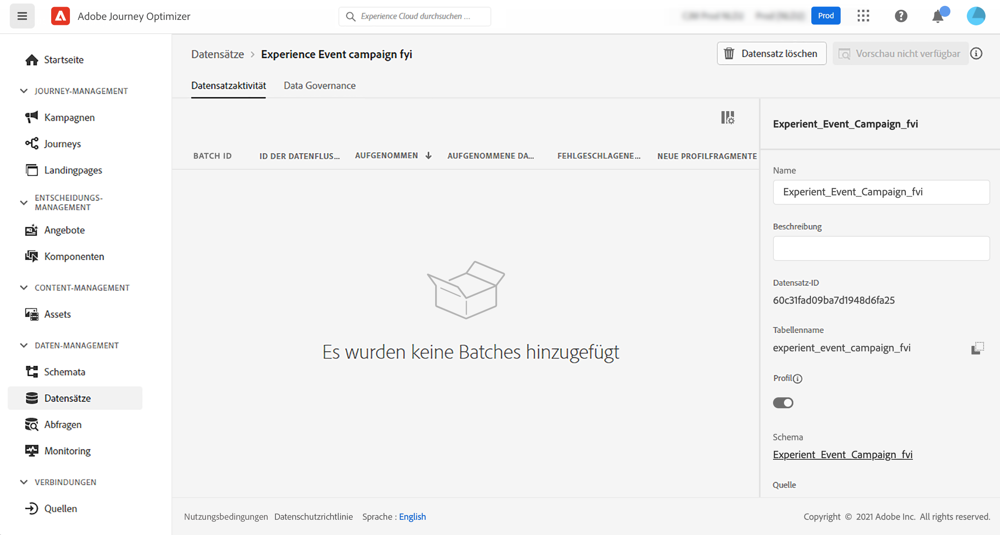
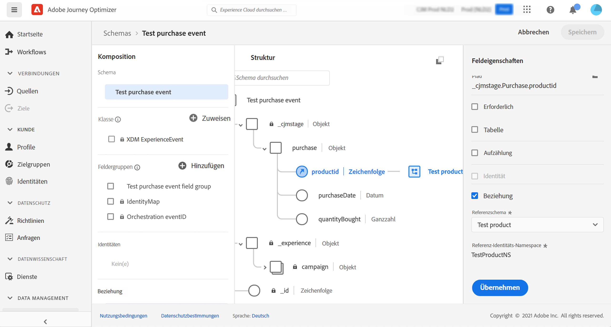

# Informationen zu ExperienceEvent-Schemata für [!DNL Journey Optimizer]-Ereignisse {#about-experienceevent-schemas}

[!DNL Journey Optimizer]-Ereignisse sind XDM-Erlebnisereignisse, die über die Streaming-Aufnahme an Adobe Experience Platform gesendet werden.

Eine wichtige Voraussetzung für das Einrichten von [!DNL Journey Optimizer]-Ereignissen ist daher, dass Sie mit dem Experience-Datenmodell (oder XDM) von Adobe Experience Platform und dem Erstellen von XDM-Erlebnisereignisschemata sowie dem Streamen von XDM-formatierten Daten an Adobe Experience Platform vertraut sind.

>[!CAUTION]
>
>Ab dem 8. Juli 2025 können neue Kundenorganisationen in Journey-Bedingungen keine Ausdrücke mehr mit Erlebnisereignisattributen erstellen. Ab dem 1. April 2026 haben Organisationen, die in den letzten 90 Tagen nicht über Journey-Ausdrücke auf Erlebnisereignisse zugegriffen haben, keinen Zugriff mehr auf diese Funktion. Alternative Ansätze und Best Practices sind unter [Suche nach Erlebnisereignissen in Journey](../building-journeys/exp-event-lookup.md) aufgeführt.
>
>Der Zugriff auf den Kontext vom Startereignis einer Journey ist nicht betroffen.

## Schemaanforderungen an [!DNL Journey Optimizer]-Ereignisse  {#schema-requirements}

Der erste Schritt beim Einrichten eines Ereignisses für [!DNL Journey Optimizer] besteht darin sicherzustellen, dass Sie ein XDM-Schema zur Darstellung des Ereignisses definiert und einen Datensatz erstellt haben, um Instanzen des Ereignisses in Adobe Experience Platform zu erfassen. Es ist nicht unbedingt erforderlich, einen Datensatz für Ereignisse zu haben. Wenn die Ereignisse jedoch an einen bestimmten Datensatz gesendet werden, ist es möglich, dadurch den Ereignisverlauf der Benutzenden zur späteren Bezugnahme und Analyse aufzubewahren. Dies ist daher immer eine gute Idee. Wenn Sie noch kein geeignetes Schema oder keinen geeigneten Datensatz für Ihr Ereignis haben, können Sie beide über die Web-Oberfläche von Adobe Experience Platform erstellen.

Jedes XDM-Schema, das für [!DNL Journey Optimizer]-Ereignisse verwendet wird, sollte die folgenden Anforderungen erfüllen:

* Das Schema muss der XDM-Klasse „ExperienceEvent“ angehören.

  

* Bei systemgenerierten Ereignissen muss das Schema die eventID-Orchestrierungs-Feldergruppe enthalten. [!DNL Journey Optimizer] verwendet dieses Feld, um Ereignisse zu identifizieren, die in Journeys verwendet werden.

  

* Deklarieren Sie ein Identitätsfeld zur Identifizierung einzelner Profile im Ereignis. Wenn keine Identität angegeben wird, kann eine Identitätszuordnung verwendet werden. Dies wird nicht empfohlen.

  

* Damit diese Daten später für ein Profil verfügbar sind, markieren Sie das Schema und den Datensatz für das Profil. [Weitere Informationen](../data/lookup-aep-data.md)

  

  

* Sie können Datenfelder einfügen, um andere Kontextdaten zu erfassen, die Sie mit dem Ereignis verknüpfen möchten, z. B. Informationen über die Person, das Gerät, von dem das Ereignis erzeugt wurde, den Standort oder andere aussagekräftige Umstände im Zusammenhang mit dem Ereignis.

  

  

<!--
## Leverage schema relationships{#leverage_schema_relationships}

Adobe Experience Platform allows you to define relationships between schemas in order to use one dataset as a lookup table for another. 

Let's say your brand data model has a schema capturing purchases. You also have a schema for the product catalog. You can capture the product ID in the purchase schema and use a relationship to look up more complete product details from the product catalog. This allows you to create an audience for all customers who bought a laptop, for example, without having to explicitly list out all laptop IDs or capture every single product details in transactional systems.

To define a relationship, you need to have a dedicated field in the source schema, in this case the product ID field in the purchase schema. This field needs to reference the product ID field in the destination schema. The source and destination tables must be enabled for profiles and the destination schema must have that common field defined as its primary identity. 

Here is the product catalog schema enabled for profile with the product ID defined as the primary identity. 

Here is the purchase schema with the relationship defined on the product ID field.

>[!NOTE]
>
>Learn more about schema relationships in the [Experience Platform documentation](https://experienceleague.adobe.com/docs/platform-learn/tutorials/schemas/configure-relationships-between-schemas.html?lang=de).

In Journey Optimizer, you can then leverage all the fields from the linked tables:

* when configuring a business or unitary event, [Read more](../event/experience-event-schema.md#unitary_event_configuration) 
* when using conditions in a journey, [Read more](../event/experience-event-schema.md#journey_conditions_using_event_context) 
* in message personalization, [Read more](../event/experience-event-schema.md#message_personalization) 
* in custom action personalization, [Read more](../event/experience-event-schema.md#custom_action_personalization_with_journey_event_context) 

### Arrays{#relationships_limitations}

You can define a schema relationship on an array of strings, for example, a list of product IDs.

You can also define a schema relationship with an attribute inside of an array of objects, for example a list of purchase information (product ID, product name, price, discount). The lookup values will be available in journeys (conditions, custom actions, etc.) and message personalization. 

### Event configuration{#unitary_event_configuration}

The linked schema fields are available in unitary and business event configuration:

* when browsing through the event schema fields in the event configuration screen.
* when defining a condition for system-generated events.

The linked fields are not available:

* in the event key formula
* in event id condition (rule-based events)

To learn how to configure a unitary event, refer to this [page](../event/about-creating.md).

### Journey conditions using event context{#journey_conditions_using_event_context}

You can use data from a lookup table linked to an event used in a journey for condition building (expression editor).

Add a condition in a journey, edit the expression and unfold the event node in the expression editor. 

To learn how to define journey conditions, refer to this [page](../building-journeys/condition-activity.md).

### Message personalization{#message_personalization}

The linked fields are available when personalizing a message. The related fields are displayed in the context passed from the journey to the message.

To learn how to personalize a message with contextual journey information, refer to this [page](../personalization/personalization-use-case.md).

### Custom action personalization with journey event context{#custom_action_personalization_with_journey_event_context}

The linked fields are available when configuring the action parameters of a journey custom action activity. 

To learn how to use custom actions, refer to this [page](../building-journeys/using-custom-actions.md).
-->
