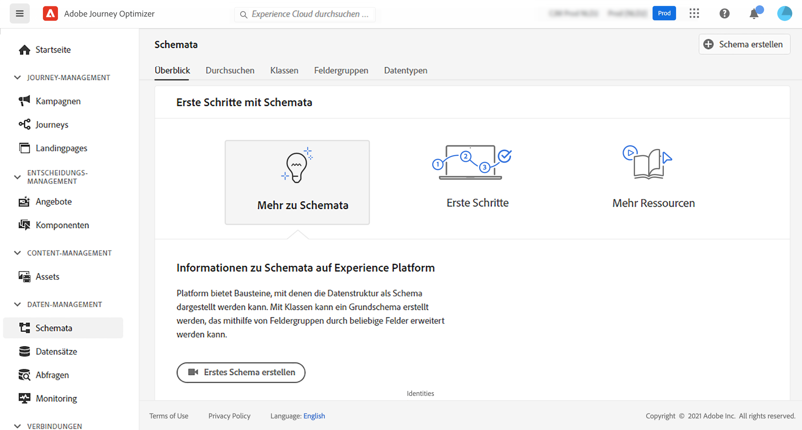

# Informationen zu ExperienceEvent-Schemasa für [!DNL Journey Optimizer]-Ereignisse {#about-experienceevent-schemas}

[!DNL Journey Optimizer]-Ereignisse sind XDM-Erlebnisereignisse, die über die Streaming-Aufnahme an Adobe Experience Platform gesendet werden.

Eine wichtige Voraussetzung für das Einrichten von [!DNL Journey Optimizer]-Ereignissen ist daher, dass Sie mit dem Experience-Datenmodell (oder XDM) von Adobe Experience Platform und dem Erstellen von XDM-Erlebnisereignisschemas sowie dem Streamen von XDM-formatierten Daten an Adobe Experience Platform vertraut sind.

## Schemaanforderungen an [!DNL Journey Optimizer]-Ereignisse  {#schema-requirements}

Der erste Schritt beim Einrichten eines Ereignisses für [!DNL Journey Optimizer] besteht darin sicherzustellen, dass Sie ein XDM-Schema zur Darstellung des Ereignisses definiert und einen Datensatz erstellt haben, um Instanzen des Ereignisses in Adobe Experience Platform zu erfassen. Es ist nicht unbedingt erforderlich, einen Datensatz für Ihre Ereignisse zu haben. Wenn Sie die Ereignisse jedoch an einen bestimmten Datensatz senden, können Sie den Ereignisverlauf der Benutzer zur späteren Bezugnahme und Analyse aufbewahren. Dies ist daher immer empfehlenswert. Wenn Sie noch kein geeignetes Schema oder keinen geeigneten Datensatz für Ihr Ereignis haben, können Sie beide über die Web-Oberfläche von Adobe Experience Platform erstellen.

Jedes XDM-Schema, das für [!DNL Journey Optimizer]-Ereignisse verwendet wird, sollte die folgenden Anforderungen erfüllen:

* Das Schema muss der ExperienceEvent-XDM-Klasse angehören.

  

* Bei systemgenerierten Ereignissen muss das Schema die eventID-Orchestrierungs-Feldergruppe enthalten. [!DNL Journey Optimizer] verwendet dieses Feld, um Ereignisse zu identifizieren, die in Journeys verwendet werden.

  

* Deklarieren Sie ein Identitätsfeld zur Identifizierung einzelner Profile im Ereignis. Wenn keine Identität angegeben ist, kann eine Identitätszuordnung (identityMap) verwendet werden. Dies wird nicht empfohlen.

  

* Damit diese Daten später in einer Journey zur Suche verfügbar sind, markieren Sie das Schema und den Datensatz für das Profil.

  

  

* Sie können auch Datenfelder einschließen, um andere Kontextdaten zu erfassen, die Sie in das Ereignis aufnehmen möchten, z. B. Informationen zum Benutzer, zum Gerät, von dem das Ereignis generiert wurde, zum Ort oder andere aussagekräftige Umstände in Zusammenhang mit dem Ereignis.

  

  

## Nutzen von Schemabeziehungen{#leverage_schema_relationships}

Mit Adobe Experience Platform können Sie Beziehungen zwischen Schemas definieren, um einen Datensatz als Lookup-Tabelle für einen anderen zu verwenden.

Nehmen wir an, Ihr Marken-Datenmodell verfügt über ein Schema zur Erfassung von Käufen. Sie verfügen weiterhin über ein Schema für den Produktkatalog. Sie können die Produkt-ID im Kaufschema erfassen und eine Beziehung verwenden, um vollständigere Produktdetails aus dem Produktkatalog nachzuschlagen. So können Sie beispielsweise eine Zielgruppe für alle Kunden erstellen, die einen Laptop gekauft haben, ohne alle Laptop-IDs explizit auflisten oder alle Produktdetails in Transaktionssystemen erfassen zu müssen.

Um eine Beziehung zu definieren, benötigen Sie ein spezielles Feld im Quellschema, in diesem Fall das Feld „Produkt-ID“ im Kaufschema. Dieses Feld muss auf das Feld „Produkt-ID“ im Zielschema verweisen. Die Quell- und Zieltabellen müssen für Profile aktiviert sein und im Zielschema muss dieses gemeinsame Feld als primäre Identität definiert sein.

Im Folgenden finden Sie das Produktkatalog-Schema, das für das Profil aktiviert ist und dessen Produkt-ID als primäre Identität definiert ist.

Im Folgenden finden Sie das Kaufschema mit der im Feld „Produkt-ID“ definierten Beziehung.

>[!NOTE]
>
>Weitere Informationen zu Schemabeziehungen finden Sie in der [Dokumentation zu Experience Platform](https://experienceleague.adobe.com/docs/platform-learn/tutorials/schemas/configure-relationships-between-schemas.html?lang=de).

In Journey Optimizer können Sie dann alle Felder aus den verknüpften Tabellen nutzen:

* beim Konfigurieren eines Geschäfts- oder unitären Ereignisses – [weitere Informationen](../event/experience-event-schema.md#unitary_event_configuration)
* bei Verwendung von Bedingungen in einer Journey – [weitere Informationen](../event/experience-event-schema.md#journey_conditions_using_event_context)
* in der Personalisierung von Nachrichten – [weitere Informationen](../event/experience-event-schema.md#message_personalization)
* in der Personalisierung benutzerdefinierter Aktionen – [weitere Informationen](../event/experience-event-schema.md#custom_action_personalization_with_journey_event_context)

### Arrays{#relationships_limitations}

Sie können eine Schemabeziehung für ein Zeichenfolgen-Array definieren, z. B. eine Liste von Produkt-IDs.

Es ist jedoch nicht möglich, eine Schemabeziehung mit einem Attribut innerhalb einer Gruppe von Objekten zu definieren, z. B. einer Liste mit Kaufinformationen (Produkt-ID, Produktname, Preis, Rabatt). Die Suchwerte sind in Journeys (Bedingungen, benutzerdefinierte Aktionen usw.) und der Nachrichtenpersonalisierung nicht verfügbar.

### Ereigniskonfiguration{#unitary_event_configuration}

Die verknüpften Schemafelder sind in der Konfiguration eines unitären und Geschäftsereignisses verfügbar:

* beim Durchsuchen der Ereignisschemafelder im Bildschirm zur Ereigniskonfiguration
* beim Definieren einer Bedingung für systemgenerierte Ereignisse

Die verknüpften Felder sind nicht verfügbar:

* in der Ereignisschlüsselformel
* in einer Ereignis-ID-Bedingung (regelbasierte Ereignisse)

Informationen zum Konfigurieren eines unitären Ereignisses finden Sie auf dieser [Seite](../event/about-creating.md).

### Journey-Bedingungen unter Verwendung von Ereigniskontext{#journey_conditions_using_event_context}

Sie können Daten aus einer Lookup-Tabelle verwenden, die mit einem Ereignis verknüpft ist, das in einer Journey zur Bedingungserstellung (Ausdruckseditor) verwendet wird.

Fügen Sie eine Bedingung in eine Journey ein, bearbeiten Sie den Ausdruck und öffnen Sie den Ereignisknoten im Ausdruckseditor.

Informationen zum Definieren von Journey-Bedingungen finden Sie auf dieser [Seite](../building-journeys/condition-activity.md).

### Personalisierung von Nachrichten{#message_personalization}

Die verknüpften Felder stehen bei der Personalisierung von Nachrichten zur Verfügung. Die zugehörigen Felder werden in dem Kontext angezeigt, der von der Journey an die Nachricht übergeben wird.

Informationen zum Personalisieren einer Nachricht mit kontextuellen Journey-Informationen finden Sie auf dieser [Seite](../personalization/personalization-use-case.md).

### Benutzerdefinierte Personalisierung von Aktionen mit Journey-Ereigniskontext{#custom_action_personalization_with_journey_event_context}

Die verknüpften Felder stehen beim Konfigurieren der Aktionsparameter einer benutzerdefinierten Aktionsaktivität von Journeys zur Verfügung.

Informationen zur Verwendung benutzerdefinierter Aktionen finden Sie auf dieser [Seite](../building-journeys/using-custom-actions.md).
