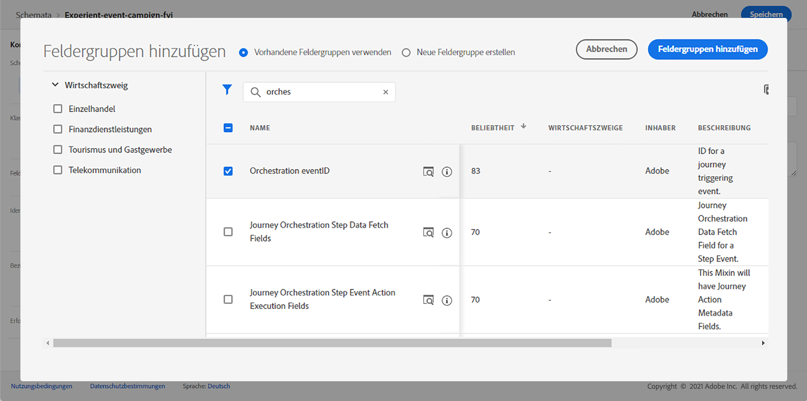

# Informationen zu ExperienceEvent-Schemata für [!DNL Journey Optimizer] Veranstaltungen {#about-experienceevent-schemas}

[!DNL Journey Optimizer] -Ereignisse sind XDM-Erlebnisereignisse, die über die Streaming-Erfassung an Adobe Experience Platform gesendet werden.

Eine wichtige Voraussetzung für die Einrichtung von Ereignissen für [!DNL Journey Optimizer] ist Ihnen vertraut mit dem Experience-Datenmodell (oder XDM) von Adobe Experience Platform, dem Erstellen von XDM-Erlebnisereignis-Schemata sowie dem Streamen von XDM-formatierten Daten an Adobe Experience Platform.

## Schemaanforderungen für [!DNL Journey Optimizer] Veranstaltungen  {#schema-requirements}

Der erste Schritt beim Einrichten eines Ereignisses für [!DNL Journey Optimizer] soll sicherstellen, dass Sie ein XDM-Schema zur Darstellung des Ereignisses definiert und einen Datensatz erstellt haben, um Instanzen des Ereignisses in Adobe Experience Platform aufzuzeichnen. Ein Datensatz für Ihre Ereignisse ist nicht unbedingt erforderlich, aber das Senden der Ereignisse an einen bestimmten Datensatz ermöglicht es Ihnen, den Ereignisverlauf der Benutzer für künftige Referenzzwecke und Analysen zu verwalten. Dies ist daher immer empfehlenswert. Wenn Sie noch kein geeignetes Schema und keinen geeigneten Datensatz für Ihr Ereignis haben, können Sie beide Aufgaben über die Adobe Experience Platform-Web-Oberfläche durchführen.

Jedes XDM-Schema, das für [!DNL Journey Optimizer] -Ereignisse sollten die folgenden Anforderungen erfüllen:

* Das Schema muss der XDM ExperienceEvent-Klasse angehören.

   

* Bei systemgenerierten Ereignissen muss das Schema die Feldergruppe Orchestration eventID enthalten. [!DNL Journey Optimizer] verwendet dieses Feld, um Ereignisse zu identifizieren, die in Journeys verwendet werden.

   

* Deklarieren Sie ein Identitätsfeld zur Identifizierung des Betreffs des Ereignisses. Wenn keine Identität angegeben ist, kann eine Identitätszuordnung verwendet werden. Dies wird nicht empfohlen.

   

* Wenn diese Daten später in einer Journey für die Suche verfügbar sein sollen, markieren Sie das Schema und den Datensatz für ein Profil.

   

   

* Sie können auch Datenfelder einschließen, um alle anderen Kontextdaten zu erfassen, die Sie in das Ereignis aufnehmen möchten, z. B. Informationen zum Benutzer, zum Gerät, von dem das Ereignis generiert wurde, zum Standort oder andere aussagekräftige Umstände im Zusammenhang mit dem Ereignis.

   

   

## Nutzen von Schemabeziehungen{#leverage_schema_relationships}

Mit Adobe Experience Platform können Sie Beziehungen zwischen Schemas definieren, um einen Datensatz als Lookup-Tabelle für einen anderen zu verwenden.

Nehmen wir an, Ihr Marken-Datenmodell verfügt über ein Schema zur Erfassung von Käufen. Sie verfügen auch über ein Schema für den Produktkatalog. Sie können die Produkt-ID im Kaufschema erfassen und eine Beziehung verwenden, um vollständigere Produktdetails aus dem Produktkatalog nachzuschlagen. So können Sie beispielsweise ein Segment für alle Kunden erstellen, die einen Laptop gekauft haben, ohne explizit alle Laptop-IDs auflisten oder alle Produktdetails in Transaktionssystemen erfassen zu müssen.

Um eine Beziehung zu definieren, benötigen Sie ein dediziertes Feld im Quellschema, in diesem Fall das Feld &quot;Produkt-ID&quot;im Kaufschema. Dieses Feld muss auf das Produkt-ID-Feld im Zielschema verweisen. Die Quell- und Zieltabellen müssen für Profile aktiviert sein, und das Zielschema muss über dieses gemeinsame Feld als primäre Identität verfügen.

Im Folgenden finden Sie das Produktkatalog-Schema, das für das Profil aktiviert ist, dessen Produkt-ID als primäre Identität definiert ist.

Im Folgenden finden Sie das Kaufschema mit der im Feld &quot;Produkt-ID&quot;definierten Beziehung.

>[!NOTE]
>
>Weitere Informationen zu Schemabeziehungen finden Sie in [Dokumentation zu Experience Platform](https://experienceleague.adobe.com/docs/platform-learn/tutorials/schemas/configure-relationships-between-schemas.html?lang=en).

In Journey Optimizer können Sie dann alle Felder aus den verknüpften Tabellen nutzen:

* bei der Konfiguration eines geschäftlichen oder einheitlichen Ereignisses, [Mehr dazu](../event/experience-event-schema.md#unitary_event_configuration)
* bei Verwendung von Bedingungen in einer Journey, [Mehr dazu](../event/experience-event-schema.md#journey_conditions_using_event_context)
* bei der Nachrichtenpersonalisierung, [Mehr dazu](../event/experience-event-schema.md#message_personalization)
* bei der Personalisierung benutzerdefinierter Aktionen, [Mehr dazu](../event/experience-event-schema.md#custom_action_personalization_with_journey_event_context)

### Ereigniskonfiguration{#unitary_event_configuration}

Die verknüpften Schemafelder sind in der Konfiguration von Einzelereignissen und Geschäftsereignissen verfügbar:

* beim Durchsuchen der Ereignisschemafelder im Bildschirm zur Ereigniskonfiguration.
* beim Definieren einer Bedingung für systemgenerierte Ereignisse.

Die verknüpften Felder sind nicht verfügbar:

* in der Ereignisschlüsselformel
* in Ereignis-ID-Bedingung (regelbasierte Ereignisse)

Informationen zum Konfigurieren eines einheitlichen Ereignisses finden Sie in diesem [page](../event/about-creating.md).

### Journey-Bedingungen mithilfe des Ereigniskontexts{#journey_conditions_using_event_context}

Sie können Daten aus einer Suchtabelle verwenden, die mit einem Ereignis verknüpft ist, das in einer Journey zur Bedingungserstellung (Ausdruckseditor) verwendet wird.

Fügen Sie eine Bedingung in einer Journey hinzu, bearbeiten Sie den Ausdruck und erweitern Sie den Ereignisknoten im Ausdruckseditor.

Weiterführende Informationen zur Definition von Journey-Bedingungen finden Sie in diesem Abschnitt [page](../building-journeys/condition-activity.md).

### Nachrichtenpersonalisierung{#message_personalization}

Die verknüpften Felder stehen bei der Nachrichtenpersonalisierung zur Verfügung. Die zugehörigen Felder werden in dem Kontext angezeigt, der von der Journey an die Nachricht übergeben wird.

Informationen zum Personalisieren einer Nachricht mit kontextuellen Journey-Informationen finden Sie in diesem Abschnitt [page](../personalization/personalization-use-case.md).

### Benutzerdefinierte Aktionspersonalisierung mit Journey-Ereigniskontext{#custom_action_personalization_with_journey_event_context}

Die verknüpften Felder stehen beim Konfigurieren der Aktionsparameter einer benutzerdefinierten Aktionsaktivität für eine Journey zur Verfügung.

Informationen zur Verwendung benutzerdefinierter Aktionen finden Sie in diesem [page](../building-journeys/using-custom-actions.md).
