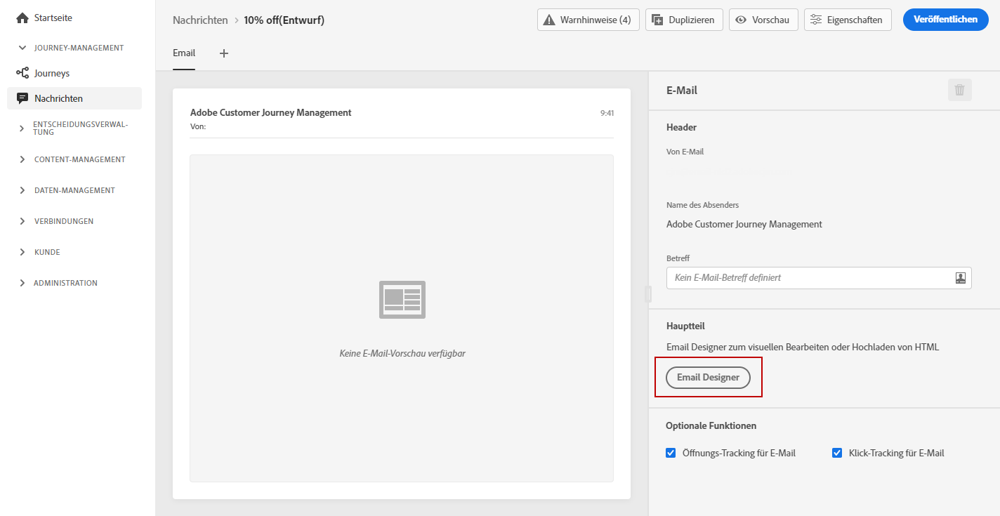
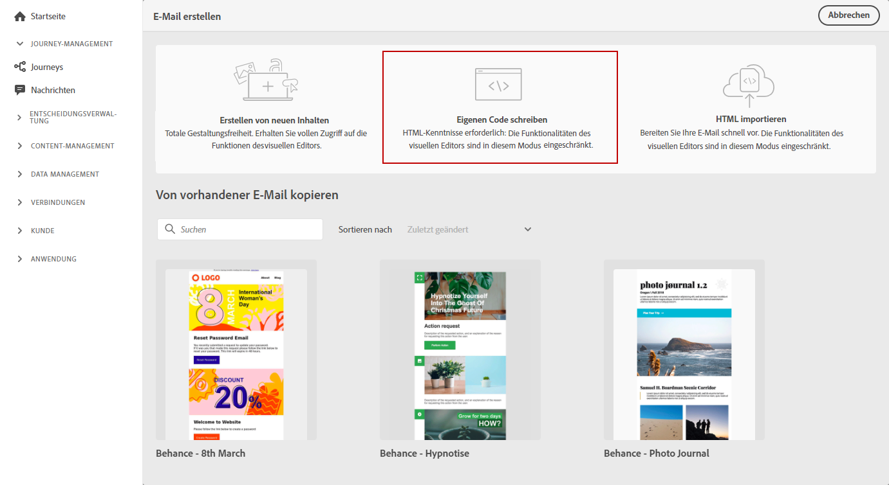
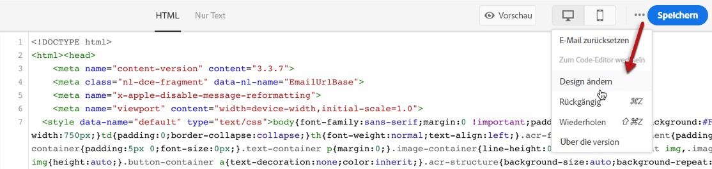
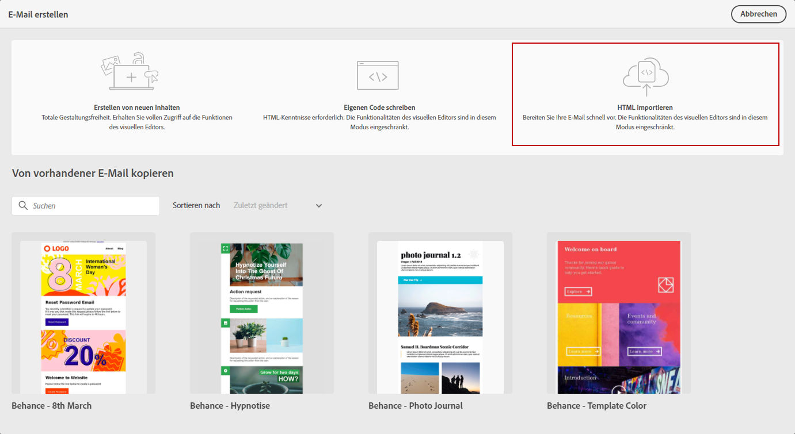

# Importieren oder Code Ihres E-Mail-Inhalts {#existing-content}

Mit Journey Optimizer können Sie vorhandene HTML-Inhalte importieren, um Ihre E-Mails zu gestalten. Bei diesem Inhalt kann es sich um HTML-Rohcode oder -Inhalt aus einer vorhandenen HTML-Datei oder einem ZIP-Ordner handeln.

Gehen Sie wie folgt vor, um HTML-Inhalte zu kodieren oder vorhandenen Inhalt zu importieren:

1. [Nachricht erstellen](create-message.md)

1. Öffnen Sie den **[!UICONTROL E-Mail-Designer]** im Abschnitt **[!UICONTROL Inhalt bearbeiten]**.

   

1. Wählen Sie **[!UICONTROL Eigenen Code]** oder **[!UICONTROL HTML]** importieren. Die nächsten Schritte finden Sie in den folgenden Abschnitten.

## Code Ihres eigenen {#import-raw-html-code}

Verwenden Sie den Modus **[!UICONTROL Code your own]**, um HTML-Rohdaten zu importieren und/oder Ihre E-Mail-Inhalte zu kodieren. Diese Methode erfordert HTML-Fertigkeiten.

>[!CAUTION]
>
> Bilder von [Adobe Experience Manager Assets Essentials](assets-essentials.md) können bei dieser Methode nicht referenziert werden. Die Bilder, auf die im HTML-Code verwiesen wird, müssen an einem öffentlichen Speicherort gespeichert werden.

1. Wählen Sie in der Startseite &quot;E-Mail-Designer&quot;die Option **[!UICONTROL Eigenen Code]**.

   

1. Geben Sie Ihren HTML-Rohcode ein oder fügen Sie ihn ein.

1. Verwenden Sie den linken Bereich, um die Personalisierungsfunktionen von [!DNL Journey Optimizer] zu nutzen. Weiterführende Informationen hierzu finden Sie in [diesem Abschnitt](personalization/personalize.md).

   

1. Wenn Sie den E-Mail-Designer öffnen möchten, um Ihre E-Mail von einem neuen Entwurf aus Beginn, wählen Sie **[!UICONTROL Entwurf ändern]** aus dem Menü &quot;Optionen&quot;.

   

1. Klicken Sie auf die Schaltfläche **[!UICONTROL Vorschau]**, um den Nachrichtenentwurf und die Personalisierung mithilfe von Test-Profilen zu überprüfen. Weiterführende Informationen hierzu finden Sie in [diesem Abschnitt](preview.md).

   

1. Sobald Ihr Code fertig ist, klicken Sie auf **[!UICONTROL Speichern]** und gehen Sie dann zurück zum Bildschirm &quot;Meldungserstellung&quot;, um die Nachricht fertigzustellen.

   

## HTML {#import-html-content-from-file} importieren

Sie können HTML-Inhalte im E-Mail-Designer importieren. Dieser Inhalt kann:

* Eine **HTML-Datei** mit einem integrierten Stylesheet
* Ein **.zip-Ordner** mit der HTML-Datei, dem Stylesheet (.css) und Bildern.

   >[!NOTE]
   >
   >Die ZIP-Dateistruktur unterliegt keinen Einschränkungen. Verweise müssen jedoch relativ sein und mit der Baumstruktur des ZIP-Ordners übereinstimmen.

Gehen Sie wie folgt vor, um eine Datei zu importieren, die HTML-Inhalte enthält:

1. Wählen Sie in der Startseite &quot;E-Mail-Designer&quot;die Option **[!UICONTROL HTML]** importieren.

   

1. Ziehen Sie die HTML- oder ZIP-Datei mit Ihrem HTML-Inhalt per Drag &amp; Drop.

1. Sobald der HTML-Inhalt hochgeladen wurde, können Sie die E-Mail-Designer-Funktionen nutzen, um Ihre E-Mail zu bearbeiten und Vorschauen zu erstellen. [Weiterführende Informationen finden Sie in diesem Abschnitt](create-email-content.md).

   
