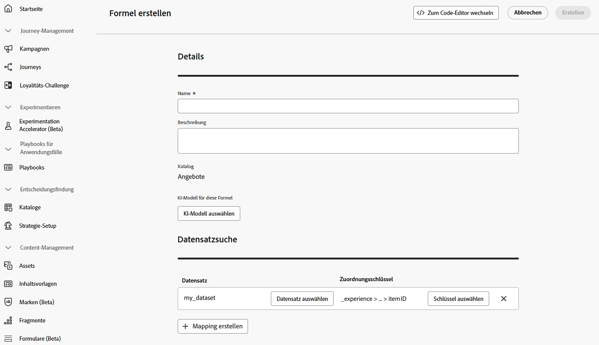

# Verwenden von Adobe Experience Platform-Daten für die Entscheidungsfindung {#aep-data}

>[!CONTEXTUALHELP]
>id="ajo_exd_rules_dataset_lookup"
>title="Datensatzsuche"
>abstract="Durch die Verwendung von Adobe Experience Platform-Daten in Entscheidungsregeln können Sie Eignungskriterien definieren, die auf dynamischen, externen Attributen basieren, sodass Entscheidungselemente nur angezeigt werden, wenn sie relevant sind. Erstellen Sie eine Zuordnung, um festzulegen, wie der Adobe Experience Platform-Datensatz mit Daten in [!DNL Journey Optimizer] verbunden wird. Wählen Sie den Datensatz mit den erforderlichen Attributen und einen Verbindungsschlüssel aus, der sowohl in den Attributen des Entscheidungselements als auch im Datensatz vorhanden ist."

>[!CONTEXTUALHELP]
>id="ajo_exd_formula_dataset_lookup"
>title="Datensatzsuche"
>abstract="Rangfolgenformeln definieren die Priorität von Entscheidungselementen. Durch Verwendung von Datensatzattributen aus [!DNL Adobe Experience Platform] können Sie die Rangfolgelogik dynamisch anpassen, um reale Bedingungen widerzuspiegeln. Erstellen Sie eine Zuordnung, um festzulegen, wie der Adobe Experience Platform-Datensatz mit Daten in [!DNL Journey Optimizer] verbunden wird. Wählen Sie den Datensatz mit den erforderlichen Attributen und einen Verbindungsschlüssel aus, der sowohl in den Attributen des Entscheidungselements als auch im Datensatz vorhanden ist."

>[!AVAILABILITY]
>
>Diese Funktion steht derzeit allen Kundinnen und Kunden als öffentliche Beta-Version zur Verfügung. Wenden Sie sich an Ihren Kontakt in der Kundenbetreuung, wenn Sie Zugriff wünschen.

[!DNL Journey Optimizer] ermöglicht die Nutzung von [!DNL Adobe Experience Platform]-Daten für die Entscheidungsfindung. Auf diese Weise können Sie die Definition Ihrer Entscheidungsattribute auf zusätzliche Daten in Datensätzen für Massenaktualisierungen erweitern, die sich regelmäßig ändern, sodass die Attribute nicht einzeln manuell aktualisiert werden müssen. Beispielsweise Verfügbarkeit, Wartezeiten usw.

## Einschränkungen und Richtlinien der Beta-Version {#guidelines}

Bevor Sie beginnen, beachten Sie die folgenden Einschränkungen und Richtlinien:

* Eine Entscheidungsrichtlinie kann für alle Entscheidungsregeln und Rangfolgenformeln zusammen auf bis zu drei Datensätze insgesamt verweisen. Wenn Ihre Regeln beispielsweise zwei Datensätze verwenden, können Ihre Formeln nur einen zusätzlichen Datensatz verwenden.
* Eine Entscheidungsregel kann drei Datensätze verwenden.
* Eine Rangfolgenformel kann drei Datensätze verwenden.
* Wenn eine Entscheidungsrichtlinie ausgewertet wird, führt das System insgesamt bis zu 1.000 Datensatzabfragen (Suchen) durch. Jede von einem Entscheidungselement verwendete Datensatzzuordnung zählt als eine Abfrage. Wenn beispielsweise ein Entscheidungselement zwei Datensätze verwendet, zählt die Auswertung dieses Angebots als zwei Abfragen hinsichtlich des Limits von 1.000 Abfragen.

## Aktivieren eines Datensatzes für Datensuchen {#enable}

Um Daten aus einem [!DNL Adobe Experience Platform]-Datensatz für die Entscheidungsfindung zu verwenden, müssen Sie ihn zunächst über einen API-Aufruf für die Suche aktivieren. Detaillierte Anweisungen finden Sie in diesem Abschnitt: [Nutzen von Adobe Experience Platform-Datensätzen in Journey Optimizer](../data/lookup-aep-data.md).

## Nutzen von Adobe Experience Platform-Daten {#leverage-aep-data}

Sobald ein Datensatz für die Suche aktiviert ist, können Sie seine Attribute verwenden, um Ihre Entscheidungslogik mit externen Daten anzureichern. Dies ist besonders nützlich bei Attributen, die sich häufig ändern, beispielsweise die Produktverfügbarkeit oder Echtzeitpreise.

Attribute aus Adobe Experience Platform-Datensätzen können in zwei Teilen der Entscheidungslogik verwendet werden:

* **Entscheidungsregeln**: Definieren, ob ein Entscheidungselement angezeigt werden kann.
* **Rangfolgenformeln**: Priorisieren Entscheidungselemente basierend auf externen Daten.

In den nächsten Abschnitten wird erläutert, wie Sie Adobe Experience Platform-Daten in beiden Kontexten verwenden.

### Entscheidungsregeln {#rules}

Durch die Verwendung von Adobe Experience Platform-Daten in Entscheidungsregeln können Sie Eignungskriterien definieren, die auf dynamischen, externen Attributen basieren, sodass Entscheidungselemente nur angezeigt werden, wenn sie relevant sind.

Nehmen wir beispielsweise an, ein Online-Einzelhändler möchte Produktempfehlungen auf der Grundlage des lokalen Ladenbestands bewerben. Ein Produkt sollte nur dann für eine Empfehlung infrage kommen, wenn es am nächstgelegenen Standort vorrätig ist. Ein Datensatz mit täglichen Inventaraktualisierungen wird in Adobe Experience Platform hochgeladen. Die Regellogik prüft, ob `inventory_count` für ein bestimmtes Produkt am bevorzugten Standort der Kundin bzw. des Kunden größer als 0 ist. Wenn dies der Fall ist, ist das Entscheidungselement geeignet.

Gehen Sie wie folgt vor, um Adobe Experience Platform-Daten in Entscheidungsregeln zu verwenden:

1. Navigieren Sie zum Menü **[!UICONTROL Strategie-Setup]**/**[!UICONTROL Entscheidungsregeln]** und wählen Sie **[!UICONTROL Regel mit Datensatz erstellen]** aus.

   

1. Klicken Sie auf **[!UICONTROL Zuordnung erstellen]**, um zu definieren, wie der Adobe Experience Platform-Datensatz mit Daten in [!DNL Journey Optimizer] verbunden wird. 

   * Wählen Sie den Datensatz mit den benötigten Attributen aus.
   * Wählen Sie einen Verbindungsschlüssel aus (z. B. Produkt-ID oder Store-ID), der sowohl in den Attributen des Entscheidungselements als auch im Datensatz vorhanden ist.

   

   >[!NOTE]
   >
   >Sie können bis zu drei Zuordnungen pro Regel erstellen.

1. Klicken Sie auf **[!UICONTROL Fortfahren]**. Sie können jetzt im Menü **[!UICONTROL Datensatzsuche]** auf die Datensatzattribute zugreifen und sie in Ihren Regelbedingungen verwenden. [Erfahren Sie, wie Sie eine Entscheidungsregel erstellen können](../experience-decisioning/rules.md#create).

   

### Rangfolgenformeln {#ranking-formulas}

Rangfolgenformeln definieren die Priorität von Entscheidungselementen. Durch Verwendung von Datensatzattributen aus [!DNL Adobe Experience Platform] können Sie die Rangfolgelogik dynamisch anpassen, um reale Bedingungen widerzuspiegeln. 

Nehmen wir beispielsweise an, eine Fluggesellschaft verwendet eine Rangfolgenformel, um Upgrade-Angebote zu priorisieren. Wenn eine Kundin bzw. ein Kunde über eine hohe Treuestufe verfügt und die aktuelle Verfügbarkeit von Sitzplätzen niedrig ist (basierend auf einem Datensatz, der stündlich aktualisiert wird), erhält die Person eine höhere Priorität. Der Datensatz enthält Felder wie `flight_number`, `available_seats` und `loyalty_score`.

Gehen Sie wie folgt vor, um Adobe Experience Platform-Daten in Rangfolgenformeln zu verwenden:

1. Erstellen oder bearbeiten Sie eine Rangfolgenformel. Klicken Sie im Abschnitt **[!UICONTROL Datensatzsuche]** auf **[!UICONTROL Zuordnung erstellen]**.

1. Definieren Sie die Datensatz-Zuordnung:

   * Wählen Sie den entsprechenden Datensatz aus (z. B. Sitzplatzverfügbarkeit nach Flug).
   * Wählen Sie einen Verbindungsschlüssel aus (z. B. Flugnummer oder Kunden-ID), der sowohl in den Attributen des Entscheidungselements als auch im Datensatz vorhanden ist.

   

   >[!NOTE]
   >
   >Sie können bis zu drei Zuordnungen pro Rangfolgenformel erstellen.

1. Verwenden Sie die Datensatzfelder, um Ihre Rangfolgenformel wie gewohnt zu erstellen. [Weitere Informationen zum Erstellen einer Rangfolgenformel](ranking/ranking-formulas.md#create-ranking-formula)

   
