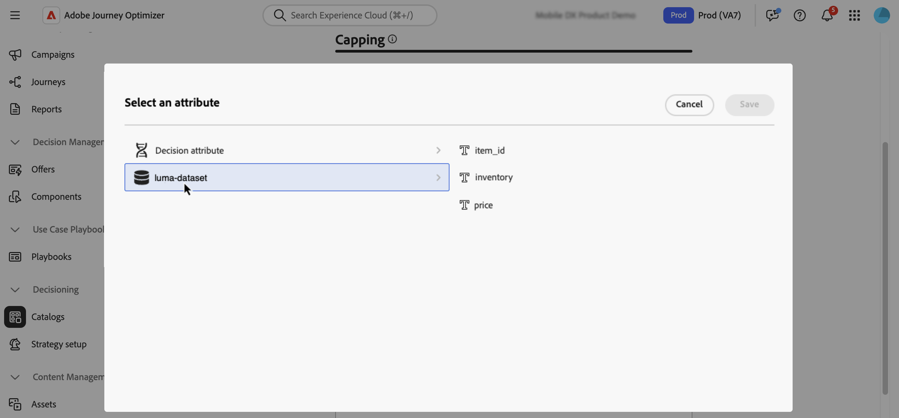

# Verwenden von Adobe Experience Platform-Daten für die Entscheidungsfindung {#aep-data}

>[!CONTEXTUALHELP]
>id="ajo_exd_catalogs_dataset"
>title="Datensatzsuche"
>abstract=In order to use attributes from Adobe Experience Platform for decisioning, you need to create a mapping to define how the Adobe Experience Platform dataset joins with data in [!DNL Journey Optimizer].”

>[!CONTEXTUALHELP]
>id="ajo_exd_catalogs_dataset_create"
>title="Datensatzsuche"
>abstract="Wählen Sie unter allen Adobe Experience Platform-Datensätzen, die für die Suche aktiviert wurden, den Datensatz mit den benötigten Attributen aus und wählen Sie dann einen Zuordnungsschlüssel (z. B. Flugnummer oder Kunden-ID) aus, der sowohl in den Entscheidungselementattributen als auch im Datensatz vorhanden ist.“"

>[!CONTEXTUALHELP]
>id="ajo_exd_rules_dataset_lookup"
>title="Datensatzsuche"
>abstract="Wählen Sie den Adobe Experience Platform-Datensatz mit den benötigten Attributen aus. Wenn der Datensatz nicht in der Liste angezeigt wird, stellen Sie sicher, dass Sie ihn für die Suche aktiviert haben und eine Datensatz-Suchzuordnung erstellt haben."

>[!CONTEXTUALHELP]
>id="ajo_exd_formula_dataset_lookup"
>title="Datensatzsuche"
>abstract="Verwenden Sie [!DNL Adobe Experience Platform] Datensatzattribute, um die Rangfolgelogik dynamisch anzupassen und damit reale Bedingungen widerzuspiegeln. Klicken Sie **[!UICONTROL Datensatz hinzufügen]**, um den Adobe Experience Platform-Datensatz mit den benötigten Attributen auszuwählen. Wenn der Datensatz nicht in der Liste angezeigt wird, stellen Sie sicher, dass Sie ihn für die Suche aktiviert haben und eine Datensatz-Suchzuordnung erstellt haben."

>[!CONTEXTUALHELP]
>id="ajo_exd_item_capping_dataset"
>title="Datensatz hinzufügen“"
>abstract="Verwenden Sie [!DNL Adobe Experience Platform] Datensatzattribute, um Begrenzungskriterien zu definieren, die auf dynamischen, externen Attributen basieren. Klicken Sie **[!UICONTROL Datensatz hinzufügen]**, um den Adobe Experience Platform-Datensatz mit den benötigten Attributen auszuwählen. Wenn der Datensatz nicht in der Liste angezeigt wird, stellen Sie sicher, dass Sie ihn für die Suche aktiviert haben und eine Datensatz-Suchzuordnung erstellt haben.“"

>[!AVAILABILITY]
>
>Diese Funktion steht derzeit allen Kunden als eingeschränkte Verfügbarkeitsversion zur Verfügung.

[!DNL Journey Optimizer] ermöglicht die Nutzung von [!DNL Adobe Experience Platform]-Daten für die Entscheidungsfindung. Auf diese Weise können Sie die Definition Ihrer Entscheidungsattribute auf zusätzliche Daten in Datensätzen für Massenaktualisierungen erweitern, die sich regelmäßig ändern, sodass die Attribute nicht einzeln manuell aktualisiert werden müssen. Beispielsweise Verfügbarkeit, Wartezeiten usw.

>[!IMPORTANT]
>
>[!DNL Journey Optimizer]Unterstützt bis zu 1.000 Suchen für eine einzelne Entscheidungsrichtlinie.

## Voraussetzungen

### Aktivieren von Datensätzen für die Suche

Bevor Sie beginnen, müssen für die Entscheidungsfindung erforderliche Datensätze zunächst für die Suche aktiviert werden. Führen Sie die in diesem Abschnitt beschriebenen Schritte aus: [Verwenden von Adobe Experience Platform-Daten](../data/lookup-aep-data.md).

### Erstellen von Zuordnungen

Um Attribute aus Adobe Experience Platform für die Entscheidungsfindung zu verwenden, müssen Sie eine Zuordnung erstellen, um zu definieren, wie der Adobe Experience Platform-Datensatz mit Daten in [!DNL Journey Optimizer] verbunden wird. Gehen Sie dazu wie folgt vor:

1. Navigieren Sie zu **[!UICONTROL Kataloge]** / **[!UICONTROL Datensatzsuche]** und klicken Sie dann auf **[!UICONTROL Erstellen]**.

   

1. Konfigurieren Sie die Zuordnung:

   1. Klicken Sie **[!UICONTROL Datensatz auswählen]**, um alle Adobe Experience Platform-Datensätze anzuzeigen, die für die Suche aktiviert wurden. Wählen Sie den Datensatz mit den benötigten Attributen aus.

   1. Klicken Sie **[!UICONTROL Schlüssel auswählen]**, um einen Verbindungsschlüssel (z. B. Flugnummer oder Kunden-ID) auszuwählen, der sowohl in den Attributen des Entscheidungselements als auch im Datensatz vorhanden ist.

   

1. Klicken Sie auf **[!UICONTROL Speichern]**.

## Nutzen von Adobe Experience Platform-Daten {#leverage-aep-data}

Sobald ein Datensatz für die Suche aktiviert ist und Zuordnungen erstellt wurden, können Sie die Daten verwenden, um Ihre Entscheidungslogik mit externen Daten anzureichern. Dies ist besonders nützlich bei Attributen, die sich häufig ändern, beispielsweise die Produktverfügbarkeit oder Echtzeitpreise.

Attribute aus Adobe Experience Platform-Datensätzen können in zwei Teilen der Entscheidungslogik verwendet werden:

* **Entscheidungsregeln**: Definieren, ob ein Entscheidungselement angezeigt werden kann.
* **Rangfolgenformeln**: Priorisieren Entscheidungselemente basierend auf externen Daten.
* **Begrenzungsregeln**: Verwenden Sie externe Daten, um den Schwellenwert für Begrenzungsregeln zu berechnen.

In den nächsten Abschnitten wird erläutert, wie Sie Adobe Experience Platform-Daten in diesen Kontexten verwenden.

### Entscheidungsregeln {#rules}

Durch die Verwendung von Adobe Experience Platform-Daten in Entscheidungsregeln können Sie Eignungskriterien definieren, die auf dynamischen, externen Attributen basieren, sodass Entscheidungselemente nur angezeigt werden, wenn sie relevant sind.

Nehmen wir beispielsweise an, ein Online-Einzelhändler möchte Produktempfehlungen auf der Grundlage des lokalen Ladenbestands bewerben. Ein Produkt sollte nur dann für eine Empfehlung infrage kommen, wenn es am nächstgelegenen Standort vorrätig ist. Ein Datensatz mit täglichen Inventaraktualisierungen wird in Adobe Experience Platform hochgeladen. Die Regellogik prüft, ob `inventory_count` für ein bestimmtes Produkt am bevorzugten Standort der Kundin bzw. des Kunden größer als 0 ist. Wenn dies der Fall ist, ist das Entscheidungselement geeignet.

Gehen Sie wie folgt vor, um Adobe Experience Platform-Daten in Entscheidungsregeln zu verwenden:

1. Navigieren Sie zum Menü **[!UICONTROL Strategie-Setup]**/**[!UICONTROL Entscheidungsregeln]** und wählen Sie **[!UICONTROL Regel mit Datensatz erstellen]** aus.

   

1. Klicken Sie **[!UICONTROL Datensatz hinzufügen]** und wählen Sie dann den Datensatz mit den benötigten Attributen aus.

   

1. Klicken Sie auf **[!UICONTROL Fortfahren]**. Sie können jetzt im Menü **[!UICONTROL Datensatzsuche]** auf die Datensatzattribute zugreifen und sie in Ihren Regelbedingungen verwenden. [Erfahren Sie, wie Sie eine Entscheidungsregel erstellen können](../experience-decisioning/rules.md#create).

   

### Rangfolgenformeln {#ranking-formulas}

Rangfolgenformeln definieren die Priorität von Entscheidungselementen. Durch Verwendung von Datensatzattributen aus [!DNL Adobe Experience Platform] können Sie die Rangfolgelogik dynamisch anpassen, um reale Bedingungen widerzuspiegeln. 

Nehmen wir beispielsweise an, eine Fluggesellschaft verwendet eine Rangfolgenformel, um Upgrade-Angebote zu priorisieren. Wenn eine Kundin bzw. ein Kunde über eine hohe Treuestufe verfügt und die aktuelle Verfügbarkeit von Sitzplätzen niedrig ist (basierend auf einem Datensatz, der stündlich aktualisiert wird), erhält die Person eine höhere Priorität. Der Datensatz enthält Felder wie `flight_number`, `available_seats` und `loyalty_score`.

Gehen Sie wie folgt vor, um Adobe Experience Platform-Daten in Rangfolgenformeln zu verwenden:

1. Rangfolgenformel erstellen oder bearbeiten

1. Klicken **[!UICONTROL Abschnitt „Datensatzsuche]** auf **[!UICONTROL Datensatz hinzufügen]**.

1. Wählen Sie den entsprechenden Datensatz aus.

   

   >[!NOTE]
   >
   >Wenn der gesuchte Datensatz nicht in der Liste angezeigt wird, stellen Sie sicher, dass Sie ihn für die Suche aktiviert haben und eine Datensatz-Suchzuordnung erstellt haben. Weitere Informationen finden Sie im Abschnitt [Voraussetzungen](#prerequisites).

1. Verwenden Sie die Datensatzfelder, um Ihre Rangfolgenformel wie gewohnt zu erstellen. [Weitere Informationen zum Erstellen einer Rangfolgenformel](ranking/ranking-formulas.md#create-ranking-formula)

   

### Begrenzungsregeln {#capping-rules}

Begrenzungsregeln dienen als Begrenzungen, um festzulegen, wie oft ein Entscheidungselement maximal angezeigt werden kann. Durch die Verwendung von Adobe Experience Platform-Daten in Begrenzungsregeln können Sie Begrenzungskriterien definieren, die auf dynamischen, externen Attributen basieren. Verwenden Sie dazu einen Ausdruck in Ihrer Begrenzungsregel, um den gewünschten Begrenzungsschwellenwert zu berechnen.

Beispielsweise kann eine retailer ein Angebot auf der Grundlage des Echtzeit-Produktinventars begrenzen. Anstatt einen festen Schwellenwert von 500 festzulegen, verwenden sie einen Ausdruck, der aus einem Adobe Experience Platform-Datensatz auf das `inventory_count` verweist. Wenn der Datensatz zeigt, dass 275 Artikel noch auf Lager sind, wird das Angebot nur bis zu dieser Anzahl zugestellt.

>[!NOTE]
>
>Begrenzungsregeln **Ausdrücke** sind derzeit für alle Benutzer als Funktion mit begrenzter Verfügbarkeit verfügbar und werden nur für den Begrenzungstyp **[!UICONTROL Insgesamt]** unterstützt.

Gehen Sie wie folgt vor, um Adobe Experience Platform-Daten in Begrenzungsregelausdrücke einzubeziehen:

1. Erstellen oder bearbeiten Sie ein Entscheidungselement.

1. Klicken Sie beim Definieren der Elementeignung auf **[!UICONTROL Datensatz hinzufügen]** und wählen Sie den entsprechenden Datensatz aus.

   

   >[!NOTE]
   >
   >Wenn der gesuchte Datensatz nicht in der Liste angezeigt wird, stellen Sie sicher, dass Sie ihn für die Suche aktiviert haben und eine Datensatz-Suchzuordnung erstellt haben. Weitere Informationen finden Sie im Abschnitt [Voraussetzungen](#prerequisites).

1. Wählen Sie den Begrenzungstyp **[!UICONTROL Insgesamt]** und aktivieren Sie dann die Option **[!UICONTROL Ausdruck]**.

   

   >[!NOTE]
   >
   >Wenn der gesuchte Datensatz nicht in der Liste angezeigt wird, stellen Sie sicher, dass Sie ihn für die Suche aktiviert haben und eine Datensatz-Suchzuordnung erstellt haben. Weitere Informationen finden Sie im Abschnitt [Voraussetzungen](#prerequisites).

1. Bearbeiten Sie den Ausdruck und verwenden Sie die Datensatzfelder, um Ihren Ausdruck zu erstellen.

   

1. Schließen Sie die Konfiguration Ihres Begrenzungs- und Entscheidungsregelelements wie gewohnt ab. [Erfahren Sie, wie Sie Begrenzungsregeln festlegen](../experience-decisioning/items.md#capping)
