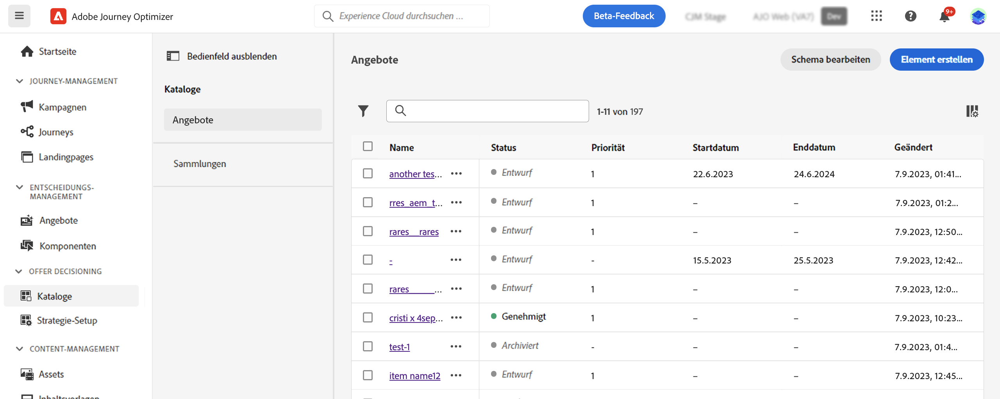
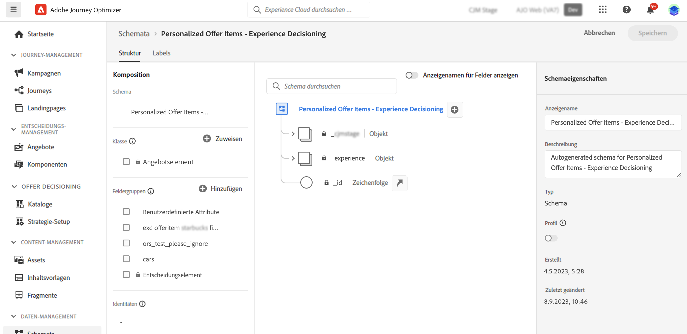

# Artikelkatalog {#catalog}

>[!BEGINSHADEBOX]

Inhalt dieses Dokumentationshandbuchs:

* [Erste Schritte mit Experience Decisioning](gs-experience-decisioning.md)
* Verwalten von Entscheidungselementen
   * **[Konfigurieren des Elementkatalogs](catalogs.md)**
   * [Erstellen von Entscheidungselementen](items.md)
   * [Verwalten von Elementsammlungen](collections.md)
* Elementauswahl konfigurieren
   * [Erstellen von Entscheidungsregeln](rules.md)
   * [Erstellen von Ranking-Methoden](ranking.md)
* [Erstellen von Auswahlstrategien](selection-strategies.md)
* [Entscheidungsrichtlinien erstellen](create-decision.md)

>[!ENDSHADEBOX]

In Experience Decisioning dienen Kataloge als zentrale Container für die Organisation von Entscheidungselementen. Jeder Katalog ist mit einem Adobe Experience Platform-Schema verknüpft, das alle Attribute umfasst, die einem Entscheidungselement zugeordnet werden können.

Zunächst werden alle erstellten Entscheidungselemente in einem einzigen &quot;Angebote&quot;-Katalog konsolidiert, auf den über die **[!UICONTROL Elemente]** Menü.

Gehen Sie wie folgt vor, um auf das Schema des Katalogs zuzugreifen, in dem die Attribute der Entscheidungselemente gespeichert werden:

1. Klicken Sie in der Elementliste auf die **[!UICONTROL Schema bearbeiten]** Schaltfläche neben **[!UICONTROL Element erstellen]** Schaltfläche.

1. Das Schema des Katalogs wird in einer neuen Registerkarte geöffnet, die der unten stehenden Struktur folgt:

   * Die **`_experience`** -Knoten enthält standardmäßige Entscheidungselementattribute wie Name, Start- und Enddatum sowie Beschreibung.
   * Die **`_<imsOrg>`** -Knoten enthält benutzerdefinierte Entscheidungselemente. Standardmäßig sind keine benutzerdefinierten Attribute konfiguriert. Sie können jedoch beliebig viele hinzufügen. Danach werden benutzerdefinierte Attribute auf dem Bildschirm zur Entscheidungselement-Erstellung neben den Standardattributen angezeigt.

   

1. Um dem Schema ein benutzerdefiniertes Attribut hinzuzufügen, erweitern Sie die **`_<imsOrg>`** und klicken Sie auf die Schaltfläche &quot;+&quot;an der gewünschten Position in der Struktur.

   

1. Füllen Sie die erforderlichen Felder für das hinzugefügte Attribut aus und klicken Sie auf **[!UICONTROL Anwenden]**.

   >[!CAUTION]
   >
   >Derzeit unterstützt Experience Decisioning ausschließlich die unten aufgeführten Datentypen. Felder, die nicht zu diesen Datentypen gehören, stehen beim Erstellen eines Entscheidungselements nicht zur Verwendung zur Verfügung.
   >* Zeichenfolge
   >* Boolesch
   >* Zahl

   Detaillierte Informationen zum Arbeiten mit Adobe Experience Platform-Schemata finden Sie im Abschnitt [XDM-Systemdokumentation](https://experienceleague.adobe.com/docs/experience-platform/xdm/ui/overview.html?lang=de).

1. Nachdem Sie die gewünschten benutzerdefinierten Attribute hinzugefügt haben, speichern Sie das Schema. Das neue Feld ist jetzt im Bildschirm zur Elementerstellung im **[!UICONTROL Benutzerdefinierte Attribute]** Abschnitt.
