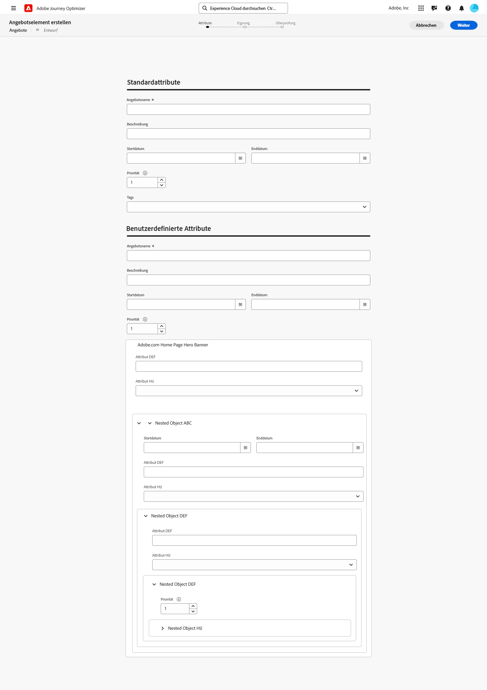

# Konfigurieren des Elementkatalogs {#catalog}

>[!CONTEXTUALHELP]
>id="ajo_exd_item_custom_attributes"
>title="Definieren der benutzerdefinierten Attribute"
>abstract="Benutzerdefinierte Attribute sind spezifische Attribute, die auf Ihre Anforderungen zugeschnitten sind und die Sie einem Entscheidungselement zuweisen können. Sie werden im Katalogschema der Entscheidungselemente erstellt."

Bei der Entscheidungsfindung dienen Kataloge als zentrale Container für die Organisation von Entscheidungselementen. Jeder Katalog ist mit einem Adobe Experience Platform-Schema verknüpft, das alle Attribute umfasst, die einem Entscheidungselement zugeordnet werden können.

Zunächst werden alle erstellten Entscheidungselemente in einem einzigen Katalog „Angebote“ konsolidiert, auf den über das Menü **[!UICONTROL Kataloge]** zugegriffen werden kann.

## Leitlinien und Einschränkungen

Um eine optimale Leistung und Konsistenz sicherzustellen, werden bei der Entscheidungsfindung die folgenden Leitlinien und Einschränkungen durchgesetzt:

* **Unterstützte Datentypen**

  Derzeit unterstützt die Entscheidungsfindung ausschließlich die folgenden Datentypen: String, Integer, Boolean, Date, DateTime, Decisioning Asset und Object. Felder, die keinen dieser Datentypen besitzen, können beim Erstellen eines Entscheidungselements oder eines Katalogs nicht verwendet werden.

* **Benutzerdefinierte Attributbegrenzung**

  Jedes Entscheidungselement kann bis zu 100 benutzerdefinierte Attribute enthalten.

* **Verschachtelungsbeschränkungen**

  Es werden maximal vier Verschachtelungsebenen unterstützt. Bilder werden auf der letzten Ebene nicht unterstützt.

## Abrufen und Bearbeiten des Katalogschemas {#access-catalog-schema}

Gehen Sie folgendermaßen vor, um auf das Schema des Katalogs zuzugreifen, in dem die Attribute der Entscheidungselemente gespeichert werden:

1. Klicken Sie in der Elementliste auf die Schaltfläche **[!UICONTROL Schema bearbeiten]**, die sich neben der Schaltfläche **[!UICONTROL Element erstellen]** befindet.

1. Das Schema des Katalogs wird in einer neuen Registerkarte geöffnet, die der unten stehenden Struktur folgt:

   * Der **`_experience`**-Knoten enthält standardmäßige Entscheidungselementattribute wie Name, Start- und Enddatum sowie Beschreibung.
   * Der **`_<imsOrg>`**-Knoten enthält benutzerdefinierte Entscheidungselemente. Standardmäßig sind keine benutzerdefinierten Attribute konfiguriert. Es können jedoch beliebig viele hinzugefügt werden. Danach werden benutzerdefinierte Attribute auf dem Erstellungsbildschirm für Entscheidungselement neben den standardmäßigen Attributen angezeigt.

   

1. Um dem Schema ein benutzerdefiniertes Attribut hinzuzufügen, erweitern Sie den Knoten **`_<imsOrg>`** und klicken Sie auf die Schaltfläche „+“ am gewünschten Speicherort in der Struktur.

   

1. Füllen Sie die erforderlichen Felder für das hinzugefügte Attribut aus und klicken Sie auf **[!UICONTROL Anwenden]**.

   Der Wert, der in ein Attribut mit einem Entscheidungs-Asset-Attribut eingegeben wird, ist eine öffentliche URL. In den meisten Fällen würde dies auf ein Bild hinweisen.

   Detaillierte Informationen zum Arbeiten mit Adobe Experience Platform-Schemata sind im Abschnitt [XDM-Systemdokumentation](https://experienceleague.adobe.com/docs/experience-platform/xdm/ui/overview.html?lang=de) zu finden.

1. Sobald die gewünschten benutzerdefinierten Attribute hinzugefügt sind, speichern Sie das Schema. Das neue Feld ist jetzt im Bildschirm zur Erstellung von Entscheidungselementen im Abschnitt **[!UICONTROL Benutzerdefinierte Attribute]** verfügbar.

   Das folgende Beispiel zeigt einen Bildschirm zur Erstellung von Elementen mit benutzerdefinierten Attributen wie Objekten, die im Schema definiert sind.

   

