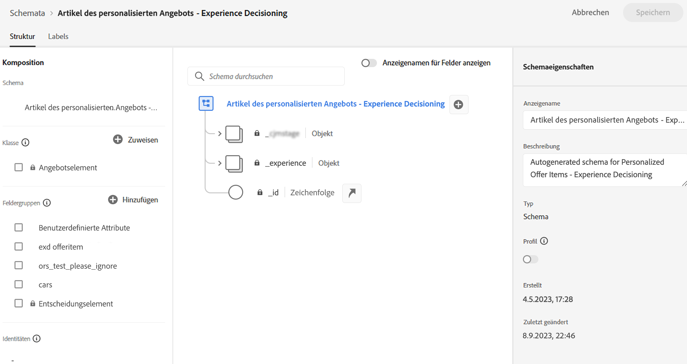
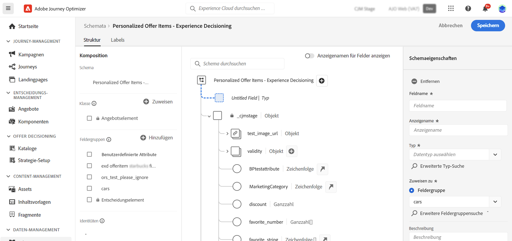

# Artikelkatalog {#catalog}

In Experience Decisioning dienen Kataloge als zentrale Container für die Organisation von Entscheidungselementen. Jeder Katalog ist mit einem Adobe Experience Platform-Schema verknüpft, das alle Attribute umfasst, die einem Entscheidungselement zugeordnet werden können.

Zunächst werden alle erstellten Entscheidungselemente in einem einzigen &quot;Angebote&quot;-Katalog konsolidiert, auf den über die **[!UICONTROL Kataloge]** Menü.

Gehen Sie folgendermaßen vor, um auf das Schema des Katalogs zuzugreifen, in dem die Attribute der Entscheidungselemente gespeichert werden:

1. Klicken Sie in der Elementliste auf die Schaltfläche **[!UICONTROL Schema bearbeiten]**, die sich neben der Schaltfläche **[!UICONTROL Element erstellen]** befindet.

1. Das Schema des Katalogs wird in einer neuen Registerkarte geöffnet, die der unten stehenden Struktur folgt:

   * Der **`_experience`**-Knoten enthält standardmäßige Entscheidungselementattribute wie Name, Start- und Enddatum sowie Beschreibung.
   * Der **`_<imsOrg>`**-Knoten enthält benutzerdefinierte Entscheidungselemente. Standardmäßig sind keine benutzerdefinierten Attribute konfiguriert. Es können jedoch beliebig viele hinzugefügt werden. Danach werden benutzerdefinierte Attribute auf dem Erstellungsbildschirm für Entscheidungselement neben den standardmäßigen Attributen angezeigt.

   

1. Um dem Schema ein benutzerdefiniertes Attribut hinzuzufügen, erweitern Sie den Knoten **`_<imsOrg>`** und klicken Sie auf die Schaltfläche „+“ am gewünschten Speicherort in der Struktur.

   

1. Füllen Sie die erforderlichen Felder für das hinzugefügte Attribut aus und klicken Sie auf **[!UICONTROL Anwenden]**.

   >[!CAUTION]
   >
   >Derzeit unterstützt Experience Decisioning ausschließlich die folgenden Datentypen: String, Integer, Boolesch, Date, DateTime und Decisioning Asset. Felder, die nicht zu diesen Datentypen gehören, stehen beim Verfassen eines Entscheidungselements oder Katalogs nicht zur Verfügung.

   Der Wert, der für ein Attribut mit dem Entscheidungsasset-Attribut eingegeben wird, ist eine öffentliche URL. Meistens würde dies auf ein Bild verweisen.

   Detaillierte Informationen zum Arbeiten mit Adobe Experience Platform-Schemata sind im Abschnitt [XDM-Systemdokumentation](https://experienceleague.adobe.com/docs/experience-platform/xdm/ui/overview.html?lang=de) zu finden.

1. Sobald die gewünschten benutzerdefinierten Attribute hinzugefügt sind, speichern Sie das Schema. Das neue Feld ist jetzt im Erstellungsbildschirm zur Entscheidung für Elemente im Abschnitt **[!UICONTROL Benutzerdefinierte Attribute]** verfügbar.
