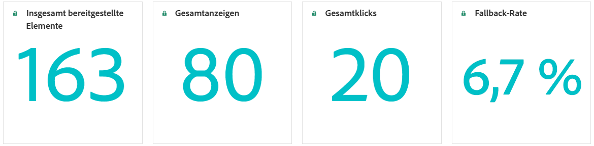

# Berichten über Entscheidungsfindung {#decisioning-report}

## Reporting zur Entscheidungsfindung {#campaigns}

Sobald Journey oder Kampagnen mit Auswahlstrategien verfügbar sind, können Sie auf dedizierte Berichte zugreifen, um KPIs (Decision Key Performance Indicators) zu überwachen.

<!--Once code-based experiences are live, you can access dedicated reports to monitor Key Performance Indicators (KPIs) as an all-encompassing dashboard, delivering an analysis of essential metrics associated with your campaign.

This encompasses details related to the decision items performances and how users interacted with them. [Learn how to work with Code-based experience reports](../reports/campaign-global-report-cja-code.md)-->

Sie können auch auf Details zur Leistung von Entscheidungselementen und zur Art und Weise zugreifen, wie Benutzende mit ihnen interagiert haben, um eine Analyse der wesentlichen Metriken zu erhalten, die mit Ihrer Kampagne verknüpft sind.

In [diesem Abschnitt](../reports/campaign-global-report-cja-code.md#decisioning-reporting) erfahren Sie, wie Sie mit Code-basierten Erlebnisberichten zur Entscheidungsfindung arbeiten.

## Reporting in Customer Journey Analytics {#cja}

Wenn Sie mit Customer Journey Analytics arbeiten, können Sie benutzerdefinierte Reporting-Dashboards für Ihre Code-basierten Kampagnen erstellen, die die Entscheidungsfindung nutzen.

Die wichtigsten Schritte sind unten aufgeführt. Detaillierte Informationen zum Arbeiten mit Customer Journey Analytics finden Sie in der [Dokumentation zu Customer Journey Analytics](https://experienceleague.adobe.com/de/docs/analytics-platform/using/cja-landing){target="_blank"}.

1. Erstellen und konfigurieren Sie eine **Verbindung** in Customer Journey Analytics. So können Sie eine Verbindung zu dem Datensatz herstellen, für den Sie Berichte erstellen möchten. [Informationen zum Erstellen einer Verbindung](https://experienceleague.adobe.com/de/docs/analytics-platform/using/cja-connections/create-connection){target="_blank"}

1. Erstellen Sie eine **Datenansicht** und verknüpfen Sie sie mit der zuvor erstellten Verbindung. Wählen Sie auf der Registerkarte **[!UICONTROL Komponenten]** die entsprechenden Schemafelder aus, die im Reporting angezeigt werden sollen. Stellen Sie sicher, dass Sie für die Entscheidungsfindung die Felder **propositioninteract** und **propositiondisplay** einschließen. [Informationen zum Erstellen und Konfigurieren von Datenansichten](https://experienceleague.adobe.com/de/docs/analytics-platform/using/cja-dataviews/create-dataview){target="_blank"}

1. Kombinieren Sie Datenkomponenten, Tabellen und Visualisierungen in **Workspace-Projekten**, um Berichte für Ihre Code-basierte Kampagne zu erstellen und freizugeben. [Informationen zum Erstellen von Workspace-Projekten](https://experienceleague.adobe.com/de/docs/analytics-platform/using/cja-workspace/build-workspace-project/create-projects){target="_blank"}
