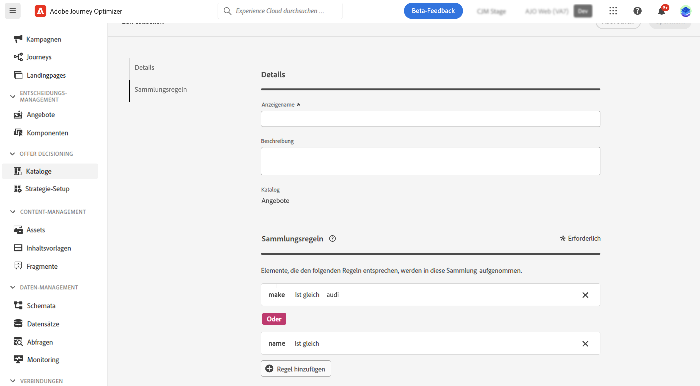

# Sammlungen {#collections}

>[!BEGINSHADEBOX]

Inhalt dieses Dokumentationshandbuchs:

* [Erste Schritte mit Experience Decisioning](gs-experience-decisioning.md)
* Verwalten von Entscheidungselementen
   * [Konfigurieren des Elementkatalogs](catalogs.md)
   * [Erstellen von Entscheidungselementen](items.md)
   * **[Verwalten von Elementsammlungen](collections.md)**
* Elementauswahl konfigurieren
   * [Erstellen von Entscheidungsregeln](rules.md)
   * [Erstellen von Ranking-Methoden](ranking.md)
* [Erstellen von Auswahlstrategien](selection-strategies.md)
* [Entscheidungsrichtlinien erstellen](create-decision.md)

>[!ENDSHADEBOX]

Mit Sammlungen können Sie Ihre Entscheidungselemente nach Ihren Voreinstellungen kategorisieren und gruppieren. Diese Kategorien werden durch Erstellen von Regeln erstellt, die die Attribute von Entscheidungselementen nutzen.

Angenommen, Sie haben dem Katalogschema Ihrer Entscheidungselemente das benutzerdefinierte Attribut &quot;Kategorie&quot;hinzugefügt. Auf diese Weise können Sie eine Sammlung erstellen, die alle Entscheidungselemente mit dem Wert &quot;Yoga&quot;im Attribut &quot;Kategorie&quot;enthält.

Die Liste der Sammlungen kann über die **[!UICONTROL Elemente]** Menü.

Gehen Sie wie folgt vor, um eine Sammlung zu erstellen:

1. Navigieren Sie zu **[!UICONTROL Elemente]** > **[!UICONTROL Sammlungen]** und klicken **[!UICONTROL Sammlung erstellen]**.
1. Geben Sie einen Namen und eine Beschreibung für die Sammlung an.
1. Fügen Sie eine oder mehrere Regeln hinzu, um die Elemente zu bestimmen, die in die Sammlung aufgenommen werden sollen. Gehen Sie dazu folgendermaßen vor:

   1. Wählen Sie ein Elementattribut aus, das als Kriterium verwendet werden soll. Die Attributliste enthält alle im Katalogschema definierten standardmäßigen und benutzerdefinierten Attribute. [Weitere Informationen zum Artikelkatalog](catalogs.md)
   1. Wählen Sie den gewünschten Operator aus und geben Sie den zu filternden Wert ein.
   1. Wiederholen Sie diese Schritte, um so viele Regeln wie nötig hinzuzufügen. Wenn mehrere Regeln hinzugefügt werden, können Sie zwischen der **und** und **Oder** -Operatoren verwenden, um sie zu kombinieren. Klicken Sie dazu auf das Operatorzeichen , um zwischen den beiden Optionen zu wechseln.

   

1. Nachdem die Sammlungsregeln definiert wurden, klicken Sie auf **[!UICONTROL Erstellen]**. Die Sammlung wird nun in der Liste angezeigt.
