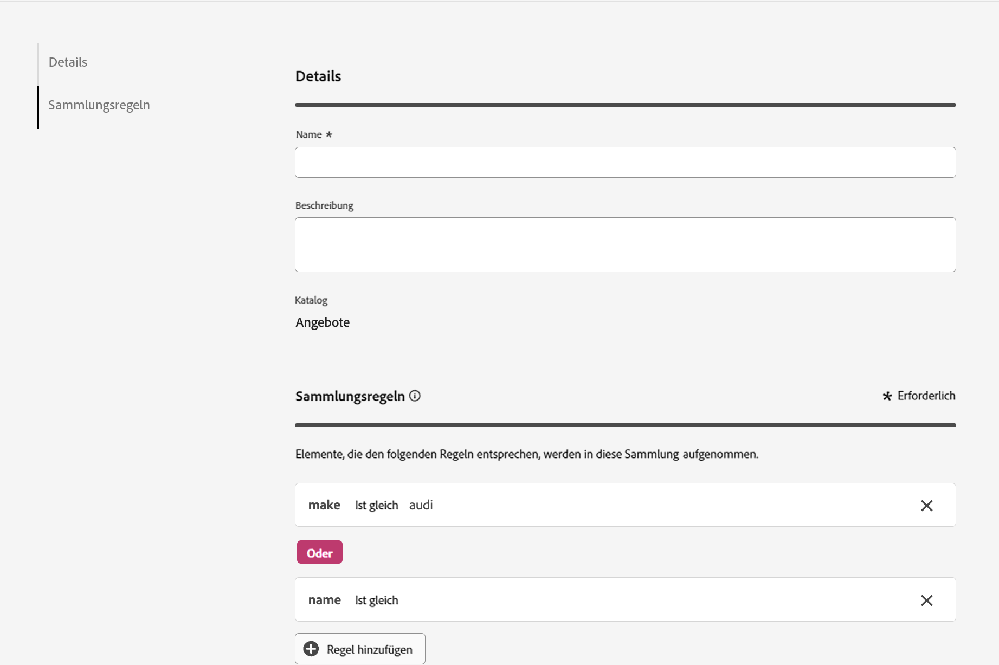

# Sammlungen {#collections}

>[!CONTEXTUALHELP]
>id="ajo_exd_item_collections"
>title="Erstellen von Sammlungen"
>abstract="Mit Sammlungen können Sie Ihre Entscheidungselemente nach Ihren Vorstellungen kategorisieren und gruppieren. Diese Kategorien werden durch das Verfassen von Regeln erstellt, die die Attribute von Entscheidungselementen nutzen."

>[!CONTEXTUALHELP]
>id="ajo_exd_item_collection_rules"
>title="Definieren von Regeln für Ihre Sammlung"
>abstract="Fügen Sie eine oder mehrere Regeln hinzu, um die Elemente zu bestimmen, die in die Sammlung aufgenommen werden sollen. Wählen Sie ein Elementattribut aus, das als Kriterium verwendet werden soll. Wählen Sie den gewünschten Operator aus und geben Sie den Wert ein, nach dem gefiltert werden soll. Fügen Sie so viele Regeln wie nötig hinzu."

>[!CONTEXTUALHELP]
>id="ajo_exd_strategy_collection"
>title="Wählen Sie eine Sammlung aus"
>abstract="Wählen Sie die Sammlung aus, die die zu berücksichtigenden Angebote enthält. Dieser Schritt ist bei der Erstellung einer Auswahlstrategie obligatorisch. Mit Sammlungen können Sie Ihre Entscheidungselemente nach Ihren Vorstellungen kategorisieren und gruppieren. Beispielsweise können Sie eine Sammlung erstellen, die alle Entscheidungselemente mit dem Wert „Yoga“ im benutzerdefinierten Attribut „Kategorie“ enthält."

>[!BEGINSHADEBOX]

Inhalt dieses Dokumentationshandbuchs:

* [Erste Schritte mit Offer Decisioning](gs-experience-decisioning.md)
* Verwalten Ihrer Entscheidungselemente
   * [Konfigurieren des Elementkatalogs](catalogs.md)
   * [Erstellen von Entscheidungselementen](items.md)
   * **[Verwalten von Elementsammlungen](collections.md)**
* Konfigurieren der Elementauswahl
   * [Erstellen von Entscheidungsregeln](rules.md)
   * [Erstellen von Rangfolgemethoden](ranking.md)
* [Erstellen von Auswahlstrategien](selection-strategies.md)
* [Erstellen von Entscheidungsrichtlinien](create-decision.md)

>[!ENDSHADEBOX]

Mit Sammlungen können Sie Ihre Entscheidungselemente nach Ihren Vorstellungen kategorisieren und gruppieren. Diese Kategorien werden durch das Verfassen von Regeln erstellt, die die Attribute von Entscheidungselementen nutzen.

Angenommen, Sie haben dem Katalogschema Ihrer Entscheidungselemente das benutzerdefinierte Attribut „Kategorie“ hinzugefügt. Auf diese Weise können Sie eine Sammlung erstellen, die alle Entscheidungselemente mit dem Wert „Yoga“ im Attribut „Kategorie“ enthält.

Die Liste der Sammlungen ist über das Menü **[!UICONTROL Elemente]** zugänglich.

Gehen Sie wie folgt vor, um eine Sammlung zu erstellen:

1. Navigieren Sie zu **[!UICONTROL Elemente]** > **[!UICONTROL Sammlungen]** und klicken Sie auf **[!UICONTROL Sammlung erstellen]**.
1. Geben Sie einen Namen und eine Beschreibung für die Sammlung ein.
1. Fügen Sie eine oder mehrere Regeln hinzu, um die Elemente zu bestimmen, die in die Sammlung aufgenommen werden sollen. Gehen Sie dazu folgendermaßen vor:

   1. Wählen Sie ein Elementattribut aus, das als Kriterium verwendet werden soll. Die Attributliste enthält alle im Katalogschema definierten standardmäßigen und benutzerdefinierten Attribute. [Weitere Informationen zum Elementkatalog](catalogs.md)
   1. Wählen Sie den gewünschten Operator aus und geben Sie den Wert ein, nach dem gefiltert werden soll.
   1. Wiederholen Sie diese Schritte gegebenenfalls, bis Sie die gewünschte Anzahl an Regeln hinzugefügt haben. Wenn mehrere Regeln hinzugefügt werden, können Sie zwischen den Operatoren **Und** und **Oder** wählen, um die Regeln zu kombinieren. Klicken Sie dazu auf das Operatorzeichen, um zwischen den beiden Optionen zu wechseln.

   

1. Nachdem die Sammlungsregeln definiert wurden, klicken Sie auf **[!UICONTROL Erstellen]**. Die Sammlung wird nun in der Liste angezeigt.
