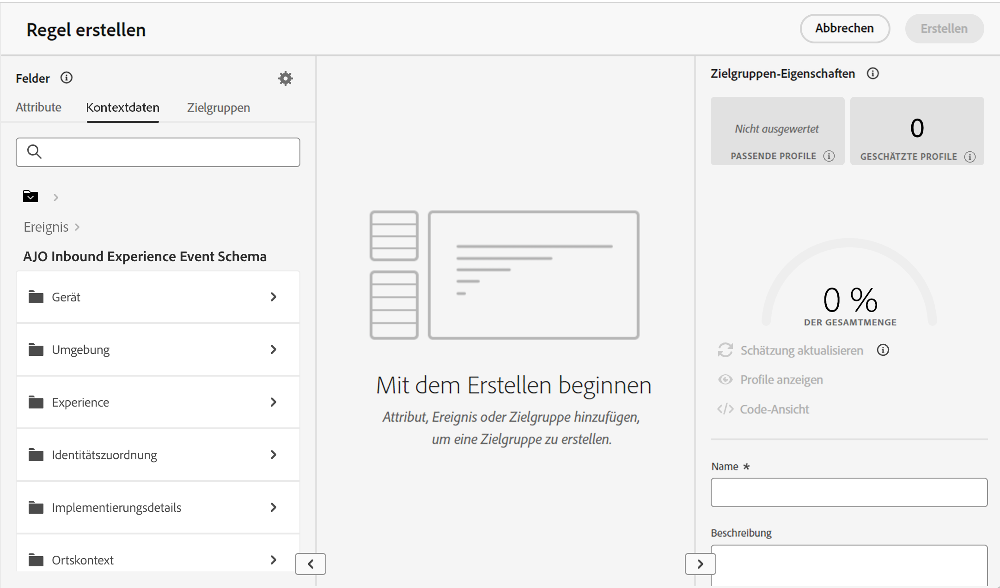

# Nutzung von Kontextdaten in der Erlebnis-Entscheidung {#context}

Mit der Erlebnis-Entscheidung können Sie alle in Adobe Experience Platform verfügbaren Informationen nutzen, um verschiedene Aktionen auszuführen, wie z. B. die Erstellung von [Entscheidungsregeln](rules.md) oder [Rangfolgeformeln](ranking.md). Sie können zum Beispiel eine Entscheidungsregel entwerfen, die verlangt, dass das aktuelle Wetter zum Zeitpunkt der Entscheidungsanfrage  wärmer als 25 °C sein muss.

>[!NOTE]
>
>Kontextdaten werden in Adobe Experience Platform definiert und zum Zeitpunkt einer Entscheidungsanfrage gesendet. Historische Daten werden nicht berücksichtigt.

Für die Verwendung von Kontextdaten müssen Sie zunächst definieren, welche Daten Sie in der Erlebnis-Entscheidung zur Verfügung stellen möchten. Sobald dies geschehen ist, werden diese Daten nahtlos in die Erlebnis-Entscheidung auf der Registerkarte **[!UICONTROL Kontextdaten]** integriert, die beim Erstellen einer Entscheidungsregel verfügbar ist. Sie können die Daten auch bei der Bearbeitung einer Rangfolgeformel nutzen.

Hier erfahren Sie, wie Sie die Erlebnis-Entscheidung mit Daten aus Adobe Experience Platform versorgen können:

1. Erstellen Sie ein **Erlebnisereignis-Schema** in Adobe Experience Platform und den dazugehörigen **Datensatz**. [Lernen Sie, wie man Schemata erstellt](https://experienceleague.adobe.com/de/docs/experience-platform/xdm/ui/resources/schemas){target="_blank"}

1. So erstellen Sie einen neuen Adobe Experience Platform-Datenstrom:

   1. Navigieren Sie zum Menü **[!UICONTROL Datenströme]** und wählen Sie **[!UICONTROL Neuer Datenstrom]**.

   1. Wählen Sie in der Dropdown-Liste **[!UICONTROL Ereignisschema]** das zuvor erstellte Erlebnis-Ereignisschema aus und klicken Sie auf **[!UICONTROL Speichern]**.

      

   1. Klicken Sie auf **[!UICONTROL Dienst hinzufügen]** und wählen Sie „Adobe Experience Platform“ als Dienst. Wählen Sie in der Dropdown-Liste **[!UICONTROL Ereignisdatensatz]** den zuvor erstellten Ereignisdatensatz und aktivieren Sie die Option **[!UICONTROL Adobe Journey Optimizer]**.

      

Sobald der Datenstrom gespeichert ist, werden die Informationen des ausgewählten Datensatzes automatisch abgerufen und in die Erlebnis-Entscheidung integriert. In der Regel sind sie innerhalb von etwa 24 Stunden verfügbar.

Weitere Anleitungen für die Arbeit mit Adobe Experience Platform finden Sie in den folgenden Ressourcen:

* [Schemata für das Experience-Datenmodell (XDM)](https://experienceleague.adobe.com/de/docs/experience-platform/xdm/schema/composition){target="_blank"}
* [Datensätze](https://experienceleague.adobe.com/de/docs/experience-platform/catalog/datasets/overview){target="_blank"}
* [Datenströme](https://experienceleague.adobe.com/de/docs/experience-platform/datastreams/overview){target="_blank"}
