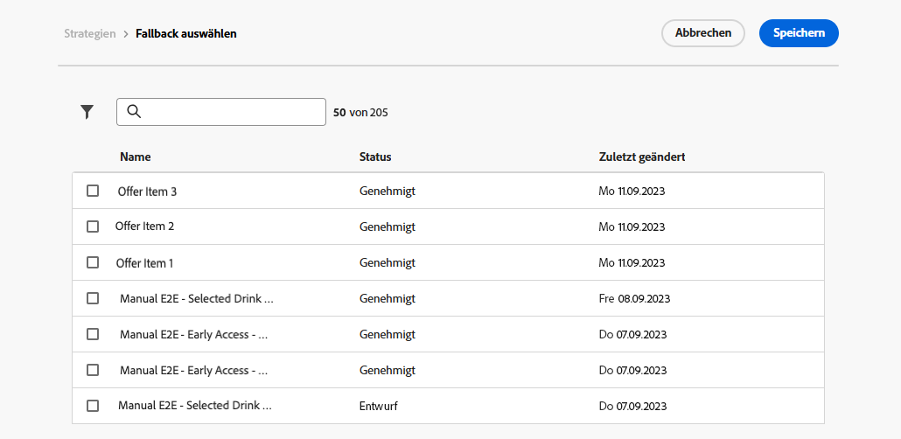

# Erstellen von Entscheidungsrichtlinien {#create-decision}

>[!CONTEXTUALHELP]
>id="ajo_code_based_item_number"
>title="Festlegen der Anzahl der zurückzugebenden Elemente"
>abstract="Wählen Sie die Anzahl der Entscheidungselemente, die zurückgegeben werden sollen. Wenn Sie beispielsweise „2“ auswählen, werden die zwei am besten geeigneten Angebote für die aktuelle Konfiguration angezeigt."

>[!CONTEXTUALHELP]
>id="ajo_code_based_fallback"
>title="Auswählen eines Fallbacks"
>abstract="Ein Fallback-Element wird dem Benutzenden angezeigt, wenn keine der für diese Entscheidungsrichtlinie definierten Auswahlstrategien qualifiziert ist."

>[!CONTEXTUALHELP]
>id="ajo_code_based_strategy"
>title="Was ist eine Strategie?"
>abstract="Die Abfolge der Auswahlstrategie bestimmt, welche Strategie zuerst bewertet wird. Es ist mindestens eine Strategie erforderlich. Entscheidungspunkte in kombinierten Strategien werden gemeinsam bewertet."
>additional-url="https://experienceleague.adobe.com/de/docs/journey-optimizer/using/decisioning/offer-decisioning/get-started-decision/starting-offer-decisioning" text="Erstellen von Strategien"

Um Ihren Kundinnen und Kunden das beste dynamische Angebot und Erlebnis zu bieten, fügen Sie Ihrem Inhalt in einer Kampagne oder auf einer Journey eine Entscheidungsrichtlinie hinzu. Konfigurieren Sie dann die zurückzugebenden Elemente und die zu verwendende Auswahlstrategie. Gehen Sie dazu wie folgt vor:

1. [Hinzufügen einer Entscheidungsrichtlinie](#add): Vom Personalisierungseditor oder E-Mail-Designer.
1. [Konfigurieren der Entscheidungsrichtlinie](#configurre): Fügen Sie einen Namen hinzu und geben Sie die Anzahl der zurückzugebenden Elemente an.
1. [Einrichten einer Strategiesequenz](#strategy): Wählen Sie die Elemente aus, die mit der Entscheidungsrichtlinie zurückgegeben werden sollen.
1. [Auswählen von Fallback-Angeboten](#fallback) (optional): Wählen Sie Elemente aus, die angezeigt werden sollen, wenn keine Elemente oder Auswahlstrategien qualifiziert sind.
1. [Überprüfen und Speichern](#review) der Auswahlstrategie

>[!AVAILABILITY]
>
>Derzeit stehen Entscheidungsrichtlinien allen Kundinnen und Kunden für den Kanal **Code-basiertes Erlebnis** zur Verfügung. Sie sind für den Kanal **E-Mail** eingeschränkt verfügbar. Wenden Sie sich an den Adobe-Support, um Zugriff zu erhalten.

## Hinzufügen einer Entscheidungsrichtlinie {#add}

1. Öffnen Sie eine Journey oder Kampagne, wählen Sie eine [Kanalaktion](../building-journeys/journeys-message.md) aus und bearbeiten Sie den Inhalt Ihrer Nachricht.

1. Aktivieren Sie für E-Mails die Option **[!UICONTROL Entscheidungsfindung aktivieren]**.

   

   >[!IMPORTANT]
   >
   >Durch Aktivierung der Entscheidungsfindung werden vorhandene E-Mail-Inhalte gelöscht. Wenn Sie Ihre E-Mail bereits entworfen haben, stellen Sie also sicher, dass Sie Ihren Inhalt zuvor als Vorlage speichern.
   >
   >Beachten Sie, dass in der E-Mail konfigurierte Entscheidungsrichtlinien nicht in der Vorlage gespeichert werden. Wenn Sie die Vorlage auf eine andere E-Mail anwenden, müssen Sie die Richtlinie neu konfigurieren.

1. Öffnen Sie den **Personalisierungseditor**, um die Entscheidungsrichtlinie zu erstellen. Für E-Mails können Sie auch ein dediziertes Menü im **E-Mail-Designer** verwenden, um eine Entscheidungsrichtlinie zu erstellen. Erweitern Sie die folgenden Abschnitte, um die beiden Methoden zu erkunden.

   +++Erstellen einer Entscheidungsrichtlinie mit dem Personalisierungseditor

   1. Öffnen Sie den Personalisierungseditor und wählen Sie **[!UICONTROL Entscheidungsrichtlinie]** aus.
   1. Klicken Sie auf die Schaltfläche **[!UICONTROL Entscheidungsrichtlinie hinzufügen]**, um eine neue Richtlinie zu erstellen.

      

   +++

   +++Erstellen einer Entscheidungsrichtlinie im E-Mail-Designer

   Wählen Sie eine Komponente aus, klicken Sie auf das Symbol **[!UICONTROL Entscheidungsfindung]** in der Symbolleiste oder im Eigenschaftenbereich und wählen Sie dann **[!UICONTROL Neue Richtlinie hinzufügen]** aus.

   Wählen Sie **[!UICONTROL Entscheidungsausgabe wiederverwenden]** aus, um eine Entscheidungsrichtlinie wiederzuverwenden, die bereits in dieser E-Mail erstellt wurde.

   

   +++

## Konfigurieren der Entscheidungsrichtlinie {#configure}

Nachdem Sie eine neue Entscheidungsrichtlinie zu Ihrem Inhalt hinzugefügt haben, wird der Konfigurationsbildschirm für Entscheidungsrichtlinien geöffnet.

1. Geben Sie einen Namen für die Entscheidungsrichtlinie an und wählen Sie einen Katalog aus (derzeit beschränkt auf den Standardkatalog **[!UICONTROL Angebote]**).

1. Wählen Sie die Anzahl der zurückzugebenden Elemente aus. Wenn Sie beispielsweise „2“ auswählen, werden die zwei am besten geeigneten Angebote für die aktuelle Konfiguration angezeigt.

   

   Für den E-Mail-Kanal ist das Feld **[!UICONTROL Anzahl von Elementen]** standardmäßig auf 1 festgelegt und kann nur geändert werden, wenn die Entscheidungsrichtlinie von innerhalb einer Komponente des Typs **[!UICONTROL Wiederholungsraster]** hinzugefügt wird. Erweitern Sie den folgenden Abschnitt, um weitere Informationen zu erhalten:

   +++Zurückgeben mehrerer Entscheidungselemente in E-Mails mithilfe einer Komponente des Typs **[!UICONTROL Wiederholungsraster]**

   1. Ziehen Sie eine Komponente vom Typ **[!UICONTROL Wiederholungsraster]** in Ihre E-Mail und konfigurieren Sie sie wie gewünscht mithilfe des Bereichs **[!UICONTROL Einstellungen]**.

      

   1. Klicken Sie auf das Symbol **[!UICONTROL Entscheidungsfindung]** auf der Symbolleiste der Arbeitsfläche oder öffnen Sie den Bereich **[!UICONTROL Entscheidungsfindung]** und wählen Sie **[!UICONTROL Entscheidungsrichtlinie hinzufügen]** aus.

   1. Geben Sie im Feld **[!UICONTROL Anzahl der Elemente]** die Anzahl der zurückzugebenden Elemente ein und konfigurieren Sie dann die Entscheidungsrichtlinie wie unten beschrieben. Die maximale Anzahl von Elementen, die Sie auswählen können, ist durch die Anzahl der Kacheln begrenzt, die in der Komponente **[!UICONTROL Wiederholungsraster]** definiert sind.

   

   +++

1. Klicken Sie auf **[!UICONTROL Weiter]**.

## Einrichten einer Strategiesequenz {#strategy}

Im Bereich **[!UICONTROL Strategiesequenz]** können Sie die Entscheidungselemente und Auswahlstrategien auswählen, die mit der Entscheidungsrichtlinie angezeigt werden sollen.

1. Klicken Sie auf die Schaltfläche **[!UICONTROL Hinzufügen]** und wählen Sie anschließend den Objekttyp aus, der in die Richtlinie aufgenommen werden soll:

   

   * **[!UICONTROL Auswahlstrategie]**: Entscheidungsstrategien nutzen Sammlungen, die mit Eignungsbegrenzungen verknüpft sind, und Rangfolgemethoden, um die anzuzeigenden Elemente zu bestimmen. Sie können eine vorhandene Auswahlstrategie auswählen oder mithilfe der Schaltfläche **[!UICONTROL Auswahlstrategie erstellen]** eine neue erstellen. [Informationen zum Erstellen von Auswahlstrategien](selection-strategies.md)

   * **[!UICONTROL Entscheidungselement]**: Wählen Sie einzelne Entscheidungselemente aus, ohne eine Auswahlstrategie durchlaufen zu müssen. Sie können jeweils nur ein Entscheidungselement auswählen. Es werden alle für das Element festgelegten Eignungsbegrenzungen angewendet.

   >[!NOTE]
   >
   >Eine Entscheidungsrichtlinie unterstützt bis zu 10 Auswahlstrategien und Entscheidungselemente zusammen. [Weitere Informationen zu den Leitlinien und Einschränkungen für die Entscheidungsfindung](gs-experience-decisioning.md#guardrails)

1. Wenn mehrere Entscheidungselemente und/oder Strategien hinzugefügt werden, werden diese in einer bestimmten Reihenfolge ausgewertet. Das erste Objekt, das der Sequenz hinzugefügt wurde, wird zuerst ausgewertet und die Auswertung wird in dieser Reihenfolge fortgeführt. Die Objekte und/oder Gruppen können nach Bedarf per Drag-and-Drop verschoben werden, um die Standardsequenz zu ändern.  Erweitern Sie den folgenden Abschnitt, um weitere Informationen zu erhalten.

   +++Verwalten der Auswertungsreihenfolge in einer Entscheidungsrichtlinie

   Sobald Sie Entscheidungselemente und Auswahlstrategien zu Ihrer Richtlinie hinzugefügt haben, können Sie ihre Reihenfolge anpassen, um die Auswertungsreihenfolge festzulegen, und Auswahlstrategien miteinander kombinieren, um sie gemeinsam auszuwerten.

   Die **sequenzielle Reihenfolge**, in der Elemente und Strategien ausgewertet werden, wird mit Zahlen links neben jedem Objekt oder jeder Objektgruppe angegeben. Um die Position einer Auswahlstrategie (oder einer Gruppe von Strategien) innerhalb der Sequenz zu verschieben, ziehen Sie sie per Drag-and-Drop an eine andere Position.

   

   >[!NOTE]
   >
   >Nur Auswahlstrategien können per Drag-and-Drop innerhalb einer Sequenz verschoben werden. Um die Position eines Entscheidungselements zu ändern, müssen Sie es entfernen und mithilfe der Schaltfläche **[!UICONTROL Hinzufügen]** wieder hinzufügen, nachdem Sie die anderen Elemente hinzugefügt haben, die vorher ausgewertet werden sollen.

   Sie können auch mehrere Auswahlstrategien in Gruppen **kombinieren**, sodass sie zusammen und nicht getrennt ausgewertet werden. Klicken Sie dazu unter einer Auswahlstrategie auf die Schaltfläche **`+`**, um sie mit einer anderen Strategie zu kombinieren. Sie können eine Auswahlstrategie auch per Drag-and-Drop auf eine andere ziehen, um die beiden Strategien zu einer Gruppe zusammenzuführen.

   >[!NOTE]
   >
   >Entscheidungselemente können nicht mit anderen Elementen oder Auswahlstrategien gruppiert werden.

   Mehrere Strategien und ihre Gruppierung bestimmen die Priorität der Strategien und die Rangfolge der geeigneten Angebote. Die erste Strategie hat die höchste Priorität, und die Strategien, die in derselben Gruppe zusammengefasst sind, haben dieselbe Priorität.

   Sie haben beispielsweise zwei Sammlungen – eine mit Strategie A und eine mit Strategie B. Die Anfrage sieht die Rücksendung von zwei Entscheidungselementen vor. Angenommen, es gibt zwei geeignete Angebote nach Strategie A und drei geeignete Angebote nach Strategie B.

   * Wenn die beiden Strategien **nicht kombiniert** und/oder in sequenzieller Reihenfolge (1 und 2) sind, werden die beiden geeignetsten Angebote nach der ersten Strategie in der ersten Zeile zurückgegeben. Gibt es für die erste Strategie keine zwei geeigneten Angebote, geht die Entscheidungs-Engine zur nächsten Strategie in der Reihenfolge über, um so viele Angebote zu finden, wie noch benötigt werden, und gibt schließlich bei Bedarf einen Fallback zurück.

     

   * Werden die beiden Sammlungen **gleichzeitig ausgewertet**, da es zwei geeignete Angebote für Strategie A und drei geeignete Angebote für Strategie B gibt, werden alle fünf Angebote anhand des von den jeweiligen Ranking-Methoden ermittelten Wertes zusammengefasst. Es werden zwei Angebote angefordert, so dass von diesen fünf Angeboten die beiden geeignetsten zurückgegeben werden.

     

   **Beispiel mit mehreren Strategien**

   Betrachten wir nun ein Beispiel, bei dem mehrere Strategien in verschiedene Gruppen unterteilt sind. Sie haben drei Strategien definiert. Strategie 1 und 2 befinden sich beide in Gruppe 1, während Strategie 3 unabhängig ist (Gruppe 2). Die geeigneten Angebote für jede Strategie und ihre Priorität (die bei der Auswertung der Ranglistenfunktion verwendet wird) sind wie folgt:

   * Gruppe 1:
      * Strategie 1 – (Angebot 1, Angebot 2, Angebot 3) – Priorität 1
      * Strategie 2 – (Angebot 3, Angebot 4, Angebot 5) – Priorität 1

   * Gruppe 2:
      * Strategie 3 – (Angebot 5, Angebot 6) – Priorität 0

   Die Angebote mit der höchsten Priorität werden zuerst ausgewertet und zur Rangfolgeliste der Angebote hinzugefügt.

   * **Iteration 1:**

     Angebote mit Strategie 1 und 2 werden gemeinsam ausgewertet (Angebot 1, Angebot 2, Angebot 3, Angebot 4, Angebot 5). Nehmen wir an, das Ergebnis lautet:

     Angebot 1 – 10
Angebot 2 – 20
Angebot 3 – 30 aus Strategie 1, 45 aus Strategie 2. Der höchste Wert von beiden wird berücksichtigt, also 45.
Angebot 4 - 40
Angebot 5 - 50

     Die Rangfolge der Angebote lautet nun wie folgt: Angebot 5, Angebot 3, Angebot 4, Angebot 2, Angebot 1.

   * **Iteration 2:**

     Angebote mit Strategie 3 werden ausgewertet (Angebot 5, Angebot 6). Nehmen wir an, das Ergebnis lautet:

      * Angebot 5 - wird nicht ausgewertet, da es bereits im obigen Ergebnis enthalten ist.
      * Angebot 6 - 60

     Die Rangfolge der Angebote ist nun wie folgt: Angebot 5, Angebot 3, Angebot 4, Angebot 2, Angebot 1, Angebot 6.

   +++

1. Wenn Ihre Auswahlstrategie fertig ist, klicken Sie auf **[!UICONTROL Weiter]**.

## Hinzufügen von Fallback-Angeboten {#fallback}

Sobald Sie Entscheidungselemente und/oder Auswahlstrategien ausgewählt haben, können Sie Fallback-Angebote hinzufügen, die angezeigt werden, wenn keines der oben genannten Elemente oder keine der oben genannten Auswahlstrategien qualifiziert ist.

Es können beliebige Elemente aus der Liste ausgewählt werden, die alle in der aktuellen Sandbox erstellten Entscheidungselemente anzeigt. Wenn keine Auswahlstrategie qualifiziert ist, wird den Benutzenden unabhängig von den Datumsangaben und den auf das ausgewählte Element angewendeten Eignungsbegrenzungen der Fallback angezeigt<!--nor frequency capping when available - TO CLARIFY-->.

>[!NOTE]
> Fallbacks sind optional. Es können maximal so viele Elemente ausgewählt werden, wie angefordert wurden. Wenn es keine geeigneten gibt und kein Fallback festgelegt ist, wird nichts angezeigt.

## Überprüfen und Speichern der Entscheidungsrichtlinie {#review}

Nachdem Sie eine Auswahlstrategie konfiguriert und Fallback-Angebote hinzugefügt haben, klicken Sie auf **[!UICONTROL Weiter]**, um Ihre Entscheidungsrichtlinie zu überprüfen und zu speichern, und dann auf **[!UICONTROL Erstellen]**, um die Richtlinienerstellung zu bestätigen.

>[!IMPORTANT]
>
>Nachdem eine Entscheidungsrichtlinie erstellt wurde, kann es bis zu 15 Minuten dauern, bis Änderungen an ihr in allen Datenregionen propagiert werden, und bis zu 30 Minuten für Kanada. Dazu gehören Änderungen, z. B. das Hinzufügen eines neuen Entscheidungselements zu einer Sammlung, das Ändern einer Regel in einem Element, das Ändern des Elementinhalts oder das Aktualisieren einer Formel.

Sie können eine Entscheidungsrichtlinie jederzeit mithilfe der Schaltfläche mit den Auslassungspunkten im Personalisierungseditor oder im Menü **[!UICONTROL Entscheidungsfindung]** im Bereich der Komponenteneigenschaften bearbeiten oder löschen.

>[!BEGINTABS]

>[!TAB Bearbeiten oder Löschen einer Richtlinie im Personalisierungseditor]

>[!TAB Bearbeiten oder Löschen einer Richtlinie in den Eigenschaften der Komponente]

>[!ENDTABS]

## Zuweisen einer Platzierung (E-Mail) {#placement}

Für E-Mails müssen Sie eine Platzierung für die Komponente definieren, die mit der Entscheidungsrichtlinie verknüpft ist. Klicken Sie dazu auf die Schaltfläche **[!UICONTROL Entscheidungsfindung]** im Bereich mit Komponenteneigenschaften und wählen Sie **[!UICONTROL Platzierung zuweisen]** aus. [Informationen zum Arbeiten mit Platzierungen](../experience-decisioning/placements.md)

## Nächste Schritte {#next-steps}

Nachdem Sie nun wissen, wie Sie eine Entscheidungsrichtlinie erstellen, können Sie sie in [!DNL Journey Optimizer]-Kanälen verwenden, um Angebote zu unterbreiten.

➡️ [Informationen zum Verwenden von Entscheidungsrichtlinien in Nachrichten](../experience-decisioning/use-decision-policy.md)

