# Erstellen von Entscheidungsrichtlinien {#create-decision}

>[!CONTEXTUALHELP]
>id="ajo_code_based_decision"
>title="Was ist eine Entscheidung?"
>abstract="Entscheidungsrichtlinien nutzen die Experience Decisioning-Engine, um je nach Zielgruppe die besten bereitzustellenden Inhalte auswählen."
>additional-url="https://experienceleague.adobe.com/docs/journey-optimizer/using/offer-decisioning/get-started-decision/starting-offer-decisioning.html?lang=de" text="Über Experience Decisioning"

>[!BEGINSHADEBOX]

Inhalt dieses Dokumentationshandbuchs:

* [Erste Schritte mit Offer Decisioning](gs-experience-decisioning.md)
* Verwalten Ihrer Entscheidungselemente
   * [Konfigurieren des Elementkatalogs](catalogs.md)
   * [Erstellen von Entscheidungselementen](items.md)
   * [Verwalten von Elementsammlungen](collections.md)
* Konfigurieren der Elementauswahl
   * [Erstellen von Entscheidungsregeln](rules.md)
   * [Erstellen von Rangfolgemethoden](ranking.md)
* [Erstellen von Auswahlstrategien](selection-strategies.md)
* **[Erstellen von Entscheidungsrichtlinien](create-decision.md)**

>[!ENDSHADEBOX]

Entscheidungsrichtlinien sind Container für Angebote, die die Offer Decisioning-Engine nutzen, um je nach Zielgruppe die besten bereitzustellenden Inhalte auszuwählen.

>[!NOTE]
>
>In der [!DNL Journey Optimizer]Benutzeroberfläche werden Entscheidungsrichtlinien als Entscheidungen gekennzeichnet<!--but they are decision policies. TBC if this note is needed-->.

## Hinzufügen einer Entscheidungsrichtlinie zu einer Code-basierten Kampagne {#add-decision}

>[!CONTEXTUALHELP]
>id="ajo_code_based_item_number"
>title="Festlegen der Anzahl der zurückzugebenden Elemente"
>abstract="Wählen Sie die Anzahl der Entscheidungselemente, die zurückgegeben werden sollen. Wenn Sie beispielsweise „2“ auswählen, werden die zwei am besten geeigneten Angebote für die aktuelle Oberfläche angezeigt."

>[!CONTEXTUALHELP]
>id="ajo_code_based_fallback"
>title="Auswählen eines Fallbacks"
>abstract="Ein Fallback-Element wird dem Benutzenden angezeigt, wenn keine der für diese Entscheidungsrichtlinie definierten Auswahlstrategien qualifiziert ist."

>[!CONTEXTUALHELP]
>id="ajo_code_based_strategy"
>title="Was ist eine Strategie?"
>abstract="Die Abfolge der Auswahlstrategie bestimmt, welche Strategie zuerst bewertet wird. Es ist mindestens eine Strategie erforderlich. Entscheidungspunkte in kombinierten Strategien werden gemeinsam bewertet."
>additional-url="https://experienceleague.adobe.com/docs/journey-optimizer/using/offer-decisioning/get-started-decision/starting-offer-decisioning.html?lang=de" text="Erstellen von Strategien"
>additional-url="https://experienceleague.adobe.com/docs/journey-optimizer/using/offer-decisioning/get-started-decision/starting-offer-decisioning.html?lang=de" text="Bewertungsreihenfolge"

Um den Besucherinnen und Besuchern auf Ihrer Website oder in Ihrer Mobile App das beste dynamische Angebot und Erlebnis zu präsentieren, fügen Sie einer Code-basierten Kampagne eine Entscheidungsrichtlinie hinzu. Gehen Sie dazu wie folgt vor.

1. Erstellen Sie eine Kampagne und wählen Sie die Aktion **[!UICONTROL Code-basiertes Erlebnis (Beta)]** aus. [Weitere Informationen](../code-based/create-code-based.md)

   >[!NOTE]
   >
   >Die Funktion „Code-basiertes Erlebnis“ ist derzeit nur als Beta-Version für ausgewählte Benutzerinnen und Benutzer verfügbar.

1. Wählen Sie im [Code-Editor](../code-based/create-code-based.md#edit-code) das Symbol **[!UICONTROL Entscheidungen]** und klicken Sie auf **[!UICONTROL Entscheidung erstellen]**.

   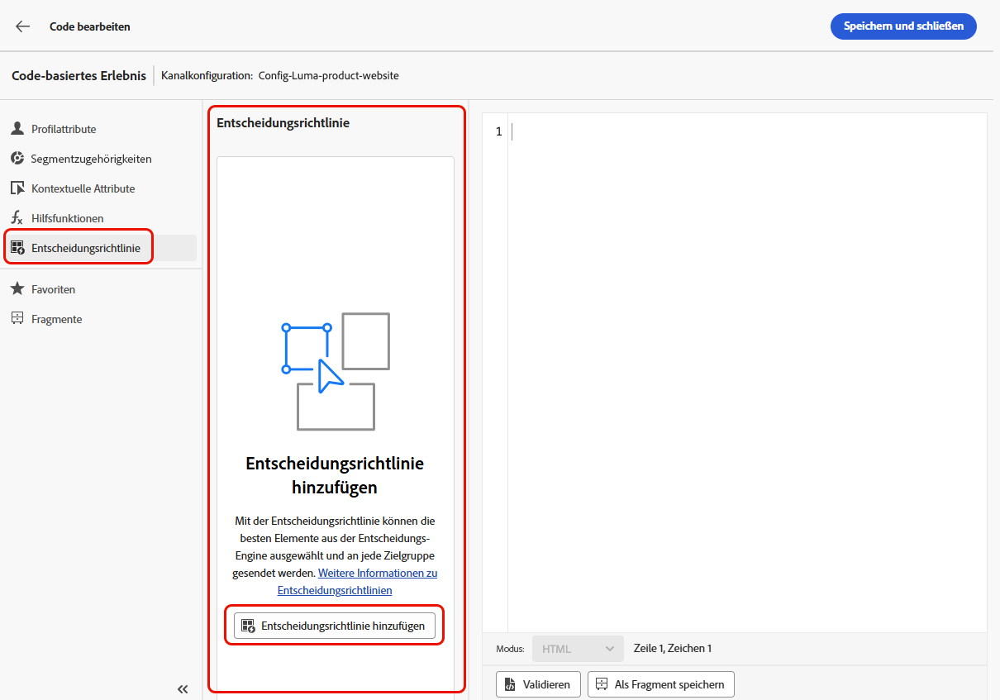

1. Füllen Sie die Details für Ihre Entscheidungsrichtlinie aus: Fügen Sie einen Namen hinzu und wählen Sie einen Katalog.

   >[!NOTE]
   >
   >Derzeit ist nur der Standardkatalog für **[!UICONTROL Angebote]** verfügbar.

   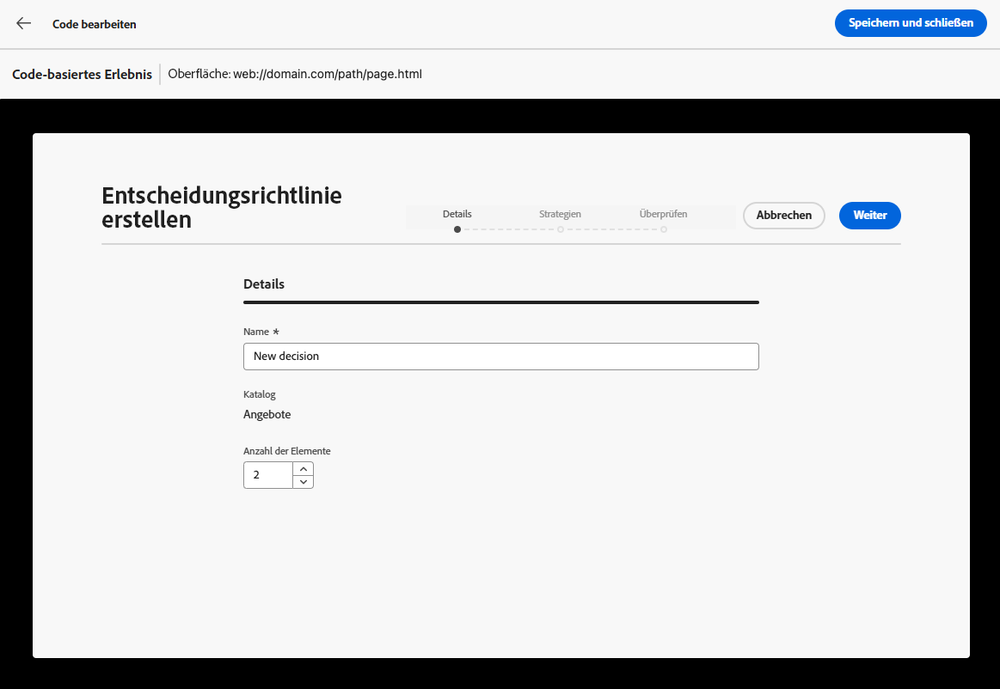

1. Wählen Sie die Anzahl der Elemente, die zurückgegeben werden sollen. Wenn Sie beispielsweise „2“ auswählen, werden die zwei am besten geeigneten Angebote für die aktuelle Oberfläche angezeigt. Klicken Sie auf **[!UICONTROL Weiter]**

1. Verwenden Sie die Schaltfläche **[!UICONTROL Strategie hinzufügen]**, um die Auswahlstrategien für Ihre Entscheidungsrichtlinie zu definieren. Jede Strategie besteht aus einer Angebotssammlung, die mit einer Eignungsbegrenzung verknüpft ist und einer Rangfolgenmethode, mit der die anzuzeigenden Angebote bestimmt werden. [Weitere Informationen](selection-strategies.md)

   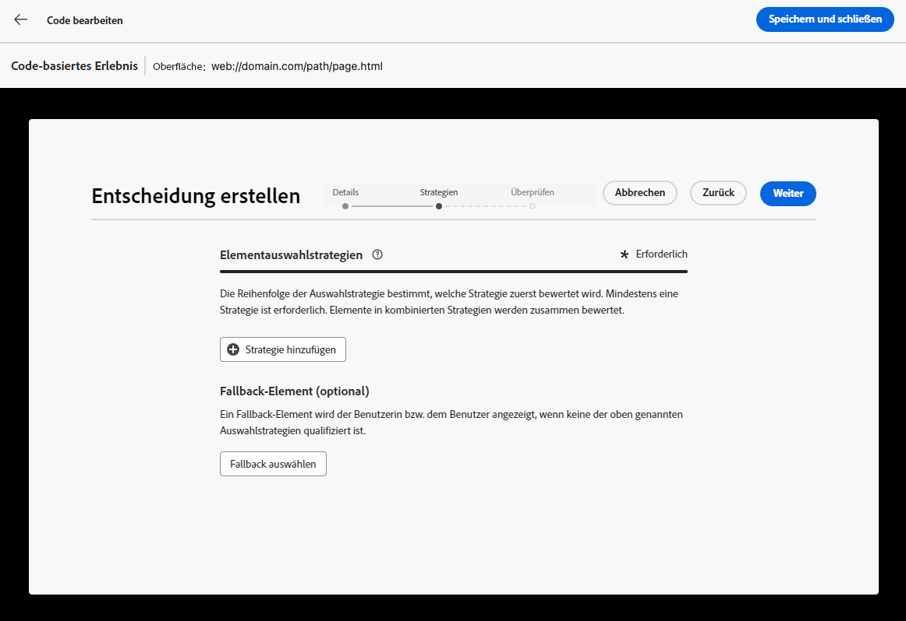

   >[!NOTE]
   >
   >Es ist mindestens eine Strategie erforderlich. Es können nicht mehr als 10 Strategien hinzugefügt werden.

1. Vom Bildschirm **[!UICONTROL Strategie hinzufügen]** aus können Sie ebenfalls eine Strategie erstellen. Die Schaltfläche **[!UICONTROL Auswahlstrategie erstellen]** leitet weiter zum Menü **[!UICONTROL Offer Decisioning]** > **[!UICONTROL Konfigurationen]**. [Weitere Informationen](selection-strategies.md)

   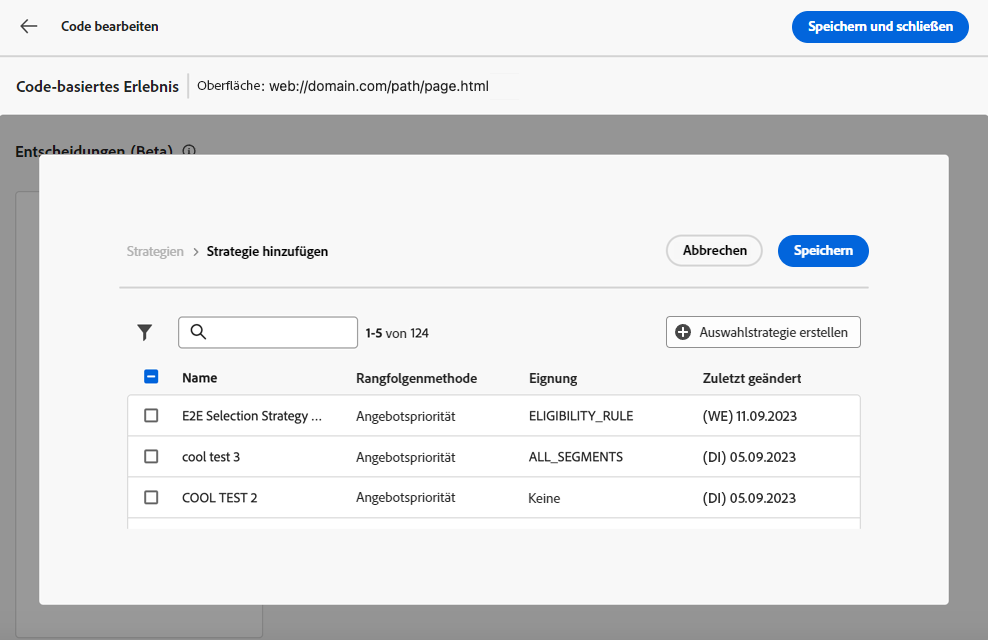

1. Wenn mehrere Strategien hinzugefügt werden, werden diese in einer bestimmten Reihenfolge ausgewertet. Die erste Strategie, die der Sequenz hinzugefügt wurde, wird zuerst ausgewertet usw. [Weitere Informationen](#evaluation-order)

   Die Strategien und/oder Gruppen können nach Bedarf per Drag-and-Drop verschoben werden, um die Standardsequenz neu anzuordnen.

   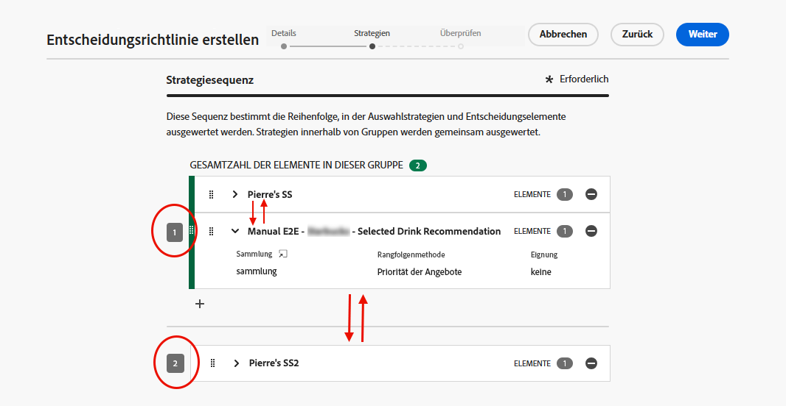

1. Fügen Sie einen Fallback hinzu. Ein Fallback-Element wird Benutzenden angezeigt, wenn keine der oben genannten Auswahlstrategien qualifiziert ist.

   

   Es können beliebige Elemente aus der Liste ausgewählt werden, die alle in der aktuellen Sandbox erstellten Entscheidungselemente anzeigt. Wenn keine Auswahlstrategie qualifiziert ist, wird den Benutzenden unabhängig von den Datumsangaben und den auf das ausgewählte Element angewendeten Eignungsbegrenzungen der Fallback angezeigt<!--nor frequency capping when available - TO CLARIFY-->.

   >[!NOTE]
   >
   >Ein Fallback ist optional. Wenn kein Fallback ausgewählt ist und keine Strategie qualifiziert ist, wird von [!DNL Journey Optimizer] nichts angezeigt.

1. Speichern Sie Ihre Auswahl und klicken Sie auf **[!UICONTROL Erstellen]**. Die neue Entscheidungsrichtlinie wird unter **[!UICONTROL Entscheidungen]** hinzugefügt.

   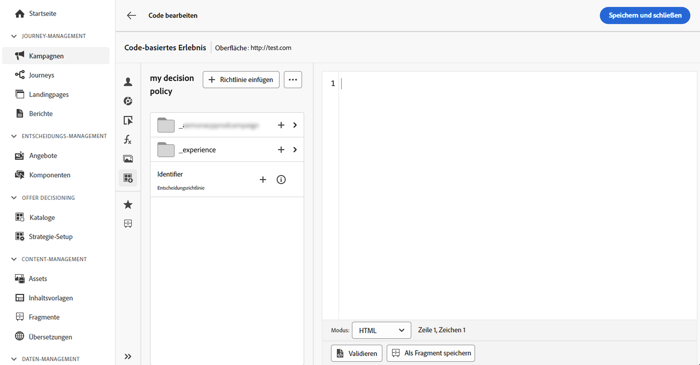

Nachdem die Entscheidungsrichtlinie erstellt wurde, können die Entscheidungsattribute im Code-basierten Erlebnisinhalt verwendet werden. [Weitere Informationen](#use-decision-policy)

## Bewertungsreihenfolge {#evaluation-order}

Wie oben beschrieben, besteht eine Strategie aus einer Sammlung, einer Rangfolgenmethode und Eignungsbegrenzungen.

Sie haben folgende Möglichkeiten:

* Die sequenzielle Reihenfolge festlegen, in der die Strategien ausgewertet werden sollen.
* Mehrere Strategien kombinieren, sodass sie zusammen und nicht getrennt ausgewertet werden.

Mehrere Strategien und ihre Gruppierung bestimmen die Priorität der Strategien und die Rangfolge der geeigneten Angebote. Die erste Strategie hat die höchste Priorität, und die Strategien, die in derselben Gruppe zusammengefasst sind, haben dieselbe Priorität.

Sie haben beispielsweise zwei Sammlungen – eine mit Strategie A und eine mit Strategie B. Die Anfrage sieht die Rücksendung von zwei Entscheidungselementen vor. Angenommen, es gibt zwei geeignete Angebote nach Strategie A und drei geeignete Angebote nach Strategie B.

* Wenn die beiden Strategien **nicht kombiniert** und/oder in sequenzieller Reihenfolge (1 und 2) sind, werden die beiden geeignetsten Angebote nach der ersten Strategie in der ersten Zeile zurückgegeben. Gibt es für die erste Strategie keine zwei geeigneten Angebote, geht die Entscheidungs-Engine zur nächsten Strategie in der Reihenfolge über, um so viele Angebote zu finden, wie noch benötigt werden, und gibt schließlich bei Bedarf einen Fallback zurück.

  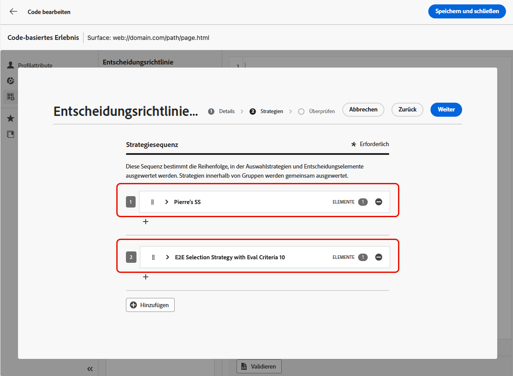

* Werden die beiden Sammlungen **gleichzeitig ausgewertet**, da es zwei geeignete Angebote für Strategie A und drei geeignete Angebote für Strategie B gibt, werden alle fünf Angebote anhand des von den jeweiligen Ranking-Methoden ermittelten Wertes zusammengefasst. Es werden zwei Angebote angefordert, so dass von diesen fünf Angeboten die beiden geeignetsten zurückgegeben werden.

  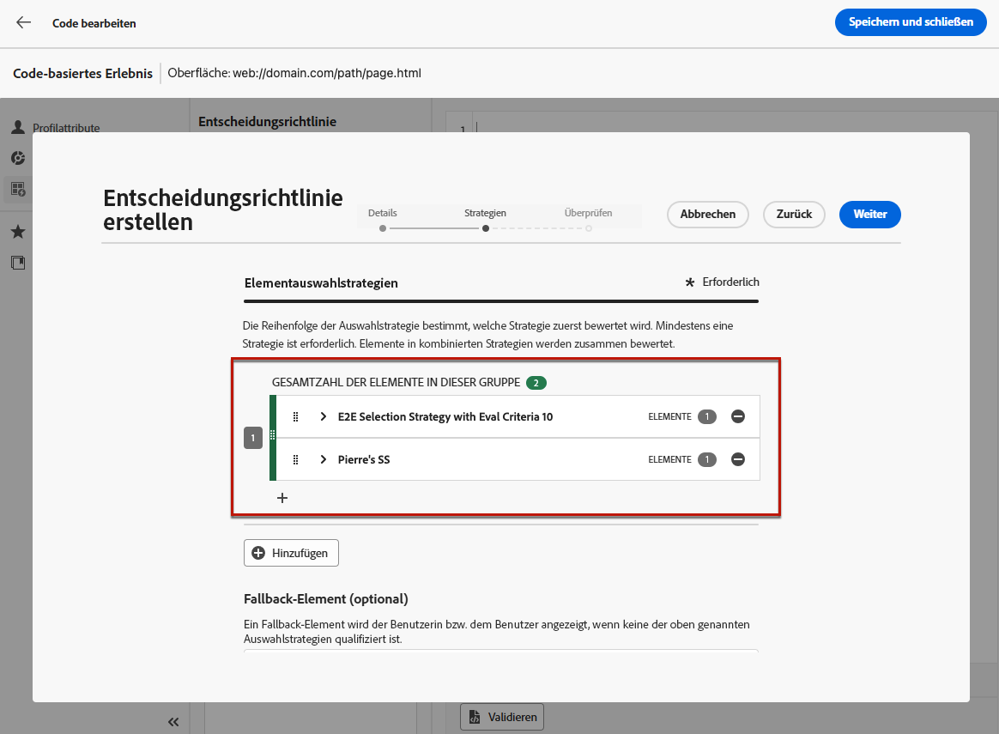

+++ **Beispiel mit mehreren Strategien**

Betrachten wir nun ein Beispiel, bei dem mehrere Strategien in verschiedene Gruppen unterteilt sind.

Sie haben drei Strategien definiert. Strategie 1 und 2 befinden sich beide in Gruppe 1, während Strategie 3 unabhängig ist (Gruppe 2).

Die geeigneten Angebote für jede Strategie und ihre Priorität (die bei der Auswertung der Ranglistenfunktion verwendet wird) sind wie folgt:

* Gruppe 1:
   * Strategie 1 – (Angebot 1, Angebot 2, Angebot 3) – Priorität 1
   * Strategie 2 – (Angebot 3, Angebot 4, Angebot 5) – Priorität 1

* Gruppe 2:
   * Strategie 3 – (Angebot 5, Angebot 6) – Priorität 0

Die Angebote mit der höchsten Priorität werden zuerst ausgewertet und zur Rangfolgeliste der Angebote hinzugefügt.

**Iteration 1:**

Angebote mit Strategie 1 und 2 werden gemeinsam ausgewertet (Angebot 1, Angebot 2, Angebot 3, Angebot 4, Angebot 5). Nehmen wir an, das Ergebnis lautet:

Angebot 1 – 10
Angebot 2 – 20
Angebot 3 – 30 aus Strategie 1, 45 aus Strategie 2. Der höchste Wert von beiden wird berücksichtigt, also 45.
Angebot 4 - 40
Angebot 5 - 50

Die Rangfolge der Angebote lautet nun wie folgt: Angebot 5, Angebot 3, Angebot 4, Angebot 2, Angebot 1.

**Iteration 2:**

Angebote mit Strategie 3 werden ausgewertet (Angebot 5, Angebot 6). Nehmen wir an, das Ergebnis lautet:

* Angebot 5 - wird nicht ausgewertet, da es bereits im obigen Ergebnis enthalten ist.
* Angebot 6 - 60

Die Rangfolge der Angebote ist nun wie folgt: Angebot 5, Angebot 3, Angebot 4, Angebot 2, Angebot 1, Angebot 6.

+++

## Entscheidungsrichtlinie im Code-Editor verwenden {#use-decision-policy}

Nach der Erstellung kann die Entscheidungsrichtlinie im [Ausdruckseditor](../code-based/create-code-based.md#edit-code) verwendet werden. Gehen Sie dazu wie folgt vor.

>[!NOTE]
>
>Code-basiertes Erlebnis nutzt den [!DNL Journey Optimizer] Ausdruckseditor mit allen Personalisierungs- und Bearbeitungsfunktionen. [Weitere Informationen](../personalization/personalization-build-expressions.md)

1. Klicken Sie auf das +-Symbol. Der Code, der der Entscheidungsrichtlinie entspricht, wird hinzugefügt. Jetzt können Sie alle gewünschten Entscheidungsattribute zu diesem Code hinzufügen.

   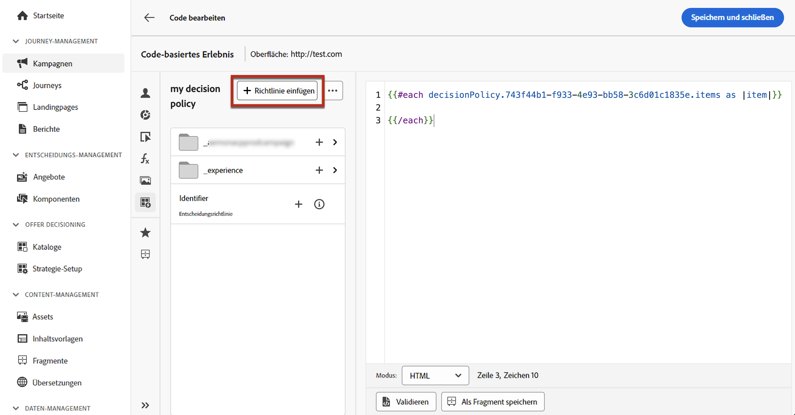

   >[!NOTE]
   >
   >Diese Sequenz wird so oft wiederholt, wie Sie die Entscheidungsrichtlinie zurückgeben möchten. Wenn Sie beispielsweise bei der [Erstellung der Entscheidung](#add-decision) 2 Elemente zurückgeben möchten, wird dieselbe Sequenz zweimal wiederholt.

1. Klicken Sie auf die Entscheidungsrichtlinie. Die Entscheidungsattribute werden angezeigt.

   Diese Attribute werden im Schema des Katalogs **[!UICONTROL Angebote]** gespeichert. Benutzerdefinierte Attribute werden im Ordner **`_<imsOrg`>** und Standardattribute im Ordner **`_experience`** gespeichert. [Weitere Informationen zum Schema des Angebotskatalogs](catalogs.md)

   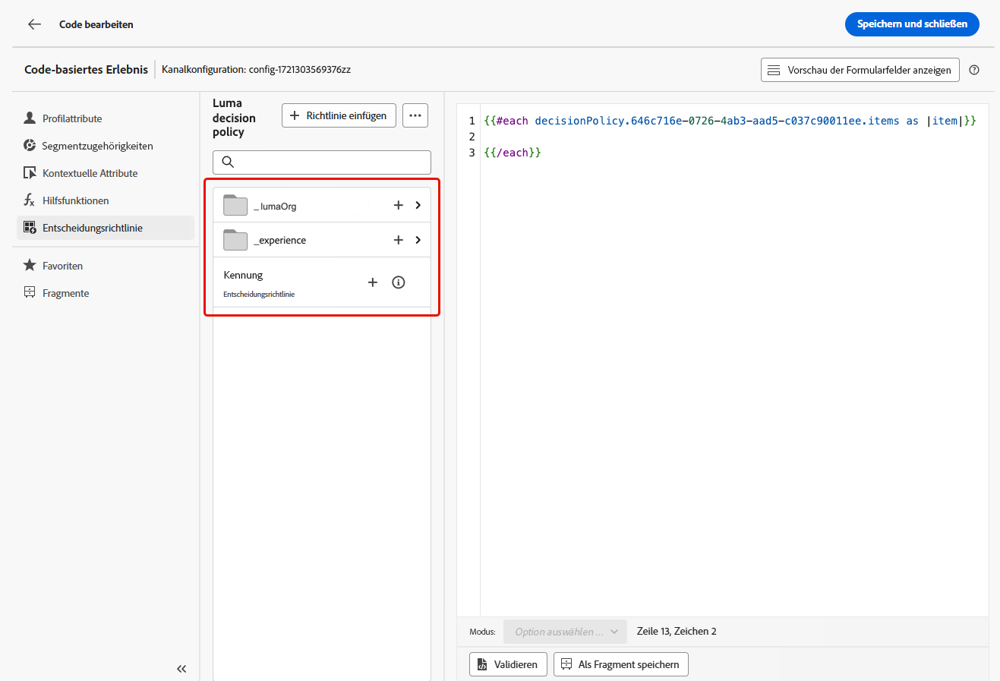

1. Klicken Sie auf den gewünschten Ordner, um ihn zu erweitern. Platzieren Sie den Cursor an der gewünschten Position und klicken Sie auf das Symbol „+“ neben dem Attribut, das Sie hinzufügen möchten. Sie können beliebig viele Attribute zum Code hinzufügen.

   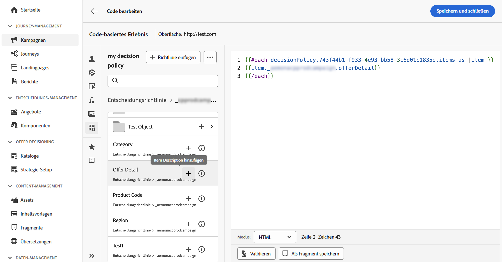

1. Um zurück zum Entscheidungsrichtlinienstamm zu navigieren, klicken Sie auf das Ordnersymbol.

   

1. Sie können auch jedes beliebige Attribut hinzufügen, das im Ausdruckseditor verfügbar ist, z. B. Profilattribute.

   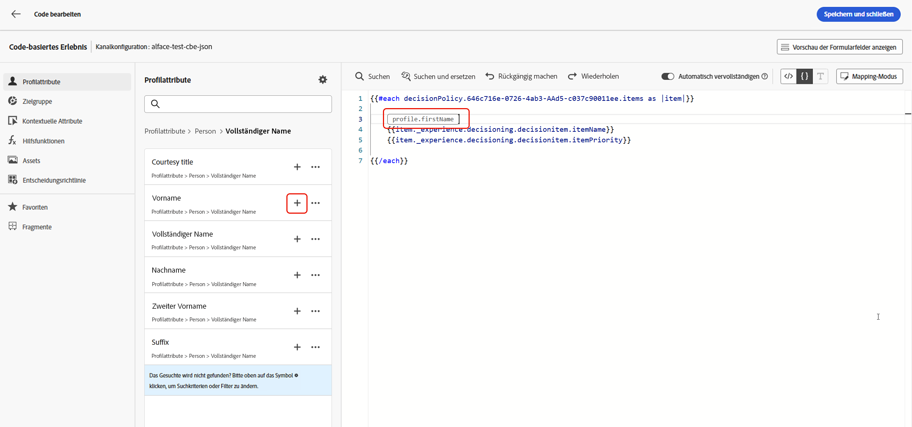
