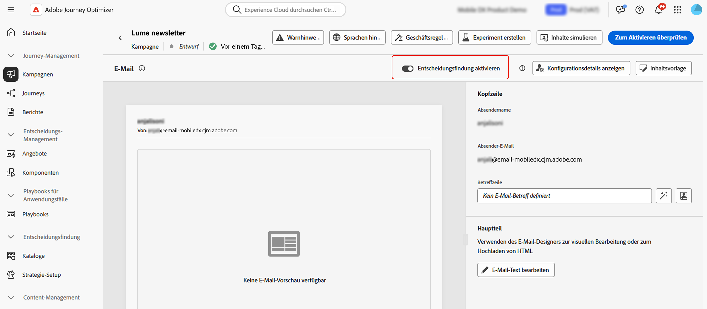
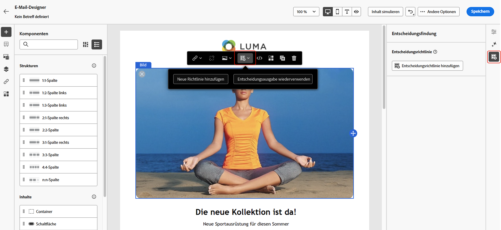
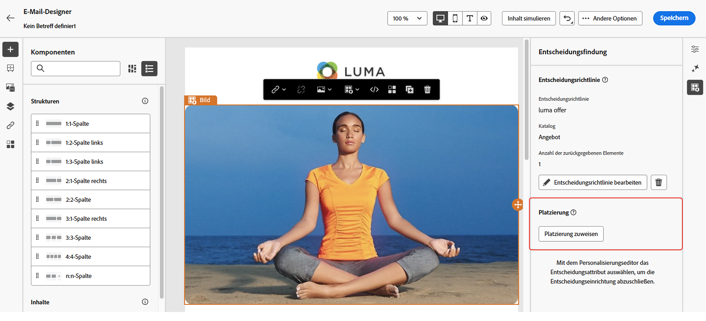

# Erstellen von Entscheidungsrichtlinien {#create-decision}

>[!CONTEXTUALHELP]
>id="ajo_code_based_decision"
>title="Was ist eine Entscheidung?"
>abstract="Entscheidungsrichtlinien enthalten die gesamte Auswahllogik, mit der die Entscheidungs-Engine den besten Inhalt auswählt. Entscheidungsrichtlinen sind kampagnenspezifisch. Ihr Ziel ist es, die besten Angebote für jedes Profil auszuwählen, während Sie bei der Kampagnenerstellung angeben können, wie die ausgewählten Entscheidungselemente dargestellt werden sollen, einschließlich der in die Nachricht aufzunehmenden Elemente."
>additional-url="https://experienceleague.adobe.com/de/docs/journey-optimizer/using/decisioning/offer-decisioning/get-started-decision/starting-offer-decisioning" text="Über Entscheidungsfindung"

>[!CONTEXTUALHELP]
>id="ajo_journey_decision_policy"
>title="Festlegen einer Entscheidungsrichtlinie"
>abstract="Mit einer Entscheidungsrichtlinie können die besten Elemente aus der Entscheidungs-Engine ausgewählt und an die richtige Zielgruppe gesendet werden."
>additional-url="https://experienceleague.adobe.com/de/docs/journey-optimizer/using/decisioning/offer-decisioning/get-started-decision/starting-offer-decisioning" text="Über Entscheidungsfindung"

>[!CONTEXTUALHELP]
>id="ajo_exd_decision_policy"
>title="Entscheidungsrichtlinie"
>abstract="Mit der Entscheidungsrichtlinie können die besten Elemente aus der Entscheidungs-Engine ausgewählt und an jede Zielgruppe gesendet werden."

>[!CONTEXTUALHELP]
>id="ajo_exd_placements"
>title="Platzierung"
>abstract="Eine Platzierung bestimmt, wo zurückgegebene Elemente aus der Entscheidungs-Engine in einer Nachricht angezeigt werden. Ihre Leistung kann in verschiedenen Berichten über verschiedene Platzierungen hinweg verfolgen."

>[!CONTEXTUALHELP]
>id="ajo_exd_decision_attribute"
>title="Auswählen von Entscheidungsattributen aus dem Katalog"
>abstract="Entscheidungsattribute werden im Schema des Katalogs gespeichert. Wählen Sie ein Attribut aus dem ausgewählten Katalog aus, das Sie hier verwenden möchten."

Entscheidungsrichtlinien sind Container für Ihre Angebote, die die Entscheidungs-Engine nutzen, um dynamisch die besten Inhalte für jedes Zielgruppenmitglied zurückzugeben. Ihr Ziel besteht darin, die besten Angebote für jedes Profil auszuwählen. Beim Kampagnen-/Journey-Authoring wiederum können Sie angeben, wie die ausgewählten Entscheidungselemente dargestellt werden, einschließlich der Elementattribute, die in die Nachricht aufgenommen werden sollen.

## Wichtige Schritte {#key}

Die Hauptschritte, um Entscheidungsrichtlinien in Ihre Nachrichten zu verwenden, sind wie folgt:

1. [Erstellen einer Entscheidungsrichtlinie in einer E-Mail oder einem Code-basierten Erlebnis](#add-decision)

   Richten Sie in Ihrer E-Mail oder Ihrem Code-basierten Erlebnis eine Entscheidungsrichtlinie ein, indem Sie die Anzahl der zurückzugebenden Elemente auswählen und Auswahlstrategien, Fallback-Optionen und die Auswertungsreihenfolge konfigurieren.

1. [Verwenden der Entscheidungsrichtlinie in Ihren Inhalten](#use-decision-policy)

   Personalisieren Sie Ihren Inhalt mit der Ausgabe der Entscheidungsrichtlinie und den Attributen der Entscheidungselemente, die in der Nachricht angezeigt werden sollen.

1. [Erstellen von Reporting-Dashboards](cja-reporting.md)

   Erstellen Sie benutzerdefinierte Customer Journey Analytics-Dashboards, um die Leistung zu messen und Einblicke in die Bereitstellung und Interaktion Ihrer Entscheidungsrichtlinien und Angebote zu erhalten.

## Leitlinien und Einschränkungen

* **Eingeschränkte Verfügbarkeit – Entscheidungsrichtlinie in E-Mails**: Derzeit ist die Erstellung von Entscheidungsrichtlinien in E-Mails nur eingeschränkt verfügbar. Wenden Sie sich an den Adobe-Support, um Zugang zu erhalten.
* **Mirror-Seiten**: Derzeit werden Entscheidungselemente in E-Mail-Mirrorseiten nicht gerendert.
* **Tracking- und Link-Typ**: Zum Nachverfolgen von Links, die von der Entscheidungsfindung generiert wurden, definieren Sie sie im Schema als „Decisioning Assets“. Attributbasierte Links können nicht nachverfolgt werden.
* **Verschachtelung von Entscheidungsrichtlinien in E-Mails**: Sie können nicht mehrere Entscheidungsrichtlinien in einer übergeordneten E-Mail-Komponente verschachteln, die bereits mit einer Entscheidungsrichtlinie verknüpft ist.
* **Duplizierte Journeys oder Kampagnen mit Entscheidungsfindung**: Wenn Sie eine Journey oder Kampagne duplizieren, die eine Entscheidungsrichtlinie enthält, verweist die duplizierte Version auf die ursprüngliche E-Mail oder das Code-basierte Erlebnis, was zu Fehlern führt. Die Entscheidungsrichtlinie muss nach einer Duplizierung immer neu konfiguriert werden.
* **Einverständnisrichtlinien**: Es dauert bist zu 48 Stunden bis Aktualisierungen von Einverständnisrichtlinien wirksam werden. Wenn eine Entscheidungsrichtlinie auf ein Attribut verweist, das mit einer kürzlich aktualisierten Einverständnisrichtlinie verknüpft ist, werden die Änderungen nicht sofort angewendet.

  Wenn neue Profilattribute, die einer Einverständnisrichtlinie unterliegen, zu einer Entscheidungsrichtlinie hinzugefügt werden, sind sie ebenfalls verwendbar, aber die mit ihnen verknüpfte Einverständnisrichtlinie wird erst erzwungen, wenn die Verzögerungszeit vorüber ist.

  Einverständnisrichtlinien sind nur für Organisationen verfügbar, die über das Zusatzangebot „Adobe Healthcare Shield“ oder „Privacy and Security Shield“ verfügen.

* **KI-Rangfolge**: Derzeit wird die KI-Rangfolge für den E-Mail-Kanal in Journeys mit Entscheidungsfindung nicht unterstützt.

## Erstellen einer Entscheidungsrichtlinie in einer E-Mail oder einem Code-basierten Erlebnis {#add-decision}

>[!CONTEXTUALHELP]
>id="ajo_code_based_item_number"
>title="Festlegen der Anzahl der zurückzugebenden Elemente"
>abstract="Wählen Sie die Anzahl der Entscheidungselemente, die zurückgegeben werden sollen. Wenn Sie beispielsweise „2“ auswählen, werden die zwei am besten geeigneten Angebote für die aktuelle Konfiguration angezeigt."

>[!CONTEXTUALHELP]
>id="ajo_code_based_fallback"
>title="Auswählen eines Fallbacks"
>abstract="Ein Fallback-Element wird dem Benutzenden angezeigt, wenn keine der für diese Entscheidungsrichtlinie definierten Auswahlstrategien qualifiziert ist."

>[!CONTEXTUALHELP]
>id="ajo_code_based_strategy"
>title="Was ist eine Strategie?"
>abstract="Die Abfolge der Auswahlstrategie bestimmt, welche Strategie zuerst bewertet wird. Es ist mindestens eine Strategie erforderlich. Entscheidungspunkte in kombinierten Strategien werden gemeinsam bewertet."
>additional-url="https://experienceleague.adobe.com/de/docs/journey-optimizer/using/decisioning/offer-decisioning/get-started-decision/starting-offer-decisioning" text="Erstellen von Strategien"

Um den Empfängerinnen und Empfängern Ihrer E-Mails sowie den Besucherinnen und Besuchern Ihrer Website oder in Ihrer App das beste dynamische Angebot und Erlebnis zu präsentieren, fügen Sie einer Code-basierten Kampagne oder Journey eine Entscheidungsrichtlinie hinzu. Gehen Sie dazu wie folgt vor.

### Erstellen einer Entscheidungsrichtlinie {#add}

1. Fügen Sie einer Journey oder Kampagne eine Aktion vom Typ **[!UICONTROL E-Mail]** oder **[!UICONTROL Code-basiertes Erlebnis]** hinzu.

1. Schalten Sie für E-Mails im Konfigurationsbildschirm die Option **[!UICONTROL Entscheidungsfindung aktivieren]** ein.

   

   >[!IMPORTANT]
   >
   >Durch Aktivierung der Entscheidungsfindung werden vorhandene E-Mail-Inhalte gelöscht. Wenn Sie Ihre E-Mail bereits entworfen haben, stellen Sie also sicher, dass Sie Ihren Inhalt zuvor als Vorlage speichern.
   >
   >Beachten Sie, dass in der E-Mail konfigurierte Entscheidungsrichtlinien nicht in der Vorlage gespeichert werden. Wenn Sie die Vorlage auf eine andere E-Mail anwenden, müssen Sie die Richtlinie neu konfigurieren.

1. Richtlinien können in E-Mail- und Code-basierten Erlebnissen mit dem Personalisierungseditor erstellt werden. Sie können auch in E-Mails über ein eigenes Menü im E-Mail-Designer erstellt werden. Erweitern Sie die folgenden Abschnitte, um weitere Informationen zu erhalten.

   +++Personalization-Editor

   1. Öffnen Sie den Personalisierungseditor und wählen Sie **[!UICONTROL Entscheidungsrichtlinie]** aus.
   1. Klicken Sie auf die Schaltfläche **[!UICONTROL Entscheidungsrichtlinie hinzufügen]**, um eine neue Richtlinie zu erstellen.

      

   +++

   +++E-Mail-Designer **[!UICONTROL Decisioning]** Menü

   1. Wählen Sie eine Komponente aus, klicken Sie auf das Symbol **[!UICONTROL Entscheidungsfindung]** in der Symbolleiste oder im Eigenschaftenbereich und wählen Sie dann **[!UICONTROL Neue Richtlinie hinzufügen]** aus.

   1. Wählen Sie **[!UICONTROL Entscheidungsausgabe wiederverwenden]** aus, um eine Entscheidungsrichtlinie wiederzuverwenden, die bereits in dieser E-Mail erstellt wurde.

      

   +++

1. Geben Sie einen Namen an und wählen Sie einen Katalog aus (derzeit beschränkt auf den Standardkatalog **[!UICONTROL Angebote]**).

1. Wählen Sie die Anzahl der zurückzugebenden Elemente aus. Wenn Sie beispielsweise „2“ auswählen, werden die zwei am besten geeigneten Angebote für die aktuelle Konfiguration angezeigt.

   

   Bei E-Mails können nur in einer Inhaltskomponente vom Typ **[!UICONTROL Wiederholungsraster]** mehrere Elemente zurückgegeben werden. Erweitern Sie den folgenden Abschnitt, um weitere Informationen zu erhalten:

   +++ Zurückgeben mehrerer Entscheidungselemente in E-Mails

   1. Ziehen Sie eine Komponente vom Typ **[!UICONTROL Wiederholungsraster]** auf die Arbeitsfläche und konfigurieren Sie sie wie gewünscht mithilfe des Bereichs **[!UICONTROL Einstellungen]**.

      

   1. Klicken Sie auf das Symbol **[!UICONTROL Entscheidungsfindung]** auf der Symbolleiste der Arbeitsfläche oder öffnen Sie den Bereich **[!UICONTROL Entscheidungsfindung]** und wählen Sie **[!UICONTROL Entscheidungsrichtlinie hinzufügen]** aus.

   1. Geben Sie im Feld **[!UICONTROL Anzahl der Elemente]** die Anzahl der zurückzugebenden Elemente ein und konfigurieren Sie dann die Entscheidungsrichtlinie wie unten beschrieben. Die maximale Anzahl von Elementen, die Sie auswählen können, ist durch die Anzahl der Kacheln begrenzt, die in der Komponente **[!UICONTROL Wiederholungsraster]** definiert sind.

   

   +++

1. Klicken Sie auf **[!UICONTROL Weiter]**.

### Auswählen von Elementen und Auswahlstrategien {#select}

Im Bereich **[!UICONTROL Strategiesequenz]** können Sie die Entscheidungselemente und Auswahlstrategien auswählen, die mit der Entscheidungsrichtlinie angezeigt werden sollen.

1. Klicken Sie auf die Schaltfläche **[!UICONTROL Hinzufügen]** und wählen Sie anschließend den Objekttyp aus, der in die Richtlinie aufgenommen werden soll:

   * **[!UICONTROL Auswahlstrategie]**: Fügen Sie eine oder mehrere Auswahlstrategien hinzu. Entscheidungsstrategien nutzen Sammlungen, die mit Eignungsbegrenzungen verknüpft sind, und Rangfolgemethoden, um die anzuzeigenden Elemente zu bestimmen. Sie können eine vorhandene Auswahlstrategie auswählen oder mithilfe der Schaltfläche **[!UICONTROL Auswahlstrategie erstellen]** eine neue erstellen. [Informationen zum Erstellen von Auswahlstrategien](selection-strategies.md)

   * **[!UICONTROL Entscheidungselement]**: Fügen Sie einzelne Entscheidungselemente hinzu, die angezeigt werden sollen, ohne eine Auswahlstrategie durchlaufen zu müssen. Sie können jeweils nur ein Entscheidungselement auswählen. Es werden alle für das Element festgelegten Eignungsbegrenzungen angewendet.

   

   >[!NOTE]
   >
   >Eine Entscheidungsrichtlinie unterstützt bis zu 10 Auswahlstrategien und Entscheidungselemente zusammen. [Weitere Informationen zu den Leitlinien und Einschränkungen für die Entscheidungsfindung](gs-experience-decisioning.md#guardrails)

1. Wenn mehrere Entscheidungselemente und/oder Strategien hinzugefügt werden, werden diese in einer bestimmten Reihenfolge ausgewertet. Das erste Objekt, das der Sequenz hinzugefügt wurde, wird zuerst ausgewertet und die Auswertung wird in dieser Reihenfolge fortgeführt. Die Objekte und/oder Gruppen können nach Bedarf per Drag-and-Drop verschoben werden, um die Standardsequenz zu ändern.  Erweitern Sie den folgenden Abschnitt, um weitere Informationen zu erhalten:

   +++Verwalten der Auswertungsreihenfolge in einer Entscheidungsrichtlinie

   Sobald Sie Entscheidungselemente und Auswahlstrategien zu Ihrer Richtlinie hinzugefügt haben, können Sie ihre Reihenfolge anpassen, um die Auswertungsreihenfolge festzulegen, und Auswahlstrategien miteinander kombinieren, um sie gemeinsam auszuwerten.

   Die **sequenzielle Reihenfolge**, in der Elemente und Strategien ausgewertet werden, wird mit Zahlen links neben jedem Objekt oder jeder Objektgruppe angegeben. Um die Position einer Auswahlstrategie (oder einer Gruppe von Strategien) innerhalb der Sequenz zu verschieben, ziehen Sie sie per Drag-and-Drop an eine andere Position.

   

   >[!NOTE]
   >
   >Nur Auswahlstrategien können per Drag-and-Drop innerhalb einer Sequenz verschoben werden. Um die Position eines Entscheidungselements zu ändern, müssen Sie es entfernen und mithilfe der Schaltfläche **[!UICONTROL Hinzufügen]** wieder hinzufügen, nachdem Sie die anderen Elemente hinzugefügt haben, die vorher ausgewertet werden sollen.

   Sie können auch mehrere Auswahlstrategien in Gruppen **kombinieren**, sodass sie zusammen und nicht getrennt ausgewertet werden. Klicken Sie dazu unter einer Auswahlstrategie auf die Schaltfläche **`+`**, um sie mit einer anderen Strategie zu kombinieren. Sie können eine Auswahlstrategie auch per Drag-and-Drop auf eine andere ziehen, um die beiden Strategien zu einer Gruppe zusammenzuführen.

   >[!NOTE]
   >
   >Entscheidungselemente können nicht mit anderen Elementen oder Auswahlstrategien gruppiert werden.

   Mehrere Strategien und ihre Gruppierung bestimmen die Priorität der Strategien und die Rangfolge der geeigneten Angebote. Die erste Strategie hat die höchste Priorität, und die Strategien, die in derselben Gruppe zusammengefasst sind, haben dieselbe Priorität.

   Sie haben beispielsweise zwei Sammlungen – eine mit Strategie A und eine mit Strategie B. Die Anfrage sieht die Rücksendung von zwei Entscheidungselementen vor. Angenommen, es gibt zwei geeignete Angebote nach Strategie A und drei geeignete Angebote nach Strategie B.

   * Wenn die beiden Strategien **nicht kombiniert** und/oder in sequenzieller Reihenfolge (1 und 2) sind, werden die beiden geeignetsten Angebote nach der ersten Strategie in der ersten Zeile zurückgegeben. Gibt es für die erste Strategie keine zwei geeigneten Angebote, geht die Entscheidungs-Engine zur nächsten Strategie in der Reihenfolge über, um so viele Angebote zu finden, wie noch benötigt werden, und gibt schließlich bei Bedarf einen Fallback zurück.

     

   * Werden die beiden Sammlungen **gleichzeitig ausgewertet**, da es zwei geeignete Angebote für Strategie A und drei geeignete Angebote für Strategie B gibt, werden alle fünf Angebote anhand des von den jeweiligen Ranking-Methoden ermittelten Wertes zusammengefasst. Es werden zwei Angebote angefordert, so dass von diesen fünf Angeboten die beiden geeignetsten zurückgegeben werden.

     

   **Beispiel mit mehreren Strategien**

   Betrachten wir nun ein Beispiel, bei dem mehrere Strategien in verschiedene Gruppen unterteilt sind. Sie haben drei Strategien definiert. Strategie 1 und 2 befinden sich beide in Gruppe 1, während Strategie 3 unabhängig ist (Gruppe 2). Die geeigneten Angebote für jede Strategie und ihre Priorität (die bei der Auswertung der Ranglistenfunktion verwendet wird) sind wie folgt:

   * Gruppe 1:
      * Strategie 1 – (Angebot 1, Angebot 2, Angebot 3) – Priorität 1
      * Strategie 2 – (Angebot 3, Angebot 4, Angebot 5) – Priorität 1

   * Gruppe 2:
      * Strategie 3 – (Angebot 5, Angebot 6) – Priorität 0

   Die Angebote mit der höchsten Priorität werden zuerst ausgewertet und zur Rangfolgeliste der Angebote hinzugefügt.

   * **Iteration 1:**

     Angebote mit Strategie 1 und 2 werden gemeinsam ausgewertet (Angebot 1, Angebot 2, Angebot 3, Angebot 4, Angebot 5). Nehmen wir an, das Ergebnis lautet:

     Angebot 1 – 10
Angebot 2 – 20
Angebot 3 – 30 aus Strategie 1, 45 aus Strategie 2. Der höchste Wert von beiden wird berücksichtigt, also 45.
Angebot 4 - 40
Angebot 5 - 50

     Die Rangfolge der Angebote lautet nun wie folgt: Angebot 5, Angebot 3, Angebot 4, Angebot 2, Angebot 1.

   * **Iteration 2:**

     Angebote mit Strategie 3 werden ausgewertet (Angebot 5, Angebot 6). Nehmen wir an, das Ergebnis lautet:

      * Angebot 5 - wird nicht ausgewertet, da es bereits im obigen Ergebnis enthalten ist.
      * Angebot 6 - 60

     Die Rangfolge der Angebote ist nun wie folgt: Angebot 5, Angebot 3, Angebot 4, Angebot 2, Angebot 1, Angebot 6.

   +++

1. Klicken Sie auf **[!UICONTROL Weiter]**

### Hinzufügen von Fallback-Angeboten {#fallback}

Sobald Sie Entscheidungselemente und/oder Auswahlstrategien ausgewählt haben, können Sie Fallback-Angebote hinzufügen, die angezeigt werden, wenn keines der oben genannten Elemente oder keine der oben genannten Auswahlstrategien qualifiziert ist.

Es können beliebige Elemente aus der Liste ausgewählt werden, die alle in der aktuellen Sandbox erstellten Entscheidungselemente anzeigt. Wenn keine Auswahlstrategie qualifiziert ist, wird den Benutzenden unabhängig von den Datumsangaben und den auf das ausgewählte Element angewendeten Eignungsbegrenzungen der Fallback angezeigt<!--nor frequency capping when available - TO CLARIFY-->.


>[!NOTE]
> Fallbacks sind optional. Es können maximal so viele Elemente ausgewählt werden, wie angefordert wurden. Wenn es keine geeigneten gibt und kein Fallback festgelegt ist, wird nichts angezeigt.

### Speichern und Verwalten von Entscheidungsrichtlinien {#save}

Sobald Ihre Entscheidungsregel fertig ist, speichern Sie sie und klicken Sie auf **[!UICONTROL Erstellen]**.

Für E-Mails müssen Sie eine Platzierung für die Komponente definieren, die mit der Entscheidungsrichtlinie verknüpft ist. Klicken Sie dazu auf die Schaltfläche **[!UICONTROL Entscheidungsfindung]** im Bereich der Komponenteneigenschaften und wählen Sie **[!UICONTROL Platzierung zuweisen]**. [Informationen zum Arbeiten mit Platzierungen](../experience-decisioning/placements.md)



Sie können eine Entscheidungsrichtlinie jederzeit mithilfe der Schaltfläche mit den Auslassungspunkten im Personalisierungseditor oder im Menü **[!UICONTROL Entscheidungsfindung]** im Bereich der Komponenteneigenschaften bearbeiten oder löschen.

>[!BEGINTABS]

>[!TAB Bearbeiten oder Löschen einer Richtlinie im Personalisierungseditor]


>[!TAB Bearbeiten oder Löschen einer Richtlinie in den Eigenschaften der Komponente]


>[!ENDTABS]

## Verwenden einer Entscheidungsrichtlinie in Ihrem Inhalt {#use-decision-policy}

Nach der Erstellung können die Entscheidungsrichtlinie und die mit den zurückgegebenen Entscheidungselementen verknüpften Attribute in Ihrem Inhalt verwendet werden, um Ihren Inhalt zu personalisieren. Gehen Sie dazu wie folgt vor.

### Fügen Sie den Entscheidungsrichtlinien-Code ein {#insert-code}

1. Öffnen Sie den Personalisierungseditor und rufen Sie das Menü **[!UICONTROL Entscheidungsrichtlinie]** auf.

1. Klicken Sie bei E-Mails auf **[!UICONTROL Syntax einfügen]**, um den Code hinzuzufügen, der der Entscheidungsrichtlinie entspricht. Klicken Sie bei Code-basierten Erlebnissen auf **[!UICONTROL Richtlinie einfügen]**.

   +++Einfügen des Entscheidungsrichtlinien-Codes in E-Mails

   

   Wenn der Komponente noch keine Platzierung zugeordnet wurde, wählen Sie für E-Mails eine Platzierung aus der Liste aus und klicken Sie auf **[!UICONTROL Zuweisen]**.

   

   +++

   +++Einfügen von Entscheidungsrichtlinien-Code in ein Code-basiertes Erlebnis

   

   +++

   >[!NOTE]
   >
   >Wenn die Schaltfläche zum Einfügen von Code nicht angezeigt wird, wurde möglicherweise bereits eine Entscheidungsrichtlinie für die übergeordnete Komponente konfiguriert.

1. Der Code für die Entscheidungsrichtlinie wird hinzugefügt. Diese Sequenz wird so oft wiederholt, wie Sie die Entscheidungsrichtlinie zurückgeben möchten. Wenn Sie beispielsweise bei der [Erstellung der Entscheidung](#add-decision) 2 Elemente zurückgeben möchten, wird dieselbe Sequenz zweimal wiederholt.

### Verwenden von Attributen von Entscheidungselementen {#attributes}

Jetzt können Sie alle gewünschten Entscheidungsattribute zu diesem Code hinzufügen.  Die verfügbaren Attribute werden im Schema des Katalogs **[!UICONTROL Angebote]** gespeichert. Benutzerdefinierte Attribute werden im Ordner **`_<imsOrg`>** und Standardattribute im Ordner **`_experience`** gespeichert. [Weitere Informationen zum Schema des Angebotskatalogs](catalogs.md)


>[!NOTE]
>
>Für das Tracking von Entscheidungsrichtlinienelementen muss das Attribut `trackingToken`wie folgt für den Inhalt der Entscheidungsrichtlinie hinzugefügt werden:
>>`trackingToken: {{item._experience.decisioning.decisionitem.trackingToken}}`

1. Klicken Sie auf den gewünschten Ordner, um ihn zu erweitern. Platzieren Sie den Cursor an der gewünschten Position und klicken Sie auf das Symbol „+“ neben dem Attribut, das Sie hinzufügen möchten. Sie können beliebig viele Attribute zum Code hinzufügen.

   

1. Die `#each`-Schleife muss in ein Paar eckige Klammern `[ ]` eingeschlossen sein und und direkt vor der schließenden `/each` muss ein Komma eingefügt werden.

   

1. Sie können auch jedes beliebige Attribut hinzufügen, das im Personalisierungseditor verfügbar ist, z. B. Profilattribute.

   

### Verwenden von Fragmenten {#fragments}

Wenn Ihre Entscheidungsrichtlinie Entscheidungselemente einschließlich Fragmenten enthält, können Sie diese Fragmente im Entscheidungsrichtlinien-Code nutzen. [Erfahren Sie mehr über Fragmente](../content-management/fragments.md)

>[!AVAILABILITY]
>
>Diese Funktion ist derzeit nur für ausgewählte Organisationen verfügbar (eingeschränkte Verfügbarkeit). Weitere Informationen erhalten Sie beim Adobe-Support.

Angenommen, Sie möchten verschiedene Inhalte für mehrere Mobilgerätemodelle anzeigen. Stellen Sie sicher, dass Sie Fragmente, die diesen Geräten entsprechen, zu dem Entscheidungselement hinzugefügt haben, das Sie in der Entscheidungsrichtlinie verwenden. [Weitere Informationen](items.md#attributes).

{width=70%}

Anschließend können Sie eine der folgenden Methoden verwenden:

>[!BEGINTABS]

>[!TAB Code direkt einfügen]

Kopieren Sie einfach den unten stehenden Code-Block in den Entscheidungsrichtlinien-Code. Ersetzen Sie `variable`mit der Fragment-ID und `placement` Sie mit dem Fragmentverweisschlüssel:

```

{{fragment id = variable}}
```

>[!TAB Führen Sie die detaillierten Schritte aus]

1. Navigieren Sie zu **[!UICONTROL Hilfsfunktionen]** und fügen Sie die **** Let` {{variable}}` zum Codebereich hinzu, in dem Sie die Variable für Ihr Fragment deklarieren können.

   

1. Verwenden Sie die **** Map **>** Get``, um Ihren Ausdruck zu erstellen. Die Zuordnung ist das Fragment, auf das im Entscheidungselement verwiesen wird, und die Zeichenfolge kann das Gerätemodell sein, das Sie im Entscheidungselement als **[!UICONTROL Fragmentverweisschlüssel)]** haben.

   

1. Sie können auch ein kontextuelles Attribut verwenden, das diese Gerätemodell-ID enthält.

   

1. Fügen Sie die Variable hinzu, die Sie für Ihr Fragment als Fragment-ID ausgewählt haben.

   

>[!ENDTABS]

Die Fragment-ID und der Referenzschlüssel werden aus dem Abschnitt **[!UICONTROL Fragmente]** des Entscheidungselements ausgewählt.

>[!WARNING]
>
>Wenn der Fragmentschlüssel falsch ist oder der Fragmentinhalt ungültig ist, schlägt das Rendern fehl und verursacht einen Fehler im Edge-Aufruf.

## Letzte Schritte {#final-steps}

Sobald Ihr Inhalt fertig ist, überprüfen und veröffentlichen Sie Ihre Kampagne oder Journey:

* [Veröffentlichen einer Journey](../building-journeys/publishing-the-journey.md)
* [Überprüfen und Aktivieren einer Kampagne](../campaigns/review-activate-campaign.md)
* [Veröffentlichen und Aktivieren eines Code-basierten Erlebnisses](../code-based/publish-code-based.md)

Sobald Ihre Entwickelnden bei Code-basierten Erlebnissen einen API- oder SDK-Aufruf zum Abrufen von Inhalten für die in Ihrer Kanalkonfiguration definierte Oberfläche starten, werden die Änderungen auf Ihre Web-Seite oder App angewendet.

>[!NOTE]
>
>Derzeit können Sie in einer Kampagne oder Journey mit [Code-basiertem Erlebnis](../code-based/create-code-based.md) keine Inhalte über die Benutzeroberfläche mithilfe von Entscheidungen simulieren. Eine Problemumgehung finden Sie in [diesem Abschnitt ](../code-based/code-based-decisioning-implementations.md).

Um zu sehen, wie Ihre Entscheidungen funktionieren, können Sie benutzerdefinierte [Reporting-Dashboards für Customer Journey Analytics](cja-reporting.md) erstellen.
