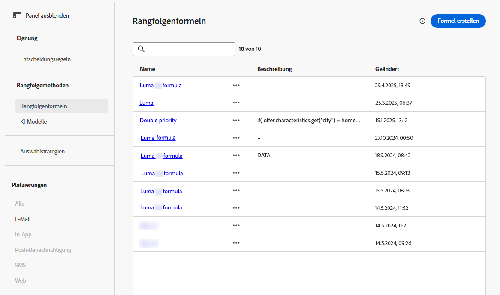
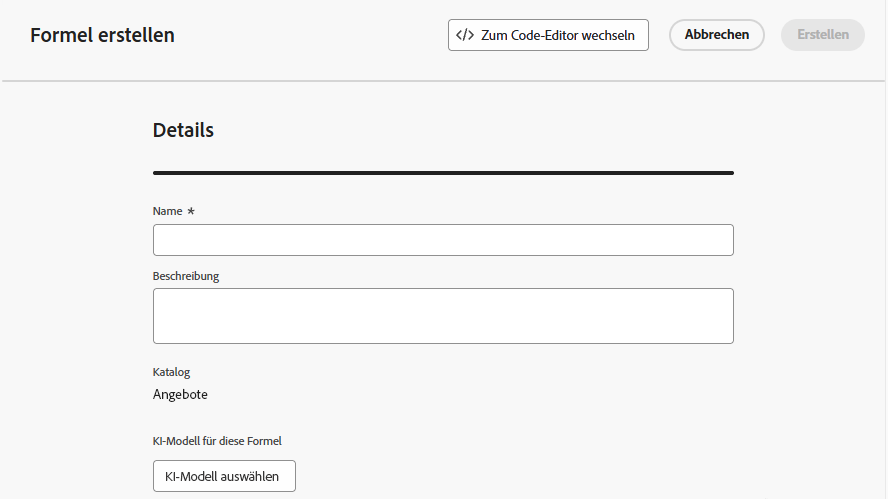
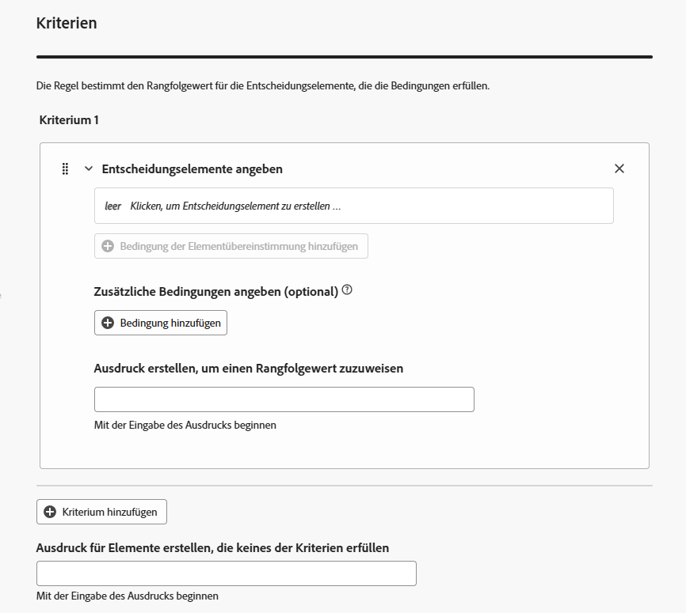
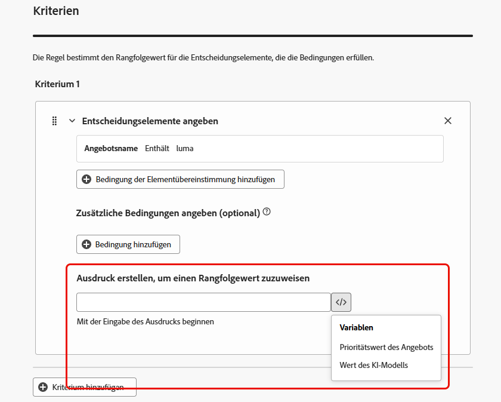
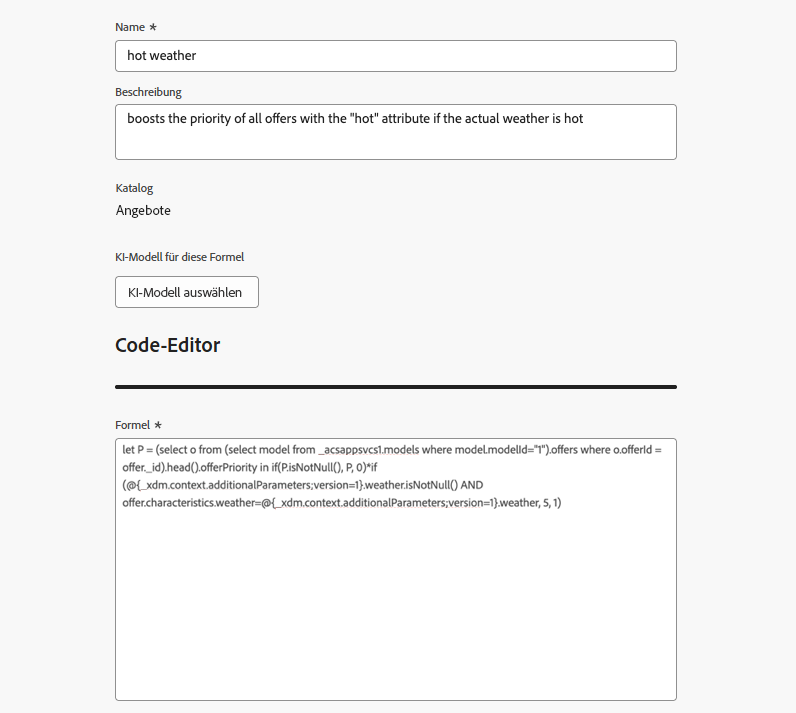

# Verwenden des KI-Formel-Builders {#create-ranking-formulas}

**Rangfolgeformeln** ermöglichen es Ihnen, Regeln zu definieren, die bestimmen, welches Angebot zuerst unterbreitet werden soll, anstatt die Prioritätswerte zu berücksichtigen.

<!--In today's world, relevance demands more than static priorities.The new formula builder in **[!UICONTROL Adobe Journey Optimizer]** empowers marketers to dynamically rank offers by blending AI-driven model scores with business priorities, offer attributes, and contextual signals — no coding required.-->

Um diese Regeln zu erstellen, bietet der KI-Formel-Builder in **[!UICONTROL Adobe Journey Optimizer]** mehr Flexibilität und Kontrolle bei der Rangfolge von Angeboten. Statt sich nur auf eine statische Angebotspriorität zu verlassen, können Sie jetzt benutzerdefinierte Rangfolgeformeln definieren, die KI-Modellbewertungen, Angebotsprioritäten, Profilattribute, Angebotsattribute und kontextuelle Signale über eine geführte Oberfläche kombinieren.

Dieser Ansatz ermöglicht es Ihnen, das Angebotsranking dynamisch auf der Grundlage einer beliebigen Kombination aus KI-gesteuerter Neigung, geschäftlichem Nutzen und Echtzeit-Kontext anzupassen, was die Abstimmung der Entscheidungsfindung auf Marketing-Ziele und Kundenanforderungen erleichtert. Der KI-Formel-Builder unterstützt einfache oder erweiterte Formeln, je nachdem, wie viel Kontrolle Sie anwenden möchten.

Nachdem eine Rangfolgenformel erstellt wurde, können Sie sie einer [Auswahlstrategie“ ](selection-strategies.md). Wenn mehrere Angebote für die Präsentation bei dieser Auswahlstrategie geeignet sind, verwendet die Entscheidungs-Engine die ausgewählte Formel, um zu berechnen, welches Angebot zuerst bereitgestellt werden soll.

## Erstellen einer Rangfolgenformel {#create-ranking-formula}

>[!CONTEXTUALHELP]
>id="ajo_exd_config_formulas"
>title="Erstellen von Ranglistenformeln"
>abstract="Mit Formeln können Sie Regeln definieren, die bestimmen, welches Entscheidungselement zuerst angezeigt werden soll, anstatt die Prioritätswerte der Elemente zu berücksichtigen. Nachdem eine Rangfolgenformel erstellt wurde, können Sie sie einer Auswahlstrategie zuweisen."

Gehen Sie wie folgt vor, um eine Rangfolgenformel zu erstellen.

1. Rufen Sie das Menü **[!UICONTROL Strategie einrichten]** auf und wählen Sie dann die Registerkarte **[!UICONTROL Rangfolgenformeln]** aus. Es wird die Liste der zuvor erstellten Rangfolgen angezeigt.

   

1. Klicken Sie **[!UICONTROL Formel erstellen]**.

1. Geben Sie den Namen der Formel an und fügen Sie bei Bedarf eine Beschreibung hinzu.

   {width="80%"}

1. Klicken Sie optional auf **[!UICONTROL KI-Modell auswählen]**, um das Modell festzulegen, das als Referenz zur Erstellung Ihrer Rangfolgenformel verwendet wird. Jedes Mal, wenn Sie bei der Definition Ihrer unten stehenden Formel auf einen Modellwert verweisen, wird das von Ihnen ausgewählte KI-Modell verwendet.

   >[!CAUTION]
   >
   >Wenn Sie ein KI-Modell verwenden, das in eine Rangfolgenformel integriert ist, werden Daten nicht im Bericht [Konversionsrate für Holdout- und modellgesteuerten Traffic](../reports/campaign-global-report-cja-code.md#conversion-rate) angezeigt.

1. Definieren Sie die Bedingungen, die die Rangfolgenbewertung für die übereinstimmenden Entscheidungselemente bestimmen. Sie haben folgende Möglichkeiten

   * Füllen Sie den Abschnitt **[!UICONTROL Kriterien]** aus der [Benutzeroberfläche](#ranking-select-criteria),
   * Oder wechseln Sie zum [Code-Editor](#ranking-code-editor).

<!--## Select an ELS dataset {#els-dataset}

To leverage data from an AEP dataset, you can select it in the **[!UICONTROL ELS settings]** section.

1. Select an ELS dataset from the list.

1. Select a decision attribute. This action is mandatory.

{width="80%"}

-->

## Definieren von Kriterien mithilfe des Formel-Builders {#ranking-select-criteria}

Mit einer intuitiven Benutzeroberfläche können Sie Entscheidungen durch die Anpassung von KI-Bewertungen (Tendenz), Angebotswert (Priorität), kontextuellen Hebeln und externen Profilneigungen anpassen - einzeln oder in Kombination -, um jede Interaktion zu optimieren. <!--Whether you're maximizing revenue, promoting strategic offers, or balancing business goals with real-time context, the formula builder gives you total control in defining ranking strategies.-->

Gehen Sie wie folgt vor, um Kriterien direkt über die Benutzeroberfläche zu definieren.

<!--{width="80%"}-->

1. Geben Sie **[!UICONTROL Abschnitt]** Kriterium 1) die Entscheidungselemente an, auf die Sie einen Rangfolgenwert anwenden möchten, indem Sie Folgendes durchführen:
   * Wählen Sie ein [Entscheidungselement-Attribut](items.md#attributes),
   * einen logischen Operator auswählen,
   * Übereinstimmende Bedingung hinzufügen - Sie können entweder einen Wert eingeben oder ein Profilattribut oder [Kontextdaten“ ](context-data.md).

   {width="70%"}

   <!--You can refer to [offer attributes](items.md#attributes), profile attributes, or [context data](context-data.md).-->

1. Optional können Sie zusätzliche Elemente angeben, um die übereinstimmenden Bedingungen zu verfeinern, damit Ihre Kriterien erfüllt sind.

   {width="80%"}

   Sie haben beispielsweise Kriterium 1 definiert, z. B. das benutzerdefinierte *Wetter*-Attribut *Gleich* die *warm*-Bedingung. Darüber hinaus können Sie eine weitere Bedingung hinzufügen, z. B. wenn die erste Bedingung erfüllt ist und wenn die Temperatur zum Zeitpunkt der Anfrage 75 Grad überschreitet, dann ist Kriterium 1 wahr.<!--Add a screenshot with the example-->

1. Erstellen Sie einen Ausdruck, der den Entscheidungselementen, die die oben definierte Bedingung erfüllen, einen Rangfolgenwert zuweist. Sie können auf eine der folgenden Optionen verweisen:

   * die Punktzahl, die aus dem KI-Modell hervorgegangen ist, das Sie optional im Abschnitt **[!UICONTROL Details]** oben [ haben](#create-ranking-formula);
   * Die Priorität des Entscheidungselements, die ein Wert ist, der beim [Erstellen eines Entscheidungselements](items.md#attributes) manuell zugewiesen wird<!--If a profile qualifies for multiple decision items, a higher priority grants the item precedence over others.-->
   * alle Attribute, die im Profil vorhanden sein könnten, z. B. alle extern abgeleiteten Neigungspunktwerte;
   * Ein statischer Wert, den Sie in einem freien Format zuweisen können.
   * eine beliebige Kombination der oben genannten Möglichkeiten.

   {width="70%"}

   >[!NOTE]
   >
   >Klicken Sie auf das Symbol neben dem Feld, um vordefinierte Variablen hinzuzufügen.

1. Klicken Sie **[!UICONTROL Kriterium hinzufügen]**, um ein oder mehrere Kriterien beliebig oft hinzuzufügen. Die Logik lautet wie folgt:
   * Wenn das erste Kriterium für ein bestimmtes Entscheidungselement zutrifft, hat es Vorrang vor den nächsten.
   * Wenn dies nicht der Fall ist, wechselt die Entscheidungs-Engine zum zweiten Kriterium usw.

1. Im letzten Feld können Sie einen Ausdruck erstellen, der allen Entscheidungselementen zugewiesen wird, die die oben genannten Kriterien nicht erfüllen.

   {width="70%"}

1. Klicken Sie **[!UICONTROL Erstellen]**, um Ihre Rangfolgenformel abzuschließen. Sie können ihn jetzt aus der Liste auswählen, um seine Details anzuzeigen und ihn zu bearbeiten oder zu löschen. Sie kann in einer &quot;[&quot; verwendet werden](selection-strategies.md) um die geeigneten Entscheidungselemente zu reihen.

### Beispiel für eine Rangfolgenformel

Betrachten Sie das folgende Beispiel:<!--To be checked by PM-->

{width="80%"}

Wenn die Region des Entscheidungselements (benutzerdefiniertes Attribut) gleich der geografischen Beschriftung des Profils (Profilattribut) ist, wird der hier ausgedrückte Rangfolgenwert (eine Kombination aus der Priorität des Entscheidungselements, dem KI-Modellwert und einem statischen Wert) auf alle Entscheidungselemente angewendet, die diese Bedingung erfüllen.

## Verwenden des Code-Editors {#ranking-code-editor}

Um Rangfolgeformeln in der **PQL-Syntax** auszudrücken, wechseln Sie mithilfe der entsprechenden Schaltfläche oben rechts auf dem Bildschirm zum Code-Editor. Weiterführende Informationen zur Verwendung der PQL-Syntax finden Sie im [entsprechenden Handbuch](https://experienceleague.adobe.com/docs/experience-platform/segmentation/pql/overview.html?lang=de).

>[!CAUTION]
>
>Diese Aktion verhindert ein Zurückkehren zur Standard-Builder-Ansicht für diese Formel.

Anschließend können Profilattribute, [Kontextdaten](context-data.md) und [Entscheidungselementattribute“ ](items.md#attributes) werden.

Sie möchten beispielsweise die Priorität aller Angebote mit dem Attribut „heiß“ erhöhen, wenn das tatsächliche Wetter heiß ist. Dazu wurde **contextData.weather=hot** im Entscheidungsaufruf übergeben. <!--[Learn how to work with context data](context-data.md)-->

{width="80%"}

>[!IMPORTANT]
>
>Beim Erstellen einer Rangfolgenformel wird ein Rückblick auf einen früheren Zeitraum nicht unterstützt, z. B. das Hinzufügen eines Erlebnisereignisses, das innerhalb des letzten Monats als Komponente der Formel aufgetreten ist. Bei jedem Versuch, einen Rückblick-Zeitraum während der Formelerstellung einzubeziehen, wird beim Speichern ein Fehler ausgelöst.

### Beispiele für Rangfolgeformeln in PQL {#ranking-formula-examples}

Sie können je nach Bedarf viele verschiedene Rangfolgeformeln erstellen. Im Folgenden finden Sie einige Beispiele.

+++Verstärken von Angeboten mit bestimmten Angebotsattributen basierend auf Profilattributen

Wenn das Profil in der Stadt lebt, die dem Angebot entspricht, verdoppeln Sie die Priorität für alle Angebote in dieser Stadt.

**Rangfolgeformel:**

```
if( offer.characteristics.get("city") = homeAddress.city, offer.rank.priority * 2, offer.rank.priority)
```

+++

+++Verstärken von Angeboten, deren Enddatum in weniger als 24 Stunden liegt

**Rangfolgeformel:**

```
if( offer.selectionConstraint.endDate occurs <= 24 hours after now, offer.rank.priority * 3, offer.rank.priority)
```

+++

+++Verstärken von Angeboten basierend auf der Neigung der Kunden, das angebotene Produkt zu kaufen

Sie können die Punktzahl für ein Angebot basierend auf einem Tendenzwert für den Kunden erhöhen.

In diesem Beispiel lautet der Instanzmandant *_salesvelocity* und das Profilschema enthält einen Bereich von Werten, die in einem Array gespeichert sind:


In diesem Fall für ein Profil wie:

```
{"_salesvelocity": {"individualScoring": [
                    {"core": {
                            "category":"insurance",
                            "propensityScore": 96.9
                        }},
                    {"core": {
                            "category":"personalLoan",
                            "propensityScore": 45.3
                        }},
                    {"core": {
                            "category":"creditCard",
                            "propensityScore": 78.1
                        }}
                    ]}
}
```

+++

+++Verstärken von Angeboten basierend auf {#context-data}

Mit [!DNL Journey Optimizer] können Sie bestimmte Angebote basierend auf Kontextdaten verstärken, die beim Entscheidungsaufruf übergeben werden. Wenn beispielsweise `contextData.weather=hot` im Entscheidungsaufruf übergeben wird, muss die Priorität aller Angebote mit `attribute=hot` erhöht werden. Detaillierte Informationen zum Übergeben von Kontextdaten mithilfe der **Edge Decisioning**- und der **Decisioning**-API finden Sie [diesem Abschnitt](context-data.md)

Beachten Sie, dass bei Verwendung der **Decisioning**-API die Kontextdaten zum Profilelement im Anfragehauptteil hinzugefügt werden wie im folgenden Beispiel.

```
"xdm:profiles": [
{
    "xdm:identityMap": {
        "crmid": [
            {
            "xdm:id": "CRMID1"
            }
        ]
    },
    "xdm:contextData": [
        {
            "@type":"_xdm.context.additionalParameters;version=1",
            "xdm:data":{
                "xdm:weather":"hot"
            }
        }
    ]
    
}],
```

+++
