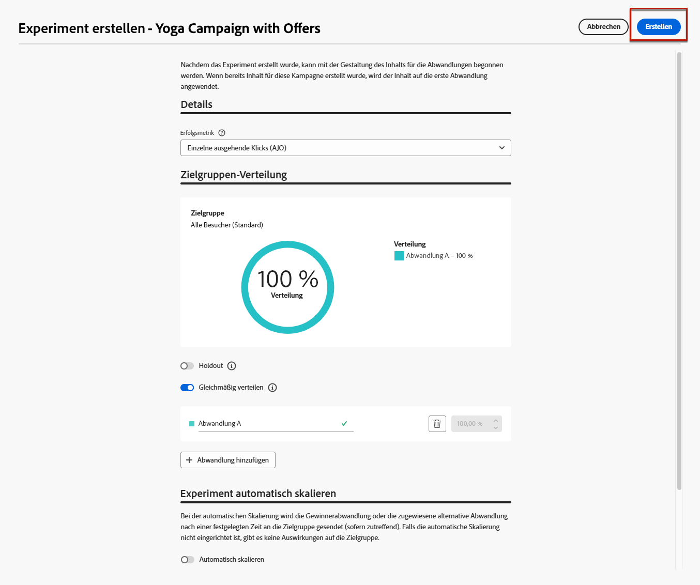

# Anwendungsfall für die Entscheidungsfindung {#experience-decisioning-uc}

In diesem Anwendungsbeispiel werden alle Schritte vorgestellt, die zur Verwendung von Decisioning mit dem [!DNL Journey Optimizer] Code-basierten Kanal erforderlich sind.

In diesem Beispiel sind Sie sich nicht sicher, ob eine bestimmte Rangfolgenformel eine bessere Leistung als die vorab zugewiesenen Angebotsprioritäten erzielt.

Um zu messen, welche für Ihre Zielgruppe am besten geeignet ist, erstellen Sie eine Kampagne mit [Inhaltsexperiment](../content-management/content-experiment.md) in dem Sie zwei Abwandlungen für den Versand definieren:

* Die erste Abwandlung verwendet Priorität als Rangfolgenmethode.
* Die zweite Variante verwendet eine Formel, die die Rangfolgenmethode ist.

## Erstellen von Auswahlstrategien

Zunächst müssen Sie zwei Auswahlstrategien erstellen: eine mit Priorität als Ranking-Methode und eine mit einer Formel als Ranking-Methode.

### Erstellen der ersten Auswahlstrategie

Gehen Sie wie folgt vor, um die erste Auswahlstrategie mit Priorität als Rangfolgenmethode zu erstellen.

1. Erstellen Sie ein Entscheidungselement. [Weitere Informationen](items.md)

1. Legen Sie **[!UICONTROL Priorität]** des Entscheidungselements im Vergleich zu anderen fest. Wenn ein Profil für mehrere Elemente qualifiziert ist, gewährt eine höhere Priorität dem Element Vorrang vor anderen.

   

   >[!NOTE]
   >
   >Die Priorität ist ein ganzzahliger Datentyp. Alle Attribute, bei denen es sich um ganzzahlige Datentypen handelt, sollten ganzzahlige Werte (ohne Dezimalstellen) enthalten.

1. Legen Sie die Eignung des Entscheidungselements fest:

   * Audiences oder Regeln definieren, um das Element auf bestimmte Profile zu beschränken. [Weitere Informationen](items.md#eligibility)

   * Legen Sie Begrenzungsregeln fest, um festzulegen, wie oft ein Angebot maximal unterbreitet werden kann. [Weitere Informationen](items.md#capping)

1. Wiederholen Sie bei Bedarf die obigen Schritte, um zusätzliche Entscheidungselemente zu erstellen.

1. Erstellen Sie **Sammlung** in der Ihre Entscheidungselemente enthalten sein werden. [Weitere Informationen](collections.md)

1. Erstellen Sie [Auswahlstrategie](selection-strategies.md#create-selection-strategy) und wählen Sie die [Sammlung](collections.md) aus, die die zu berücksichtigenden Angebote enthält.

1. [Wählen Sie die Rangfolgenmethode aus](#select-ranking-method) um das beste Angebot für jedes Profil auszuwählen. Wählen Sie in diesem Fall **[!UICONTROL Angebotspriorität]** aus: Wenn mehrere Angebote für diese Strategie infrage kommen, verwendet die Decisioning-Engine den Wert, **[!UICONTROL in den Angeboten]** als „Priorität“ festgelegt wurde. [Weitere Informationen](selection-strategies.md#offer-priority)

   

### Erstellen der zweiten Auswahlstrategie

Gehen Sie wie folgt vor, um die zweite Auswahlstrategie mit einer Formel als Ranking-Methode zu erstellen.

1. Erstellen Sie ein Entscheidungselement. [Weitere Informationen](items.md)

   <!--1. Set the same **[!UICONTROL Priority]** as for the first decision item. TBC?-->

1. Legen Sie die Eignung des Entscheidungselements fest:

   * Audiences oder Regeln definieren, um das Element auf bestimmte Profile zu beschränken. [Weitere Informationen](items.md#eligibility)

   * Legen Sie Begrenzungsregeln fest, um festzulegen, wie oft ein Angebot maximal unterbreitet werden kann. [Weitere Informationen](items.md#capping)

1. Wiederholen Sie bei Bedarf die obigen Schritte, um zusätzliche Entscheidungselemente zu erstellen.

1. Erstellen Sie **Sammlung** in der Ihre Entscheidungselemente enthalten sein werden. [Weitere Informationen](collections.md)

1. Erstellen Sie [Auswahlstrategie](selection-strategies.md#create-selection-strategy) und wählen Sie die [Sammlung](collections.md) aus, die die zu berücksichtigenden Angebote enthält.

1. [Wählen Sie die Rangfolgenmethode aus](#select-ranking-method) mit der Sie das beste Angebot für jedes Profil auswählen möchten. Wählen Sie in diesem Fall **[!UICONTROL Formel]**, um anhand eines bestimmten berechneten Ergebnisses zu bestimmen, welches geeignete Angebot bereitgestellt werden soll. [Weitere Informationen](selection-strategies.md#ranking-formula)

   

## Erstellen einer Code-basierten Erlebniskampagne

<!--To present the best dynamic offer and experience to your visitors on your website or mobile app, add a decision policy to a code-based campaign.

Define two delivery treatments each containing a different decision policy.-->

Nachdem Sie die beiden Auswahlstrategien konfiguriert haben, erstellen Sie eine Code-basierte Erlebniskampagne, in der Sie für jede Strategie eine andere Behandlung definieren, um zu vergleichen, welche am besten funktioniert.

1. Erstellen Sie eine Kampagne und wählen Sie die Aktion **[!UICONTROL Code-basiertes Erlebnis]** aus. [Weitere Informationen](../code-based/create-code-based.md)

1. Wenn Ihr Versand personalisiert wurde, klicken Sie auf der Übersichtsseite der Kampagne auf **[!UICONTROL Experiment erstellen]**, um mit der Konfiguration Ihres Inhaltsexperiments zu beginnen. [Weitere Informationen](../content-management/content-experiment.md)

   

1. Wählen oder erstellen Sie auf der Übersichtsseite der Kampagne eine Code-basierte Konfiguration und klicken Sie auf **[!UICONTROL Inhalt bearbeiten]**.

   

<!--1. Sart personalizing **Treatment A** by clicking **[!UICONTROL Create]**.

    -->

1. Beginnen Sie im Fenster zur Inhaltsbearbeitung mit der Personalisierung **Abwandlung A**, indem Sie auf **[!UICONTROL Code bearbeiten]** klicken.

   

1. Wählen Sie **[!UICONTROL Entscheidungsrichtlinie]** aus, klicken Sie auf **[!UICONTROL Entscheidungsrichtlinie hinzufügen]** und geben Sie die Entscheidungsdetails ein. [Weitere Informationen](create-decision.md)

   

1. Wählen Sie die erste erstellte Strategie aus. Klicken Sie auf **[!UICONTROL Strategie hinzufügen]**.

1. Klicken Sie auf **[!UICONTROL Erstellen]**. Die neue Entscheidung wird unter **[!UICONTROL Entscheidungen]** hinzugefügt.

   

1. Klicken Sie auf das Symbol für weitere Aktionen (drei Punkte) und wählen Sie **[!UICONTROL Hinzufügen]** aus. Jetzt können Sie alle Entscheidungsattribute hinzufügen, die Sie darin haben möchten.

   

1. Sie können auch jedes beliebige Attribut hinzufügen, das im Personalisierungseditor verfügbar ist, z. B. Profilattribute.

   

1. Wählen Sie im Fenster zur Inhaltsbearbeitung die Option **Variante B** und wiederholen Sie die obigen Schritte, um eine weitere Entscheidungsrichtlinie zu erstellen, und wählen Sie die zweite von Ihnen erstellte Auswahlstrategie aus.

   

1. Speichern Sie Ihren Inhalt.
