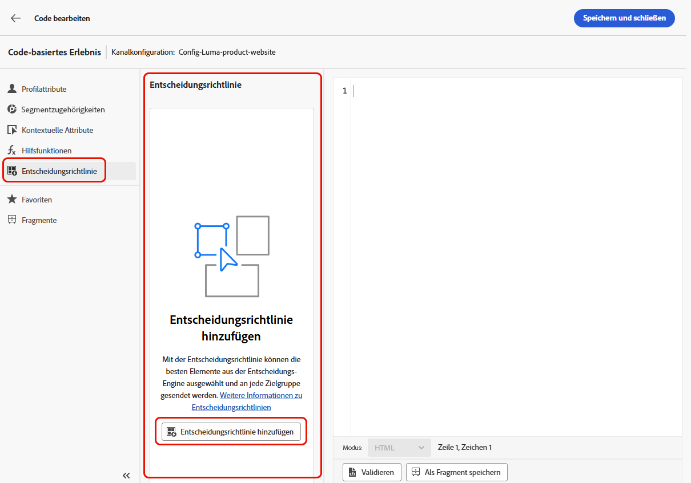

# Anwendungsfall für die Entscheidungsfindung {#experience-decisioning-uc}

In diesem Anwendungsfall werden alle Schritte vorgestellt, die zur Verwendung der Entscheidungsfindung mit dem Code-basierten [!DNL Journey Optimizer]-Kanal erforderlich sind.

In diesem Beispiel sind Sie sich nicht sicher, ob eine bestimmte Rangfolgenformel eine bessere Leistung als die vorab zugewiesenen Angebotsprioritäten erzielt. Um zu messen, welche für Ihre Zielgruppe am besten geeignet ist, erstellen Sie eine Kampagne mit [Inhaltsexperiment](../content-management/content-experiment.md) in dem Sie zwei Abwandlungen für den Versand definieren:

* Die erste Abwandlung verwendet die Priorität als Rangfolgenmethode.
* Die zweite Abwandlung verwendet eine Formel als Rangfolgenmethode.

## Erstellen von Auswahlstrategien

Zunächst müssen Sie zwei Auswahlstrategien erstellen: eine mit der Priorität und eine mit einer Formel als Rangfolgenmethode.

>[!NOTE]
>
>Sie können auch einzelne Entscheidungselemente erstellen, ohne eine Auswahlstrategie durchlaufen zu müssen. Es wird die für jedes Element festgelegte Priorität angewendet.

### Erstellen einer Strategie mit Priorität

Erstellen Sie die erste Auswahlstrategie mit der Priorität als Rangfolgenmethode anhand der folgenden Schritte.

1. Erstellen Sie ein Entscheidungselement. [Weitere Informationen](items.md)

1. Legen Sie die **[!UICONTROL Priorität]** des Entscheidungselements im Vergleich zu anderen fest. Wenn ein Profil für mehrere Elemente qualifiziert ist, gewährt eine höhere Priorität dem Element Vorrang vor anderen.

   {width="90%"}

   >[!NOTE]
   >
   >Die Priorität ist ein ganzzahliger Datentyp. Alle Attribute, bei denen es sich um ganzzahlige Datentypen handelt, sollten ganzzahlige Werte (ohne Dezimalstellen) enthalten.

1. Legen Sie die Eignung des Entscheidungselements fest:

   * Legen Sie mithilfe von Zielgruppen oder Regeln Einschränkungen fest, um jedes Element auf bestimmte Profile zu beschränken. [Weitere Informationen](items.md#eligibility)

   * Legen Sie mithilfe von Begrenzungsregeln fest, wie oft ein Angebot maximal unterbreitet werden kann. [Weitere Informationen](items.md#capping)

1. Wiederholen Sie bei Bedarf die obigen Schritte, um zusätzliche Entscheidungselemente zu erstellen.

1. Erstellen Sie eine **Sammlung**, in der die Entscheidungselemente enthalten sein werden. [Weitere Informationen](collections.md)

1. Erstellen Sie eine [Auswahlstrategie](selection-strategies.md#create-selection-strategy) und wählen Sie die [Sammlung](collections.md) aus, die die zu berücksichtigenden Angebote enthält.

1. [Wählen Sie die Rangfolgenmethode](#select-ranking-method), die zur Auswahl des besten Angebots für jedes Profil verwendet werden soll. Wählen Sie in diesem Fall **[!UICONTROL Angebotspriorität]** aus: Wenn mehrere Angebote für diese Strategie infrage kommen, verwendet die Entscheidungsfindungs-Engine den Wert, der in den Angeboten als **[!UICONTROL Priorität]** festgelegt wurde. [Weitere Informationen](selection-strategies.md#offer-priority)

   {width="90%"}

### Eine andere Strategie mit einer Formel erstellen

Um die zweite Auswahlstrategie mit einer Formel als Rangfolgenmethode zu erstellen, gehen Sie wie folgt vor.

1. Erstellen Sie ein Entscheidungselement. [Weitere Informationen](items.md)

   <!--Do you need to set the same **[!UICONTROL Priority]** as for the first decision item, or it won't be considered at all?-->

1. Legen Sie die Eignung des Entscheidungselements fest:

   * Legen Sie mithilfe von Zielgruppen oder Regeln Einschränkungen fest, um jedes Element auf bestimmte Profile zu beschränken. [Weitere Informationen](items.md#eligibility)

   * Legen Sie mithilfe von Begrenzungsregeln fest, wie oft ein Angebot maximal unterbreitet werden kann. [Weitere Informationen](items.md#capping)

1. Wiederholen Sie bei Bedarf die obigen Schritte, um zusätzliche Entscheidungselemente zu erstellen.

1. Erstellen Sie eine **Sammlung**, in der die Entscheidungselemente enthalten sein werden. [Weitere Informationen](collections.md)

1. Erstellen Sie eine [Auswahlstrategie](selection-strategies.md#create-selection-strategy) und wählen Sie die [Sammlung](collections.md) aus, die die zu berücksichtigenden Angebote enthält.

1. [Wählen Sie die Rangfolgenmethode](#select-ranking-method), die Sie zur Auswahl des besten Angebots für jedes Profil verwenden möchten. Wählen Sie in diesem Fall **[!UICONTROL Formel]**, um anhand eines bestimmten berechneten Ergebnisses zu bestimmen, welches geeignete Angebot bereitgestellt werden soll. [Weitere Informationen](selection-strategies.md#ranking-formula)

   {width="90%"}

## Erstellen einer Code-basierten Erlebniskampagne

<!--To present the best dynamic offer and experience to your visitors on your website or mobile app, add a decision policy to a code-based campaign.

Define two delivery treatments each containing a different decision policy.-->

Nachdem Sie die beiden Auswahlstrategien konfiguriert haben, erstellen Sie eine Code-basierte Erlebniskampagne, in der Sie für jede Strategie eine andere Behandlung definieren, um zu vergleichen, welche am besten funktioniert.

1. Erstellen Sie eine Kampagne und wählen Sie die Aktion **[!UICONTROL Code-basiertes Erlebnis]** aus. [Weitere Informationen](../code-based/create-code-based.md)

1. Wenn Ihr Versand personalisiert wurde, klicken Sie auf der Übersichtsseite der Kampagne auf **[!UICONTROL Experiment erstellen]**, um mit der Konfiguration Ihres Inhaltsexperiments zu beginnen. [Weitere Informationen](../content-management/content-experiment.md)

   {width="90%"}

1. Wählen Sie auf der Übersichtsseite der Kampagne eine Code-basierte Konfiguration aus und klicken Sie auf **[!UICONTROL Inhalt bearbeiten]**.

   {width="90%"}

1. Klicken Sie im Fenster zur Inhaltsbearbeitung auf **Code bearbeiten** **[!UICONTROL , um mit der Personalisierung zu]**.

   {width="90%"}

1. Wählen Sie im [Code](../code-based/create-code-based.md#edit-code)Editor die Option **[!UICONTROL Entscheidungsrichtlinie]** aus, klicken Sie auf **[!UICONTROL Entscheidungsrichtlinie hinzufügen]** und geben Sie die Entscheidungsdetails ein. [Weitere Informationen](create-decision.md#add)

   {width="90%"}

1. Klicken Sie **[!UICONTROL Abschnitt &quot;]**&quot; auf die Schaltfläche **[!UICONTROL Hinzufügen]** und wählen Sie **[!UICONTROL Auswahlstrategie]**. [Weitere Informationen](create-decision.md#select)

   {width="80%"}

   >[!NOTE]
   >
   >Sie können auch &quot;**[!UICONTROL &quot; auswählen]** um einzelne Elemente hinzuzufügen, ohne eine Auswahlstrategie durchlaufen zu müssen. Es wird die für jedes Element festgelegte Priorität angewendet.

1. Wählen Sie die erste erstellte Strategie aus.

   {width="90%"}

1. Speichern Sie Ihre Änderungen und klicken Sie auf **[!UICONTROL Erstellen]**. Die neue Entscheidung wird unter &quot;**[!UICONTROL &quot;]**.

1. Klicken Sie auf die Schaltfläche **[!UICONTROL Richtlinie einfügen]**. Der Code, der der Entscheidungsrichtlinie entspricht, wird hinzugefügt. Fügen Sie dann alle Attribute, die Sie dem Code hinzufügen möchten, einschließlich Profilattribute, hinzu. [Weitere Informationen](create-decision.md#use-decision-policy)

   {width="90%"}

1. Speichern Sie Ihre Änderungen.

1. Gehen Sie zurück zum Fenster zur Inhaltsbearbeitung, wählen Sie die Schaltfläche &quot;+&quot; aus, um **Abwandlung B** hinzuzufügen, wählen Sie sie aus und klicken Sie auf **[!UICONTROL Code bearbeiten]**.

   {width="90%"}

1. Wiederholen Sie die obigen Schritte, um eine weitere Entscheidungsrichtlinie zu erstellen und die zweite von Ihnen erstellte Auswahlstrategie auszuwählen. <!--Do you need to create exactly the same content to compare only the ranking method?-->

1. Speichern Sie Ihre Änderungen und [veröffentlichen Sie Ihre Code-basierte Erlebniskampagne](../code-based/publish-code-based.md).

Mit dem Experimentierkampagnenbericht und dem [Bericht zur Entscheidungsfindung](../reports/campaign-global-report-cja-experimentation.md) können Sie verfolgen[ wie Ihre Kampagne ](cja-reporting.md). <!--TBC how to check which treatment performs best-->