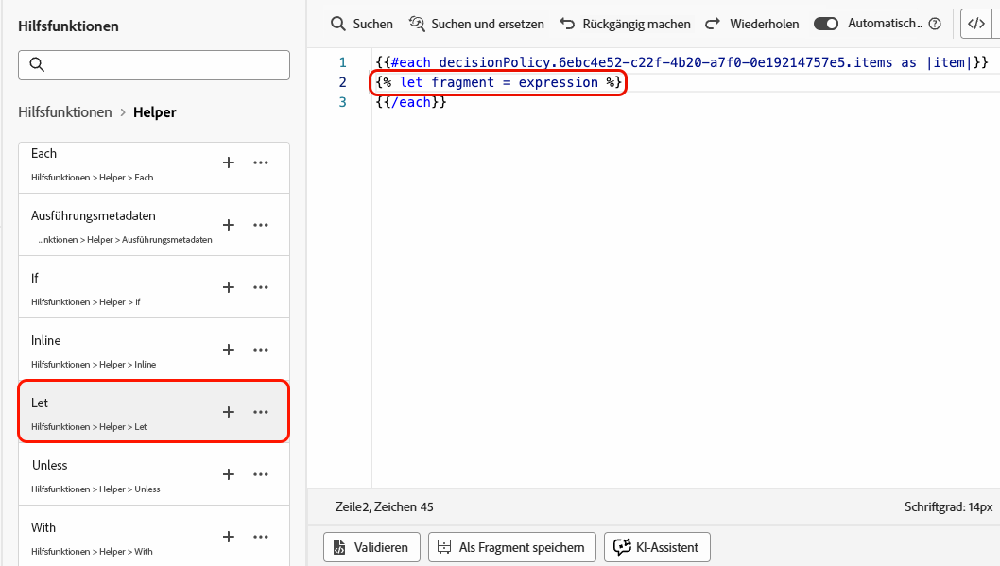
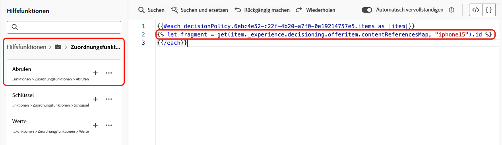
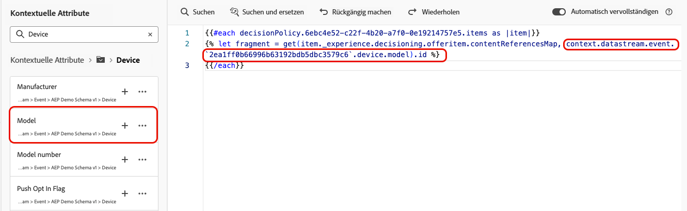
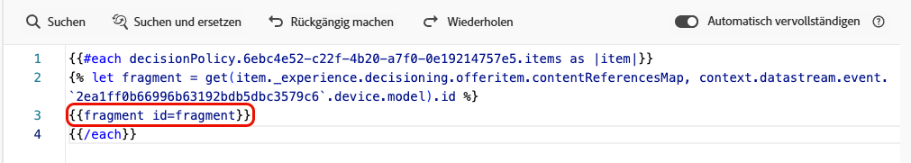

# Nutzen von Fragmenten in Entscheidungsrichtlinien {#fragments}

Wenn Ihre Entscheidungsrichtlinie Entscheidungselemente einschließlich Fragmenten enthält, können Sie diese Fragmente im Entscheidungsrichtlinien-Code nutzen. [Erfahren Sie mehr über Fragmente](../content-management/fragments.md)

>[!AVAILABILITY]
>
>Diese Funktion ist derzeit nur für den Kanal **Code-basiertes Erlebnis** und für eine Reihe von Organisationen verfügbar (eingeschränkte Verfügbarkeit). Weitere Informationen erhalten Sie beim Adobe-Support.

Angenommen, Sie möchten verschiedene Inhalte für mehrere Mobilgerätemodelle anzeigen. Stellen Sie sicher, dass Sie Fragmente, die diesen Geräten entsprechen, zu dem Entscheidungselement hinzugefügt haben, das Sie in der Entscheidungsrichtlinie verwenden. [Weitere Informationen](items.md#attributes).

{width=70%}

Anschließend können Sie eine der folgenden Methoden verwenden:

>[!BEGINTABS]

>[!TAB Code direkt einfügen]

Kopieren Sie einfach den unten stehenden Code-Block in den Entscheidungsrichtlinien-Code. Ersetzen Sie `variable` durch die Fragment-ID und `placement` durch den Fragmentverweisschlüssel:

```

{{fragment id = variable}}
```

>[!TAB Befolgen Sie die detaillierten Schritte]

1. Navigieren Sie zu den **[!UICONTROL Hilfsfunktionen]** und fügen Sie die **Let**-Funktion ` {{variable}}` zum Code-Bereich hinzu, in dem Sie die Variable für Ihr Fragment deklarieren können.

   

1. Verwenden Sie die auf **Map** > **Get** basierende Funktion ``, um Ihren Ausdruck zu erstellen. Die Zuordnung ist das Fragment, auf das im Entscheidungselement verwiesen wird, und die Zeichenfolge kann das Gerätemodell sein, das Sie im Entscheidungselement als **[!UICONTROL Fragmentverweisschlüssel]** eingegeben haben.

   

1. Sie können auch ein kontextuelles Attribut verwenden, das diese Gerätemodell-ID enthält.

   

1. Fügen Sie die Variable hinzu, die Sie für Ihr Fragment als Fragment-ID ausgewählt haben.

   

>[!ENDTABS]

Die Fragment-ID und der Referenzschlüssel werden später im Abschnitt **[!UICONTROL Fragmente]** des Entscheidungselements ausgewählt.

>[!WARNING]
>
>Wenn der Fragmentschlüssel falsch oder der Fragmentinhalt ungültig ist, schlägt das Rendern fehl und verursacht einen Fehler im Edge-Aufruf.

## Leitlinien bei der Verwendung von Fragmenten {#fragments-guardrails}

**Entscheidungselement- und Kontextattribute**

Entscheidungselement- und Kontextattribute werden in [!DNL Journey Optimizer]-Fragmenten nicht standardmäßig unterstützt. Sie können jedoch stattdessen globale Variablen verwenden, wie unten beschrieben.

Angenommen, Sie möchten die Variable *sport* in Ihrem Fragment verwenden.

1. Verweisen Sie auf diese Variable im Fragment, z. B.:

   ```
   Elevate your practice with new {{sport}} gear!
   ```

1. Definieren Sie die Variable mit der Funktion **Let** im Entscheidungsrichtlinienblock. Im folgenden Beispiel wird *sport* mit dem Entscheidungsattribut definiert:

   ```
   {#each decisionPolicy.13e1d23d-b8a7-4f71-a32e-d833c51361e0.items as |item|}}
   
   {{fragment id = get(item._experience.decisioning.offeritem.contentReferencesMap, "placement1").id }}
   {{/each}}
   ```

**Inhaltsvalidierung von Entscheidungselementfragmenten**

* Aufgrund der Dynamik dieser Fragmente wird bei Verwendung in einer Kampagne die Nachrichtenvalidierung während der Erstellung des Kampagneninhalts für Fragmente übersprungen, auf die in Entscheidungselementen verwiesen wird.

* Die Validierung des Fragmentinhalts erfolgt nur während der Erstellung und Veröffentlichung des Fragments.

* Im Fall von JSON-Fragmenten wird die Gültigkeit des JSON-Objekts nicht sichergestellt. Stellen Sie sicher, dass der Ausdrucksfragmentinhalt ein gültiger JSON-Inhalt ist, damit er in Entscheidungselementen verwendet werden kann.

Zur Laufzeit wird der Kampagneninhalt (einschließlich des Fragmentinhalts aus Entscheidungselementen) validiert. Im Falle eines Validierungsfehlers wird die Kampagne nicht gerendert.
