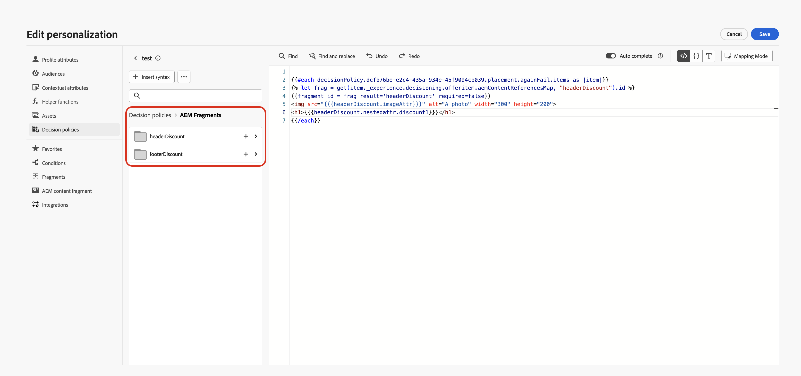

# Nutzen von Fragmenten in Entscheidungsrichtlinien {#fragments}

Entscheidungselemente unterstützen zwei Arten von Fragmentinhalten, die beim Verfassen von Nachrichten innerhalb einer Entscheidungsrichtlinie genutzt werden können:

* **Journey Optimizer-Inhaltsfragmente** - wiederverwendbare Ausdrucksfragmente, die in Journey Optimizer erstellt und zum Abschnitt „Fragmente **[!UICONTROL des Entscheidungselements hinzugefügt]**. [Erfahren Sie mehr über AJO-Inhaltsfragmente](../content-management/fragments.md)
* **AEM-Inhaltsfragmente** - Inhalte, die in Adobe Experience Manager verfasst, den Attributen des Entscheidungselements zugeordnet und im Personalisierungseditor nach Schlüsselnamen ausgewählt werden. [Erfahren Sie, wie Sie ein AEM-Inhaltsfragment mit einem Entscheidungselement verknüpfen](items.md#aem-fragments)

## Journey Optimizer-Inhaltsfragmente {#ajo-fragments}

Wenn Ihre Entscheidungsrichtlinie Entscheidungselemente einschließlich AJO-Inhaltsfragmenten enthält, können Sie diese Fragmente beim Verfassen einer Nachricht innerhalb der Entscheidungsrichtlinie auf allen Kanälen nutzen, auf denen die Entscheidungsfindung verfügbar ist (Code-basiertes Erlebnis, E-Mail, Push, SMS und Journey).

Angenommen, Sie möchten verschiedene Inhalte für mehrere Mobilgerätemodelle anzeigen. Fügen Sie die angegebenen Fragmente, die sich jeweils auf ein anderes Telefonmodell beziehen, zu dem Entscheidungselement hinzu, das Sie in der Entscheidungsrichtlinie verwenden. [Erfahren Sie, wie Sie Fragmente zu einem Entscheidungselement hinzufügen](items.md#attributes).

{width=70%}

Anschließend können Sie eine der folgenden Methoden verwenden:

>[!BEGINTABS]

>[!TAB Code direkt einfügen]

Kopieren Sie einfach den unten stehenden Code-Block in den Entscheidungsrichtlinien-Code. Ersetzen Sie `variable` durch die Fragment-ID und `placement` durch den Fragmentverweisschlüssel:

```handlebars

{{fragment id = variable required=false}}
```

>[!TAB Befolgen Sie die detaillierten Schritte]

1. Navigieren Sie zu den **[!UICONTROL Hilfsfunktionen]** und fügen Sie die **Let**-Funktion ` {{variable}}` zum Code-Bereich hinzu, in dem Sie die Variable für Ihr Fragment deklarieren können.

   

1. Verwenden Sie die auf **Map** > **Get** basierende Funktion ``, um Ihren Ausdruck zu erstellen. Die Zuordnung ist das Fragment, auf das im Entscheidungselement verwiesen wird. Die Zeichenfolge kann das Gerätemodell sein, das Sie im Entscheidungselement als **[!UICONTROL Fragmentverweisschlüssel“ eingegeben]**.

   

1. Sie können auch ein kontextuelles Attribut verwenden, das diese Gerätemodell-ID enthält.

   

1. Fügen Sie die Variable hinzu, die Sie für Ihr Fragment als Fragment-ID ausgewählt haben.

   

>[!ENDTABS]

Die Fragment-ID und der Referenzschlüssel werden später im Abschnitt **[!UICONTROL Fragmente]** des Entscheidungselements ausgewählt.

>[!WARNING]
>
>Wenn der Fragmentschlüssel falsch ist oder der Fragmentinhalt ungültig ist, kann das Rendering fehlschlagen und einen Fehler im Edge-Aufruf verursachen.
>
>Um Fehler zu vermeiden, wenn ein Fragment vorübergehend nicht verfügbar ist, wird das `required=false`-Flag verwendet, sodass das Fragment stattdessen übersprungen wird. [Erfahren Sie mehr über vorübergehend nicht verfügbare Fragmente](#temporary-unavailable-fragments)

### Verwendung und Leitlinien {#fragments-guardrails}

Die folgenden Leitplanken gelten speziell für **AJO-Inhaltsfragmente** die in Entscheidungselementen verwendet werden.

+++Simulieren von Inhalts- und Ausdrucksfragmenten in E-Mails

Für den **E-Mail**-Kanal werden mit einem Entscheidungselement verknüpfte Ausdrucksfragmente korrekt angezeigt, wenn Sie **[!UICONTROL Testversand durchführen]** oder die Kampagne aktiviert wird. In **[!UICONTROL Inhalt simulieren]** wird das Ausdrucksfragment jedoch nicht aus dem Entscheidungselement angezeigt.

+++

+++Visuelle Fragmente und Entscheidungselemente in E-Mails

Sie können einem Entscheidungselement kein **[!UICONTROL visuelles Fragment]** zuweisen, nur **Ausdrucksfragmente** werden in diesem Kontext unterstützt.

+++

+++Entscheidungselement- und Kontextattribute

Entscheidungselementattribute und kontextuelle Attribute werden in [!DNL Journey Optimizer] Fragmenten nicht standardmäßig unterstützt. Sie können jedoch stattdessen globale Variablen verwenden, wie unten beschrieben.

Angenommen, Sie möchten die Variable *sport* in Ihrem Fragment verwenden.

1. Verweisen Sie auf diese Variable im Fragment, z. B.:

   ```text
   Elevate your practice with new {{sport}} gear!
   ```

1. Definieren Sie die Variable mit der Funktion **Let** im Entscheidungsrichtlinienblock. Im folgenden Beispiel wird *sport* mit dem Entscheidungsattribut definiert:

   ```handlebars
   {#each decisionPolicy.13e1d23d-b8a7-4f71-a32e-d833c51361e0.items as |item|}}
   
   {{fragment id = get(item._experience.decisioning.offeritem.contentReferencesMap, "placement1").id }}
   {{/each}}
   ```

+++

+++Validierung des Inhalts eines Entscheidungsfragments

* Aufgrund der Dynamik dieser Fragmente wird bei Verwendung in einer Kampagne die Nachrichtenvalidierung bei der Erstellung von Kampagneninhalten für Fragmente übersprungen, auf die in Entscheidungselementen verwiesen wird.

* Die Validierung des Fragmentinhalts erfolgt nur während der Erstellung und Veröffentlichung des Fragments.

* Bei Ausdrucksfragmenten vom Typ JSON wird der Inhalt beim Speichern des Fragments syntaktisch validiert. Validierungsfehler werden als Warnhinweise angezeigt.

Zur Laufzeit wird der Kampagneninhalt (einschließlich des Fragmentinhalts aus Entscheidungselementen) validiert. Im Falle eines Validierungsfehlers wird die Kampagne nicht gerendert.

+++

+++Vorübergehend nicht verfügbare Fragmente werden übersprungen {#temporary-unavailable-fragments}

Wenn Journey oder Kampagnen auf Fragmente verweisen, die an Entscheidungselemente angehängt sind, kann es zu kurzen Synchronisierungsverzögerungen kommen, bevor aktualisierte Fragmente in Edge verfügbar sind.

Um Fehler zu vermeiden, wenn ein Fragment vorübergehend nicht verfügbar ist, ist für Fragmente jetzt das `required`-Flag standardmäßig auf `false` festgelegt, sodass sie übersprungen werden, anstatt einen Journey- oder Kampagnenfehler zu verursachen.

Das bedeutet, dass ein Fragment einfach ignoriert wird, wenn es vorübergehend in Edge nicht verfügbar ist. Wenn das Fragment verfügbar ist, wird es normal gerendert.

**Beispiel**

Wenn Ihre Entscheidungsrichtlinie für zwei Angebote qualifiziert ist und jedes ein Fragment hat - z. B. „20 % Rabatt“ und „30 % Rabatt“ - und das zweite Fragment vorübergehend nicht verfügbar ist, mit `required=false` das System das verfügbare Angebot rendert (20 % Rabatt) und das andere Fragment (30 % Rabatt) überspringt, anstatt die Journey oder Kampagne fehlschlagen zu lassen. Dies erhöht die Zuverlässigkeit bei der Synchronisierung von Inhalten.

+++

>[!NOTE]
>
>Sie können ein Fragment weiterhin als obligatorisch markieren, indem Sie die `required`-Markierung auf `true` setzen. Wenn ein Fragment jedoch vorübergehend fehlt, kann dies dazu führen, dass das Journey- oder Kampagnen-Rendering fehlschlägt.

## AEM-Inhaltsfragmente {#aem-fragments-decisioning}

>[!AVAILABILITY]
>
>Diese Funktion ist nur in begrenztem Umfang für ausgehende Kanäle mit Entscheidungsunterstützung verfügbar. Wenden Sie sich an Ihren Adobe-Support-Mitarbeiter, um Zugriff anzufordern.

Bevor Sie AEM-Inhaltsfragmente in einer Entscheidungsrichtlinie nutzen, stellen Sie Folgendes sicher:

* hat Ihr Inhaltsfragment in Adobe Experience Manager erstellt und mit `ajo-enabled:{OrgId}/{SandboxName}` getaggt, damit es von Journey Optimizer gefunden werden kann. [Erfahren Sie, wie Sie ein Tag erstellen und zuweisen](../integrations/aem-fragments.md#create-tag)
* Das Fragment an den Abschnitt **[!UICONTROL AEM Fragments]** des Angebotselements gebunden, indem ihm ein eindeutiger Referenzname zugewiesen wird. [Erfahren Sie, wie Sie ein AEM-Inhaltsfragment mit einem Entscheidungselement verknüpfen](items.md#attributes)

Im Personalisierungseditor sind alle AEM-Inhaltsfragmente verfügbar, die mit den von der Richtlinie ausgewählten Entscheidungselementen verknüpft sind. Pro Fragmentschlüsselname wird ein Ordner angezeigt.

In diesem Beispiel enthält die Entscheidungsrichtlinie zwei Entscheidungselemente, an die AEM-Fragmente über ihren Referenznamen gebunden sind.



1. Klicken Sie auf die Schaltfläche &quot;+&quot;, um das gewünschte Fragment zu Ihrem Ausdruck hinzuzufügen.

   Da an einen einzelnen Referenznamen mehrere Fragmente über verschiedene Angebotselemente hinweg gebunden sein können, bestimmt Decisioning anhand der Ranking-Kriterien der Entscheidungsrichtlinie das beste für jeden Kunden.

1. Nachdem das Fragment ausgewählt wurde, können Sie seine Attribute wie Bild-URLs, Textfelder oder andere Inhalte nutzen und mithilfe von Decisioning den richtigen Inhalt zum richtigen Zeitpunkt für den richtigen Kunden darstellen.

   

1. Vor der Aktivierung Ihrer Kampagne oder Journey können Sie **[!UICONTROL Inhalt simulieren]** verwenden, um eine Vorschau anzuzeigen, wie die Feldwerte des AEM-Inhaltsfragments für ein bestimmtes Testprofil gerendert werden. [Erfahren Sie mehr über die Simulation von Inhalten](../content-management/preview-test.md)
