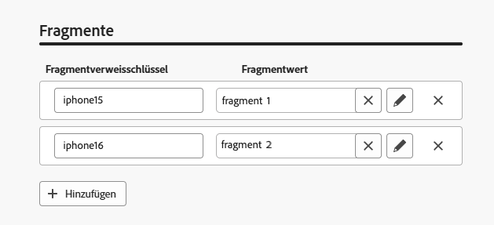
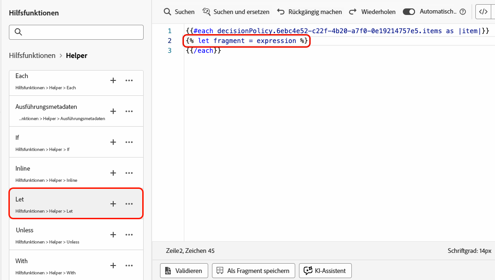
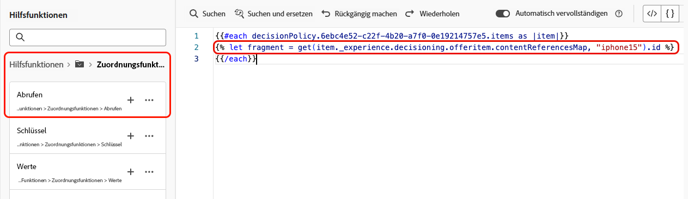
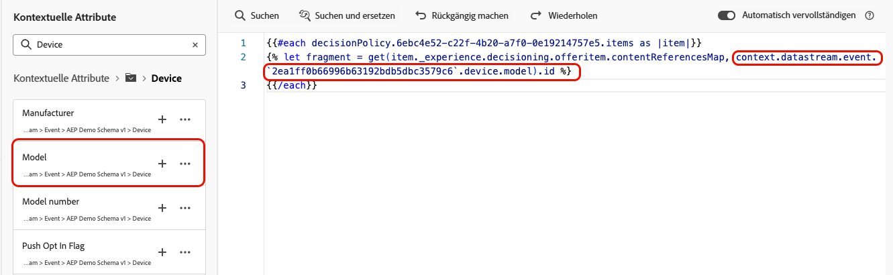
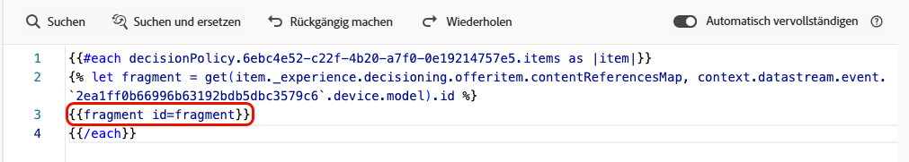

# Nutzen von Fragmenten in Entscheidungsrichtlinien {#fragments}

Wenn Ihre Entscheidungsrichtlinie Entscheidungselemente einschließlich Fragmenten enthält, können Sie diese Fragmente beim Verfassen einer Nachricht innerhalb der Entscheidungsrichtlinie nutzen. [Erfahren Sie mehr über Fragmente](../content-management/fragments.md)

>[!AVAILABILITY]
>
>Diese Funktion ist in begrenzter Verfügbarkeit für die Kanäle **Code-basiertes Erlebnis** und **E-Mail** verfügbar. Wenden Sie sich an Ihren Adobe-Support-Mitarbeiter, um Zugriff anzufordern.

Angenommen, Sie möchten verschiedene Inhalte für mehrere Mobilgerätemodelle anzeigen. Fügen Sie die angegebenen Fragmente, die sich jeweils auf ein anderes Telefonmodell beziehen, zu dem Entscheidungselement hinzu, das Sie in der Entscheidungsrichtlinie verwenden. [Weitere Informationen](items.md#attributes).

{width=70%}

Anschließend können Sie eine der folgenden Methoden verwenden:

>[!BEGINTABS]

>[!TAB Code direkt einfügen]

Kopieren Sie einfach den unten stehenden Code-Block in den Entscheidungsrichtlinien-Code. Ersetzen Sie `variable` durch die Fragment-ID und `placement` durch den Fragmentverweisschlüssel:

```handlebars

{{fragment id = variable required=false}}
```

>[!TAB Befolgen Sie die detaillierten Schritte]

1. Navigieren Sie zu den **[!UICONTROL Hilfsfunktionen]** und fügen Sie die **Let**-Funktion ` {{variable}}` zum Code-Bereich hinzu, in dem Sie die Variable für Ihr Fragment deklarieren können.

   

1. Verwenden Sie die auf **Map** > **Get** basierende Funktion ``, um Ihren Ausdruck zu erstellen. Die Zuordnung ist das Fragment, auf das im Entscheidungselement verwiesen wird. Die Zeichenfolge kann das Gerätemodell sein, das Sie im Entscheidungselement als **[!UICONTROL Fragmentverweisschlüssel“ eingegeben]**.

   

1. Sie können auch ein kontextuelles Attribut verwenden, das diese Gerätemodell-ID enthält.

   

1. Fügen Sie die Variable hinzu, die Sie für Ihr Fragment als Fragment-ID ausgewählt haben.

   

>[!ENDTABS]

Die Fragment-ID und der Referenzschlüssel werden später im Abschnitt **[!UICONTROL Fragmente]** des Entscheidungselements ausgewählt.

>[!WARNING]
>
>Wenn der Fragmentschlüssel falsch ist oder der Fragmentinhalt ungültig ist, kann das Rendering fehlschlagen und einen Fehler im Edge-Aufruf verursachen.
>
>Um Fehler zu vermeiden, wenn ein Fragment vorübergehend nicht verfügbar ist, wird das `required=false`-Flag verwendet, sodass das Fragment stattdessen übersprungen wird. [Weitere Informationen](#temporary-unavailable-fragments)

## Verwendung und Leitlinien {#fragments-guardrails}

### Simulieren von Inhalts- und Ausdrucksfragmenten in E-Mails {#simulate-content-expression-fragments}

Für den **E-Mail**-Kanal werden mit einem Entscheidungselement verknüpfte Ausdrucksfragmente korrekt angezeigt, wenn Sie **[!UICONTROL Testversand durchführen]** oder die Kampagne aktiviert wird. In **[!UICONTROL Inhalt simulieren]** wird das Ausdrucksfragment jedoch nicht aus dem Entscheidungselement angezeigt.

### Visuelle Fragmente und Entscheidungselemente in E-Mails {#visual-fragments-decision-items}

Sie können einem Entscheidungselement kein **[!UICONTROL visuelles Fragment]** zuweisen, nur **Ausdrucksfragmente** werden in diesem Kontext unterstützt.

### Entscheidungselement- und Kontextattribute {#decision-item-context-attributes}

Entscheidungselementattribute und kontextuelle Attribute werden in [!DNL Journey Optimizer] Fragmenten nicht standardmäßig unterstützt. Sie können jedoch stattdessen globale Variablen verwenden, wie unten beschrieben.

Angenommen, Sie möchten die Variable *sport* in Ihrem Fragment verwenden.

1. Verweisen Sie auf diese Variable im Fragment, z. B.:

   ```text
   Elevate your practice with new {{sport}} gear!
   ```

1. Definieren Sie die Variable mit der Funktion **Let** im Entscheidungsrichtlinienblock. Im folgenden Beispiel wird *sport* mit dem Entscheidungsattribut definiert:

   ```handlebars
   {#each decisionPolicy.13e1d23d-b8a7-4f71-a32e-d833c51361e0.items as |item|}}
   
   {{fragment id = get(item._experience.decisioning.offeritem.contentReferencesMap, "placement1").id }}
   {{/each}}
   ```

### Validierung des Inhalts eines Entscheidungsfragments {#fragment-content-validation}

* Aufgrund der Dynamik dieser Fragmente wird bei Verwendung in einer Kampagne die Nachrichtenvalidierung bei der Erstellung von Kampagneninhalten für Fragmente übersprungen, auf die in Entscheidungselementen verwiesen wird.

* Die Validierung des Fragmentinhalts erfolgt nur während der Erstellung und Veröffentlichung des Fragments.

* Bei Ausdrucksfragmenten vom Typ JSON wird der Inhalt beim Speichern des Fragments syntaktisch validiert. Validierungsfehler werden als Warnhinweise angezeigt.

Zur Laufzeit wird der Kampagneninhalt (einschließlich des Fragmentinhalts aus Entscheidungselementen) validiert. Im Falle eines Validierungsfehlers wird die Kampagne nicht gerendert.

### Vorübergehend nicht verfügbare Fragmente werden übersprungen {#temporary-unavailable-fragments}

Wenn Journey oder Kampagnen auf Fragmente verweisen, die an Entscheidungselemente angehängt sind, kann es zu kurzen Synchronisierungsverzögerungen kommen, bevor aktualisierte Fragmente in Edge verfügbar sind.

Um Fehler zu vermeiden, wenn ein Fragment vorübergehend nicht verfügbar ist, ist für Fragmente jetzt das `required`-Flag standardmäßig auf `false` festgelegt, sodass sie übersprungen werden, anstatt einen Journey- oder Kampagnenfehler zu verursachen.

Das bedeutet, dass ein Fragment einfach ignoriert wird, wenn es vorübergehend in Edge nicht verfügbar ist. Wenn das Fragment verfügbar ist, wird es normal gerendert.

**Beispiel**

Wenn Ihre Entscheidungsrichtlinie für zwei Angebote qualifiziert ist und jedes ein Fragment hat - z. B. „20 % Rabatt“ und „30 % Rabatt“ - und das zweite Fragment vorübergehend nicht verfügbar ist, mit `required=false` das System das verfügbare Angebot rendert (20 % Rabatt) und das andere Fragment (30 % Rabatt) überspringt, anstatt die Journey oder Kampagne fehlschlagen zu lassen. Dies erhöht die Zuverlässigkeit bei der Synchronisierung von Inhalten.

>[!NOTE]
>
>Sie können ein Fragment weiterhin als obligatorisch markieren, indem Sie die `required`-Markierung auf `true` setzen. Wenn ein Fragment jedoch vorübergehend fehlt, kann dies dazu führen, dass das Journey- oder Kampagnen-Rendering fehlschlägt.

