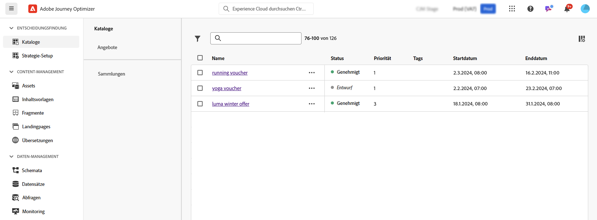
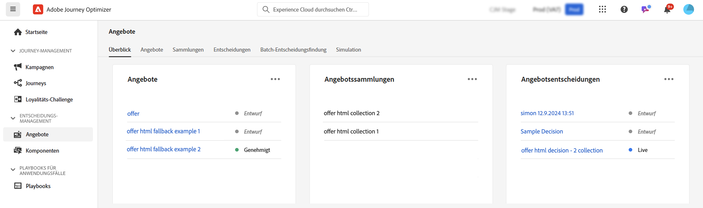

# Erste Schritte mit Entscheidungsfunktionen in [!DNL Journey Optimizer] {#gs-decision}

Mit den Entscheidungsfunktionen in [!DNL Journey Optimizer] können Sie Ihren Kundinnen und Kunden die besten Angebote und personalisierte Erlebnisse zu genau den richtigen Zeiten über alle Touchpoints hinweg bereitstellen. Diese Funktionen vereinfachen die Personalisierung durch einen zentralisierten Katalog von Marketing-Angeboten und eine erweiterte Entscheidungs-Engine, die Regeln und Rangfolgekriterien verwendet, um die relevantesten Inhalte für jeden Kontakt bereitzustellen.

Wichtigste Vorteile:

* Verbesserte Kampagnen-Performance durch die Bereitstellung personalisierter Angebote über mehrere Kanäle hinweg,
* Verbesserte Workflows: Anstatt mehrere Sendungen oder Kampagnen zu erstellen, können Marketing-Teams den Workflow verbessern, indem sie einen einzelnen Versand erstellen und die Angebote in verschiedenen Vorlagenbereichen variieren.
* Steuern Sie, wie oft ein Angebot in Kampagnen und für Kundschaft angezeigt wird.

Derzeit bietet [!DNL Journey Optimizer] die beiden unten beschriebenen Hauptlösungen.

## Entscheidungsfindung {#decisioning}

Unser Entscheidungs-Framework der nächsten Generation, das dazu dient, bestehende Journey Optimizer-Workflows zu vereinheitlichen und die Grundlage für die Verwaltung zusätzlicher Inhaltskataloge zu schaffen. Die Entscheidungsfindung bietet:

* Schemabasierte Verwaltung des Elementkatalogs: Erhöht die Flexibilität, indem jedem Angebot benutzerdefinierte Metadaten zugeordnet werden
* Flexible Sammlungsregeln: Gruppieren Angebote einfach zur zukünftigen Auswertung anhand verschiedener Kriterien
* Aktualisierte Entscheidungsrichtlinie und Konfiguration der Auswahlstrategie: Lassen die erneute Verwendung von Entscheidungskomponenten zu
* Experimentfunktionen: Testen die Entscheidungslogik anhand anderer Inhaltskomponenten, um die Leistung zu messen

Decisioning steht allen Kunden für die Kanäle **Code-basiertes Erlebnis**, **Push-Benachrichtigung** und **SMS** zur Verfügung. Die Entscheidungsfindung für den Kanal **E-Mail** ist in begrenzter Verfügbarkeit verfügbar. Um Zugriff auf E-Mail-Entscheidungen zu erhalten, wenden Sie sich an Ihren Adobe-Support-Mitarbeiter. Weitere Informationen zu [Verfügbarkeitskennzeichnungen](../rn/releases.md#availability-labels).

➡️ [Erste Schritte mit der Entscheidungsfindung](../experience-decisioning/gs-experience-decisioning.md)

>[!NOTE]
>
>Informationen zur Migration vom Entscheidungs-Management zum Decisioning finden Sie im [Migrationsdokumentation](../experience-decisioning/migrate-to-decisioning.md) und [Migrationshandbuch](../experience-decisioning/decisioning-migration-api.md).

## Entscheidungs-Management {#decision-management}

Unsere bewährte Entscheidungs-Management-Funktion in Journey Optimizer nutzt eine zentrale Bibliothek mit Marketing-Angeboten und eine Entscheidungs-Engine, die Regeln und Einschränkungen auf Echtzeit-Kundenprofile anwendet und Daten aus Adobe Experience Platform nutzt, um das richtige Angebot zur richtigen Zeit bereitzustellen.

Entscheidungs-Management unterstützt die folgenden Kanäle: E-Mail, In-App-Messaging, Push-Benachrichtigungen, SMS und Direkt-Mail.

➡️ [Erste Schritte mit dem Entscheidungs-Management](../offers/get-started/starting-offer-decisioning.md)
