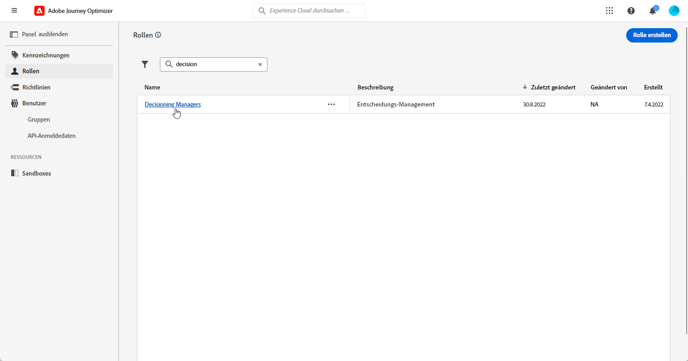
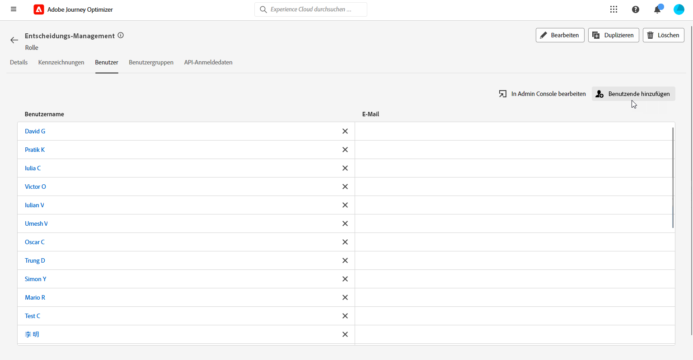
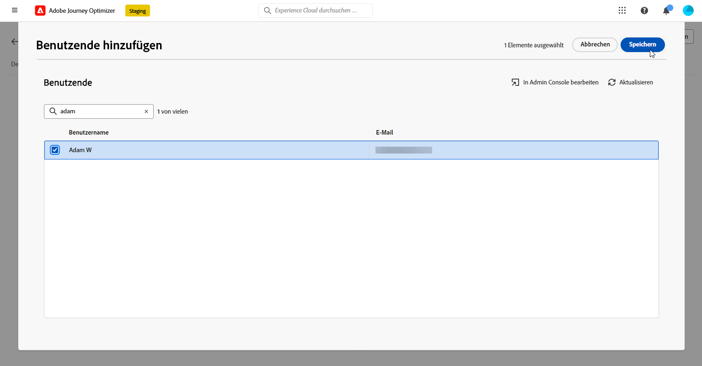

# Erste Schritte mit der Entscheidungsfindung {#get-started-experience-decisioning}

>[!CONTEXTUALHELP]
>id="ajo_email_enable_experience_decisioning"
>title="Was ist die Entscheidungsfindung?"
>abstract="Die Entscheidungsfindung ist ein neues Tool neben dem Entscheidungs-Management, mit dem Sie die besten Elemente aus der Entscheidungs-Engine auswählen und jedem Kontakt bereitstellen können. Für die Verwendung sind zusätzliche Einstellungen erforderlich."

## Was ist die Entscheidungsfindung? {#about}

Die Entscheidungsfindung vereinfacht die Personalisierung, indem sie einen zentralisierten Katalog von Marketing-Angeboten, die als „Entscheidungselemente“ bezeichnet werden, und eine ausgereifte Entscheidungs-Engine anbietet. Diese Engine nutzt Regeln und Rangfolgekriterien, um die relevantesten Entscheidungselemente für jeden Kontakt auszuwählen und darzustellen.

Diese Entscheidungselemente werden über den ([-basierten Erlebniskanal) nahtlos in eine Vielzahl eingehender Oberflächen integriert](../code-based/get-started-code-based.md) auf die in [!DNL Adobe Journey Optimizer] Kampagnen zugegriffen werden kann.

>[!IMPORTANT]
>
>Entscheidungsrichtlinien für die Entscheidungsfindung sind nur zur Verwendung in Code-basierten Erlebniskampagnen und E-Mail-Kampagnen verfügbar.

➡️ [Funktion im Video kennenlernen](#video)

➡️ In [diesem Abschnitt](experience-decisioning-uc.md) wird ein Anwendungsfall vollständig vorgestellt, der zeigt, wie Entscheidungen erstellt und in Inhaltsexperimenten mit dem Code-basierten Erlebniskanal verwendet werden können.

## Wichtige Schritte bei der Entscheidungsfindung {#steps}

Die wichtigsten Schritte für die Arbeit mit der Entscheidungsfindung sind:

1. **Zuweisen entsprechender Berechtigungen**. Die Entscheidungsfindung steht nur Benutzenden mit Zugriff auf eine Entscheidungfindungs-bezogene **[!UICONTROL Rolle]** zur Verfügung, z. B. Entscheidungsträgern. Wenn Sie nicht auf die Entscheidungsfindung zugreifen können, müssen Ihre Berechtigungen erweitert werden.

   +++Erfahren Sie, wie Sie die Rolle „Entscheidungstragende“ zuweisen

   1. Um Benutzenden eine Rolle im Produkt [!DNL Permissions] zuzuweisen, navigieren Sie zur Registerkarte **[!UICONTROL Rollen]** und wählen Sie „Entscheidungsträger“ aus.

      

   1. Klicken Sie auf der Registerkarte **[!UICONTROL Benutzer]** auf **[!UICONTROL Benutzer hinzufügen]**.

      

   1. Geben Sie Name oder E-Mail-Adresse der jeweiligen Benutzenden ein oder wählen Sie die Person aus der Liste aus und klicken Sie auf **[!UICONTROL Speichern]**.

      Wenn die Benutzerin bzw. der Benutzer vorher noch nicht erstellt wurde, lesen Sie die [Dokumentation zum Hinzufügen von Benutzenden](https://experienceleague.adobe.com/de/docs/experience-platform/access-control/ui/users).

      

   Ihre Benutzenden sollten dann eine E-Mail mit einer Umleitung zu Ihrer Instanz erhalten.

   +++

1. **Benutzerdefinierte Attribute konfigurieren**: Der Katalog der Elemente kann an spezifische Anforderungen angepasst werden, indem benutzerdefinierte Attribute im Schema des Katalogs eingerichtet werden.

   ➡️ [Informationen zum Konfigurieren des Elementkatalogs](catalogs.md)

1. **Erstellen Sie Entscheidungselemente**, um die Zielgruppe anzuzeigen.

   ➡️ [Informationen zum Erstellen von Entscheidungselementen](items.md) in der Benutzeroberfläche (und in der [API-Dokumentation](api-reference/decisions-items/create.md))

1. **Mit Sammlungen organisieren**: Verwenden Sie Sammlungen, um Entscheidungselemente basierend auf attributbasierten Regeln zu kategorisieren. Sammlungen können in Auswahlstrategien integriert werden, um zu bestimmen, welche Sammlung von Entscheidungselementen berücksichtigt werden soll.

   ➡️ [Informationen zum Verwalten von Elementsammlungen](collections.md) in der Benutzeroberfläche (und in der [API-Dokumentation](api-reference/items-collections/create.md))

1. **Entscheidungsregeln erstellen**: Entscheidungsregeln werden in Entscheidungselementen und/oder Auswahlstrategien verwendet, um zu bestimmen, wem ein Entscheidungselement angezeigt werden kann.

   ➡️ [Informationen zum Erstellen von Entscheidungsregeln](rules.md)

1. **Rangfolgemethoden implementieren**: Erstellen Sie Rangfolgemethoden und wenden Sie diese innerhalb von Auswahlstrategien an, um die Prioritätsreihenfolge für die Auswahl von Entscheidungselementen festzulegen.

   ➡️ [Informationen zum Erstellen von Rangfolgemethoden](ranking/ranking.md)

1. **Auswahlstrategien erstellen**: Erstellen Sie Auswahlstrategien, die Sammlungen, Entscheidungsregeln und Rangfolgemethoden nutzen, um die Entscheidungselemente zu identifizieren, die für die Anzeige in Profilen geeignet sind.

   ➡️ [Informationen zum Erstellen von Auswahlstrategien in der Benutzeroberfläche](selection-strategies.md) in der Benutzeroberfläche (und in der [API-Dokumentation](api-reference/selection-strategies/create.md))

1. **Eine Entscheidungsrichtlinie erstellen und in die Code-basierte oder E-Mail-Journey/-Kampagne einbetten**: Entscheidungsrichtlinien kombinieren mehrere Auswahlstrategien, um die für die gewünschte Zielgruppe anzuzeigenden geeigneten Entscheidungselemente zu bestimmen.

   ➡️ [Informationen zum Arbeiten mit Entscheidungsrichtlinien](create-decision.md)
➡️ Um das Angebot erfolgreich über den Code-basierten Erlebniskanal bereitzustellen, befolgen Sie die Implementierungsschritte in [diesem Abschnitt](../code-based/code-based-implementation-samples.md).

## Weitere Ressourcen

* **[Erstellen von Entscheidungselementen](items.md)**: Erfahren Sie, wie Sie Entscheidungselemente einschließlich Angebote, Inhaltsvarianten und Erlebnisse erstellen und verwalten.
* **[Konfigurieren von Entscheidungskatalogen](catalogs.md)**: Erfahren Sie, wie Sie Entscheidungselemente zur Verbesserung der Verwaltung in Katalogen organisieren.
* **[Definieren von Auswahlstrategien](selection-strategies.md)**: Erfahren Sie, wie Sie Auswahlstrategien mit Eignungsregeln und Rangfolgenmethoden erstellen.
* **[Erstellen von Entscheidungsrichtlinien](create-decision-policy.md)**: Erfahren Sie, wie Sie Entscheidungsrichtlinien erstellen, in denen Strategien und Einschränkungen kombiniert werden.
* **[Rangfolge und KI-Modelle](ranking/ranking.md)**: Setzen Sie übergeordnete Rangfolgenformeln und KI-Modelle für personalisierte Entscheidungsfindung ein.
* **[Entscheidungsleitlinien](decisioning-guardrails.md)**: Lernen Sie wichtige Einschränkungen und Best Practices bei der Implementierung von Entscheidungsfindung kennen.
* **[Tutorials zur Entscheidungsfindung](https://experienceleague.adobe.com/de/docs/journey-optimizer-learn/tutorials/decision-capabilities/decisioning/introduction-to-decisioning){target="_blank"}**: Erkunden Sie Video-Tutorials mit detaillierten Anleitungen zu Entscheidungsfunktionen und Best Practices.

## Anleitungsvideo {#video}

Erfahren Sie mehr über die Entscheidungsfunktionen in Adobe Journey Optimizer.

>[!VIDEO](https://video.tv.adobe.com/v/3451101?quality=12)
