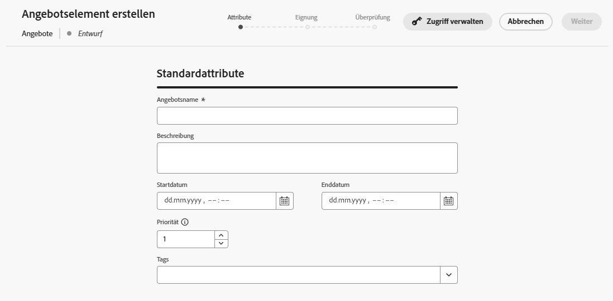
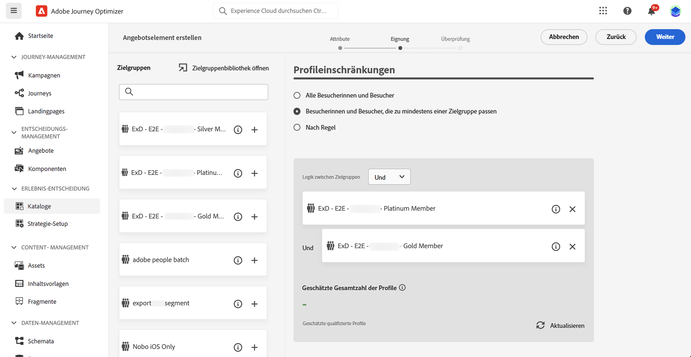
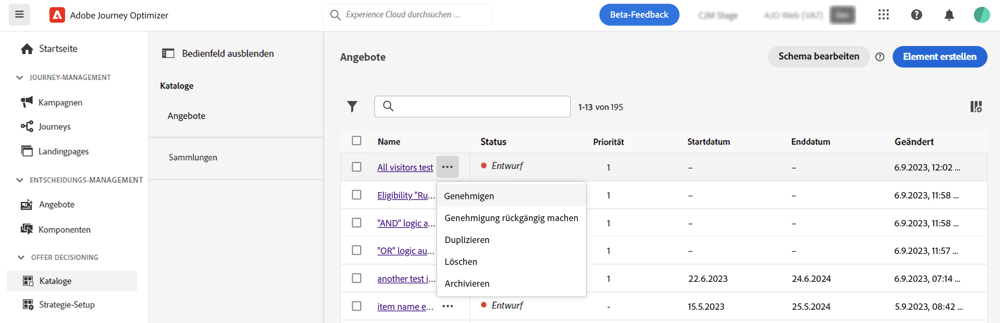

# Entscheidungsartikel {#items}

>[!BEGINSHADEBOX]

Inhalt dieses Dokumentationshandbuchs:

* [Erste Schritte mit Experience Decisioning](gs-experience-decisioning.md)
* Verwalten von Entscheidungselementen
   * [Konfigurieren des Elementkatalogs](catalogs.md)
   * **[Erstellen von Entscheidungselementen](items.md)**
   * [Verwalten von Elementsammlungen](collections.md)
* Elementauswahl konfigurieren
   * [Erstellen von Entscheidungsregeln](rules.md)
   * [Erstellen von Ranking-Methoden](ranking.md)
* [Erstellen von Auswahlstrategien](selection-strategies.md)
* [Entscheidungsrichtlinien erstellen](create-decision.md)

>[!ENDSHADEBOX]

Mit Journey Optimizer können Sie Marketing-Angebote, die als Entscheidungselemente bezeichnet werden, erstellen und in einem zentralen Katalog und in Sammlungen organisieren. Sie bestehen aus standardmäßigen und benutzerdefinierten Attributen, die genau auf Ihre Bedürfnisse abgestimmt sind. Darüber hinaus enthalten sie Profilbegrenzungen, mit denen Sie definieren können, wem ein Entscheidungselement angezeigt werden kann.

Bevor Sie ein Entscheidungselement erstellen, stellen Sie sicher, dass Sie eine **Entscheidungsregel** , wenn Sie Bedingungen festlegen möchten, um zu bestimmen, wem das Entscheidungselement angezeigt werden kann. [Erfahren Sie, wie Sie  Entscheidungsregeln](rules.md) erstellen können. 

## Erstellen des ersten Entscheidungselements

Gehen Sie wie folgt vor, um ein Entscheidungselement zu erstellen:

1. Navigieren Sie zu **[!UICONTROL Erlebnisentscheidungen]** > **[!UICONTROL Elemente]**.

1. Definieren Sie die Standardattribute des Entscheidungselements:

   1. Geben Sie einen Namen und eine Beschreibung ein.
   1. Geben Sie das Start- und Enddatum an. Das Element wird von der Decisioning Engine nur innerhalb dieser Daten berücksichtigt.
   1. Legen Sie die **[!UICONTROL Priorität]** des Entscheidungselements im Vergleich zu anderen, wenn ein Profil für mehrere Elemente qualifiziert ist. Eine höhere Priorität gewährt dem Element Vorrang vor anderen.

   

1. Benutzerdefinierte Attribute sind spezifische Attribute, die auf Ihre Anforderungen zugeschnitten sind und die Sie einem Entscheidungselement zuweisen können. Sie werden im Katalogschema der Entscheidungselemente definiert. [Erfahren Sie, wie Sie mit Katalogen arbeiten.](catalogs.md)

1. Sobald die Attribute des Entscheidungspunkts definiert sind, klicken Sie auf **[!UICONTROL Nächste]** , um Profilbegrenzungen für das Element festzulegen.

   Standardmäßig sind alle Profile berechtigt, das Entscheidungselement zu erhalten. Sie können jedoch Zielgruppen oder Regeln verwenden, um das Element auf bestimmte Profile zu beschränken, wobei beide Lösungen unterschiedlichen Verwendungszwecken entsprechen. Erweitern Sie den folgenden Abschnitt, um weitere Informationen zu erhalten:

   +++Verwenden von Zielgruppen vs. Entscheidungsregeln

   Grundsätzlich liefert eine Zielgruppe eine Liste von Profilen, während es sich bei einer Entscheidungsregel um eine Funktion handelt, die während des Entscheidungsprozesses bei Bedarf für ein einzelnes Profil ausgeführt wird.

   * **Zielgruppen**: Einerseits sind Zielgruppen eine Gruppe von Adobe Experience Platform-Profilen, die basierend auf Profilattributen und Erlebnisereignissen einer bestimmten Logik entsprechen. Jedoch wird beim Offer Decisioning-Prozess die Zielgruppe nicht neu berechnet, weshalb sie zum Zeitpunkt der Angebotsunterbreitung möglicherweise nicht aktuell ist.

   * **Entscheidungsregeln**: Andererseits basiert eine Entscheidungsregel auf in Adobe Experience Platform verfügbaren Daten und bestimmt, wem ein Angebot angezeigt werden kann. Nachdem die Entscheidungsregel in einem Angebot oder einer Entscheidung für eine bestimmte Platzierung ausgewählt wurde, wird sie bei jedem Entscheidungsvorgang erneut ausgeführt. Dadurch wird jedem Profil immer ein aktuelles, optimales Angebot angezeigt.

+++

   

   * Um die Präsentation des Entscheidungselements auf die Mitglieder einer oder mehrerer Adobe Experience Platform-Zielgruppen zu beschränken, wählen Sie die **[!UICONTROL Besucher, die in eine oder mehrere Zielgruppen fallen]** -Option, fügen Sie dann eine oder mehrere Zielgruppen aus dem linken Bereich hinzu und kombinieren Sie sie mithilfe der **[!UICONTROL und]** / **[!UICONTROL Oder]** logische Operatoren. [Weitere Informationen zu Zielgruppen](../audience/about-audiences.md).

   * Um eine bestimmte Entscheidungsregel mit dem Entscheidungselement zu verknüpfen, wählen Sie **[!UICONTROL Nach Regel]** und ziehen Sie dann die gewünschte Regel aus dem linken Bereich in den zentralen Bereich. [Weitere Informationen zu Entscheidungsregeln](rules.md).

   Wenn Sie Zielgruppen oder Entscheidungsregeln auswählen, können Sie Informationen zur geschätzten Anzahl der qualifizierten Profile sehen. Klicken Sie auf **[!UICONTROL Aktualisieren]**, um diese Daten zu aktualisieren.

   >[!NOTE]
   >
   >Profilschätzungen sind nicht verfügbar, wenn Regelparameter Daten enthalten, die nicht im Profil enthalten sind, z. B. Kontextdaten. Beispielsweise eine Eignungsregel, für die die aktuelle Temperatur höher als 25 °C sein muss.

1. Sobald die Begrenzungen des Entscheidungselements definiert sind, klicken Sie auf **[!UICONTROL Nächste]** , um das Element zu überprüfen und zu speichern.

1. Das Entscheidungselement wird jetzt in der Liste angezeigt, wobei die **[!UICONTROL Entwurf]** -Status. Wenn sie für die Anzeige in Profilen bereit ist, klicken Sie auf die Suchschaltfläche und wählen Sie **[!UICONTROL Genehmigen]**.

   

## Verwalten von Entscheidungselementen

In der Liste der Entscheidungselemente können Sie ein Entscheidungselement bearbeiten und seinen Status ändern (**Entwurf**, **Genehmigt**, **Archiviert**), duplizieren oder löschen Sie sie.

Um ein Entscheidungselement zu ändern, öffnen Sie es, nehmen Sie Ihre Änderungen vor und speichern Sie es.

Wenn Sie ein Entscheidungselement auswählen oder auf die Suchschaltfläche klicken, werden die unten beschriebenen Aktionen aktiviert.

* **[!UICONTROL Genehmigen]**: Setzt den Status des Entscheidungselements auf Genehmigt .
* **[!UICONTROL Validierung rückgängig machen]**: Setzt den Status des Entscheidungselements zurück auf **[!UICONTROL Entwurf]**.
* **[!UICONTROL Duplizieren]**: Erstellt ein Entscheidungselement mit identischen Attributen und Einschränkungen. Standardmäßig verfügt das neue Element über die **[!UICONTROL Entwurf]** -Status.
* **[!UICONTROL Löschen]**: Entfernt das Entscheidungselement aus der Liste.

  >[!IMPORTANT]
  >
  >Nach dem Löschen sind das Entscheidungselement und sein Inhalt nicht mehr verfügbar. Diese Aktion kann nicht rückgängig gemacht werden. Wenn das Entscheidungselement in einer Sammlung oder Entscheidung verwendet wird, kann es nicht gelöscht werden. Sie müssen das Entscheidungselement zuerst aus allen Objekten entfernen.

* **[!UICONTROL Archivieren]**: Legt den Status des Entscheidungselements auf **[!UICONTROL Archiviert]**. Das Entscheidungselement ist weiterhin in der Liste verfügbar, Sie können seinen Status jedoch nicht auf **[!UICONTROL Entwurf]** oder **[!UICONTROL Genehmigt]**. Sie können es nur duplizieren oder löschen.
