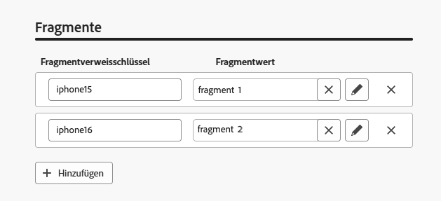
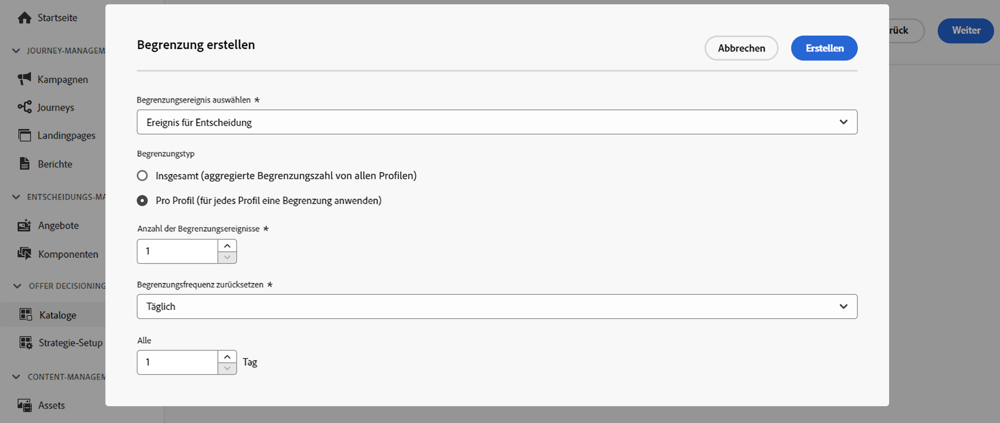
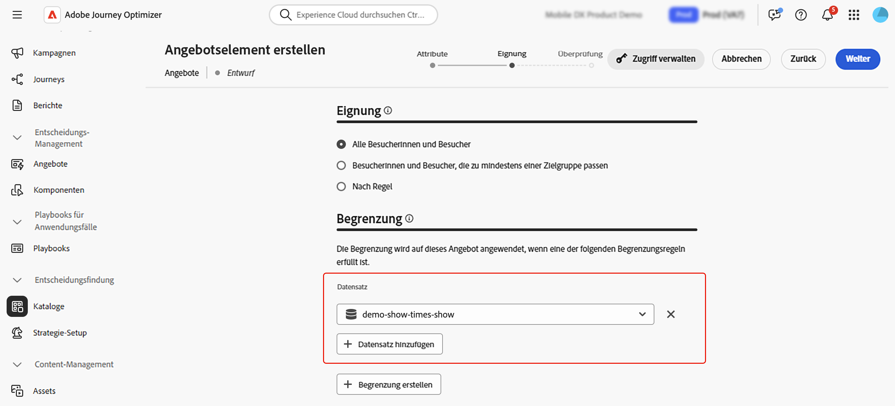
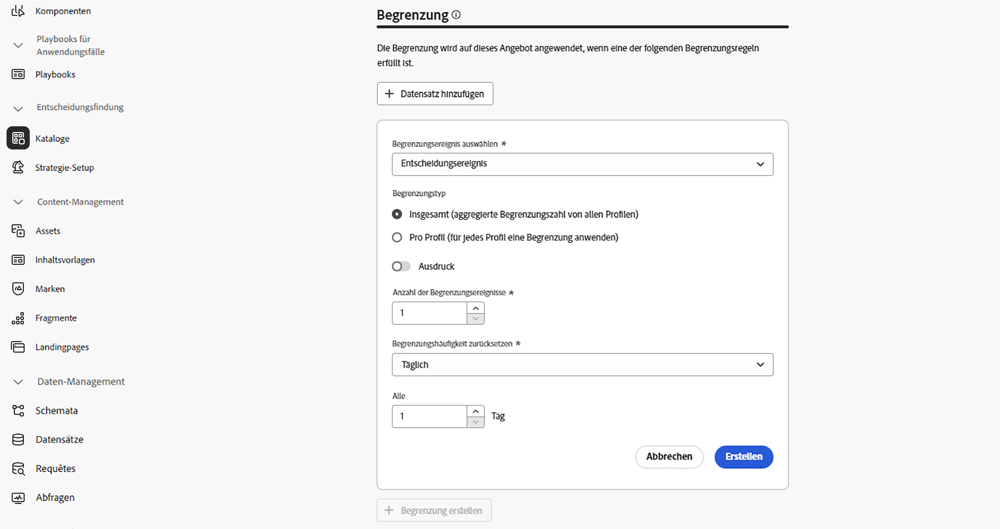
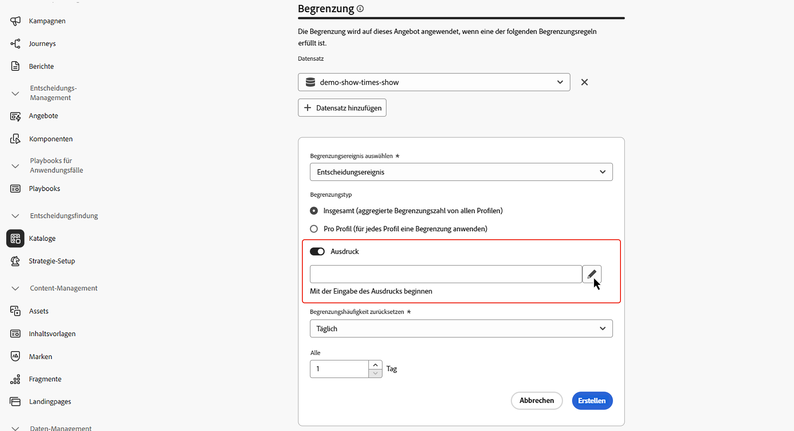
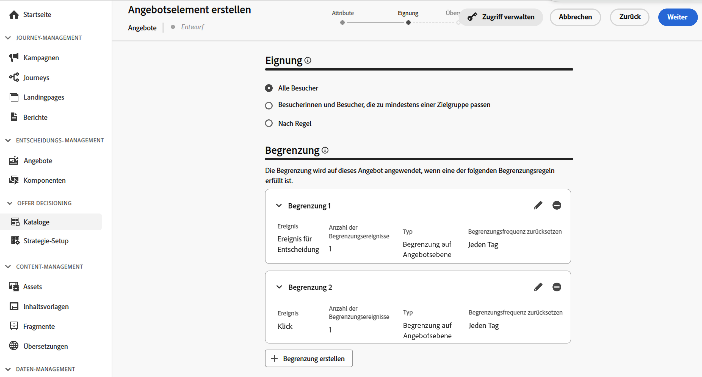
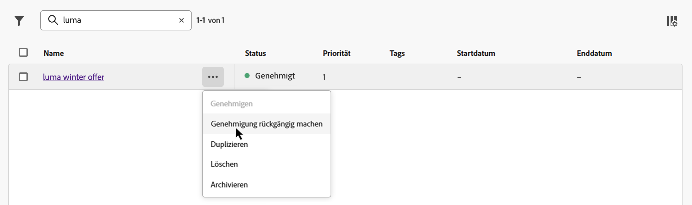

# Erstellen Ihres ersten Entscheidungselements {#items}

>[!CONTEXTUALHELP]
>id="ajo_exd_items"
>title="Verwalten von Entscheidungselementen"
>abstract="Mit Journey Optimizer können Sie Marketing-Angebote erstellen, die als Entscheidungselemente bezeichnet werden, und in einem zentralen Katalog und in Sammlungen organisieren. Derzeit sind alle erstellten Entscheidungselemente in einem einzigen „Angebote“-Katalog konsolidiert. Über diesen Bildschirm können Sie auch mithilfe der Schaltfläche **Schema bearbeiten** auf das Schema des Katalogs zugreifen und benutzerdefinierte Attribute für Ihre Entscheidungselemente erstellen."

Mit Journey Optimizer können Sie Marketing-Angebote erstellen, die als Entscheidungselemente bezeichnet werden, und in einem zentralen Katalog und in Sammlungen organisieren. Sie bestehen aus standardmäßigen und benutzerdefinierten Attributen, die genau auf Ihre Bedürfnisse abgestimmt sind. Darüber hinaus enthalten sie Profileinschränkungen, mit denen Sie definieren können, wem ein Entscheidungselement angezeigt werden kann.

Bevor Sie ein Entscheidungselement erstellen, stellen Sie sicher, dass Sie eine **Entscheidungsregel** erstellt haben, wenn Sie Bedingungen festlegen möchten, um zu bestimmen, wem das Entscheidungselement angezeigt werden kann. [Erfahren Sie, wie Sie Entscheidungsregeln erstellen können](rules.md).

Um ein Entscheidungselement zu erstellen, navigieren Sie zu **[!UICONTROL Entscheidungsfindung]** > **[!UICONTROL Kataloge]**, klicken Sie auf **[!UICONTROL Element erstellen]** und befolgen Sie dann die in den folgenden Abschnitten beschriebenen Schritte.

## Definieren der Attribute des Entscheidungselements {#attributes}

>[!CONTEXTUALHELP]
>id="ajo_exd_item_priority"
>title="Definieren der Priorität des Entscheidungselements"
>abstract="Wenn ein Profil für mehrere Elemente geeignet ist, ermöglicht die Priorität den Vergleich dieses Entscheidungselements mit anderen. Eine höhere Priorität gewährt dem Element Vorrang vor anderen."

Definieren Sie zunächst die standardmäßigen und die benutzerdefinierten Attribute des Entscheidungselements:

1. Geben Sie einen Namen und eine Beschreibung ein.
1. Geben Sie Start- und Enddatum an. Das Element wird von der Entscheidungs-Engine nur innerhalb dieser Daten berücksichtigt.
1. Legen Sie die **[!UICONTROL Priorität]** des Entscheidungselements im Vergleich zu anderen fest, wenn ein Profil für mehrere Elemente qualifiziert ist. Eine höhere Priorität gewährt dem Element Vorrang vor anderen.

   >[!NOTE]
   >
   >Die Priorität ist ein ganzzahliger Datentyp. Alle Attribute, bei denen es sich um ganzzahlige Datentypen handelt, sollten ganzzahlige Werte (ohne Dezimalstellen) enthalten.

1. Das Feld **Tags** ermöglicht es Ihnen, Ihren Entscheidungselementen einheitliche Adobe Experience Platform-Tags zuzuweisen. Dies erleichtert die Klassifizierung und die Suche. [Erfahren Sie, wie Sie mit Tags arbeiten](../start/search-filter-categorize.md#tags)

1. Verwenden Sie Fragmente, um dem Entscheidungselement mehrere Inhalte hinzuzufügen – beispielsweise, wenn Sie für verschiedene Modelle von Mobilgeräten unterschiedliche Inhalte anzeigen möchten. [Erfahren Sie mehr über Fragmente](../content-management/fragments.md)

   >[!AVAILABILITY]
   >
   >Fragmente in Entscheidungselementen sind derzeit nur für eine ausgewählte Gruppe von Organisationen verfügbar (eingeschränkte Verfügbarkeit). Weitere Informationen erhalten Sie beim Adobe-Support.

   Wählen Sie im Abschnitt **[!UICONTROL Fragmente]** die veröffentlichten Fragmente aus, die Sie verwenden möchten, und weisen Sie ihnen einen Referenzschlüssel zu. Sie können diese Fragmente dann in Ihren Entscheidungsrichtlinien nutzen. [Weitere Informationen](create-decision.md#fragments)

   {width=70%}

   Sie können nur veröffentlichte Fragmente auswählen und bis zu sechs Fragmente zu einem Entscheidungselement hinzufügen.

   >[!WARNING]
   >
   >Derzeit werden nur [Ausdrucksfragmente](../personalization/use-expression-fragments.md) unterstützt.
   >
   >Verschachtelte Fragmente (d. h. Fragmente, die auf andere Fragmente verweisen) können nicht verwendet werden. Die [Genehmigung](#approve) des Entscheidungselements schlägt fehl, wenn Sie ein solches Fragment hinzufügen.

1. Geben Sie benutzerdefinierte Attribute an (optional). Benutzerdefinierte Attribute sind spezifische Attribute, die auf Ihre Anforderungen zugeschnitten sind und die Sie einem Entscheidungselement zuweisen können. Sie werden im Katalogschema der Entscheidungselemente definiert. [Erfahren Sie, wie Sie mit Vorlagen arbeiten](catalogs.md)

1. Sobald die Attribute des Entscheidungselements definiert sind, klicken Sie auf **[!UICONTROL Weiter]**.

## Konfigurieren der Eignung des Entscheidungselements {#eligibility}

>[!CONTEXTUALHELP]
>id="ajo_exd_item_constraints"
>title="Hinzufügen von Zielgruppen oder Entscheidungsregeln"
>abstract="Standardmäßig sind alle Profile berechtigt, das Entscheidungselement zu erhalten. Sie können jedoch Zielgruppen oder Regeln verwenden, um das Element auf bestimmte Profile zu beschränken."

<!--
>"additional-url="https://experienceleague.adobe.com/en/docs/journey-optimizer/using/audiences-profiles-identities/audiences/about-audiences" text="Use audiences"
>additional-url="https://experienceleague.adobe.com/en/docs/journey-optimizer/using/decisioning/experience-decisioning/rules" text="Use decision rules"
-->

Standardmäßig sind alle Profile berechtigt, das Entscheidungselement zu erhalten. Sie können jedoch Zielgruppen oder Regeln verwenden, um das Element auf bestimmte Profile zu beschränken, wobei die beiden Lösungen unterschiedlichen Verwendungszwecken entsprechen. Erweitern Sie den folgenden Abschnitt, um weitere Informationen zu erhalten:

+++Verwenden von Zielgruppen im Vergleich zu Entscheidungsregeln

Grundsätzlich liefert eine Zielgruppe eine Liste von Profilen, während es sich bei einer Entscheidungsregel um eine Funktion handelt, die während des Entscheidungsprozesses bei Bedarf für ein einzelnes Profil ausgeführt wird.

* **Zielgruppen**: Zielgruppen sind Adobe Experience Platform-Profile, die basierend auf Profilattributen und Erlebnisereignissen einer bestimmten Logik entsprechen. Jedoch wird bei der Angebotsverwaltung die Zielgruppe nicht neu berechnet, weshalb sie zum Zeitpunkt der Angebotsunterbreitung möglicherweise nicht aktuell ist.

* **Entscheidungsregeln**: Dagegen basiert eine Entscheidungsregel auf in Adobe Experience Platform verfügbaren Daten und bestimmt, wem ein Angebot angezeigt werden kann. Nachdem die Entscheidungsregel in einem Angebot oder einer Entscheidung für eine bestimmte Platzierung ausgewählt wurde, wird sie bei jedem Entscheidungsvorgang erneut ausgeführt. Dadurch wird jedem Profil immer ein aktuelles, optimales Angebot angezeigt.

+++

* Um die Präsentation des Entscheidungselements auf die Mitglieder einer oder mehrerer Adobe Experience Platform-Zielgruppen zu beschränken, wählen Sie die Option **[!UICONTROL Besucherinnen und Besucher, die zu mindestens einer Zielgruppe passen]** aus, fügen Sie dann eine oder mehrere Zielgruppen aus dem linken Bereich hinzu und kombinieren Sie sie mithilfe der logischen Operatoren **[!UICONTROL Und]**/**[!UICONTROL Oder]**. [Weitere Informationen zu Zielgruppen](../audience/about-audiences.md)

* Um eine bestimmte Entscheidungsregel mit dem Entscheidungselement zu verknüpfen, wählen Sie **[!UICONTROL Nach Regel]** aus und ziehen Sie dann die gewünschte Regel aus dem linken Bereich in den zentralen Bereich. [Weitere Informationen zu Entscheidungsregeln](rules.md)

Wenn Sie Zielgruppen oder Entscheidungsregeln auswählen, können Sie Informationen zur geschätzten Anzahl der qualifizierten Profile sehen. Klicken Sie auf **[!UICONTROL Aktualisieren]**, um diese Daten zu aktualisieren.

>[!NOTE]
>
>Profilschätzungen sind nicht verfügbar, wenn Regelparameter Daten enthalten, die nicht im Profil enthalten sind, z. B. Kontextdaten. Beispielsweise eine Eignungsregel, für die die aktuelle Temperatur höher als 25 °C sein muss.

## Festlegen von Begrenzungsregeln {#capping}

>[!CONTEXTUALHELP]
>id="ajo_exd_item_capping_expression"
>title="Ausdruck"
>abstract="Anstatt einen statischen Wert für den Begrenzungsschwellenwert zu verwenden, können Sie Ihren eigenen Ausdruck definieren. Auf diese Weise können Sie den Schwellenwert dynamisch mithilfe von Entscheidungsattributen und/oder externen Attributen aus einem Adobe Experience Platform-Datensatz berechnen.  Begrenzungsregel **-Ausdrücke** sind derzeit im Rahmen einer eingeschränkten Verfügbarkeit für alle Benutzenden verfügbar. Sie werden nur für den Begrenzungstyp **[!UICONTROL Insgesamt]** unterstützt."

Mit Begrenzungen wird definiert, wie oft ein Angebot maximal angezeigt werden kann. Durch die Begrenzung der Anzeige von Angeboten vermeiden Sie, dass Ihre Kundinnen und Kunden übermäßig umworben werden, und können jeden Touchpoint mit dem besten Angebot optimieren. Sie können bis zu 10 Begrenzungen für ein bestimmtes Entscheidungselement erstellen.

>[!NOTE]
>
>
>Die Aktualisierung des Begrenzungszählerwerts kann bis zu 3 Sekunden dauern. Angenommen, Sie zeigen auf Ihrer Website ein Webbanner an, in dem ein Angebot vorgestellt wird. Wenn eine bestimmte Person in weniger als 3 Sekunden zur nächsten Seite Ihrer Website navigiert, wird der Zählerwert für diese Person nicht erhöht.

Beim Konfigurieren von Begrenzungsregeln können Sie auf Attribute verweisen, die in Adobe Experience Platform-Datensätzen gespeichert sind, um Schwellenwerte zu definieren. Um einen Datensatz zu verwenden, wählen Sie ihn im Abschnitt **[!UICONTROL Datensatz]** aus.

>[!NOTE]
>
>Diese Funktion ist derzeit im Rahmen einer eingeschränkten Verfügbarkeit für alle Benutzenden verfügbar. Detaillierte Informationen zur Verwendung finden Sie in diesem Abschnitt: [Verwenden von Adobe Experience Platform-Daten für die Entscheidungsfindung](../experience-decisioning/aep-data-exd.md)

Um Begrenzungsregeln für das Entscheidungselement festzulegen, klicken Sie auf die Schaltfläche **[!UICONTROL Begrenzung erstellen]** und führen Sie die folgenden Schritte aus:

1. Legen Sie fest, welches **[!UICONTROL Begrenzungsereignis]** für die Erhöhung des Zählers berücksichtigt wird.

   * **[!UICONTROL Entscheidungsereignis]** (Standardwert): Die maximale Häufigkeit, mit der ein Angebot unterbreitet werden kann.
   * **[!UICONTROL Impression]** (nur eingehende Kanäle): Die maximale Häufigkeit, mit der das Angebot einer Person angezeigt werden kann.
   * **[!UICONTROL Klicks]**: Die maximale Anzahl der Klicks auf das Entscheidungselement durch eine Person.
   * **[!UICONTROL Benutzerspezifisches Ereignis]**: Sie können ein benutzerspezifisches Ereignis definieren, das verwendet wird, um die Anzahl der Sendevorgänge des Elements zu begrenzen. Sie können beispielsweise die Anzahl der Einlösungen auf 10.000 begrenzen, oder bis ein bestimmtes Profil 1 Mal eine Einlösung vorgenommen hat. Verwenden Sie dazu [Adobe Experience Platform-XDM](https://experienceleague.adobe.com/docs/experience-platform/xdm/home.html?lang=de){target="_blank"}-Schemata, um eine Regel für ein benutzerspezifische Ereignis zu erstellen.

   >[!NOTE]
   >
   >Bei allen Begrenzungsereignissen außer Entscheidungsereignissen wird das Feedback zum Entscheidungs-Management möglicherweise nicht automatisch erfasst, was dazu führen könnte, dass der Begrenzungszähler nicht korrekt inkrementiert wird. Damit jedes Begrenzungsereignis verfolgt und im Begrenzungszähler berücksichtigt wird, stellen Sie sicher, dass das Schema, das zur Erfassung von Erlebnisereignissen verwendet wird, die richtige Feldergruppe für dieses Ereignis enthält. Detaillierte Informationen zur Datenerfassung finden Sie in der Dokumentation zum Entscheidungs-Management in Journey Optimizer:
   >* [Datenerfassung für das Entscheidungs-Management](data-collection/data-collection.md)
   >* [Konfigurieren der Datenerfassung](data-collection/schema-requirement.md)

1. So wählen Sie den Begrenzungstyp:

   * Wählen Sie **[!UICONTROL Insgesamt]** aus, um festzulegen, wie oft ein Element für die gesamte Zielgruppe vorgeschlagen werden kann, d. h. für alle Benutzenden. Wenn Sie z. B. ein Elektronikhändler sind, der einen Fernseher im Angebot hat, möchten Sie, dass das Angebot allen Profilen nur 200-mal angezeigt wird.

   * Wählen Sie **[!UICONTROL Pro Profil]** aus, um festzulegen, wie oft das Angebot derselben Person vorgeschlagen werden kann. Ein Beispiel: Sie sind eine Bank, die eine Platin-Kreditkarte anbietet, und dieses Angebot nicht öfter als fünfmal pro Profil angezeigt werden. Es wird angenommen, dass Benutzende, die das Angebot fünfmal gesehen und nicht darauf reagiert haben, eher das nächste beste Angebot nutzen.

1. Definieren Sie den Begrenzungsschwellenwert. Dazu können Sie entweder einen statischen Wert eingeben oder den Schwellenwert mithilfe eines Ausdrucks berechnen. Erweitern Sie die folgenden Abschnitte, um weitere Informationen zu erhalten.

   +++Statischer Schwellenwert

   Geben Sie im Feld **[!UICONTROL Limit der Begrenzungsanzahl]** an, wie oft das Angebot allen Benutzenden oder pro Profil präsentiert werden kann, je nach gewählter Begrenzungsart. Der Wert muss eine Ganzzahl größer 0 sein.

   Sie haben beispielsweise festgelegt, dass ein benutzerdefiniertes Begrenzungsereignis wie etwa die Anzahl von Checkouts berücksichtigt wird. Wenn Sie im Feld **[!UICONTROL Limit der Begrenzungsanzahl]** 10 eingeben, werden nach 10 Checkouts keine Angebote mehr gesendet.

   +++

   +++Ausdruck als Schwellenwert

   Anstatt einen statischen Wert für den Begrenzungsschwellenwert zu verwenden, können Sie Ihren eigenen Ausdruck definieren. Auf diese Weise können Sie den Schwellenwert dynamisch mithilfe von Entscheidungsattributen und/oder externen Attributen aus einem Adobe Experience Platform-Datensatz berechnen.

   Beispielsweise können Marketing-Fachleute beschließen, einen Multiplikator hinzuzufügen, um die Exposition anzupassen. Zum Beispiel könnten sie den verfügbaren Bestand mit zwei multiplizieren, sodass die Zahl der Kundinnen und Kunden, denen das Angebot angezeigt wird, doppelt so hoch ist wie die Zahl der verfügbaren Einheiten. Dieser Ansatz geht davon aus, dass nicht alle Kundinnen und Kunden konvertieren werden, und gewährleistet eine bessere Reichweite ohne Überverkäufe.

   >[!NOTE]
   >
   >Begrenzungsregel-**Ausdrücke** sind derzeit im Rahmen einer eingeschränkten Verfügbarkeit für alle Benutzenden verfügbar. Sie werden nur für den Begrenzungstyp **[!UICONTROL Insgesamt]** unterstützt.

   Um einen Ausdruck zu verwenden, aktivieren Sie die Option **[!UICONTROL Ausdruck]** und bearbeiten Sie dann den Ausdruck nach Bedarf.

   

   +++

1. Legen Sie in der Dropdown-Liste **[!UICONTROL Begrenzungsfrequenz zurücksetzen]** die Frequenz fest, mit der der Begrenzungszähler zurückgesetzt wird. Legen Sie dazu den Zeitraum für die Zählung (täglich, wöchentlich oder monatlich) fest und geben Sie die Anzahl der Tage/Wochen/Monate Ihrer Wahl an. Wenn Sie beispielsweise möchten, dass die Begrenzungsanzahl alle 2 Wochen zurückgesetzt wird, wählen Sie aus der entsprechenden Dropdown-Liste die Option **[!UICONTROL Wöchentlich]** aus und geben Sie in das andere Feld den Wert **2** ein.

   * Der Frequenzbegrenzungszähler wird um **12 Uhr UTC** an dem von Ihnen festgelegten Tag oder gegebenenfalls am ersten Tag der Woche bzw. des Monats zurückgesetzt. Der erste Tag der Woche ist der **Sonntag**. Die von Ihnen gewählte Dauer darf **2 Jahre** (d. h. die entsprechende Anzahl von Monaten, Wochen oder Tagen) nicht überschreiten.

   * Nach Veröffentlichung Ihres Entscheidungselements können Sie den Zeitraum (monatlich, wöchentlich oder täglich), den Sie für die Häufigkeit ausgewählt haben, nicht mehr ändern. Sie können die Frequenzlbegrenzung auch dann bearbeiten, wenn das Element den Status **[!UICONTROL Entwurf]** aufweist und noch nie mit aktivierter Frequenzlimitierung veröffentlicht wurde.

   * Es kann eine Pufferzeit von bis zu 15 Minuten geben, bevor Ereignisse den Frequenzbegrenzungswerten angerechnet werden, entweder beim Genehmigen des Entscheidungselements oder beim Erstellen der Begrenzung – je nachdem, was zuletzt eintritt.

1. Klicken Sie auf **[!UICONTROL Erstellen]**, um die Erstellung der Begrenzungsregel zu bestätigen. Sie können bis zu 10 Regeln für ein einziges Entscheidungselement erstellen. Klicken Sie dazu auf die Schaltfläche **[!UICONTROL Begrenzung erstellen]** und wiederholen Sie die oben beschriebenen Schritte.

   

<!--* Identifying how many times a given customer has been shown a decision item. 
If a marketer wants to determine how many times a specific customer has been shown an offer, they can do that. Go to Profiles menu, Attributes tab. You'll see all counter values. The alphanumeric string is associated to the offer. To make the map, go to an item, in the URL check the last alphanumeric strings. D stands for day, w stands for week, m for month. "Ce" custom event-->

## Überprüfen und Genehmigen des Entscheidungselements {#approve}

1. Sobald die Eignungs- und Begrenzungsregeln für das Entscheidungselement definiert sind, klicken Sie auf **[!UICONTROL Weiter]**, um das Element zu überprüfen und zu speichern.

1. Das Entscheidungselement wird jetzt in der Liste angezeigt und hat den Status **[!UICONTROL Entwurf]**. Wenn es bereit ist, in Profilen präsentiert zu werden, klicken Sie auf die Schaltfläche mit den drei Punkten und wählen Sie **[!UICONTROL Genehmigen]** aus.

   

## Verwalten von Entscheidungselementen {#manage}

In der Liste der Entscheidungselemente können Sie ein Entscheidungselement bearbeiten und seinen Status ändern (**Entwurf**, **Genehmigt**, **Archiviert**), es duplizieren oder löschen.

Um ein Entscheidungselement zu ändern, öffnen Sie es, nehmen Sie Ihre Änderungen vor und speichern Sie es.

Wenn Sie ein Entscheidungselement auswählen oder auf die Schaltfläche mit den drei Punkten klicken, werden die unten beschriebenen Aktionen aktiviert.

* **[!UICONTROL Genehmigen]**: Setzt den Status des Entscheidungselements auf „Genehmigt“.
* **[!UICONTROL Genehmigung rückgängig machen]**: Setzt den Status des Entscheidungselements zurück auf **[!UICONTROL Entwurf]**.
* **[!UICONTROL Duplizieren]**: Erstellt ein Entscheidungselement mit identischen Attributen und Einschränkungen. Standardmäßig weist das neue Element den Status **[!UICONTROL Entwurf]** auf.
* **[!UICONTROL Löschen]**: Entfernt die Entscheidung aus der Liste.

  >[!IMPORTANT]
  >
  >Nach dem Löschen sind das Entscheidungselement und sein Inhalt nicht mehr verfügbar. Diese Aktion kann nicht rückgängig gemacht werden.

  Genehmigte Angebotselemente können nicht gelöscht werden, wenn sie in einer Sammlung oder Entscheidung verwendet werden. Um sie zu löschen, ändern Sie ihren Status in „Entwurf“. Klicken Sie dazu auf die Schaltfläche mit den Auslassungspunkten und wählen Sie **[!UICONTROL Genehmigung rückgängig machen]** aus.

  

* **[!UICONTROL Archivieren]**: Setzt den Entscheidungsstatus auf **[!UICONTROL Archiviert]**. Das Entscheidungselement ist weiterhin in der Liste verfügbar, Sie können seinen Status jedoch nicht auf **[!UICONTROL Entwurf]** oder **[!UICONTROL Genehmigt]** zurücksetzen. Sie können es nur duplizieren oder löschen.

