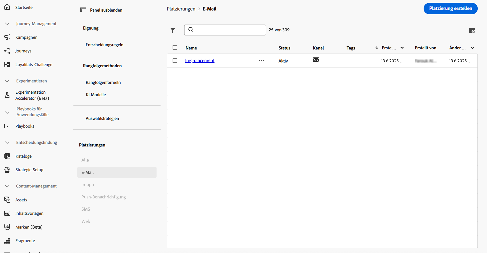
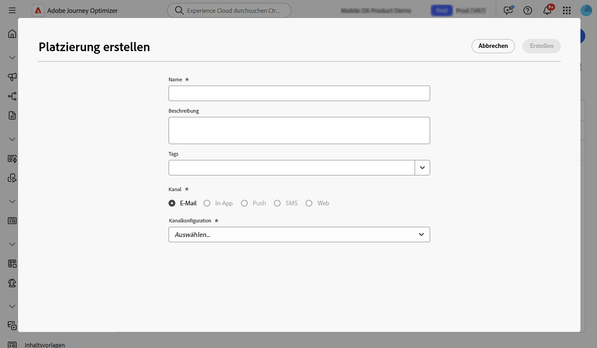
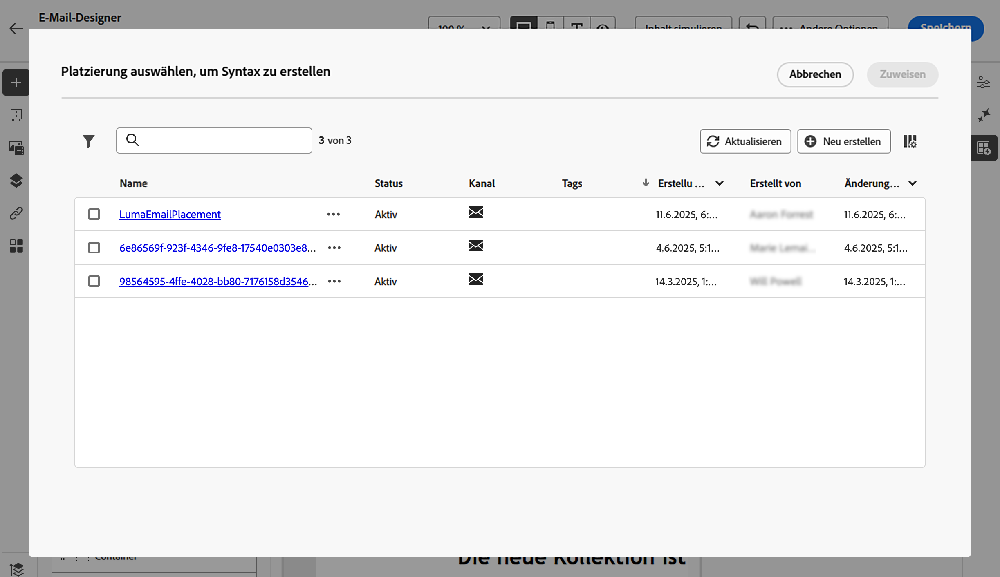

# Arbeiten mit Platzierungen {#create-decision}

## Über Platzierungen {#about}

Eine Platzierung ist ein Container, der zur Präsentation von Entscheidungselementen verwendet wird. Dadurch wird sichergestellt, dass der richtige Angebotsinhalt an der richtigen Stelle in Ihrer Nachricht angezeigt wird.

Wenn Sie einer E-Mail eine Entscheidungsrichtlinie hinzufügen, müssen Sie eine Platzierung mit der Komponente verknüpfen, die die zurückgegebenen Entscheidungselemente präsentiert. Auf diese Weise können Sie beispielsweise die Leistung von Entscheidungselementen über verschiedene Platzierungen hinweg im Reporting verfolgen.

Die Liste der Platzierungen ist über das Menü **[!UICONTROL Strategie-Setup]** zugänglich. Es stehen Filter zur Verfügung, mit denen Sie Platzierungen nach einer bestimmten Kanaloberfläche oder Tags abrufen können.

>[!NOTE]
>
>Derzeit sind Platzierungen nur für den E-Mail-Kanal verfügbar.

## Erstellen einer Platzierung {#create}

Gehen Sie wie folgt vor, um eine Platzierung zu erstellen:

1. Navigieren Sie zum Menü **[!UICONTROL Strategie-Setup]**, wählen Sie **[!UICONTROL E-Mail]** aus und klicken Sie auf die Schaltfläche **[!UICONTROL Platzierung erstellen]**.

   Sie können eine Platzierung auch direkt über den E-Mail-Designer erstellen, wenn Sie eine Entscheidungsrichtlinie hinzufügen. [Erfahren Sie, wie Sie eine Platzierung mit einer E-Mail-Komponente verknüpfen](../experience-decisioning/create-decision.md#save)

1. Definieren Sie die Eigenschaften der Platzierung:

   

   * **[!UICONTROL Name]**: der Name der Platzierung. Achten Sie darauf, einen aussagekräftigen Namen zu wählen, um die Platzierung leichter abrufen zu können.
   * **[!UICONTROL Beschreibung]**: Eine Beschreibung der Platzierung (optional).
   * **[!UICONTROL Tags]**: Weisen Sie der Platzierung einheitliche Adobe Experience Platform-Tags zu. Dies erleichtert die Klassifizierung und die Suche. [Erfahren Sie, wie Sie mit Tags arbeiten](../start/search-filter-categorize.md#tags)
   * **[!UICONTROL Kanal]**: Der Kanal, für den die Platzierung verwendet wird. Derzeit sind Platzierungen nur für E-Mails verfügbar.
   * **[!UICONTROL Kanalkonfiguration]**: Verknüpfen Sie die Platzierung mit einer Kanalkonfiguration. [Erfahren Sie, wie Sie die Kanalkonfiguration einrichten](../configuration/channel-surfaces.md).

1. Klicken Sie auf **[!UICONTROL Erstellen]**.

Nachdem die Platzierung erstellt wurde, wird sie in der Liste „Platzierungen“ angezeigt, wenn eine Entscheidungsrichtlinie zu einer E-Mail hinzugefügt wird. Sie können sie auswählen, um ihre Eigenschaften anzuzeigen und zu bearbeiten. [Informationen zum Erstellen von Entscheidungsrichtlinien](../experience-decisioning/create-decision.md)

