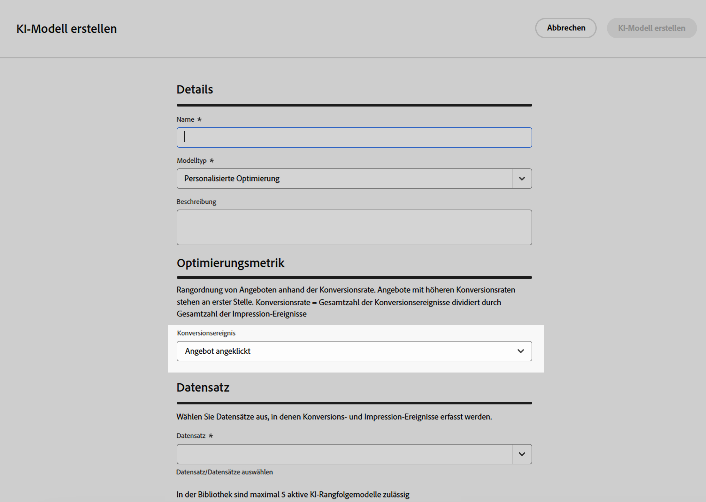

# Rangfolgenmethoden {#rankings}

>[!CONTEXTUALHELP]
>id="ajo_exd_config_formulas"
>title="Erstellen von Ranglistenformeln"
>abstract="Mithilfe von Formeln kann festgelegt werden, welches Element zuerst angezeigt werden soll, anstatt die Prioritätswerte der Elemente zu berücksichtigen. Nachdem eine Rangfolgenmethode erstellt wurde, kann sie einer Entscheidungsstrategie zugewiesen werden, um festzulegen, welche Elemente zuerst ausgewählt werden sollen."

Mit Rangfolgenmethoden können Elemente, die für ein bestimmtes Profil angezeigt werden sollen, nach Rang geordnet werden. Nachdem eine Rangfolgenmethode erstellt wurde, kann sie einer Entscheidungsstrategie zugewiesen werden, um festzulegen, welche Elemente zuerst ausgewählt werden sollen.

Es stehen zwei Arten von Rangfolgemethoden zur Verfügung:

* Mithilfe von **Formeln** kann festgelegt werden, welches Element zuerst angezeigt werden soll, anstatt die Prioritätswerte der Elemente zu berücksichtigen.

* **KI-Modelle** ermöglichen es, trainierte Modellsysteme zu verwenden, die mehrere Datenpunkte nutzen, um zu bestimmen, welches Element zuerst angezeigt werden soll.

## Erstellen von Rangfolgenmethoden {#create}

Gehen Sie wie folgt vor, um eine Rangfolgenmethode zu erstellen:

1. Navigieren Sie zum Menü **[!UICONTROL Strategie-Setup]** und wählen Sie dann das Menü **[!UICONTROL Formeln]** oder **[!UICONTROL KI-Modelle]** je nach dem Rangfolgetyp aus, den Sie verwenden möchten.

1. Klicken Sie oben rechts im Bildschirm auf die Schaltfläche **[!UICONTROL Formel erstellen]** oder **[!UICONTROL KI-Modell erstellen]**.

   

1. Konfigurieren Sie die Formel oder das KI-Modell entsprechend Ihren Anforderungen und speichern Sie sie die Formel bzw. das Modell.

   Detaillierte Informationen zum Erstellen von Rangfolgeformeln und KI-Modellen finden Sie in der Dokumentation zum Entscheidungs-Management:

   * [Rangfolgeformeln](../offers/ranking/create-ranking-formulas.md)
   * [KI-Modelle](../offers/ranking/ai-models.md)

   >[!NOTE]
   >
   >Die Verschachtelungstiefe in einer Rangfolgenformel ist auf 30  Ebenen beschränkt. Diese wird durch Zählen der schließenden Klammern `)` in der PQL-Zeichenfolge gemessen. Eine Regelzeichenfolge kann für UTF-8-kodierte Zeichen bis zu 8 KB groß sein. Dies entspricht 8.000 ASCII-Zeichen (jeweils 1 Byte) oder 2.000 bis 4.000 Nicht-ASCII-Zeichen (jeweils 2 bis 4 Byte). [Weitere Informationen zu den Leitlinien und Einschränkungen für die Entscheidungsfindung](gs-experience-decisioning.md#guardrails)

Eine Entscheidungsrichtlinie unterstützt bis zu 10 Auswahlstrategien und Entscheidungselemente zusammen. [Weitere Informationen zu den Leitlinien und Einschränkungen für die Entscheidungsfindung](gs-experience-decisioning.md#guardrails)

+++ Optimieren von Modellen für benutzerdefinierte Metriken in [!DNL Customer Journey Analytics]

>[!NOTE]
>
>Diese Funktion steht nur Kundinnen und Kunden von [!DNL Customer Journey Analytics] mit Administratorrechten zur Verfügung.
>
>Bevor Sie beginnen, stellen Sie sicher, dass Sie Journey Optimizer mit Customer Journey Analytics integriert haben, um Journey Optimizer-Datensätze in Ihre Standard-Datenansichten zu exportieren.  [Informationen zum Verwenden von Daten aus  [!DNL Journey Optmizer]  in  [!DNL Customer Journey Analytics]](../reports/cja-ajo.md)

Personalisierte Optimierungsmodelle sind ein KI-Modelltyp, mit dem Sie Geschäftsziele definieren und mithilfe von Kundendaten geschäftsorientierte Modelle trainieren können, um personalisierte Angebote bereitzustellen und KPIs zu maximieren.  Ausführliche Informationen zum Erstellen eines personalisierten KI-Modells finden Sie in der [Dokumentation zum Entscheidungs-Management](../offers/ranking/personalized-optimization-model.md).

Personalisierte Optimierungsmodelle verwenden standardmäßig **Angebot-Klicks** als Optimierungsmetrik. Wenn Sie mit [!DNL Customer Journey Analytics] arbeiten, können Sie mit [!DNL Decisioning] Ihre eigenen benutzerdefinierten Metriken verwenden, um Ihr Modell zu optimieren.

Rufen Sie dazu den Bildschirm zum Erstellen des personalisierten KI-Modells auf und erweitern Sie die Dropdown-Liste **[!UICONTROL Konversionsereignis]**. In der Liste werden alle Metriken aus Ihrer standardmäßigen Anzeige [Datenansicht](https://experienceleague.adobe.com/de/docs/analytics-platform/using/cja-dataviews/data-views){target="_blank"} in [!DNL Customer Journey Analytics] angezeigt. Wählen Sie die Metrik aus, mit der Sie Ihr Modell optimieren möchten, und schließen Sie dann die Erstellung des KI-Modells wie gewohnt ab.

>[!NOTE]
>
>Standardmäßig verwenden Metriken in [!DNL Customer Journey Analytics] ein Attributionsmodell „Letztkontakt“, mit dem 100 % des Credits dem Touchpoint zugewiesen werden, der zuletzt vor der Konvertierung auftritt.
>
>Es ist zwar möglich, das Attributionsmodell zu ändern, aber nicht alle Attributionsmodelle eignen sich ideal für die Optimierung von KI-Modellen.  Wir empfehlen, mit Sorgfalt ein Attributionsmodell auszuwählen, das Ihren Optimierungszielen entspricht, um die Genauigkeit und Leistung des Modells sicherzustellen.
>
>Weitere Informationen zu verfügbaren Attributionsmodellen und Anleitungen zu ihrer Verwendung finden Sie in der [[!DNL Customer Journey Analytics] Dokumentation](https://experienceleague.adobe.com/de/docs/analytics-platform/using/cja-dataviews/component-settings/attribution){target="_blank"}

+++

## Nutzen von Entscheidungselementattributen in Formeln {#items}

Rangfolgeformeln werden in **PQL-Syntax** ausgedrückt und können verschiedene Attribute wie Profilattribute, [Kontextdaten](context-data.md) und Attribute im Zusammenhang mit Ihren Entscheidungselementen nutzen.

Um Attribute im Zusammenhang mit Ihren Entscheidungselementen in Formeln zu nutzen, befolgen Sie die unten stehende Syntax im Code Ihrer Rangfolgeformel. Erweitern Sie jeden Abschnitt, um weitere Informationen zu erhalten:

+++Verwenden von Standardattributen von Entscheidungselementen

+++

+++Verwenden benutzerdefinierter Attribute von Entscheidungselementen

+++
