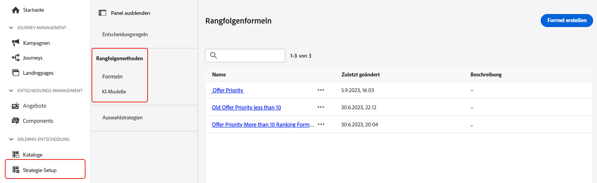

# Rangfolgemethoden {#rankings}

>[!CONTEXTUALHELP]
>id="ajo_exd_config_formulas"
>title="Erstellen von Ranglistenformeln"
>abstract="Mithilfe von Formeln kann festgelegt werden, welches Element zuerst angezeigt werden soll, anstatt die Prioritätswerte der Elemente zu berücksichtigen. Nachdem eine Rangfolgenmethode erstellt wurde, kann sie einer Entscheidungsstrategie zugewiesen werden, um festzulegen, welche Elemente zuerst ausgewählt werden sollen."

>[!BEGINSHADEBOX „Was Sie in diesem Dokumentationshandbuch finden“]

* [Erste Schritte mit Experience Decisioning](gs-experience-decisioning.md)
* Verwalten Ihrer Entscheidungselemente: [Konfigurieren des Elementkatalogs](catalogs.md) – [Erstellen von Entscheidungselementen](items.md) – [Verwalten von Elementsammlungen](collections.md)
* Konfigurieren der Elementauswahl: [Erstellen von Entscheidungsregeln](rules.md) – **[Erstellen von Ranking-Methoden](ranking.md)**
* [Erstellen von Auswahlstrategien](selection-strategies.md)
* [Erstellen von Entscheidungsrichtlinien](create-decision.md)

>[!ENDSHADEBOX]

Mit Rangfolgemethoden können Elemente nach Rang geordnet werden, die für ein bestimmtes Profil angezeigt werden sollen. Nachdem eine Rangfolgemethode erstellt wurde, kann sie einer Entscheidungsstrategie zugewiesen werden, um festzulegen, welche Elemente zuerst ausgewählt werden sollen.

Auf Rangfolgemethoden kann über das Menü **[!UICONTROL Konfiguration]**/**[!UICONTROL Rangfolgemethoden]** zugegriffen werden. Es stehen zwei Arten von Rangfolgemethoden zur Verfügung:

* Mithilfe von **Formeln** kann festgelegt werden, welches Element zuerst angezeigt werden soll, anstatt die Prioritätswerte der Elemente zu berücksichtigen.

* **KI-Modelle** ermöglichen es, trainierte Modellsysteme zu verwenden, die mehrere Datenpunkte nutzen, um zu bestimmen, welches Element zuerst angezeigt werden soll.

Ausführliche Informationen zu den einzelnen Rangfolgemethoden und deren Erstellung sind in der Dokumentation zum Entscheidungs-Management zu finden:

* [Ranking-Formeln](../offers/ranking/create-ranking-formulas.md)
* [KI-Modelle](../offers/ranking/ai-models.md)
