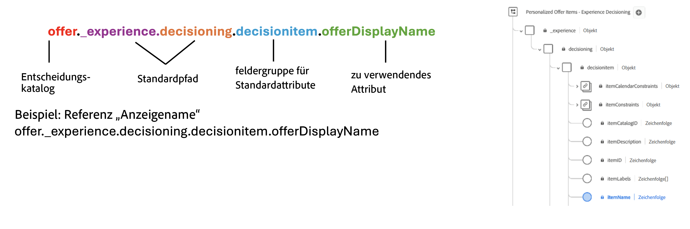

# Rangfolgenmethoden {#rankings}

>[!CONTEXTUALHELP]
>id="ajo_exd_config_formulas"
>title="Erstellen von Ranglistenformeln"
>abstract="Mithilfe von Formeln kann festgelegt werden, welches Element zuerst angezeigt werden soll, anstatt die Prioritätswerte der Elemente zu berücksichtigen. Nachdem eine Rangfolgenmethode erstellt wurde, kann sie einer Entscheidungsstrategie zugewiesen werden, um festzulegen, welche Elemente zuerst ausgewählt werden sollen."

Mit Rangfolgenmethoden können Elemente, die für ein bestimmtes Profil angezeigt werden sollen, nach Rang geordnet werden. Nachdem eine Rangfolgenmethode erstellt wurde, kann sie einer Entscheidungsstrategie zugewiesen werden, um festzulegen, welche Elemente zuerst ausgewählt werden sollen.

Es stehen zwei Arten von Rangfolgemethoden zur Verfügung:

* Mithilfe von **Formeln** kann festgelegt werden, welches Element zuerst angezeigt werden soll, anstatt die Prioritätswerte der Elemente zu berücksichtigen.

* **KI-Modelle** ermöglichen es, trainierte Modellsysteme zu verwenden, die mehrere Datenpunkte nutzen, um zu bestimmen, welches Element zuerst angezeigt werden soll.

## Erstellen von Rangfolgenmethoden {#create}

Gehen Sie wie folgt vor, um eine Rangfolgenmethode zu erstellen:

1. Navigieren Sie zum Menü **[!UICONTROL Strategie-Setup]** und wählen Sie dann das Menü **[!UICONTROL Formeln]** oder **[!UICONTROL KI-Modelle]** je nach dem Rangfolgetyp aus, den Sie verwenden möchten.

1. Klicken Sie oben rechts im Bildschirm auf die Schaltfläche **[!UICONTROL Formel erstellen]** oder **[!UICONTROL KI-Modell erstellen]**.

   

1. Konfigurieren Sie die Formel oder das KI-Modell entsprechend Ihren Anforderungen und speichern Sie sie die Formel bzw. das Modell.

   Detaillierte Informationen zum Erstellen von Rangfolgeformeln und KI-Modellen finden Sie in der Dokumentation zum Entscheidungs-Management:

   * [Ranking-Formeln](../offers/ranking/create-ranking-formulas.md)
   * [KI-Modelle](../offers/ranking/ai-models.md)

+++ Optimieren von Modellen für benutzerdefinierte [!DNL Customer Journey Analytics]-Metriken

>[!NOTE]
>
>Diese Funktion steht nur [!DNL Customer Journey Analytics] -Kunden mit Administratorrechten zur Verfügung.
>
>Stellen Sie vor dem Start sicher, dass Sie Journey Optimizer mit Customer Journey Analytics integriert haben, um Journey Optimizer-Datensätze in Ihre standardmäßigen Datenansichten zu exportieren. [Erfahren Sie, wie Sie  [!DNL Journey Optmizer] Daten in [!DNL Customer Journey Analytics]](../reports/cja-ajo.md) nutzen

Personalisierte Optimierungsmodelle sind eine Art KI-Modell, mit dem Sie Geschäftsziele definieren und Kundendaten nutzen können, um geschäftsorientierte Modelle zu trainieren, um personalisierte Angebote bereitzustellen und KPIs zu maximieren. Detaillierte Informationen zum Erstellen eines personalisierten AI-Modells finden Sie in der [Dokumentation zur Entscheidungsverwaltung](../offers/ranking/personalized-optimization-model.md).

Standardmäßig verwenden personalisierte Optimierungsmodelle **Angebotsklicks** als Optimierungsmetrik. Wenn Sie mit [!DNL Customer Journey Analytics] arbeiten, können Sie mit [!DNL Decisioning] Ihre eigenen benutzerspezifischen Metriken nutzen, um Ihr Modell zu optimieren.

Rufen Sie dazu den Bildschirm zur Erstellung des personalisierten KI-Modells auf und erweitern Sie die Dropdown-Liste **[!UICONTROL Konversionsereignis]** . Alle Metriken aus Ihrer standardmäßigen [!DNL Customer Journey Analytics] [Datenansicht](https://experienceleague.adobe.com/en/docs/analytics-platform/using/cja-dataviews/data-views){target="_blank"} werden in der Liste angezeigt. Wählen Sie die Metrik aus, für die Sie Ihr Modell optimieren möchten, und schließen Sie dann die Erstellung des KI-Modells wie gewohnt ab.

>[!NOTE]
>
>Standardmäßig verwenden Metriken in [!DNL Customer Journey Analytics] ein Attributionsmodell &quot;Letztkontakt&quot;, mit dem 100 % des Guthabens dem Touchpoint zugewiesen wird, der zuletzt vor der Konvertierung auftritt.
>
>Es ist zwar möglich, das Attributionsmodell zu ändern, aber nicht alle Attributionsmodelle eignen sich ideal für die Optimierung des KI-Modells. Es wird empfohlen, ein Attributionsmodell sorgfältig auszuwählen, das Ihren Optimierungszielen entspricht, um die Modellgenauigkeit und -leistung sicherzustellen.
>
>Weitere Informationen zu verfügbaren Attributionsmodellen und Anleitungen zu ihrer Verwendung finden Sie in der [[!DNL Customer Journey Analytics] Dokumentation](https://experienceleague.adobe.com/en/docs/analytics-platform/using/cja-dataviews/component-settings/attribution){target="_blank"}

+++

## Nutzen von Entscheidungselementattributen in Formeln {#items}

Rangfolgeformeln werden in **PQL-Syntax** ausgedrückt und können verschiedene Attribute wie Profilattribute, [Kontextdaten](context-data.md) und Attribute im Zusammenhang mit Ihren Entscheidungselementen nutzen.

Um Attribute im Zusammenhang mit Ihren Entscheidungselementen in Formeln zu nutzen, befolgen Sie die unten stehende Syntax im Code Ihrer Rangfolgeformel. Erweitern Sie jeden Abschnitt, um weitere Informationen zu erhalten:

+++Verwenden von Standardattributen von Entscheidungselementen

+++

+++Verwenden benutzerdefinierter Attribute von Entscheidungselementen

+++
