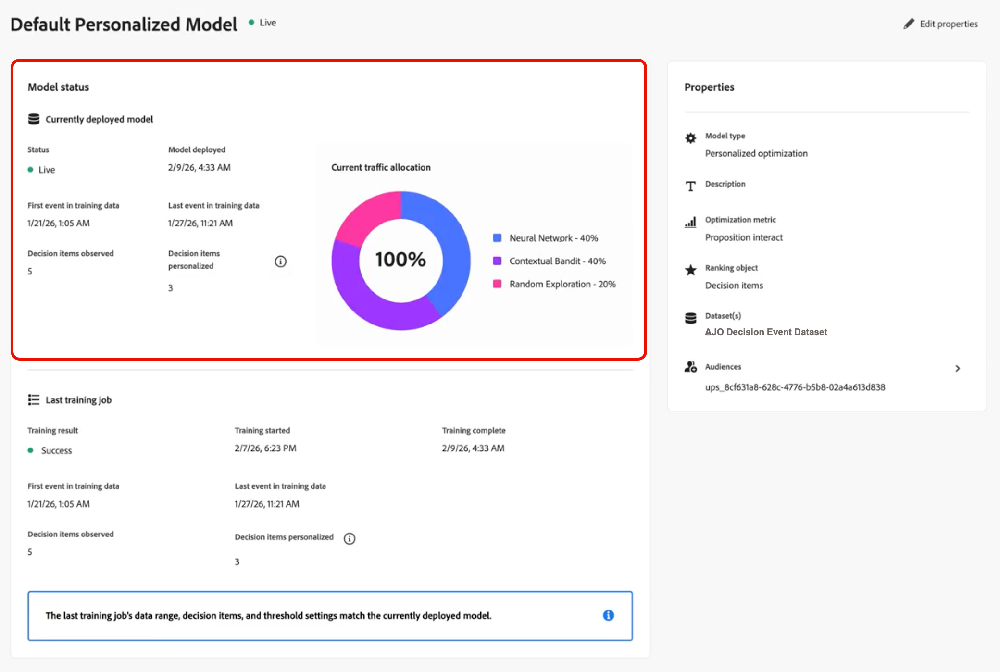

# Überwachen Ihrer KI-Modelle {#ai-model-observability}

Egal, ob Sie Marketing-Experte, Datenwissenschaftler oder Entscheidungs-Administrator sind, wenn Sie verstehen, wie Ihre personalisierten Optimierungsmodelle funktionieren und sich verhalten, können Sie mit KI für jeden Kunden die besten Angebote auswählen.

Zu diesem Zweck können Sie den Zustand, den Trainingsstatus und die Entwicklung Ihrer KI-Modelle direkt in [!DNL Journey Optimizer] überwachen.

Dadurch erhalten Sie einen klaren Überblick darüber, ob Ihr Modell funktioniert, wann es zuletzt trainiert wurde, was während der Schulung passiert ist, wie es Ihr Geschäftsergebnis steigert (z. B. Konversionen oder Umsatz) und wann es nicht funktioniert<!-- (for example, unexpected decision item count, training data date range, or insufficient events)-->.

>[!AVAILABILITY]
>
>Derzeit wird diese Funktion nur für Modelle [personalisierte Optimierung](personalized-optimization-model.md) unterstützt.

➡️ [Funktion im Video kennenlernen](#video)

## Anzeigen des Trainings-Status {#from-ai-model-list}

Sobald ein Modell live geschaltet ist, tritt es in einen fortlaufenden Lebenszyklus ein: Daten werden erfasst und das Modell wird regelmäßig neu trainiert, um das Ranking der Angebote zu optimieren. Sie können den Trainings-Status Ihrer personalisierten Optimierungsmodelle in der KI-Modellliste überprüfen.

1. Gehen Sie zu **[!UICONTROL Decisioning]** > **[!UICONTROL Strategie einrichten]** > **[!UICONTROL KI-Modelle]**, um das KI-Modellinventar zu öffnen.

1. Sie können alle verfügbaren KI-Modelle und deren Status anzeigen.

1. Für jedes **[!UICONTROL Live]**-KI-Modell des Typs „Personalisierte Optimierung“ werden zwei Spalten angezeigt:
   * wann der letzte Trainingsvorgang ausgeführt wurde **[!UICONTROL Zuletzt trainiert]** und
   * ob jedes Modell erfolgreich trainiert wurde oder nicht (**[!UICONTROL Trainingsergebnis]**).

   

   Auf diese Weise können Sie schnell Modelle identifizieren, die weitere Untersuchungen oder Fehlerbehebungen benötigen.

## Zugreifen auf Modellstatusberichte {#access-ai-model-details}

Klicken Sie in der Liste auf ein KI-Modell für die personalisierte Optimierung. Von dort aus können Sie die unten aufgeführten Elemente anzeigen:

* **[!UICONTROL Aktuell bereitgestelltes Modell]** - Dieser Abschnitt zeigt das aktuell bereitgestellte Modell, den Zeitpunkt der Bereitstellung, den Datumsbereich der verwendeten Daten, die Anzahl der eingeschlossenen und personalisierten Entscheidungselemente (Angebote) und die aktuelle Traffic-Zuordnung zu den Untermodellen<!-- (random exploration, new offer booster?, contextual bandit, neural network)-->.

  

  In diesem Beispiel wurde das Modell auf fünf Entscheidungselemente trainiert, und das Modell verfügt über genügend Traffic, um personalisierte Prognosen für drei der Entscheidungselemente zu entwickeln. Die beiden übrigen Entscheidungspunkte werden nach dem Zufallsprinzip zugestellt.

  Sie können auch sehen, dass das Modell derzeit 40 % des Traffics dem personalisierten neuronalen Netzwerk, 40 % des Traffics dem kontextuellen Bandit und 20 % des Traffics zufälliger Untersuchung zuordnet.

* **[!UICONTROL Letzter Trainingsvorgang]** - Dieser Abschnitt zeigt den Status des letzten Trainingsvorgangs, den Ausführungszeitpunkt sowie alle Fehlermeldungen an. [Erfahren Sie mehr über Fehlerzustände](#check-for-error-states)

  

  In diesem Beispiel können Sie beobachten, dass das bereitgestellte Modell erwartungsgemäß mit dem Trainings-Auftrag übereinstimmt.

* **[!UICONTROL Eigenschaften]** - In diesem Abschnitt werden die Eigenschaften des Modells angezeigt, z. B. der verwendete Datensatz, die Optimierungsmetrik und die Zielgruppen, die zum Trainieren des personalisierten Optimierungsmodells verwendet werden.

  

  Klicken Sie auf **[!UICONTROL Eigenschaften bearbeiten]**, um diese Elemente zu ändern. Sie werden zum Bildschirm KI-Modell erstellen weitergeleitet. [Weitere Informationen](create-ai-models.md)

* **[!DNL Model performance]** - Dieser Abschnitt zeigt die Leistung der einzelnen Modellarme im Zeitverlauf, wie z. B. die Traffic-Zuordnung und die Konversionsrate für jedes Untermodell. Sie können zwischen den **letzten 7 Tagen** und den **letzten 30 Tagen** wechseln. Die Steigerung und die statistische Signifikanz sind die Schlüsselindikatoren dafür, ob das Modell tatsächlich Ihr Marketing-Ergebnis verbessert.

  

  In diesem Beispiel sehen Sie, dass die personalisierten Untermodelle in den letzten 30 Tagen eine Steigerung der Konversionsrate um mehr als 60 % erzielten. Diese Steigerung ist statistisch signifikant, was bedeutet, dass dieses KI-Modell eine Auswirkung auf Ihr Unternehmen hat.

* **[!UICONTROL Traffic-Zuordnung im Zeitverlauf modellieren]** - In diesem Abschnitt wird die Entwicklung des Modells im Zeitverlauf dargestellt. Bei der ersten Bereitstellung eines Modells werden 100 % des Traffics zufällig ausgeführt, da noch keine Angebotsdaten erfasst wurden. Nach der ersten Umschulung verlagert sich der Verkehr in der Regel auf die personalisierten Arme.

  

  In diesem Beispiel sehen Sie, dass sich die Traffic-Zuordnung von 100 % zufälliger Exploration zu neuronalem Netzwerk- und kontextuellem Bandit-Traffic verschoben hat, da das Modell im Laufe der Zeit neu trainiert wurde.

## Grundlegendes zu Schulungsfehlern {#check-for-error-states}

Gehen Sie wie folgt vor, um Fehlerdetails für ein KI-Modell für die personalisierte Optimierung anzuzeigen, dessen letzter Trainingsvorgang fehlgeschlagen ist.

1. Klicken Sie in der Liste auf das Modell. Die Details zum Modellstatus werden angezeigt.

   {width="95%"}

   In diesem Beispiel können Sie sehen, dass kein Modell bereitgestellt wird, da der letzte Trainings-Auftrag fehlgeschlagen ist.

   >[!NOTE]
   >
   >Wenn kein Modell bereitgestellt wird, werden Entscheidungsanfragen mithilfe einer einheitlichen zufälligen Traffic-Zuordnung bereitgestellt.

1. Gehen Sie durch die Fehlerdetails im Abschnitt **[!UICONTROL Letzter Trainingsvorgang]**.

   {width="70%"}

   Ein Trainings-Auftrag schlägt in der Regel fehl, wenn es keine Feedback-Ereignisse in dem Datensatz gibt, den Sie für dieses Modell ausgewählt haben. Das bedeutet, dass Sie den Datensatz mit entsprechenden Konversionsereignissen füllen oder einen neuen Datensatz auswählen müssen.

1. Sie können überprüfen, welcher Datensatz in den (Eigenschaften **[!UICONTROL des Modells ausgewählt]**. Klicken Sie **[!UICONTROL Eigenschaften bearbeiten]**, um einen anderen Datensatz auszuwählen. [Weitere Informationen](create-ai-models.md)

   {align="left" width="45%"}

## Häufig gestellte Fragen {#faq}

+++ Welche KI-Modelle kann ich überwachen?

Die KI-Modellüberwachung wird derzeit nur für Modelle [personalisierte Optimierung](personalized-optimization-model.md) unterstützt. Andere Rangfolgemodelltypen zeigen den Modellstatusbericht noch nicht an.
+++

+++ Warum ist der Trainingsvorgang meines Modells fehlgeschlagen?

Trainingsaufträge schlagen oft fehl, wenn der für das Modell ausgewählte Datensatz keine oder nur sehr wenige Feedback-(Konversions-)Ereignisse aufweist. Überprüfen Sie **[!UICONTROL Abschnitt „Letzter Trainingsvorgang]** auf die Fehlerdetails und überprüfen Sie dann die **[!UICONTROL Eigenschaften]** des Modells, um den Datensatz und die Optimierungsmetrik zu bestätigen. Füllen Sie den Datensatz mit den richtigen Ereignissen oder [ Sie einen anderen Datensatz ](create-ai-models.md) geeignete Konvertierungsdaten aus.
+++

+++ In welcher Beziehung steht die KI-Modellüberwachung zu Kampagnen- und Journey-Berichten?

Die KI-Modellüberwachung unterscheidet sich von Kampagnen- oder Journey-Berichten. Ein einzelnes KI-Modell kann für mehrere Kampagnen oder mehrere Journey verwendet werden, und Kampagnen- oder Journey-Berichte zeigen nicht an, welches Modell für einen bestimmten Versand verwendet wurde. Verwenden Sie die Statusüberwachung des KI-Modells, um das Modell selbst zu verstehen und zu überwachen. Verwenden Sie [Kampagnenberichte](../../reports/campaign-global-report-cja.md) und [Journey-Berichte](../../reports/journey-global-report-cja.md) für Metriken auf Versandebene.
+++

+++ Meine Optimierungsmetrik ist eine kontinuierliche Metrik wie der Umsatz oder der Bestellwert, keine binäre Metrik wie Klicks oder Konversionen. Wie interpretiere ich die gemeldeten Konversions- und Konversionsratenwerte?

Bei Verwendung einer kontinuierlichen Metrik wie Umsatz oder Bestellwert versucht das Modell, den geschätzten Wert vorherzusagen, der mit der Präsentation eines bestimmten Angebots verbunden ist (nicht die Konversionswahrscheinlichkeit). Der ausgewiesene Wert „Konversionen“ ist der Gesamtumsatz (oder Bestellwert), der mit den aufgezeichneten Angebotsanzeigen für jede Modellverzweigung verbunden ist. Die angezeigte „Konversionsrate“ ist der Konversionswert dividiert durch den Anzeigewert und kann bei einer kontinuierlichen Metrik 100 % überschreiten.
+++

+++ Was ist die Bedeutung der Steigerung?

Die Steigerungssignifikanz ist die statistische Signifikanz des berichteten Steigerungswerts im Vergleich zur Zufallsexploration. Die Signifikanz wird mithilfe eines Chi-Quadrat-Tests der Proportionsunterschiede berechnet, der ein identisches Ergebnis liefert wie die Signifikanzberechnung eines Z-Tests für zwei Populationsanteile.
+++

+++ Was ist das Modell Gini Index? Was ist ein „guter“ Wert des Gini-Index?

Der Modell-Gini-Index (auch als Gini-Koeffizient bezeichnet) ist ein Offline-Maß für die Vorhersagekraft eines Modells. Der Gini-Index des Modells reicht von 0 (keine Vorhersagekraft) bis 1 (er sagt für jeden Kunden den Konversions- oder Metrikwert für jedes Angebot perfekt voraus). Es gibt keinen universellen „guten“ Gini-Indexwert, da verschiedene Entscheidungsanwendungsfälle zu unterschiedlichem Benutzerverhalten und daher zu unterschiedlichen Modellergebnissen führen. Innerhalb desselben Anwendungsfalls weisen höhere Gini-Indexwerte auf ein höheres Qualitätsmodell hin.
+++

+++ Wie wird der Gini-Index berechnet?

Der Gini-Index für jeden Modellarm wird unterschiedlich berechnet, je nachdem, ob die Optimierungsmetrik binär oder kontinuierlich ist:

**Binäre Optimierungsmetrik** (z. B. Klicks, Bestellungen): Der Gini-Index wird anhand der Fläche unter der Kurve (AUC) der Receiver-Operating-Charakteristik (ROC)-Kurve berechnet, die normalerweise als ROC-AUC oder kurz einfach als AUC bezeichnet wird. Die ROC-AUC reicht von 0,5 (Zufallsmodell mit keiner Vorhersagekraft) bis 1,0 (perfekte Vorhersagekraft). ROC AUC wird mithilfe der Formel Gini = 2 x (ROC AUC) - 1 in einen Gini-Index umgewandelt.

**Metrik zur kontinuierlichen Optimierung** (z. B. Umsatz, Bestellwert): Der Gini-Index wird anhand der Fläche unter der Lorenz-Kurve berechnet, die den kumulativen prognostizierten Positiven des Modells im Vergleich zu den kumulativen echten Positiven in der Population zugeordnet ist. Die Fläche unter der Lorenz-Kurve reicht von 0,0 (perfekte Vorhersagekraft) bis 0,5 (Zufallsmodell mit Null Vorhersagekraft). Die Lorenz-AUC wird mithilfe der Formel Gini = 1 - 2 x (Lorenz-AUC) in einen Gini-Index umgewandelt.
+++

+++ Was ist ein besseres Maß für die Modellqualität: Gini-Index oder Steigerung / Steigerung Bedeutung?

Typischerweise werden Online-Messungen der Modellqualität, wie z. B. Steigerung und Steigerung der Signifikanz, als „Goldstandard“-Methode zur Messung der Modellqualität betrachtet. Gini-Indizes bieten Berichten zufolge einen zusätzlichen Datenpunkt für datenwissenschaftliche Teams, die Entscheidungsmodelle für Kunden bewerten.
+++

<!--
## Understanding statuses and errors {#statuses-errors}

* **Success** – The latest training job completed successfully. The model is trained and deployed for ranking.
* **Failed** – The latest training job failed (for example, no events in the datasets). The UI shows an error message and a request ID; use these when troubleshooting or contacting support.
* **In progress** – A training job is running. Some metrics may be temporarily unavailable until it finishes.
* **Pending** – No result yet (for example, model recently activated or settings recently changed).

If no model has been successfully deployed yet, the "currently deployed model" section and some performance fields will be empty or show the initial-state messaging.
-->

## Anleitungsvideo {#video}

Erfahren Sie, wie Sie Ihre KI-Ranking-Modelle überwachen und den Trainings-Status und die Leistung in [!DNL Journey Optimizer] interpretieren.

>[!VIDEO](https://video.tv.adobe.com/v/3479849?quality=12)

## Verwandte Dokumentation {#related}

* [Über KI-Modelle](ai-models.md)
* [Modell zur personalisierten Optimierung](personalized-optimization-model.md)
* [Erstellen von KI-Modellen](create-ai-models.md)
* [Erstellen eines Datensatzes zum Erfassen von Ereignissen](../data-collection/create-dataset.md)
